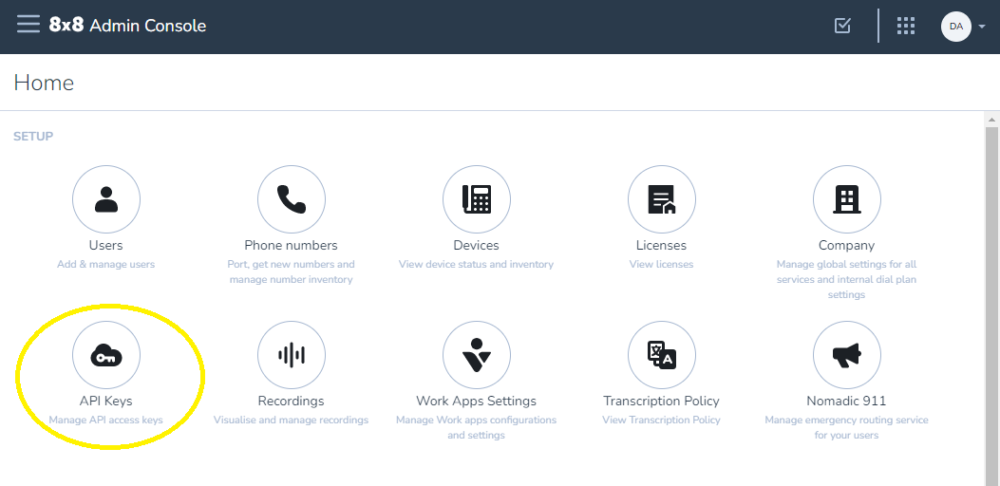
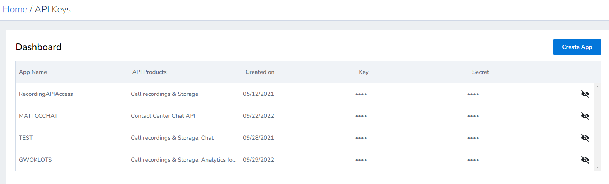
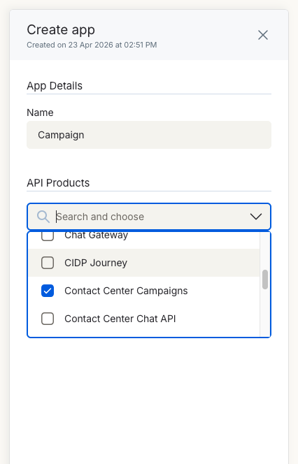
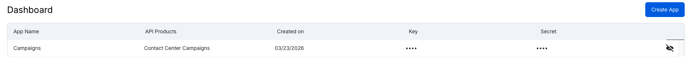

# Authentication

:::warning BETA

**The Contact Center Campaigns API is currently in Beta.** See the [Overview](./overview.md) for details.

:::

## Overview

The Contact Center Campaigns API uses two request headers to authenticate and route every request:

- **`X-API-Key`** — an Admin Console API Key belonging to an app that has the **Contact Center Campaigns** API Product attached
- **`X-8x8-Tenant`** — your 8x8 tenant name

Unlike the legacy [Contact Center Dynamic Campaigns API](/actions-events/docs/cc-managing-campaign-status), HTTP Basic authentication is not supported.

## Admin Console API Key

Admin Console API Keys are managed centrally through the 8x8 Admin Console. Every key belongs to an *app*, and each app has one or more *API Products* attached to it — the Product controls which APIs the key can be used against. The Contact Center Campaigns API requires the **Contact Center Campaigns** API Product.

### How to obtain a key

If the API Keys option isn't visible in Admin Console, your account doesn't have the required permission. See the [required permission](#required-permission) section below.



1. Log into **[8x8 Admin Console](https://admin.8x8.com)**
2. In the **SETUP** section, click **API Keys**

   

3. Click **Create App** (or edit an existing app if you already have one you want to use)
4. Enter an application name (no spaces allowed)
5. In the **API Products** dropdown, select **Contact Center Campaigns**

   

6. Click **Save** to generate your key

   The dashboard will display your newly created app with the generated API key. The key always starts with `eght_` and can be viewed at any time by clicking the eye icon.

   

### Required permission

Creating or managing Admin Console API Keys requires the **Application Credentials** permission. This is granted by the **Company Admin** role, or can be granted via a custom role.

For full details on API Key management, see [How to get API Keys](../../../analytics/docs/how-to-get-api-keys).

### Key format

- Admin Console API Keys always start with `eght_`
- The key is passed in the `X-API-Key` HTTP header

## Tenant identification

Every request must include an `X-8x8-Tenant` header identifying your tenant:

```text
X-8x8-Tenant: your-tenant-name
```

The tenant name is distinct from the `{customer-site}` value that appears in the URL path. The customer site identifies a region (`US1`, `US2`, `UK3`); the tenant name identifies your specific tenant within that region.

## Combined header usage

Every request with a body sends all three headers together:

```text
X-API-Key: eght_your_admin_console_key
X-8x8-Tenant: your-tenant-name
Content-Type: application/vnd.campaigns.v1+json
```

## Troubleshooting authentication

**401 Unauthorized**

- The `X-API-Key` header is missing or malformed
- The key doesn't start with `eght_`
- The key has been revoked or the app has been deleted in Admin Console

**403 Forbidden**

- The key is valid, but the **Contact Center Campaigns** API Product is not attached to the app. Edit the app in Admin Console and add the Product.
- The Admin Console role granting the key doesn't permit this API

**404 Not Found (on every request)**

- The `X-8x8-Tenant` header value doesn't match a known tenant, or is missing
- The `{customer-site}` segment of the URL is wrong — `US1`, `US2`, and `UK3` are the only valid values

For the full error catalogue, see [Troubleshooting](./troubleshooting.md).

## Next steps

- [Endpoints](./endpoints.md) - Request and response reference
- [Campaign State Machine](./state-machine.md) - Which actions are valid from which states
- [Troubleshooting](./troubleshooting.md) - Common issues and debugging guide
