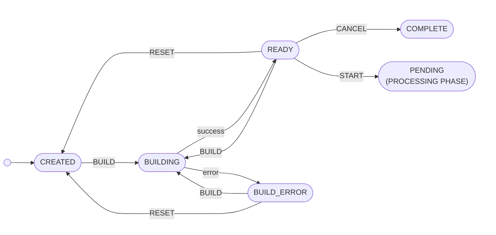
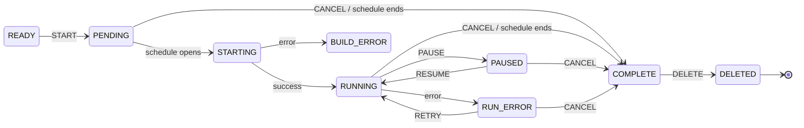

# Campaign State Machine

:::warning BETA

**The Contact Center Campaigns API is currently in Beta.** See the [Overview](./overview.md) for details.

:::

Every `PATCH /campaigns/{campaignId}` request supplies an `action`. The server validates that action against the campaign's current `state` and responds with `409 Conflict` when the action isn't allowed. Understanding the state machine is a prerequisite to using this API reliably.

## States

A campaign is always in exactly one state. The full set of states:

| State         | Description                                                                                                                                                                       | Transient? |
|---------------|-----------------------------------------------------------------------------------------------------------------------------------------------------------------------------------|------------|
| `CREATED`     | The campaign has just been created and is not yet active.                                                                                                                         | no         |
| `BUILDING`    | The system is querying CRM data and preparing the campaign for use. The CRM query and filter can be edited and the campaign rebuilt as many times as needed before it is started. | yes        |
| `READY`       | The campaign is fully built and ready to be started.                                                                                                                              | no         |
| `PENDING`     | The campaign has been started and is waiting for its scheduled start time.                                                                                                        | no         |
| `STARTING`    | The campaign is being started, including any final preparations before it becomes active.                                                                                         | yes        |
| `RUNNING`     | The campaign is currently active and dialing records when agents are available.                                                                                                   | no         |
| `PAUSED`      | The campaign is paused, new records are no longer being added to the dialing queue, but records already queued will still be dialed. The campaign can be resumed.                 | no         |
| `COMPLETE`    | The campaign has finished running, either because it reached its end time or was cancelled. A completed campaign cannot be restarted.                                             | no         |
| `BUILD_ERROR` | An error occurred while building the campaign.                                                                                                                                    | no         |
| `RUN_ERROR`   | An error occurred while running the campaign.                                                                                                                                     | no         |
| `DELETED`     | The campaign has been soft-deleted and is retained only for record-keeping.                                                                                                       | no         |

Transient states (`BUILDING`, `STARTING`) are the result of an action the server is still processing. The campaign will leave them without further client input.

## Actions and their preconditions

Each action is valid only from a specific set of states:

| Action   | Valid from states                               | Result                                                                              |
|----------|--------------------------------------------------|-------------------------------------------------------------------------------------|
| `BUILD`  | `CREATED`, `READY`, `BUILD_ERROR`                | Campaign moves to `BUILDING`, then settles in `READY` (or `BUILD_ERROR` on failure) |
| `RESET`  | `READY`, `BUILD_ERROR`                           | Campaign returns to `CREATED`, allowing it to be rebuilt                             |
| `START`  | `READY`                                          | Campaign moves to `PENDING` or `STARTING`, then to `RUNNING`                         |
| `PAUSE`  | `RUNNING`                                        | Campaign moves to `PAUSED`                                                          |
| `RESUME` | `PAUSED`                                         | Campaign returns to `RUNNING`                                                        |
| `RETRY`  | `RUN_ERROR`                                      | Campaign resumes processing                                                          |
| `CANCEL` | `PENDING`, `RUNNING`, `PAUSED`, `RUN_ERROR`      | Campaign moves to `COMPLETE`                                                        |
| `PURGE`  | `PAUSED`, `RUN_ERROR`, `COMPLETE`                | Clears queued interactions for the campaign                                         |

If an action is sent from a state not listed as valid, the API returns `409 Conflict`. See [Troubleshooting](./troubleshooting.md#409-conflict) for details.

## Visual diagram

The state machine is split into two phases. The **Management phase** covers campaign creation, building, and validation before the campaign has ever run. The **Processing phase** begins when `START` is sent and covers everything from there to termination.

`READY` appears in both diagrams as the bridge state: from `READY` the campaign either hands off into the Processing phase via `START`, or is cancelled without ever running.

### Management phase



### Processing phase



A few things worth knowing to read the diagrams:

- **Uppercase labels** (`BUILD`, `START`, `PAUSE`, `CANCEL`, …) are client actions sent via `PATCH /campaigns/{campaignId}`.
- **Lowercase labels** (`success`, `error`, `schedule opens`, `schedule ends`) are automatic transitions triggered by the service — the client does not send these.
- `PENDING` is **skipped** if the campaign's `startTime` is in the past when `START` is sent — the campaign transitions directly into `STARTING`.
- `PURGE` does not change the campaign state and is therefore not shown as an edge. It is valid from `PAUSED`, `RUN_ERROR`, and `COMPLETE`, and clears queued interactions for the campaign.

## The `enabled` flag

In addition to its state, every campaign has a boolean `enabled` flag which is independent of the state machine. When a campaign is disabled, only the `BUILD` and `RESET` actions are allowed; all other actions are rejected until the campaign is re-enabled.

Toggle the flag by supplying `enabled` in the PATCH body:

```json
{ "action": "BUILD", "enabled": true }
```

Omit `enabled` to leave the current value unchanged.

## Display status vs actual state

The campaign response includes a separate `displayStatus` field (of type [`CampaignDisplayStatus`](./field-reference.md#campaigndisplaystatus)). This is a UI-oriented derived view — for example:

- `SCHEDULED` is shown when `state` is `PENDING`
- `PURGED` is shown when `state` is `PAUSED` and the campaign has been purged
- `DISABLED` is shown when `enabled` is `false`, regardless of state

Automation that drives the API should branch on `state`, not on `displayStatus`. The full mapping table is in the [Field Reference](./field-reference.md#campaigndisplaystatus).

## Next steps

- [Endpoints](./endpoints.md) - Full request and response detail
- [Field Reference](./field-reference.md) - Full schema for every object and enum
- [Troubleshooting](./troubleshooting.md) - Error format and common issues
