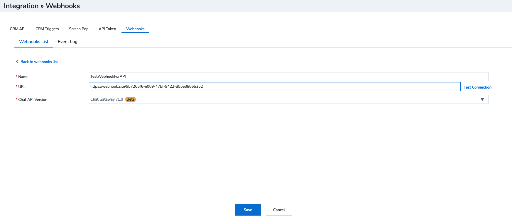
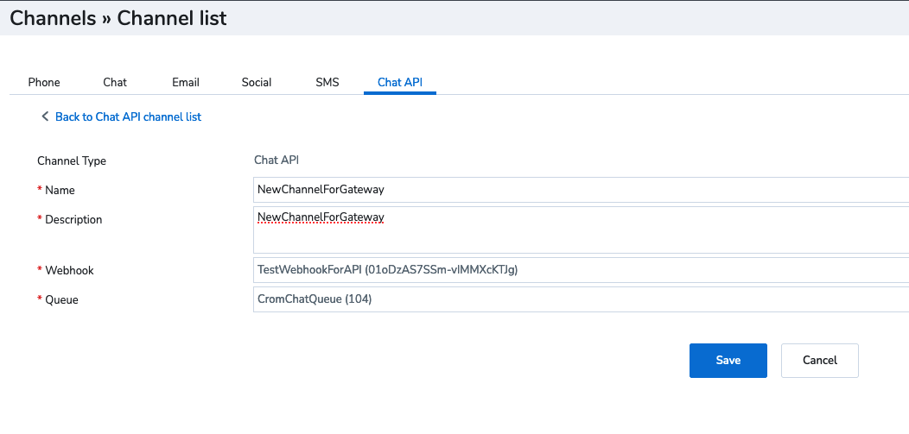

# Workflow - Connecting 3rd party channel

## Prerequisites

To use the Chat Gateway you must have the following:

* At least one configured queue so that any interactions coming from your customers can be routed to your agents.
* At least one agent is assigned to your queue, so they can pick up the queued interactions and connect with your customers.
* Know the Queue ID.

Information on how to do this can be found [here](https://docs.8x8.com/8x8WebHelp/VCC/configuration-manager-vovcc/content/queuechatqueue.htm?Highlight=chat%20queue)

* A client application that calls the Chat API and listens for messages (i.e., events) that are returned.

## Setup flow

To set up the Chat Gateway do the following:

* **API key** Follow the flow to get your access token [API Key](/actions-events/docs/api-key)

Next, we need to create the webhook, so that data can be sent between 8x8 and the application and also the channel, which allows the webhook to connect to 8x8. There are two flows, via the API and in configuration manager in 8x8 Contact Center

* **Create webhook** - [API method](/actions-events/reference/createwebhook-1)

Go to Configuration Manager - Integration - webhook


Then select Add webhook and populate with the details

Name - this is the name you want to give the webhook

URL - this is the webhook of the application that you want to communicate with the Chat Gateway

Chat API Version - This needS to be Chat Gateway



Now you can create a channel

**Create a channel** - [API method](/actions-events/reference/createchatapichannel-1)

Go to Configuration Manager - Channel - Chat API


Select new channel, then populate the details

Name - the name you want to give the channel

Description - the description you want to give the channel

Webhook - select the webhook you have created in the step above, or a different one if you need

Queue - This is a queue that the channel will route to, however this can be changed in the conversation flow if needed



**Create conversation** [API](/actions-events/reference/createcctransaction-1)

When creating the conversation, the channnel ID and the API key which have been created earlier in the flow are needed.

Information that can be passed across when creating the conversation

**User object**

These allows you to give information about the customer to the agent and also populate the 8x8 Native CRM, in this example below

Language - the language of the customer  

Name - name of the customer  

Email - email address of the customer (this can be used to screen pop the customer record in the native CRM or an External CRM)  

Phone - phone number of the customer

```
{
     "user": {
          "language": "en",
          "name": "James Jones",
          "email": "user@example.com",
          "phone": "07917846011"
     }
}

```

**User object - Additional properties**

This allows extra information to be passed across to the agent, specifically customer values that can be conveyed using the format :customValue anyKey: anyValue.It is essential to recognize that customer values being passed must include both a key and a corresponding value.

In the example below, the bot is telling the agent that the customer is authenticated, they were asking about their balance and it's regarding their credit account

```
{
    "additionalProperties": [
        {
            "key": "Authenticated",
            "value": "yes"
        },
        {
            "key": "Intent",
            "value": "balance"
        },
        {
            "key": "AccountType",
            "value": "credit"
        }
    ]
}

```

**User object - History**

This allows the content of the conversation that has happened between the bot and the agent to be passed across to the agent.

In the example below, it shows the conversation between the agent and bot regarding a balance which will be presented to the agent

```
{
     "history": {
          "messages": [
               {
                    "authorType": "user",
                    "text": "I would like my balance please"
               },
               {
                    "authorType": "bot",
                    "text": "Sure, please let me your account number"
               },
               {
                    "authorType": "user",
                    "text": "My account number is 1234"
               },
               {
                    "authorType": "bot",
                    "text": "Your balance is £12.34"
               }
          ]
     }
}

```

Example JSON of the user objects together

```
curl --request POST  
     --url [https://api.8x8.com/chat-gateway/v1/conversations](https://api.8x8.com/chat-gateway/v1/conversations)  
     --header 'accept: application/hal+json'  
     --header 'content-type: application/json'  
     --data '  
{
    "user": {
        "language": "en",
        "name": "James Jones",
        "email": "user@example.com",
        "phone": "013453403332",
        "additionalProperties": [
            {
                "key": "Authenticated",
                "value": "yes"
            },
            {
                "key": "Intent",
                "value": "balance"
            },
            {
                "key":" AccountType",
                "value": "credit"
            }
        ]
    },
    "assignment": {
        "type": "queue",
        "id":" 123"
    },
    "history": {
        "messages": [
            {
                "authorType": "user",
                "text": "Hello, can I get my balance please"
            },
            {
                "authorType": "bot",
                "text": "Sure, what is your account number"
            },
            {
                "authorType": "user",
                "text": "123456"
            },
            {
                "authorType": "bot",
                "text": "Your balance is £12.34"
            },
            {
                "authorType": "user",
                "text": "Thanks, please can I speak to an agent "
            },
            {
                "authorType": "bot",
                "text": "Sure, connecting you now"
            }
        ]
    },
    "channelId": "f5odm43occnifcdcsa"
}

```

In the history in the user objects, you can also add

**User object - History - attachments**

When adding the user history, attachments that have been sent between the bot and the customer can also be added to this conversation

**User object - History - adaptive cards**

When adding the user history, adaptive cards that have been sent between the bot and customer can be added to the conversation. More information on adaptive cards can be found here - [MS Adaptive cards](https://learn.microsoft.com/en-us/adaptive-cards/)

Once the conversation is created an activity will be sent for # **`QUEUED`**

```
{
  "eventType": "QUEUED",
  "conversationId": "ID-0",
  "timestamp": 0,
  "data": {
    "queueId": "string",
    "queueName": "string"
  }
}

```

When the conversation is queued, this information can still be updated and the queue can be changed using -

**Update conversation** [Update conversation](/actions-events/reference/putcctransaction)

Once the conversation has reached an agent, the follow notification will be received from # **`AGENT JOINED`**

```
{  
  "eventType": "AGENT_JOINED",  
  "messageType": "SYSTEM",  
  "conversationId": "ID-0",  
  "timestamp": 0,  
  "agentId": "string",  
  "agentName": "string"  
}

```

Then, when the agent is typing a message, the following activity will be sent # **`ACTIVITY`**

```
{
  "eventType": "ACTIVITY",
  "conversationId": "ID-0",
  "timestamp": 0,
  "data": {
    "name": "typing",
    "value": {
      "users": [
        {
          "type": "agent",
          "id": "string"
        }
      ]
    }
  }
}

```

The conversation will then be ongoing between the agent and the customer.

An agent sends a message, this will be received on the message activity with the conversationID # **`MESSAGE`**

```
{
  "eventType": "MESSAGE",
  "conversationId": "ID-0",
  "timestamp": 0,
  "data": {
    "isEcho": true,
    "sender": {
      "id": "string",
      "type": ""
    }

```

Then, a message can be sent back in, using the conversation ID,

```
 "authorType": "user",
 "text": "Hello, I'm sending a message"

```

## Note

> 📘 **To enhance the experience of the customer, we recommend you leverage these Contact Center API's as well -**
>
> [Real Time Statistics Reporting API](/analytics/docs/cc-realtime-statistics), to retrieve customer information, make routing decisions.
>
> [Tenant Schedule API](https://support.8x8.com/cloud-contact-center/8x8-contact-center/developers/what-is-the-8x8-contact-center-tenant-provisioning-api), to ensure the Contact Center is open and receiving queries before handing the query off to an agent.
>
>
