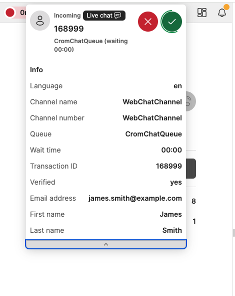
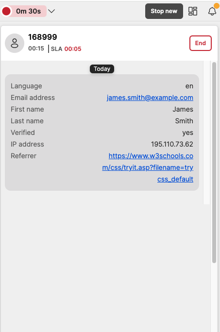

# Customer information

## Customer Information

### Introduction

Using this option, customer specific information can be sent from a website, into the webchat widget, which can then be forwarded onto an agent, but also it can be sent into ICA as well.

#### Script config

Here is an example of where the customer information is being set, for this example, the customer is already logged into the website, so we are passing in the information to the agent, to let them know the customer's name and email address, and also that they have already been verified

```javascript
    chatApp.setCustomerInfo({
      "First name": "James",
      "Last name": "Smith",
      "Verified": 'yes',
      "Email address": "email@8x8.com"
    })
```

To add this, you need to add it at the bottom of the script in this area here

```html
})(  
--ADD THE FUNCTION CHATAPP CODE HERE  
);  
    </script>
```

Then, the full script will look like this

```html
    <!-- Place this code snippet anywhere you want the button to appear in your page. If no button has been configured in the chat script, it will not show up nor take any space. -->
    <div id="__8x8-chat-button-container-script_1333070733643e5b8fa7a791.52161248"></div>

    <!-- This script will not interfere with the button layout, you just need to include it in the same page. It must also be within the <body> section of the page, preferably just before the ending tag. -->
    <script type="text/javascript">
    (function(c, f, ef){
        var typeofC = Object.prototype.toString.call(c);
        var props = (typeofC === '[object Object]' && c) || {};
        var cb = f || (typeofC === '[object Function]' && c);
        var config = {
            scriptUuid: "script_1333070733643e5b8fa7a791.52161248",
            tenant: "Y2hyaXNjcm9tYmllZGVtbzAx",
            channelName: "WebChatChannel",
            channelUuid: "Ak3ULjXFQx-unSA6ebdW8A",
            domain: "https://vcc-eu11.8x8.com",
            buttonContainerId: "__8x8-chat-button-container-script_1333070733643e5b8fa7a791.52161248",
            align: "right",
        };

        var url = new URL("https://cloud8-cc-geo.8x8.com/vcc-chat-channels/public/webchat/discovery");
        var params = { domain: config.domain, tenant: config.tenant, channelUuid: config.channelUuid };
        url.search = new URLSearchParams(params).toString();
        fetch(url)
            .then(response => response.json())
            .then(data => config.domain = !data.domain ? config.domain : data.domain)
            .catch(error => console.warn('Failed to retrieve override domain, will continue using ', config.domain, error))
            .finally(() => loadChat());

        function loadChat() {
            var se = document.createElement("script");
            se.type = "text/javascript";
            se.async = true;
            se.src = props.loaderURL || (config.domain + "/CHAT/common/js/chatv3.js");
            Object.keys(config).forEach(function (k) { se.dataset[k] = config[k] });
            Object.keys(props).forEach(function (k) { se.dataset[k] = props[k] });
            function handleInitEvent(e) {
                var initFn = e.detail.init;
                initFn(config, cb);
                se.removeEventListener('init', handleInitEvent)
            }
            function handleErrorEvent(e) {
                ef && ef(e);
                se.removeEventListener('customerror', handleErrorEvent);
            }
            se.addEventListener('init', handleInitEvent);
            se.addEventListener('customerror', handleErrorEvent);
            var os = document.getElementsByTagName("script")[0];
            os.parentNode.insertBefore(se, os);
        }
    })(function(chatApp) {
    chatApp.setCustomerInfo({
      "First name": "James",
      "Last name": "Smith",
      "Verified": 'yes',
      "Email address": "user@example.com"
    })
  });
    </script>

```

#### Agent view

When the query is routed through to an agent, they will be able to see the data that was passed into the webchat, in both the interaction panel -
  

Also the chat panel


  
#### Important Notes

* The customer information can be set on any myProxy lifecycle subscriber hook, but it will only be actually sent to the server when the customer is added to a queue.
* Only primitive data types (strings, numbers and booleans) are allowed as values. Trying to set the customer information with non-primitive data types (e.g., objects, arrays and functions) will result in console warnings, and their values will be discarded.
* Setting a customer information already previously set will overwrite that information, unless the new value is undefined. If the new value is null, that information will be removed from the customer information and will not be sent to the server from that moment on, unless it is set again with a non-null, defined value.
* The customer information key:value pair is limited in 100 characters for the key and 500 character for the value. Any key:pair bigger than the specified value will be ignored.

#### Troubleshooting

* Make sure that, when trying to remove properties from the customer information without resetting all its properties, the passed properties have null values (and not undefined), as setting undefined values to properties do not have any effect on the final customer information.
* If the message Customer info  is not of a primitive type and will be discarded is shown in the browser console when trying to set the customer information, it means that the logged property value is of a data type unsupported by the embedded chat. Only primitive data types (strings, numbers and booleans) are currently allowed.
* If the message Customer info  key is too big and will be discarded is shown in the browser console when trying to set the customer information, it means that the key string length is too big. Only strings with length less than 100 characters are allowed.
* If the message Customer info  value is too big and will be discarded is shown in the browser console when trying to set the customer information, it means that the value string length is too big. Only strings with length less than 500 characters are allowed.
