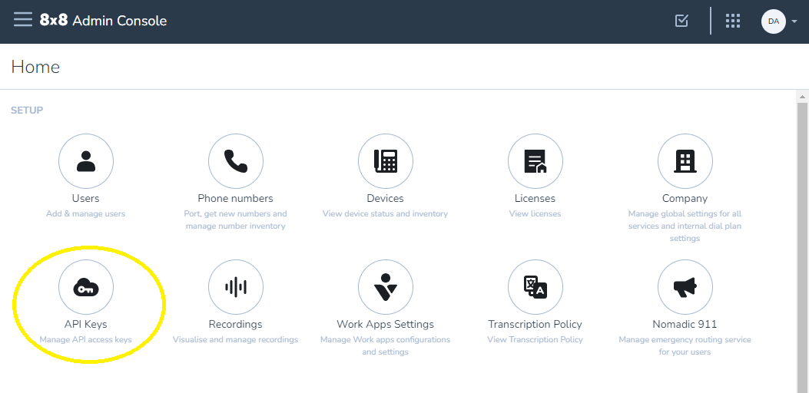
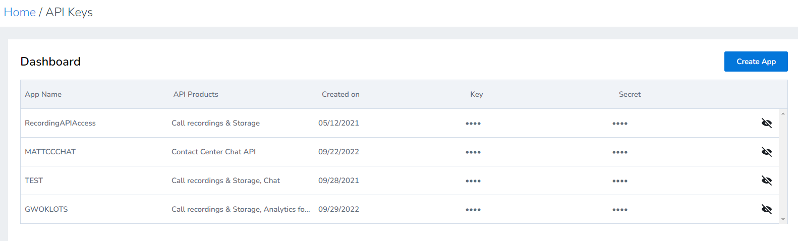

# Authentication

## Overview

The 8x8 Event Streaming service supports two types of authentication credentials, depending on how you obtain them and which 8x8 system you're using.

> 📘 **Authentication Method**
>
> Both authentication types use the same `X-API-Key` HTTP header, making the authentication mechanism consistent across both methods.
>
>

## Authentication Types

### Admin Console Keys (X-API-Key Header)

> ✅ **Recommended**
>
> Admin Console Keys are the **recommended authentication method** for production applications. They provide centralized credential management through the 8x8 Admin Console.
>
>

**Characteristics:**
- Obtained from **8x8 Admin Console** at [admin.8x8.com](https://admin.8x8.com)
- Key format: Always starts with `eght_`
- Authentication method: HTTP header `X-API-Key`

**How to Obtain:**

If you do not have the API Keys option in Admin Console, you do not have the correct permission/role.



1. Log into **[8x8 Admin Console](https://admin.8x8.com)**
2. In the **SETUP** section, click **API Keys**

   

3. Click **"Create App"**
4. Enter an application name (no spaces allowed)
5. In the **API Products** dropdown, select **"Pulsar Event Stream"**

   

6. Click **"Save"** to generate your key

   The dashboard will display your newly created app with the generated API key:

   

   **Note:** The key starts with `eght_` and can be viewed anytime by clicking the eye icon.

**Required Permission:** **Application Credentials** permission (**Company Admin Role** or custom role)

**Documentation:** [How to get API Keys](../../../analytics/docs/how-to-get-api-keys)

**Usage:**

```text
X-API-Key: eght_your_key_here
```

### Contact Center (CC) Tokens (X-API-Key Header)

**Characteristics:**
- Obtained from **Contact Center Configuration Manager**
- Token format: Base64-encoded `username:api-password` (does not start with `eght_`)
- Authentication method: HTTP header `X-API-Key` (same as Admin Console Keys)

**How to Obtain:**
1. Log into **Contact Center Configuration Manager**
2. Navigate to **Integration** > **API Token**
3. If you already have a **Data Request Token** displayed, copy that token
4. If no token exists, click **"New Token"** to generate one, then copy it

**Important Notes:**
- The token combines your **username** and **API password**
- Token does not expire unless you generate a new one
- Generating a new token invalidates the previous token for all use cases

**Documentation:** [Streaming API Overview](../legacy-streaming-api-overview)

**Usage:**

```text
X-API-Key: your_cc_token_here
```

> 📘 **Backward Compatibility**
>
> CC Tokens also continue to work with the legacy `Authorization: Basic` header and `?token=Basic+` URL parameter for backward compatibility with existing clients.
>
>

> 📘 **Authentication Methods: Header vs Query Parameter**
>
> The API key can be provided in two ways:
>
> **HTTP Header (Recommended):**
> - `X-API-Key: your-key-here`
> - Header names are case-insensitive per HTTP spec (X-API-Key, x-api-key, X-Api-Key all work)
> - More secure (not logged in URLs)
>
> **Query Parameter:**
> - `?x-api-key=your-key-here`
> - Parameter name is case-sensitive (must be lowercase `x-api-key`)
> - Useful when headers cannot be set (e.g., some browser contexts)
>
>

## Example Usage

import Tabs from '@theme/Tabs';
import TabItem from '@theme/TabItem';

### Using Admin Console Keys (X-API-Key Header)

> ✅ **Recommended Method**
>
> Admin Console Keys are the recommended authentication method for production applications.
>
>

<Tabs>
<TabItem value="go" label="Go">

```go
headers := http.Header{}
headers.Set("X-API-Key", "eght_your_admin_console_key")

dialer := websocket.Dialer{
    HandshakeTimeout: 45 * time.Second,
    TLSClientConfig: &tls.Config{
        InsecureSkipVerify: false, // Set to true only for testing
    },
}

conn, resp, err := dialer.Dial(wsURL, headers)
```

</TabItem>
<TabItem value="java" label="Java">

```java
String xApiKey = "eght_your_admin_console_key";
PulsarWebSocketClient client = new PulsarWebSocketClient(serverUri, xApiKey);

// The constructor automatically adds the header:
if (xApiKey != null && !xApiKey.isEmpty()) {
    addHeader("X-API-Key", xApiKey);
}
```

</TabItem>
<TabItem value="nodejs" label="Node.js">

```javascript
const WebSocket = require('ws');

const wsURL = 'wss://your-host/ws/v2/reader/persistent/tenant/namespace/topic';
const ws = new WebSocket(wsURL, {
    headers: {
        'X-API-Key': 'eght_your_admin_console_key'
    }
});
```

</TabItem>
</Tabs>

### Using CC Tokens (X-API-Key Header)

> 📘 **Alternative Method**
>
> CC Tokens remain supported for existing integrations or when Admin Console Keys are not available. Use the `X-API-Key` header (same format as Admin Console Keys).
>
>

<Tabs>
<TabItem value="go" label="Go">

```go
headers := http.Header{}
headers.Set("X-API-Key", "your_cc_token_here")

dialer := websocket.Dialer{
    HandshakeTimeout: 45 * time.Second,
    TLSClientConfig: &tls.Config{
        InsecureSkipVerify: false, // Set to true only for testing
    },
}

wsURL := "wss://your-host/ws/v2/reader/persistent/tenant/namespace/topic"
conn, resp, err := dialer.Dial(wsURL, headers)
```

</TabItem>
<TabItem value="java" label="Java">

```java
String ccToken = "your_cc_token_here";
String wsURL = "wss://your-host/ws/v2/reader/persistent/tenant/namespace/topic";

// Create client with X-API-Key header
PulsarWebSocketClient client = new PulsarWebSocketClient(URI.create(wsURL));
client.addHeader("X-API-Key", ccToken);
```

</TabItem>
<TabItem value="nodejs" label="Node.js">

```javascript
const WebSocket = require('ws');

const wsURL = 'wss://your-host/ws/v2/reader/persistent/tenant/namespace/topic';
const ws = new WebSocket(wsURL, {
    headers: {
        'X-API-Key': 'your_cc_token_here'
    }
});
```

</TabItem>
<TabItem value="python" label="Python">

```python
import websocket

ws_url = "wss://your-host/ws/v2/reader/persistent/tenant/namespace/topic"
headers = {
    "X-API-Key": "your_cc_token_here"
}

ws = websocket.WebSocketApp(ws_url, header=headers)
```

</TabItem>
<TabItem value="browser" label="Browser">

```javascript
// Browsers cannot set custom headers for WebSockets
// Use URL parameter instead
const wsURL = 'wss://your-host/ws/v2/reader/persistent/tenant/namespace/topic?x-api-key=your_cc_token_here';
const ws = new WebSocket(wsURL);

// Note: Token will be visible in browser DevTools and history
```

</TabItem>
</Tabs>

## Troubleshooting Authentication

### Common Issues

**401 Unauthorized**
- Verify your credential is correct and complete
- For Admin Console Keys: Ensure the key starts with `eght_`
- For CC Tokens: Ensure the token is the full base64-encoded string from Configuration Manager
- Check that you're using the right tenant name
- Ensure you're using the `X-API-Key` header (or `?x-api-key=` URL parameter for browsers)

## Next Steps

- [Connection Guide](./connection.md) - Learn about establishing connections
- [Message Format](./message-format.mdx) - Understand event structure
- [Code Examples](./examples/golang.md) - See authentication in action
