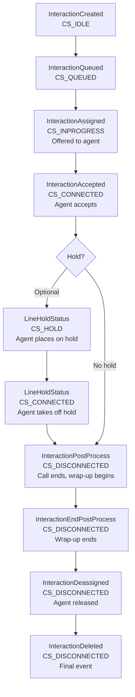
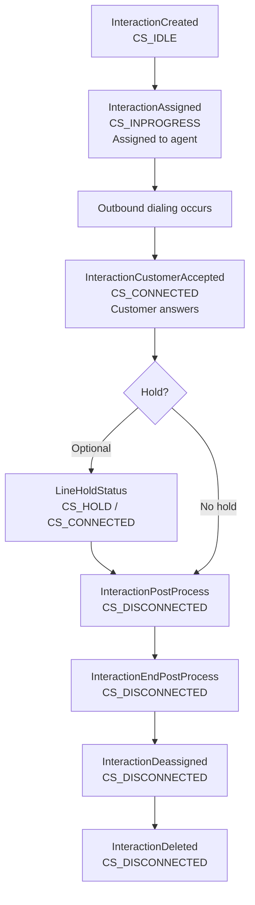
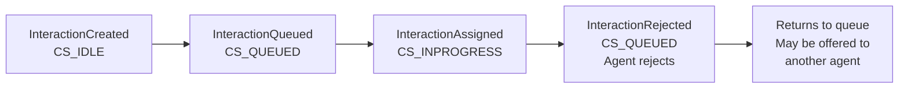
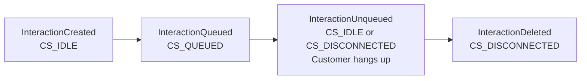
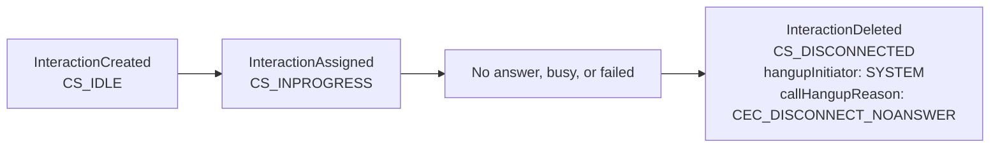
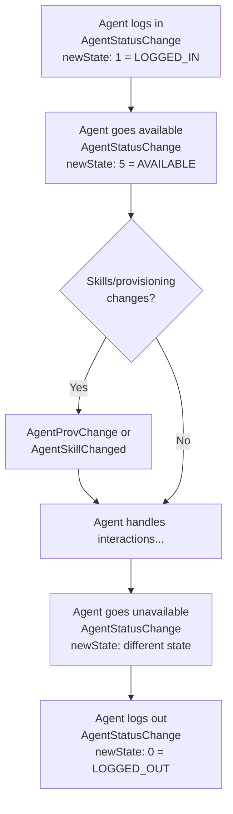

# Event Lifecycle

Understanding how events flow through an interaction's lifecycle helps you build robust integrations and accurately track interaction progress.

import Tabs from '@theme/Tabs';
import TabItem from '@theme/TabItem';

## Overview

Contact center interactions (calls, chats, emails) progress through a series of states, with each state transition generating an event. By tracking these events and their sequence, you can:

- Build real-time dashboards showing interaction status
- Calculate key metrics (queue time, talk time, wrap-up duration)
- Correlate events to understand complete customer journeys
- Identify patterns and optimize routing rules

## Inbound Call Lifecycle

A typical inbound phone call generates events in this sequence:



**Key Fields to Track:**
- `interactionGUID`: Unique identifier to correlate all events for this interaction
- `callState`: Current state in the lifecycle
- `eventTS` or `interactionEventTS`: When each transition occurred
- `agentId`: Which agent handled the interaction (from InteractionAssigned onward)

## Outbound Call Lifecycle

Outbound calls (agent-initiated or campaign) have a slightly different flow:



**Key Difference:** Outbound calls skip the `InteractionQueued` state and use `InteractionCustomerAccepted` when the customer answers.

## Rejected/Abandoned Call Flow

Not all interactions complete successfully. Here are common alternate flows:

### Agent Rejects Interaction



When an agent rejects an offered interaction, it returns to the queue and may be offered to another agent.

### Customer Abandons Queue



If a customer hangs up while waiting in queue, you'll see `InteractionUnqueued` followed by `InteractionDeleted`.

### Outbound Call Not Answered



When an outbound call doesn't connect, the `InteractionDeleted` event includes diagnostic information about why the call failed.

## Agent State Events

In parallel with interaction events, agent state changes are tracked separately:



**Note:** Agent events are published to:
- `tenant/event-v1/all` (all events topic)
- `tenant/event-v1/AgentStatusChange` (event-specific topic)
- `tenant/agent-v1/{agentId}` (agent-specific topic)

## Tracking Complete Interactions

To track a complete interaction from start to finish:

1. **Use `interactionGUID`** as the correlation key across all events
2. **Track state transitions** via `callState` field
3. **Monitor timestamps** using `eventTS` or `interactionEventTS` to calculate durations:
   - **Queue time**: InteractionQueued.eventTS → InteractionAssigned.eventTS
   - **Ring time**: InteractionAssigned.eventTS → InteractionAccepted.eventTS
   - **Talk time**: InteractionAccepted.eventTS → InteractionPostProcess.eventTS
   - **Wrap-up time**: InteractionPostProcess.eventTS → InteractionEndPostProcess.eventTS
4. **Capture outcome** from InteractionDeleted:
   - `hangupInitiator`: Who ended the call
   - `callHangupReason`: Why the call ended
   - `dispositionCode`: Agent's wrap-up disposition

## Example: Building an Interaction Timeline

Here's a practical example of tracking interaction metrics by correlating events:

<Tabs>
<TabItem value="go" label="Go">

```go
type InteractionTimeline struct {
    InteractionGUID string
    Created         time.Time
    Queued          time.Time
    Assigned        time.Time
    Connected       time.Time
    Disconnected    time.Time
    AgentID         string
    QueueID         int
    HangupReason    string
}

func (t *InteractionTimeline) ProcessEvent(event Event) {
    switch event.Event {
    case "InteractionCreated":
        t.InteractionGUID = event.InteractionGUID
        t.Created = time.Unix(event.EventTS, 0)
    case "InteractionQueued":
        t.Queued = time.Unix(event.EventTS, 0)
        t.QueueID = event.QueueID
    case "InteractionAssigned":
        t.Assigned = time.Unix(event.EventTS, 0)
        t.AgentID = event.AgentID
    case "InteractionAccepted", "InteractionCustomerAccepted":
        t.Connected = time.Unix(event.EventTS, 0)
    case "InteractionDeleted":
        t.Disconnected = time.Unix(event.EventTS, 0)
        t.HangupReason = event.CallHangupReason
    }
}

func (t *InteractionTimeline) QueueDuration() time.Duration {
    if t.Queued.IsZero() || t.Assigned.IsZero() {
        return 0
    }
    return t.Assigned.Sub(t.Queued)
}

func (t *InteractionTimeline) TalkDuration() time.Duration {
    if t.Connected.IsZero() || t.Disconnected.IsZero() {
        return 0
    }
    return t.Disconnected.Sub(t.Connected)
}
```

</TabItem>
<TabItem value="python" label="Python">

```python
from datetime import datetime
from dataclasses import dataclass
from typing import Optional

@dataclass
class InteractionTimeline:
    interaction_guid: Optional[str] = None
    created: Optional[datetime] = None
    queued: Optional[datetime] = None
    assigned: Optional[datetime] = None
    connected: Optional[datetime] = None
    disconnected: Optional[datetime] = None
    agent_id: Optional[str] = None
    queue_id: Optional[int] = None
    hangup_reason: Optional[str] = None

    def process_event(self, event: dict):
        event_type = event.get('event')

        if event_type == 'InteractionCreated':
            self.interaction_guid = event['interactionGUID']
            self.created = datetime.fromtimestamp(event['eventTS'])
        elif event_type == 'InteractionQueued':
            self.queued = datetime.fromtimestamp(event['eventTS'])
            self.queue_id = event.get('queueId')
        elif event_type == 'InteractionAssigned':
            self.assigned = datetime.fromtimestamp(event['eventTS'])
            self.agent_id = event.get('agentId')
        elif event_type in ['InteractionAccepted', 'InteractionCustomerAccepted']:
            self.connected = datetime.fromtimestamp(event['eventTS'])
        elif event_type == 'InteractionDeleted':
            self.disconnected = datetime.fromtimestamp(event['eventTS'])
            self.hangup_reason = event.get('callHangupReason')

    def queue_duration(self) -> Optional[float]:
        if self.queued and self.assigned:
            return (self.assigned - self.queued).total_seconds()
        return None

    def talk_duration(self) -> Optional[float]:
        if self.connected and self.disconnected:
            return (self.disconnected - self.connected).total_seconds()
        return None
```

</TabItem>
<TabItem value="nodejs" label="Node.js">

```javascript
class InteractionTimeline {
    constructor() {
        this.interactionGUID = null;
        this.created = null;
        this.queued = null;
        this.assigned = null;
        this.connected = null;
        this.disconnected = null;
        this.agentId = null;
        this.queueId = null;
        this.hangupReason = null;
    }

    processEvent(event) {
        switch (event.event) {
            case 'InteractionCreated':
                this.interactionGUID = event.interactionGUID;
                this.created = new Date(event.eventTS * 1000);
                break;
            case 'InteractionQueued':
                this.queued = new Date(event.eventTS * 1000);
                this.queueId = event.queueId;
                break;
            case 'InteractionAssigned':
                this.assigned = new Date(event.eventTS * 1000);
                this.agentId = event.agentId;
                break;
            case 'InteractionAccepted':
            case 'InteractionCustomerAccepted':
                this.connected = new Date(event.eventTS * 1000);
                break;
            case 'InteractionDeleted':
                this.disconnected = new Date(event.eventTS * 1000);
                this.hangupReason = event.callHangupReason;
                break;
        }
    }

    queueDuration() {
        if (this.queued && this.assigned) {
            return (this.assigned - this.queued) / 1000; // seconds
        }
        return null;
    }

    talkDuration() {
        if (this.connected && this.disconnected) {
            return (this.disconnected - this.connected) / 1000; // seconds
        }
        return null;
    }
}
```

</TabItem>
</Tabs>

## Best Practices

### Event Correlation

- **Always use `interactionGUID`** to correlate events - it's the only reliable way to track an interaction across its entire lifecycle
- **Store events** rather than just metrics - you may need to recalculate or debug later
- **Handle out-of-order events** - network delays can cause events to arrive out of sequence

### State Management

- **Track `callState` transitions** to ensure your application state matches the interaction state
- **Expect optional events** - not all interactions follow the complete path (e.g., abandoned calls skip most steps)
- **Handle missing events** - network issues or system restarts may cause missed events

### Metric Calculation

- **Use event timestamps** (`eventTS` or `interactionEventTS`) for accurate duration calculations
- **Account for holds** - `LineHoldStatus` events affect talk time calculations
- **Consider time zones** - timestamps are in UTC, convert as needed for reporting

### Error Handling

- **Check `hangupInitiator`** and `callHangupReason` in InteractionDeleted events to understand why interactions ended
- **Monitor for anomalies** - unexpected state transitions may indicate system issues
- **Log unhandled event types** - new event types may be added in future releases

## Next Steps

- [Message Format](./message-format.mdx) - Detailed field descriptions and message structure
- [Event Reference](./event-reference.md) - Complete list of event types and their fields
- [Field Reference](./field-reference.mdx) - Detailed documentation for all event fields
- [Code Examples](./examples/golang.md) - Complete working implementations
