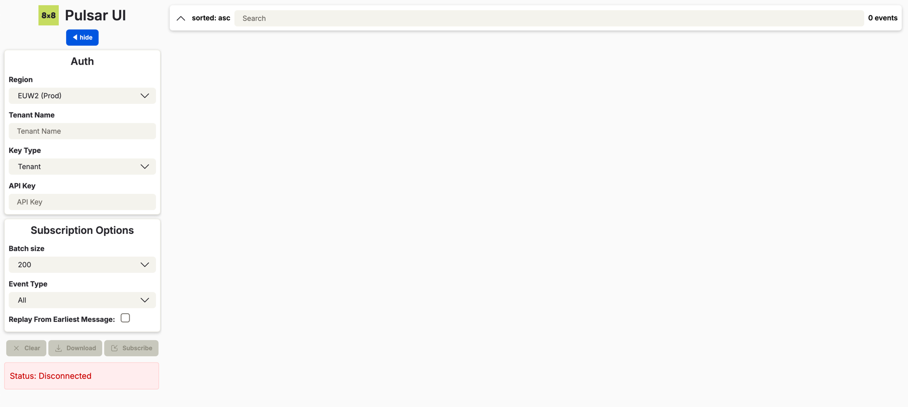
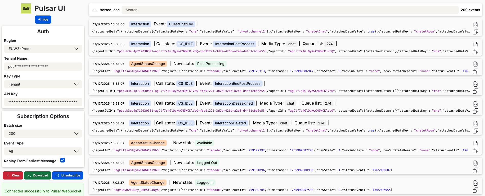

# Browser Client Example

Web-based tool for testing, debugging, and monitoring 8x8 Event Streams in real-time.

## Accessing the Pulsar UI

The Pulsar UI is available at: [https://cloud8.8x8.com/vcc-cloud8-pulsar-ui/ui](https://cloud8.8x8.com/vcc-cloud8-pulsar-ui/ui)

Fill in your region, tenant name, and API key (see [Authentication Guide](../authentication.mdx)), then click **Subscribe**.

## Next Steps

- [Go Client Example](./golang.md) - For command-line usage and automation
- [Java Client Example](./java.md) - For Java-based applications
- [Python Client Example](./python.mdx) - For Python-based applications
- [Node.js Client Example](./nodejs.mdx) - For JavaScript/Node.js applications
- [Connection Guide](../connection.md) - Learn more about WebSocket connections
- [Message Format](../message-format.mdx) - Understanding event structure
