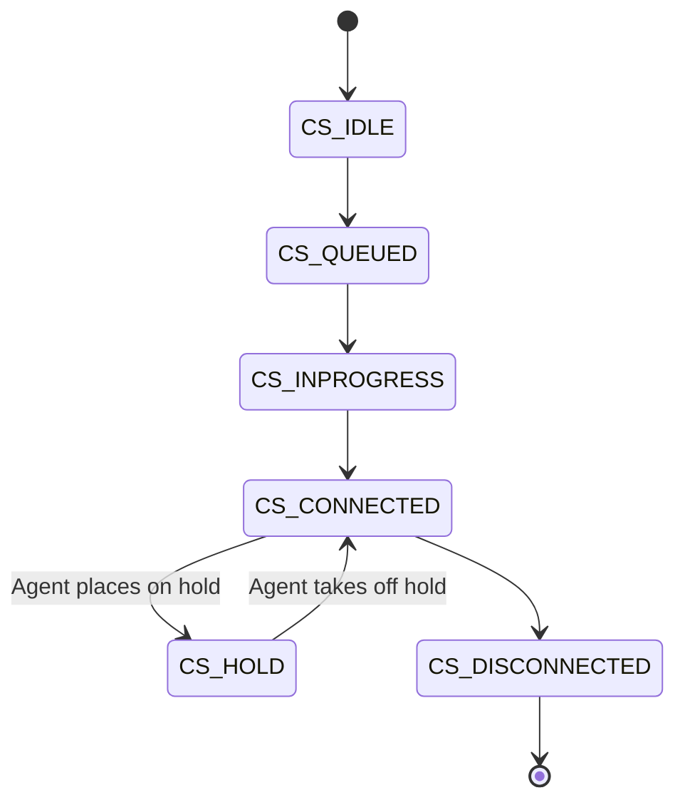
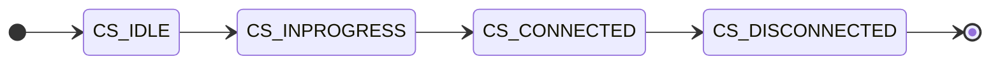

# Field Reference

This page provides detailed documentation for all fields that appear in event payloads, including field value codes, transformations, and the comprehensive attachedData keys reference.

import Tabs from '@theme/Tabs';
import TabItem from '@theme/TabItem';

## Comprehensive AttachedData Keys Reference

The `attachedData` field can contain a wide variety of keys depending on the interaction type, channel, and system configuration. Below is a comprehensive reference organized by category:

### Basic Interaction Fields

| Key                  | Type   | Description                                          |
|----------------------|--------|------------------------------------------------------|
| `phoneNum`           | number | Primary phone number for the interaction             |
| `pho`                | mixed  | Phone number (short key)                             |
| `callingName`        | mixed  | Caller's name or calling number                      |
| `callerId`           | number | Caller ID number                                     |
| `@pri`               | number | Priority value                                       |
| `priority`           | number | Queue priority (50 is standard)                      |
| `med`                | string | Media type code<br />"T" for phone<br />"C" for chat/SMS   |
| `cha`                | mixed  | Channel identifier                                   |
| `channelName`        | mixed  | Channel/queue name                                   |
| `cnt`                | number | Counter field                                        |
| `con`                | number | Contact/record ID                                    |
| `tok`                | number | Token identifier                                     |

### Queue and Routing Fields

| Key                  | Type   | Description                                          |
|----------------------|--------|------------------------------------------------------|
| `que`                | string | Queue identifier (format: `tenant~~queue~~media~~id`) |
| `oqu`                | string | Original queue before transfer                       |
| `queueDirection`     | string | "in" (inbound)<br />"out" (outbound)                   |
| `tenantName`         | string | Tenant name                                          |
| `tenantSkillName`    | string | Skill/queue name                                     |

### Timing Fields

| Key                              | Type   | Description                                   |
|----------------------------------|--------|-----------------------------------------------|
| `tim`                            | number | Timestamp (seconds since epoch)               |
| `otim`                           | number | Original/queue entry time (seconds)           |
| `waitTime`                       | number | Wait time in seconds                          |
| `callAnsweredTime`               | number | Call answered timestamp (milliseconds)        |
| `callHangupTime`                 | number | Call hangup timestamp (milliseconds)          |
| `callAnsweredTenantTT`           | string | Answered time formatted in tenant timezone    |
| `callHangupTenantTT`             | string | Hangup time formatted in tenant timezone      |
| `callDuration`                   | string | Call duration formatted (HH:MM:SS)            |
| `callDurationSec`                | number | Call duration in seconds                      |
| `phoneQueueInteractionStartTime` | number | Phone queue interaction start (seconds)       |

### Recording Fields

| Key                 | Type   | Description                                         |
|---------------------|--------|-----------------------------------------------------|
| `tenantRecServer`   | string | Recording server name (e.g., "eu10nfs01")          |
| `aAgtCallRec`       | string | Agent call recording setting<br />"yes"<br />"no"          |
| `agtInitVR`         | string | Agent initiated recording<br />"NotSet"<br />etc.         |
| `callerPerm`        | string | Caller permission for recording<br />"yes"<br />"no"       |
| `vRecP`             | number | Recording parameter                                 |

### Outbound and Campaign Fields

| Key                     | Type    | Description                                      |
|-------------------------|---------|--------------------------------------------------|
| `ctl_transType`         | string  | Transaction type<br />"agentdial"<br />"campaign"<br />etc. |
| `destType`              | string  | Destination type<br />"external"<br />etc.              |
| `outboundTclItemId`     | mixed   | Outbound transaction code list item ID           |
| `outboundTclListId`     | mixed   | Outbound transaction code list ID                |
| `outboundTclShortCode`  | string  | Outbound TCL short code                          |
| `campId`                | number  | Campaign ID                                       |
| `campName`              | string  | Campaign name                                     |
| `dialMode`              | string  | Dial mode<br />"preview"<br />"progressive"<br />etc.        |
| `extRecordId`           | number  | External record ID                                |
| `extRecordType`         | string  | External record type<br />"customer"<br />etc.           |
| `phoneList`             | string  | Phone list for campaign                           |
| `previewTimeout`        | string  | Preview timeout setting                           |
| `rejectOnPreviewTimeout`| boolean | Whether to reject on preview timeout              |
| `retry_count`           | number  | Retry count for outbound call                     |
| `showSkipButton`        | boolean | Whether skip button is shown                      |

### Transfer and Original Interaction Fields

| Key                       | Type   | Description                                    |
|---------------------------|--------|------------------------------------------------|
| `originalInteractionGuid` | string | GUID of original interaction before transfer   |
| `originalTokenId`         | number | Token ID of original interaction               |
| `originalTransactionId`   | number | Transaction ID of original interaction         |

### Transaction Codes and Disposition

| Key                | Type   | Description                                                                                                             |
|--------------------|--------|-------------------------------------------------------------------------------------------------------------------------|
| `tclSelectedItems` | string | Selected transaction codes in format "listId\|itemId,listId\|itemId" - see [Transaction Codes](#transaction-codes-and-disposition) section for details |

### Digital Channel Fields (Chat, SMS, Email)

| Key                             | Type    | Description                                      |
|---------------------------------|---------|--------------------------------------------------|
| `chaletChat`                    | boolean | Whether this is a Chalet chat                    |
| `chaletRoom`                    | string  | Chalet room identifier                           |
| `channelId`                     | string  | Channel ID (short form)                          |
| `createInteractionTimestampNanos` | number | Creation timestamp in nanoseconds              |
| `customerLanguage`              | string  | Customer language code (e.g., "en")              |
| `extTransactionData`            | string  | External transaction data (formatted string)     |
| `extTransactionDataID`          | string  | External transaction data ID                     |
| `sessionId`                     | string  | Session identifier                               |
| `timezoneOffset`                | number  | Timezone offset                                  |
| `type`                          | string  | Interaction type (e.g., "SMS")                   |
| `nam`                           | string  | Name field for digital channels                  |

### Remote Participant Fields

| Key                 | Type   | Description                                       |
|---------------------|--------|---------------------------------------------------|
| `remoteCallingName` | string | Remote caller name (formatted)                    |
| `remotePhoneNum`    | string | Remote phone number (formatted with country code) |

### Advanced/System Fields

| Key                  | Type   | Description                                         |
|----------------------|--------|-----------------------------------------------------|
| `ctl_userdata`       | string | Control user data                                   |
| `externalUserData`   | string | External user data string                           |
| `carrierCallBlockingCheck` | number | Carrier call blocking check result            |
| `record_phone_index` | number | Phone record index                                  |
| `schema_user`        | string | Database schema user                                |

**Note:** Not all keys will be present in every event. The keys present depend on:
- Media type (phone, chat, email, SMS)
- Interaction direction (inbound vs outbound)
- System configuration and enabled features
- Customer-specific customizations

## Field Values Reference

Many fields in event payloads use numeric ordinal values to represent states, modes, and types. This section documents what these numeric values mean.

### Resource Type Codes

The `resourceType` field indicates the media channel type:

| Code | Media Type | Description                    |
|------|------------|--------------------------------|
| 0    | Phone      | Voice call interaction         |
| 1    | Email      | Email interaction              |
| 2    | Chat       | Chat or messaging interaction  |
| 3    | SMS        | SMS text message interaction   |
| 4    | Video      | Video call interaction         |

**Example:**

```json
{
  "resourceType": 0,
  "mediaType": "phone"
}
```

**Note:** The `mediaType` field provides a normalized string representation ("phone", "email", "chat"), while `resourceType` contains the numeric code.

### Recording Mode Codes

The `recordingMode` field indicates the recording state:

| Code | Mode    | Description                                      |
|------|---------|--------------------------------------------------|
| 0    | Off     | Recording is disabled                            |
| 1    | Record  | Recording is active                              |
| 2    | Monitor | Monitoring mode (recording without notification) |

**In JSON, these appear as strings:**

```json
{
  "recordingMode": "yes",  // Corresponds to code 1 (Record)
  "recordingMode": "no"    // Corresponds to code 0 (Off)
}
```

### Call State Codes

The `callState` field indicates the current state of an interaction throughout its lifecycle:

| Code              | Description                                                                                     | Typical Events                                    |
|-------------------|-------------------------------------------------------------------------------------------------|---------------------------------------------------|
| `CS_IDLE`         | Initial state - interaction created but not yet queued                                          | InteractionCreated                                |
| `CS_QUEUED`       | Interaction waiting in queue to be assigned to an agent                                         | InteractionQueued, InteractionUnqueued            |
| `CS_INPROGRESS`   | Interaction assigned to agent but not yet connected (ringing/alerting)                          | InteractionAssigned                               |
| `CS_CONNECTED`    | Active interaction - agent and customer are connected                                           | InteractionAccepted, InteractionCustomerAccepted  |
| `CS_HOLD`         | Interaction is on hold                                                                          | LineHoldStatus (status: true)                     |
| `CS_DISCONNECTED` | Interaction has ended - one or more parties disconnected                                        | InteractionDeleted, InteractionPostProcess        |

**State Transitions:**

Typical interaction lifecycle for inbound calls:



Typical interaction lifecycle for outbound calls:



**Example in events:**

```json
{
  "event": "InteractionQueued",
  "callState": "CS_QUEUED",
  "queueTime": 1744819217
}
```

```json
{
  "event": "InteractionAccepted",
  "callState": "CS_CONNECTED",
  "agentId": "agAglVJkg0TU28dok9y9UQKg"
}
```

**Note:** The `callState` field appears in most Interaction events and is essential for tracking interaction progress through the system.

### Agent State Codes

Agent-related events use numeric codes for states and presence:

#### Login State

| Code | State       | Description                  |
|------|-------------|------------------------------|
| 0    | LOGGED_OUT  | Agent is logged out          |
| 1    | LOGGED_IN   | Agent is logged in           |

#### Presence

| Code | Presence | Description                      |
|------|----------|----------------------------------|
| 0    | Offline  | Agent is offline                 |
| 1    | Online   | Agent is online and available    |
| 2    | DND      | Do Not Disturb (busy/unavailable)|

**Example from AgentStatusChange event:**

```json
{
  "newState": 5,           // Current agent state
  "newSubState": "none",   // Sub-state description
  "newSubStateReason": "none"
}
```

### Reject Reason Codes

The `rejectReason` field (in `InteractionRejected` events) indicates why an interaction was rejected:

| Code | Reason        | Description                                 |
|------|---------------|---------------------------------------------|
| 0    | Unknown       | Rejection reason not specified              |
| 1    | Timeout       | Agent did not respond in time               |
| 2    | Agent Reject  | Agent explicitly rejected the interaction   |

### Hangup Reason Codes

The `callHangupReason` field (in `InteractionDeleted` events) indicates why a call ended. This provides detailed information about call termination beyond just who initiated the hangup.

| Code                          | Category      | Description                                                                 | Common Scenarios                                      |
|-------------------------------|---------------|-----------------------------------------------------------------------------|-------------------------------------------------------|
| `CEC_NONE`                    | Normal        | No specific reason provided                                                 | Default value, generic termination                    |
| `CEC_DISCONNECT_NORMAL`       | Normal        | Normal call termination - call completed successfully                       | Customer and agent finished conversation              |
| `CEC_DISCONNECT_BUSY`         | Failed        | Called number was busy                                                      | Outbound call to busy number                          |
| `CEC_DISCONNECT_BADADDRESS`   | Failed        | Invalid phone number or unreachable destination                             | Malformed number, disconnected number                 |
| `CEC_DISCONNECT_NOANSWER`     | Failed        | Called party did not answer                                                 | Outbound call rang but no answer                      |
| `CEC_DISCONNECT_CANCELLED`    | Cancelled     | Call was cancelled before connection                                        | Agent or customer cancelled during ring               |
| `CEC_DISCONNECT_REJECTED`     | Rejected      | Call was rejected by the called party or system                             | Customer/system declined call                         |
| `CEC_DISCONNECT_FAILED`       | Failed        | Call failed due to system or network error                                  | Network issues, system errors                         |
| `CEC_DISCONNECT_BLOCKED`      | Blocked       | Call was blocked (e.g., by spam filter, DNC list)                           | Compliance blocking, spam detection                   |

**Usage with hangupInitiator:**

The `callHangupReason` works in conjunction with `hangupInitiator` to provide complete termination information:

| hangupInitiator | callHangupReason              | Interpretation                                    |
|-----------------|-------------------------------|---------------------------------------------------|
| `CUSTOMER`      | `CEC_DISCONNECT_NORMAL`       | Customer hung up normally                         |
| `AGENT`         | `CEC_DISCONNECT_NORMAL`       | Agent hung up normally                            |
| `SYSTEM`        | `CEC_DISCONNECT_NOANSWER`     | System terminated - customer didn't answer        |
| `SYSTEM`        | `CEC_DISCONNECT_FAILED`       | System terminated - technical failure             |
| `SYSTEM`        | `CEC_DISCONNECT_BLOCKED`      | System terminated - call blocked                  |

**Example in InteractionDeleted event:**

```json
{
  "event": "InteractionDeleted",
  "callState": "CS_DISCONNECTED",
  "hangupInitiator": "SYSTEM",
  "callHangupReason": "CEC_DISCONNECT_NOANSWER",
  "dispositionCode": 1000
}
```

**Interpretation:** System terminated the call because the customer didn't answer.

**Analytics Use Cases:**

- **Call completion rates**: Count `CEC_DISCONNECT_NORMAL` vs other reasons
- **Technical issues**: Monitor `CEC_DISCONNECT_FAILED` for system problems
- **Contact rates**: Track `CEC_DISCONNECT_NOANSWER` and `CEC_DISCONNECT_BUSY` for outbound campaigns
- **Compliance monitoring**: Track `CEC_DISCONNECT_BLOCKED` for regulatory compliance

## Field Transformations

The system performs several transformations on field values between the internal event format and the output you receive. Understanding these transformations helps explain why certain fields have specific formats.

### GUID Extraction

Agent IDs are stored internally as GUIDs with the format `"X-AgentId-Y"`, but are extracted to simpler agent IDs for output:

**Internal format:** `"tenant01-agAglVJkg0TU28dok9y9UQKg-e46672cd-660c-46f5-b8f0-856eaf18f65c"`

**Extracted agentId:** `"agAglVJkg0TU28dok9y9UQKg"`

The extraction process:
1. GUID is split by `-` delimiter
2. The component starting with `ag` is extracted
3. This becomes the `agentId` field value
4. The full GUID is preserved in `agentGUID` field

**Example in event:**

```json
{
  "agentGUID": "tenant01-agAglVJkg0TU28dok9y9UQKg-e46672cd-660c-46f5-b8f0-856eaf18f65c",
  "agentId": "agAglVJkg0TU28dok9y9UQKg"
}
```

### Queue ID Parsing

Queue identifiers are stored internally using a `~~` (double-tilde) separated format: `"tenant~~queue~~media~~id"`, but are parsed to extract just the numeric queue ID:

**Internal format:** `"tenant01~~1162~~phone~~b1e3e2f2-b01a-4a03-ba3d-f30859414d97"`

**Extracted queueId:** `1162`

The parsing process:
1. Split the string by `~~` delimiter
2. Extract the numeric queue ID component
3. This becomes the `queueId` field value

**Example in attachedData:**

```json
{
  "attachedData": {
    "attachedDatum": [
      {"attachedDataKey": "que", "attachedDataValue": "tenant01~~1162~~phone~~..."}
    ]
  },
  "queueId": 1162
}
```

### Media Type Normalization

The `mediaType` field is normalized from numeric `resourceType` codes to human-readable strings:

| resourceType | mediaType |
|--------------|-----------|
| 0            | "phone"   |
| 1            | "email"   |
| 2            | "chat"    |
| 3            | "chat"    |
| 4            | "phone"   |

**Example:**

```json
{
  "resourceType": 0,
  "mediaType": "phone"
}
```

### Participating Agents Array Parsing

The `participatingAgents` field contains semicolon-separated agent IDs that are parsed from internal GUID format:

**Internal format:** `"tenant01-agAglVJkg0TU28dok9y9UQKg-guid1;tenant01-agBbcDef123-guid2"`

**Parsed output:** `"agAglVJkg0TU28dok9y9UQKg,agBbcDef123"` (comma-separated agent IDs)

**Note:** In some events, this may appear as comma-separated instead of semicolon-separated, depending on the transformation stage.

### Boolean String Representation

Boolean values in events are represented as strings (`"true"`, `"false"`) rather than native JSON booleans:

```json
{
  "isAgentInitiated": false,      // JSON boolean in some contexts
  "isOutboundCall": true,         // JSON boolean
  "isDirectAccess": "false",      // String in other contexts
  "isExternal": "true"            // String
}
```

This is due to the internal message format constraints. When consuming events, be prepared to handle both boolean and string representations.

### Timestamp Formats

Events include timestamps in multiple formats:

| Field Name           | Format                        | Example        | Description                      |
|----------------------|-------------------------------|----------------|----------------------------------|
| `eventTS`            | Seconds since epoch (integer) | 1744819217     | Event occurrence time            |
| `interactionEventTS` | Seconds since epoch (integer) | 1744819217     | Interaction-specific event time  |
| `queueTime`          | Seconds since epoch (integer) | 1744819217     | Time entered queue               |
| `msgInfo.timestamp`  | Milliseconds since epoch      | 1744819217000  | Message metadata timestamp       |

**Converting to Date/Time:**

<Tabs>
<TabItem value="go" label="Go">

```go
// From seconds
eventTime := time.Unix(event.EventTS, 0)

// From milliseconds
msgTime := time.UnixMilli(event.MsgInfo.Timestamp)
```

</TabItem>
<TabItem value="java" label="Java">

```java
// From seconds
Instant eventTime = Instant.ofEpochSecond(event.getEventTS());

// From milliseconds
Instant msgTime = Instant.ofEpochMilli(event.getMsgInfo().getTimestamp());
```

</TabItem>
<TabItem value="python" label="Python">

```python
from datetime import datetime

# From seconds
event_time = datetime.fromtimestamp(event['eventTS'])

# From milliseconds
msg_time = datetime.fromtimestamp(event['msgInfo']['timestamp'] / 1000)
```

</TabItem>
<TabItem value="nodejs" label="Node.js">

```javascript
// From seconds
const eventTime = new Date(event.eventTS * 1000);

// From milliseconds
const msgTime = new Date(event.msgInfo.timestamp);
```

</TabItem>
</Tabs>

## Transaction Codes and Disposition

Interaction events related to call wrap-up include two important but distinct fields for tracking call outcomes:

### dispositionCode vs transactionCodeList

#### dispositionCode

A **single primary outcome code** representing the overall call result:

- Simple string or numeric value
- High-level categorization of what happened
- Examples: `"CALLBACK"`, `"SALE"`, `"NO_ANSWER"`, `1000`
- Always a single value
- Appears in `InteractionDeleted` and `InteractionEndPostProcess` events

**Example:**

```json
{
  "event": "InteractionDeleted",
  "dispositionCode": 1000,
  "agentNotes": "Customer requested callback tomorrow"
}
```

#### transactionCodeList

**Multiple detailed transaction codes** for granular categorization:

- Structured format: `"listId|itemId,listId|itemId"`
- Can contain multiple codes for different aspects of the interaction
- References database-defined Transaction Code Lists (TCL)
- Used for detailed analytics, compliance tracking, and business intelligence
- Agents can select multiple codes during wrap-up
- System may auto-apply mandatory codes

**Format:** Comma-separated pairs of `listId|itemId`

**Example:**

```json
{
  "attachedData": {
    "attachedDatum": [
      {"attachedDataKey": "tclSelectedItems", "attachedDataValue": "5|12,6|45,8|99"}
    ]
  }
}
```

This translates to:
- List 5, Item 12: "Product Type - Insurance"
- List 6, Item 45: "Customer Sentiment - Satisfied"
- List 8, Item 99: "Follow-up Required - Yes"

### Complete Example

A typical wrap-up scenario showing both fields:

```json
{
  "event": "InteractionDeleted",
  "dispositionCode": "SALE",
  "agentNotes": "Sold premium insurance package",
  "attachedData": {
    "attachedDatum": [
      {"attachedDataKey": "tclSelectedItems", "attachedDataValue": "5|12,6|45,8|99"}
    ]
  }
}
```

Here:
- **dispositionCode** = `"SALE"` (overall outcome: sale was made)
- **transactionCodeList** = `"5|12,6|45,8|99"` (detailed categorization: insurance product, satisfied customer, follow-up needed)

### Configuration

Transaction Code Lists are configured by administrators in **8x8 Configuration Manager**:

#### Creating Transaction Code Lists

1. Navigate to: **Configuration Menu → Transaction Codes → Add**
2. Configure properties for the code list (name, description, settings)
3. Define individual codes in the **Codes** tab
4. Optional: Translate codes to secondary languages

#### Viewing List and Item IDs

To understand the numeric IDs in `tclSelectedItems`:

- **List ID**: In the Transaction Codes list, select dropdown → **Columns → ID** to show the list ID column
- **Item ID**: Edit a list → **Codes** tab → Select dropdown → **Columns → ID** to show individual transaction code IDs

These numeric IDs (listId and itemId) are what appear in `tclSelectedItems` as `"listId|itemId"`.

#### Assignment

- Transaction code lists are assigned to **agent groups** or **queues**
- Multiple transaction code lists can be applied to a single agent group or queue
- Agents only see codes from lists assigned to their group/queue

#### Agent Selection

- Agents select transaction codes during interaction wrap-up in Agent Console/Workspace
- Selected codes are recorded in the `tclSelectedItems` field
- System may automatically apply mandatory codes if configured

### Documentation References

- [Transaction codes overview](https://docs.8x8.com/8x8WebHelp/VCC/configuration-manager-vovcc/content/transactioncodespageoverview.htm)
- [Create transaction codes](https://docs.8x8.com/8x8WebHelp/VCC/configuration-manager-vovcc/content/creatingtransactioncodelist.htm)
- [Agent: Select transaction codes](https://docs.8x8.com/8x8WebHelp/contact-center/agent-workspace/Content/transaction-codes.htm)

## UserData Extraction

The `attachedData` object contains an array of key-value pairs. Many of these keys are extracted from a nested internal structure called `userData` and transformed into top-level fields or remain in `attachedData`.

### Extraction Mapping

The following table shows how nested `userData` fields are extracted and mapped:

| userData Key            | Output Field                           | Description                                           | Example Value                 |
|-------------------------|----------------------------------------|-------------------------------------------------------|-------------------------------|
| `userData.otim`         | `eventTS`                              | Original/queue entry timestamp (seconds since epoch)  | 1744819217                    |
| `userData.tclSelectedItems` | attachedData: `tclSelectedItems`   | Transaction code list (format: listId\|itemId,...)    | "5\|12,6\|45,8\|99"           |
| `userData.queueDirection` | `direction`                          | Queue direction (inbound/outbound)                    | "in", "out"                   |
| `userData.cha`          | `inboundChannelid`                     | Inbound channel identifier                            | 441733968848                  |
| `userData.que`          | `queueId`                              | Queue ID (parsed from `~~` separated format)          | 1162                          |
| `userData.tim`          | `queueTime`                            | Time when interaction entered queue (seconds)         | 1744819217                    |
| `userData.ema`          | `emailSourceAddress`                   | Email source address (for email interactions)         | `user@example.com`            |
| `userData.aAgtCallRec`  | `overrideAutoInteractionRecording`     | Override auto recording setting                       | "yes", "no"                   |
| `userData.agtCallRec`   | `allowAgentOverrideInteractionRecording` | Allow agent to override recording                   | "yes", "no"                   |
| `userData.callerPerm`   | `callerPermission`                     | Caller permission for recording                       | "yes", "no"                   |

### How Extraction Works

1. **Internal Event Creation**: The system creates an internal event with nested `userData` structure
2. **Field Extraction**: Specific keys from `userData` are extracted to top-level fields or separate `attachedData` entries
3. **Format Transformation**: Some fields undergo additional transformation (e.g., queue ID parsing from `~~` format)
4. **Preservation**: The complete `userData` structure is also preserved in `attachedData` for reference

### Example

**Internal userData structure:**

```text
userData = {
  "otim": "1744819217",
  "que": "tenant01~~1162~~phone~~b1e3e2f2-b01a-4a03-ba3d-f30859414d97",
  "queueDirection": "in",
  "cha": "441733968848",
  "tclSelectedItems": "5|12,6|45"
}
```

**Extracted to output event:**

```json
{
  "eventTS": 1744819217,
  "queueId": 1162,
  "direction": "in",
  "inboundChannelid": 441733968848,
  "attachedData": {
    "attachedDatum": [
      {"attachedDataKey": "que", "attachedDataValue": "tenant01~~1162~~phone~~..."},
      {"attachedDataKey": "queueDirection", "attachedDataValue": "in"},
      {"attachedDataKey": "cha", "attachedDataValue": 441733968848},
      {"attachedDataKey": "tclSelectedItems", "attachedDataValue": "5|12,6|45"}
    ]
  }
}
```

**Note:**

- `eventTS` is extracted from `userData.otim`
- `queueId` is extracted and parsed from `userData.que` (removing the `~~` format)
- `direction` is extracted from `userData.queueDirection`
- `inboundChannelid` is extracted from `userData.cha`
- Original values are preserved in `attachedData` for reference

## Next Steps

- [Message Format](./message-format.mdx) - Learn how to decode and process messages
- [Event Reference](./event-reference.md) - Browse all available event types
- [Code Examples](./examples/golang.md) - See field usage in context
