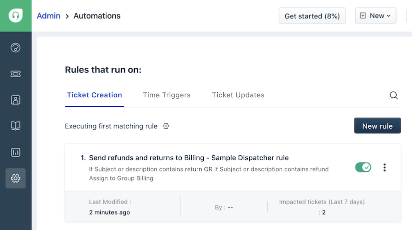
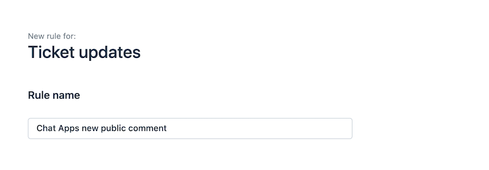
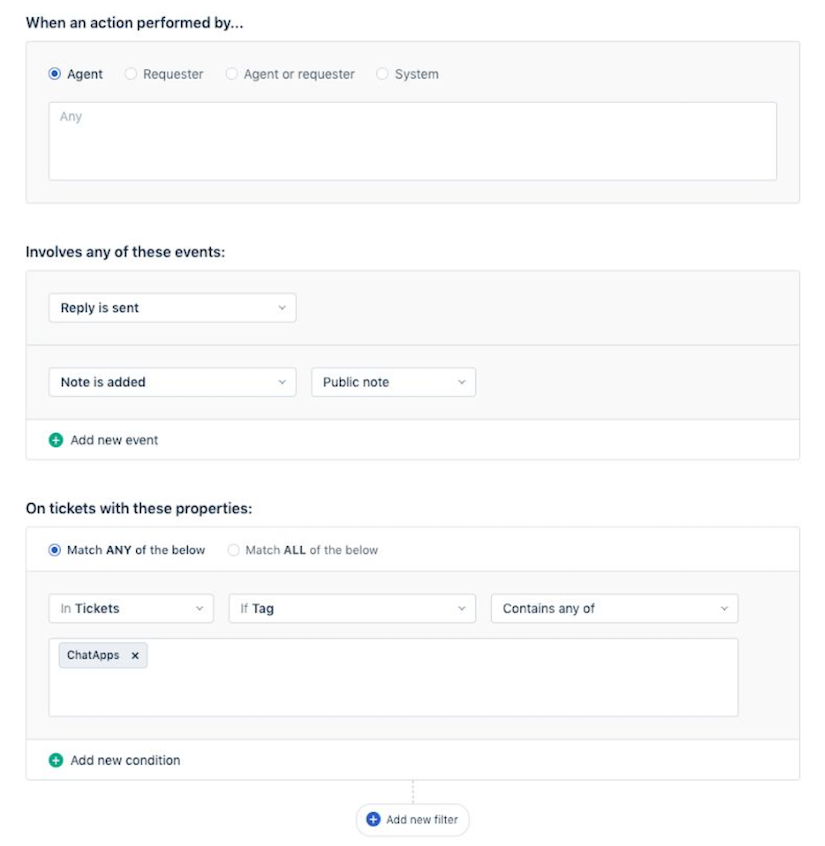
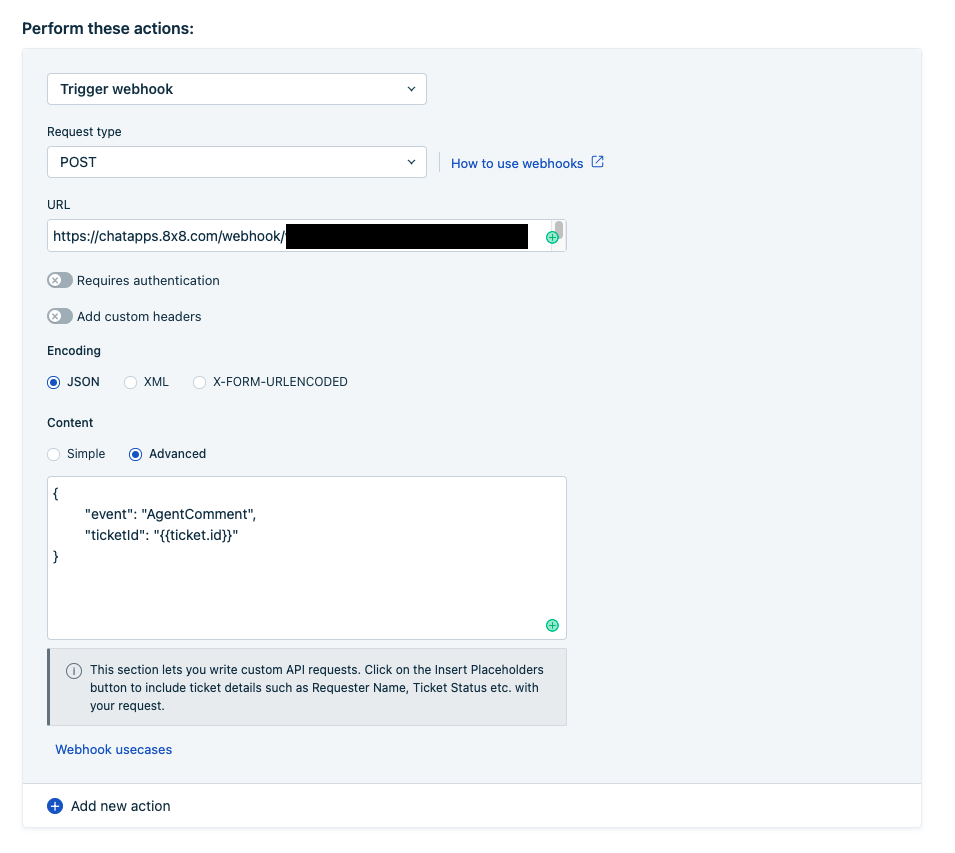
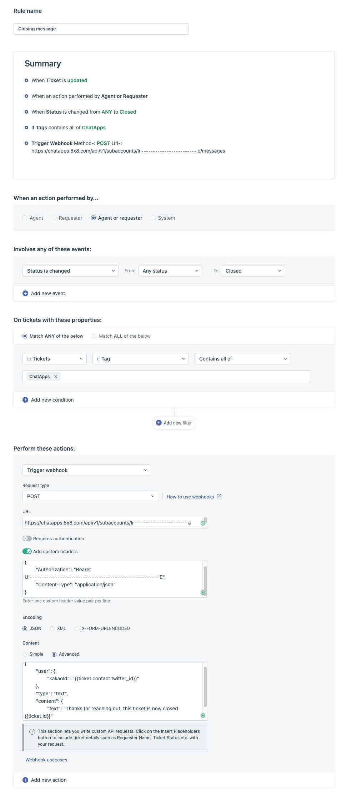

# Freshdesk

[Freshdesk](https://freshdesk.com/eu/) is a customer support software providing automated helpdesk support for companies to effectively manage their customer care and support.

By integrating 8x8 Chat Apps product into FreshDesk Support you get the best of both products, a simple and unique Chat Apps API with no deployment needed, as well as the best customer service front end, with advanced configurations available.

## Video Guide

[undefined](https://www.youtube.com/embed/FtlzyUCvdbQ?si=NbvBX4oZdg0rbqzS "youtube.com")
  

## Use cases

* Receive and send Chat Apps message for FreshDesk support.
* Automate assigning of Chat Apps messages triggered based on status changes.

## Product scope

* 8x8 Chat Apps Account
* FreshDesk (Growth plan or higher)

## What you'll need

* A 8x8 Connect account with Chat Apps enabled
* Your FreshDesk Support account: This integration is based on Freshdesk automation features, which are only available for the **Growth** plan (or higher)
* ChannelId and Access Key (Request from 8x8 Support Team for the Freshdesk Integration)

## Creating your Chat Apps integration with Freshdesk Support's automation feature

#### 1. Let’s setup the first Automation, go to Settings, then Automations (under Productivity)



---

#### 2. Under Ticket Updates, let’s create a new rule called "ChatApps new public comment"



---

#### 3. Let’s configure the following fields:




* Your URL should be:  

`https://chatapps.8x8.com/webhook/freshdesk/{ChanelId}?accessKey={accessKey}`
	+ {ChanelId} and {accessKey} will be sent to you.
	+ For example: `https://chatapps.8x8.com/webhook/freshdesk/1234-abcd-1234-abcd?accessKey=123456789`
* Your JSON content should be:

```json
{ 
"event": "AgentComment", 
"ticketId": "{{ticket.id}}"
}

```

---

#### 4. Under Ticket Updates again, let’s create another rule called **ChatApps status changed**


---

#### **5. Let’s configure the following fields:**


**URL is the same as the above**

#### Your JSON now should be

```json
{
"event": "StatusChanged", 
"ticketId": "{{ticket.id}}", 
"ticketStatus": "{{ticket.status}}"
}

```

  

---

#### 6. Once this is done, you will need to send to 8x8 the following information:

* **URL**, the path to customer Freshdesk API:https://{YOUR_SUBDOMAIN}.freshdesk.com/api/v2
* **ApiToken**, your Freshdesk ApiToken, of an admin user.
* **TicketTag**, which will be added to tickets created by 8x8 (Chat Apps, for instance)
* **DefaultTicketSubject**, ticket subject which will be used for a new ticket starting from an incoming message

  

  

  

  

> 📘 **Optional Step**
> 
> If you would like to send an automatic message to your users, when closing a ticket, you can use the instructions below to set it up.
> 
> 

 **Automatic Closing Message**

* Create a new Automation rule under "Ticket Updates" Category
* Set the correct tag and rules (tag should be consistent to what you used in other rules)
* Select Trigger webhook - POST on `https://chatapps.8x8.com/api/v1/subaccounts/{{subaccountid}}/messages`
	+ please replace {{subaccountid}} with your `subaccountId`which can be found in [8x8 Connect](https://connect.8x8.com/messaging/api-keys)
* custom header: `{"Authorization": "Bearer YprcJ**\*\***\*\*\*\***\*\***","Content-Type": "application/json"}`  

*8x8 Bearer token can be found in the API Keys section of your [8x8 connect](https://connect.8x8.com) account*

**Your JSON advance body:** 

```json
{
  "user": {
    "msisdn": {{ticket.requester.mobile}}
  },
  "type": "Text",
  "content": {
    "text": "Thanks for your reaching out, your ticket {{ticket.id}} is now closed"
  }
}

```

You can modify the "text" field above to include any message and use any [FreshDesk ticket field](https://support.freshdesk.com/en/support/solutions/articles/52630-understanding-dynamic-content-and-placeholders). 


