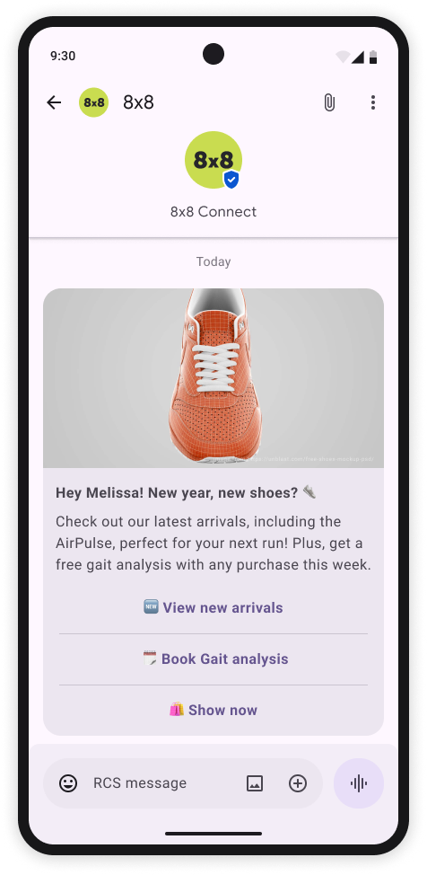

# RCS

RCS Business Messaging (RBM) is designed to enable rich, interactive communication between businesses and consumers—all within the default messaging app on Android devices.

It’s powered by Rich Communication Services (RCS), a protocol developed by Google and mobile carriers to modernise texting.

**Key Features:**  

• Branded messages with your business name, logo, and verified status.  

• Rich media support: Send high-quality images, videos, carousels, and file attachments.  

• Interactive messaging: Use buttons for calls, maps, website links, quick replies, and more.  

• Delivery and read receipts: Know when messages are delivered and seen.  

• SMS fallback: Automatically sends as SMS when RCS is unavailable on the device.

**Why It’s Valuable for Businesses:** • Drives higher engagement than traditional SMS with app-like experiences.  

• Builds trust and authenticity through verified branding.  

• Supports two-way conversations (ideal for updates, promotions, reminders, and support).

---

**Key Terms:**

**RCS Sender Agent** - An RCS agent or RCS Sender Agent is a digital identity that represents a brand in a customer's Rich Communication Services (RCS) messaging experience. RCS agents use the RCS Business Messaging (RBM) API to communicate with users through messages, events, and requests.  

**RCS** - “RCS” means the Rich Communications Services message protocol that allows users to send texts, photos, videos, and more. RCS provides a richer message feature set than the legacy SMS/MMS message protocol.  

**RBM** - “RBM” means RCS Business Messaging, otherwise known as non-consumer RCS and provides a messaging protocol to allow businesses to engage and interact with customers using rich, interactive message features.  

**Rich Media Messaging** - “Rich Media Messaging” means non-consumer text messages that include images and videos.  

**Basic Messaging** - “Rich Messaging” means non-consumer text-only messages.
