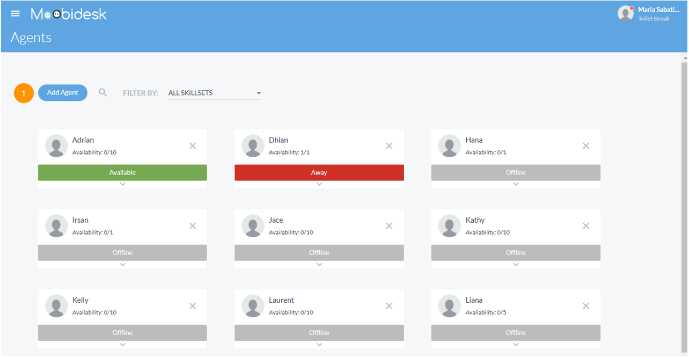

# Agent Management

The Agents module provides real-time visibility into agent availability, performance, and workload distribution.

## Agent Dashboard

### Agent List View

The main agent view displays:
- **Name**: Agent full name
- **Status**: Available, Busy, Away, Offline
- **Active Chats**: Number of current conversations
- **Max Capacity**: Configured concurrent conversation limit
- **Skill Sets**: Assigned expertise areas
- **Aux Code**: Current auxiliary status reason

### Status Indicators

| Status | Description | Chat Assignment |
|--------|-------------|-----------------|
| **Available** | Ready to receive conversations | Enabled |
| **Busy** | At capacity or in wrap-up | Disabled |
| **Away** | Temporarily unavailable | Disabled |
| **Offline** | Not logged in | Disabled |

## Agent Configuration

### Creating Agents

Administrators can create agent accounts:
1. Navigate to Settings → Users → Add User
2. Enter agent details (name, email, username)
3. Assign role (Agent)
4. Set max concurrent conversations (default: 5)
5. Assign skill sets and proficiency levels
6. Assign to queues
7. Save configuration

### Agent Capacity

Configure maximum concurrent conversations per agent:
- **Default**: 5 conversations
- **Range**: 1-20 conversations
- **Recommended**: 3-5 for quality service
- Adjust based on channel complexity and agent experience

## Skill Sets

### Overview

Skill sets enable intelligent conversation routing based on agent expertise.

### Configuring Skills

Administrators define skill categories:
- **Examples**: Technical Support, Billing, Sales, Spanish Language, VIP Customer Care
- Assign to agents with proficiency levels (1-5)
- Higher proficiency agents receive priority routing

### Skill-Based Routing

When enabled in queue configuration:
1. Conversation requires specific skill (e.g., "Billing")
2. System routes to agents with that skill
3. Priority given to agents with higher proficiency
4. Falls back to general queue if no skilled agents available

## Auxiliary (Aux) Codes

### Purpose

Aux codes track time agents spend on non-conversation activities.

### Common Aux Codes

| Code | Description | Availability |
|------|-------------|--------------|
| **Break** | Scheduled break | Away |
| **Lunch** | Meal break | Away |
| **Training** | Learning activities | Away |
| **Meeting** | Team or client meetings | Away |
| **Technical Issue** | System problems | Away |
| **Wrap-up** | Post-conversation documentation | Busy |

### Usage

Agents select aux codes when changing status:
1. Click status dropdown
2. Select "Away" or "Busy"
3. Choose applicable aux code
4. System tracks time spent in each aux code for reporting

## Agent Actions

### Transferring Conversations

**Transfer to Agent**:
1. Open conversation
2. Select "Transfer"
3. Choose destination agent
4. Add transfer notes (optional)
5. Confirm transfer

**Transfer to Queue**:
1. Open conversation
2. Select "Transfer to Queue"
3. Choose destination queue
4. Conversation re-enters routing logic

### Using Canned Messages

1. In conversation window, click canned message icon
2. Search or browse available templates
3. Select message - auto-populates with contact variables
4. Edit if needed and send

### Applying Tags & Labels

Tag conversations for categorization:
1. Open conversation
2. Select tag icon
3. Choose from predefined tags or create custom
4. Apply multiple tags as needed
5. Tags appear in conversation history and reports

## Performance Monitoring

### Real-Time Metrics

Supervisors and Managers can view:
- **Current Status**: Live agent availability
- **Active Conversations**: Ongoing chats per agent
- **Average Response Time**: Speed of agent replies
- **Conversations Handled**: Total for current session
- **Customer Satisfaction**: CSAT scores from recent conversations

### Agent Reports

Generate performance reports:
- **Conversation Volume**: Total handled by time period
- **Response Time**: First response and average response metrics
- **SLA Compliance**: Percentage meeting service level targets
- **CSAT Scores**: Customer satisfaction trends
- **Aux Code Time**: Breakdown of non-conversation time

## Best Practices

- Set realistic agent capacity based on channel mix (chat vs email)
- Use skill-based routing for specialized inquiries
- Monitor aux code usage to identify process bottlenecks
- Provide agents access to comprehensive canned message library
- Review agent performance metrics weekly for coaching opportunities
- Balance workload across team to prevent burnout
