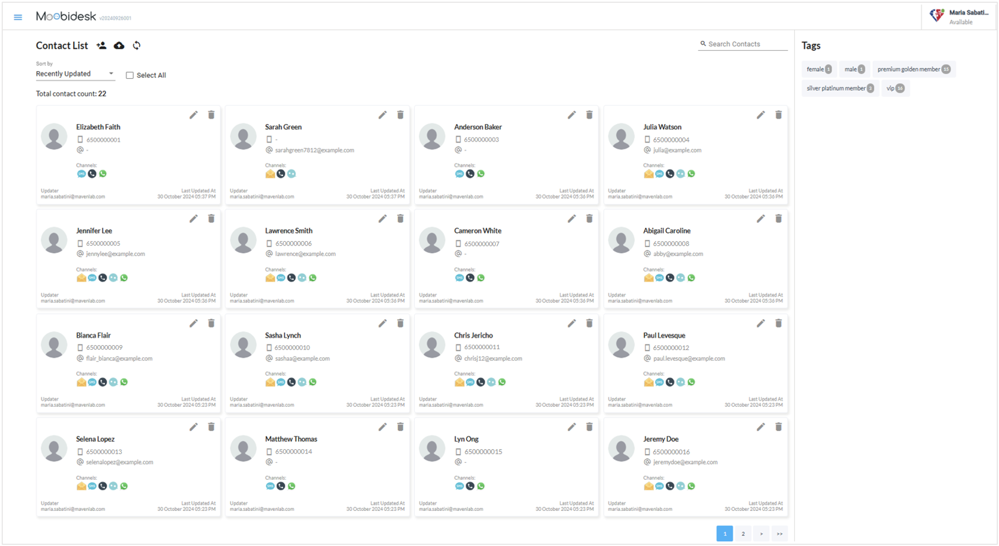
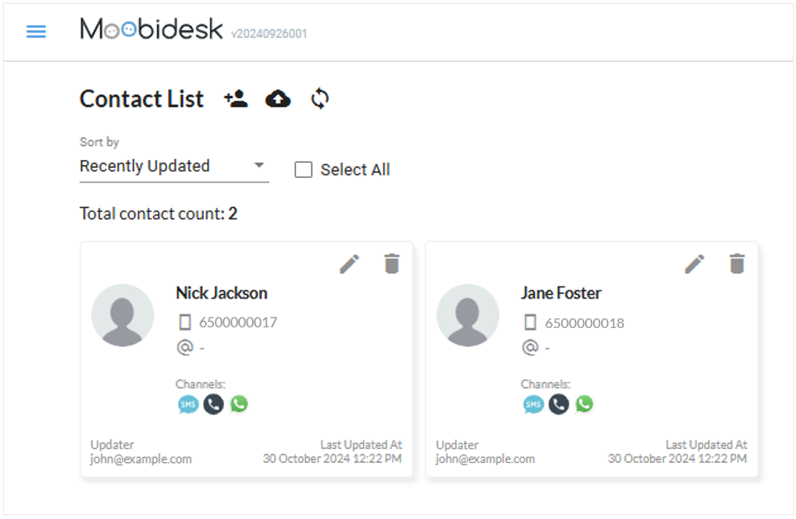

# Contact Management

The Contacts module provides a unified customer database with interaction history across all communication channels.

## Contact Overview

### Contact List View

The main contact list displays:
- **Name**: Customer full name
- **Phone**: Primary contact number
- **Email**: Email address
- **Source**: Channel of first contact (WhatsApp, Email, Facebook)
- **Last Interaction**: Most recent conversation timestamp
- **Status**: Active, Inactive, or Blocked

### Search & Filter

**Quick Search**: Search by name, phone, email, or any custom attribute

**Advanced Filters**:
- Channel source
- Date range of last contact
- Custom attribute values
- Conversation status

## Contact Details

### Profile Information

Each contact record contains:
- **Basic Info**: Name, phone, email
- **Channel Identifiers**: WhatsApp number, Facebook ID, Email address
- **Custom Attributes**: Organization-defined fields (e.g., Account ID, Customer Tier, Region)
- **Tags**: Categorical labels for segmentation
- **Notes**: Internal agent comments and context

### Interaction History

View complete conversation timeline:
- All messages across channels
- Agent assignments
- Conversation status changes
- Tags and labels applied
- Timestamps for all interactions

## Managing Contacts

### Creating Contacts

Contacts are automatically created when:
- A customer initiates a conversation
- An agent starts an outbound conversation
- Contacts are imported via bulk upload

**Manual Creation**:
1. Navigate to Contacts → Add Contact
2. Enter required fields (name, channel identifier)
3. Add optional custom attributes
4. Save contact record

### Updating Contacts

- Edit any field directly from the contact detail view
- Update custom attributes as new information becomes available
- Add internal notes for agent reference

### Merging Contacts

When duplicate records exist:
1. Select the duplicate contacts
2. Choose "Merge Contacts"
3. Select the primary record to retain
4. Confirm merge - interaction history will be consolidated

### Blocking Contacts

Block contacts to prevent future conversations:
1. Open contact record
2. Select "Block Contact"
3. Blocked contacts cannot initiate new conversations
4. Unblock at any time to restore access

## Custom Attributes

### Attribute Configuration

Administrators can define custom contact fields:
- **Text**: Free-form text input
- **Number**: Numeric values
- **Date**: Date picker
- **Dropdown**: Predefined value list
- **Boolean**: Yes/No toggle

### Use Cases

- Customer segmentation for targeted broadcasts
- Personalized conversation routing
- Advanced reporting and analytics
- CRM data synchronization

## Contact Import/Export

### Bulk Import

Import contacts via CSV:
1. Download CSV template
2. Populate contact data (name, phone, email, custom attributes)
3. Upload file via Contacts → Import
4. Review validation errors and reupload if needed

**CSV Format Requirements**:
- Phone numbers in E.164 format (+1234567890)
- Valid email addresses
- Custom attributes must match configured field names

### Export

Export contact lists for external analysis:
1. Apply desired filters
2. Select "Export Contacts"
3. Download CSV with all visible fields

## Privacy & Compliance

- Contact data is encrypted at rest and in transit
- Access is restricted by user role permissions
- Audit logs track all contact modifications
- Support GDPR data deletion requests through Administrator actions
