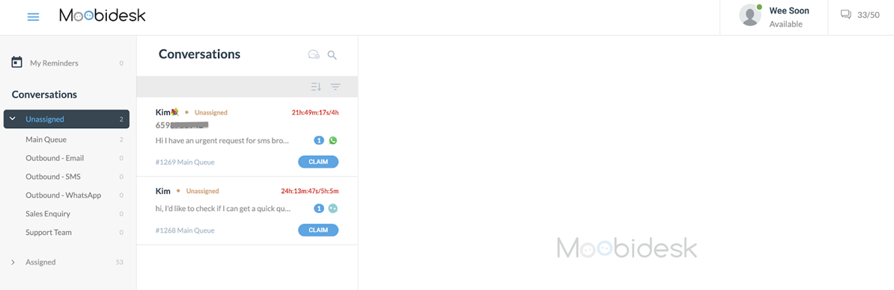
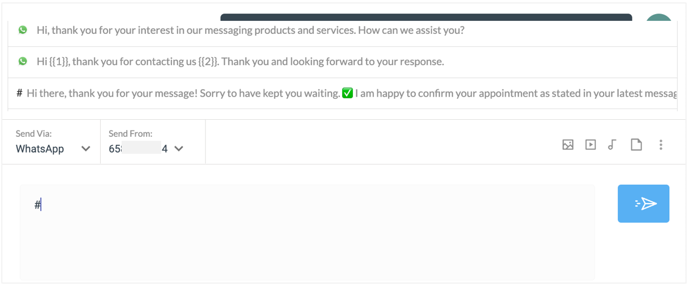

# Conversations

The Conversations (Chats) module is the core workspace where agents engage with customers across WhatsApp, Email, and Facebook Messenger.

## Conversation Interface

### Layout



The conversation workspace consists of three panels:

**Left Panel - Conversation List**:
- Active conversations assigned to agent
- Queued conversations awaiting assignment
- Filter by channel, status, or tag
- Search by contact name or content

**Center Panel - Message Thread**:
- Full conversation history
- Real-time message exchange
- Rich media support (images, videos, documents)
- Typing indicators
- Read receipts (WhatsApp)

**Right Panel - Contact Details**:
- Customer profile information
- Custom attributes
- Conversation tags and labels
- Internal notes
- Interaction history

### Conversation States

| State | Description | Agent Action |
|-------|-------------|--------------|
| **Queued** | Waiting for agent assignment | Click to accept |
| **Active** | Assigned to agent, open | Respond to customer |
| **Pending** | Waiting for customer reply | Monitor for response |
| **Resolved** | Completed by agent | Closed, available for reporting |
| **Abandoned** | Customer left before resolution | Auto-closed after timeout |

## Managing Conversations

### Accepting Conversations

**From Queue**:
1. View available conversations in queue panel
2. Click conversation to review details
3. Click "Accept" to assign to yourself
4. Conversation moves to your active list

**Auto-Assignment**:
- System automatically routes based on queue rules
- Notification alert when new conversation assigned
- Appears immediately in active conversation list

### Responding to Messages

#### Text Messages

1. Type response in message input field
2. Press Enter or click Send
3. Message delivered via customer's channel (WhatsApp, Email, Facebook)

#### Rich Media

**Sending Images/Documents**:
1. Click attachment icon
2. Select file from computer
3. Add caption (optional)
4. Send - file uploaded and delivered

**Supported File Types**:
- Images: JPG, PNG, GIF (max 5MB)
- Documents: PDF, DOC, XLS (max 10MB)
- Videos: MP4 (max 16MB) - WhatsApp only

#### Canned Messages



Use pre-written templates for common responses:
1. Click canned message icon (or type `/`)
2. Search by keyword or browse categories
3. Select template
4. Auto-populates with contact variables: `{{first_name}}`, `{{email}}`, etc.
5. Edit if needed and send

**Example Canned Message**:

```text
Hi {{first_name}}, thanks for contacting us! I'm {{agent_name}}
and I'll be happy to help you today.
```

### Transferring Conversations

#### Transfer to Agent

1. Click transfer icon
2. View available agents with current capacity
3. Select destination agent
4. Add transfer notes: "Customer needs Spanish support"
5. Confirm - conversation immediately moves to recipient agent

#### Transfer to Queue

1. Click "Transfer to Queue"
2. Select destination queue
3. Conversation re-enters routing logic
4. Next available agent in that queue receives it

### Internal Notes

Add context for other agents without sending to customer:
1. Click notes icon in right panel
2. Type internal comment: "Customer called earlier, promised callback"
3. Save note
4. Appears in conversation history with "Internal Note" label
5. Visible to all agents, never sent to customer

### Tagging Conversations

Categorize for reporting and analysis:
1. Click tag icon
2. Select from predefined tags: "Billing Issue", "Product Question", "Complaint"
3. Create custom tags as needed
4. Apply multiple tags per conversation
5. Tags appear in reports and searchable

### Conversation Labels

Use labels for workflow management:
- **Follow-up Required**: Needs future action
- **Escalated**: Requires manager attention
- **Bug Report**: Technical issue identified
- **Feature Request**: Customer suggestion

**Applying Labels**:
1. Right-click conversation in list
2. Select "Add Label"
3. Choose label
4. Labeled conversations highlighted in list

## Resolving Conversations

### Marking as Resolved

When customer issue is complete:
1. Click "Resolve" button
2. Add resolution notes (optional): "Refund processed"
3. Confirm closure
4. Conversation moves to resolved state
5. Customer can re-open by sending new message

### Auto-Resolution

System automatically resolves conversations:
- **24 hours** of customer inactivity (configurable)
- Agent explicitly closes conversation
- Customer sends "resolved" or "thanks" (if configured)

### Re-opening Resolved Conversations

If customer replies to resolved conversation:
- System creates new conversation linked to previous
- Maintains full history
- Re-enters queue routing

## Multi-Channel Considerations

### WhatsApp

- **24-Hour Window**: After customer message, business has 24 hours to respond freely
- **Template Messages**: Outside 24-hour window, must use pre-approved templates
- **Read Receipts**: Blue checkmarks indicate customer has read message
- **Media**: Full support for images, videos, documents, audio

### Email

- **Subject Line**: Displayed in conversation list
- **Threading**: All replies grouped under original email
- **CC/BCC**: Not supported - direct communication only
- **Attachments**: Full support for all document types

### Facebook Messenger

- **Response Time**: 24-hour response window for promotional content
- **Standard Messaging**: No time limit for customer service responses
- **Rich Features**: Quick replies, buttons, carousels supported
- **Media**: Images and documents supported

## Search & Filters

### Quick Search

Search across all conversations by:
- Contact name
- Phone or email
- Message content
- Conversation ID

### Advanced Filters

Filter conversation list by:
- **Channel**: WhatsApp, Email, Facebook
- **Status**: Queued, Active, Pending, Resolved
- **Date Range**: Last 24 hours, 7 days, 30 days, custom
- **Tags**: Any applied conversation tags
- **Labels**: Workflow labels
- **Agent**: Assigned agent name
- **Queue**: Source queue

## Keyboard Shortcuts

| Shortcut | Action |
|----------|--------|
| `Ctrl+Enter` | Send message |
| `Ctrl+/` | Open canned messages |
| `Ctrl+T` | Transfer conversation |
| `Ctrl+R` | Resolve conversation |
| `Ctrl+N` | Add internal note |
| `Esc` | Close conversation detail |

## Best Practices

### Response Time

- Acknowledge new conversations within 30 seconds
- Set expectations: "Let me look into this, I'll have an answer in 5 minutes"
- Use auto-responders during off-hours

### Message Quality

- Use customer's name for personalization
- Keep messages concise and scannable
- Use canned messages for consistency
- Proofread before sending

### Conversation Management

- Tag all conversations for accurate reporting
- Add internal notes for continuity
- Transfer promptly when you can't resolve
- Resolve conversations only when fully complete

### Workload Management

- Accept conversations within your capacity
- Use "Busy" status when at max capacity
- Take breaks to prevent burnout
- Communicate delays to customers proactively
