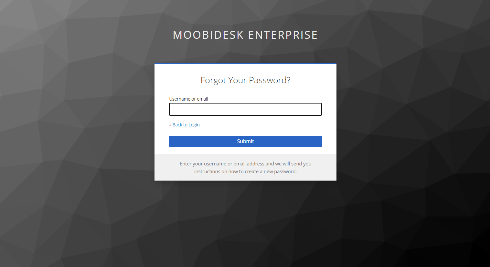

# Getting Started

## Login & Access

Access Moobidesk through your organization's URL:

```text
https://[your-organization].moobidesk.com
```

Use the credentials provided by your system administrator to log in.

## Dashboard Overview

The Moobidesk dashboard provides real-time visibility into your contact center operations:



### Key Metrics (Top Bar)

- **Active Chats**: Current conversations in progress
- **Queued Chats**: Conversations waiting for agent assignment
- **Active Agents**: Agents currently available
- **SLA Compliance**: Real-time service level performance

### Main Navigation

- **Contacts**: Customer profile and interaction history
- **Agents**: Agent status, availability, and performance
- **Queue**: Conversation routing and distribution
- **Chats**: Active conversation management
- **Broadcast**: WhatsApp campaign management
- **Reports**: Historical analytics and insights
- **Statistics**: Real-time performance metrics
- **Settings**: System configuration and preferences

## User Interface

### Header Bar

- **Search**: Global search across contacts and conversations
- **Status Selector**: Set agent availability (Available, Busy, Away, Offline)
- **Notifications**: System alerts and updates
- **Profile Menu**: User settings and logout

### Quick Actions

- **New Conversation**: Initiate outbound contact
- **View Queue**: Monitor pending conversations
- **Access Reports**: Generate performance insights

## Channel Support

Moobidesk supports multi-channel engagement:
- **WhatsApp**: Full Business API integration
- **Email**: Unified inbox management
- **Facebook Messenger**: Social media customer service

## Next Steps

- Set up your [agent profile and availability](/connect/docs/moobidesk/agents)
- Learn about [conversation management](/connect/docs/moobidesk/conversations)
- Configure [queue routing rules](/connect/docs/moobidesk/queue)
