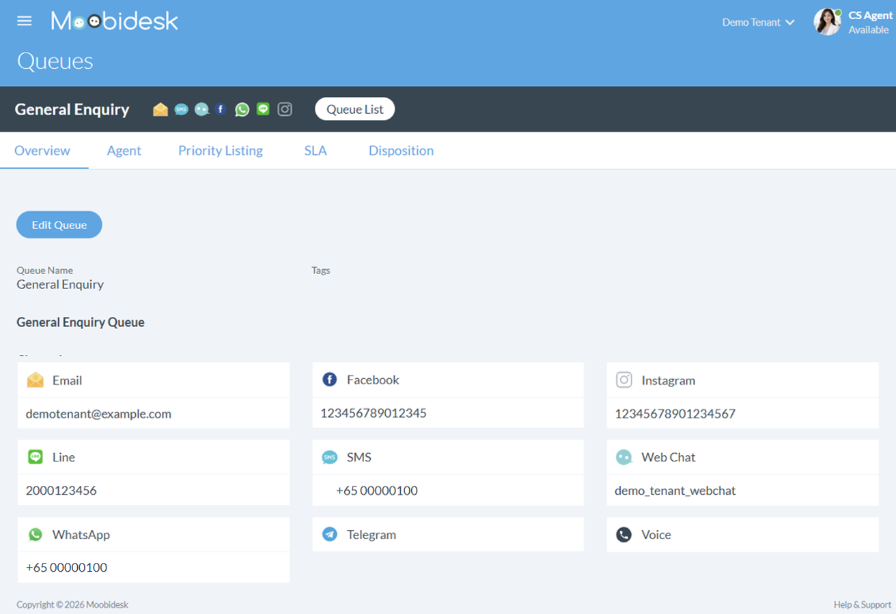

# Queue Management

The Queue module controls how incoming conversations are distributed to available agents based on routing rules, priority, and agent availability.

## Queue Overview

### Queue List View

Each queue contains the following configurations:
- **Queue Name**: Unique identifier for the queue
- **Queue Type**: Defines the queue's purpose and usage
- **Assigned Channels**: Communication channels linked to the queue
- **Skillsets**: Required agent capabilities for handling conversations
- **Assigned Agents**: Agents allocated to handle conversations in the queue
- **Routing Priority**: Determines how conversations are distributed among agents
- **SLA Settings**: Defines response time targets for conversations

### Queue Types

| Type | Purpose | Routing Logic |
|------|---------|---------------|
| **General** | Default queue for handling incoming conversations | Conversations are routed to available agents within the queue |
| **Non-General** | Queue configured for specific channels, skillsets, or use cases | Conversations are routed based on configured channels and skillset matching |
| **Outbound** | Used for agent-initiated conversations | Conversations are initiated by agents and assigned directly |

## Creating Queues

Managers can create and configure queues to manage conversation routing:

1. Navigate to Queues → Add Queue
2. Enter queue details:
   - **Queue Name**: Unique identifier for the queue
   - **Queue Type**: Select the queue type (e.g., General, Non-General, Outbound)
   - **Assigned Channels**: Select communication channels for the queue (e.g., WhatsApp, Email)
   - **Skillsets**: Define required skillsets for agents handling this queue
3. Configure queue settings:
   - **Assigned Agents**
   - **Routing Priority**: Define agent priority within the queue (used for distribution)
   - **SLA Settings**: Configure response time targets (Assigned, Read, Responded, Closed)
4. Save configuration

## Routing Methods

### Round-Robin

Distributes conversations sequentially to agents in rotation.

**Best For**: Balanced workload distribution, general inquiries

### Pick-Me

New conversations are placed in the Unassigned queue. Agents manually select and claim conversations from the queue.

**Best For**: Flexible conversation handling, Teams that prefer manual assignment, Low to moderate conversation volume

## Priority Management

### Queue Priority

Queues can be configured with agent priority levels to control how conversations are distributed.

- Priority levels range from 1 (highest) to 5 (lowest)
- Agents with higher priority receive conversations first
- Agents with the same priority level receive conversations in a round-robin approach

### Assignment Logic

- The system evaluates agents starting from Priority 1 to Priority 5
- Only eligible agents are considered for assignment
- If no eligible agents are available, the conversation remains Unassigned

### Agent Eligibility

To receive a conversation, an agent must:
- Be in Available status
- Not exceed the maximum concurrent conversation limit

## SLA (Service Level Agreement)

### Configuring SLAs

SLA defines the expected response time for handling conversations within a queue.

The following SLA parameters can be configured:
- **Assigned**: Time taken for a conversation to be assigned to an agent
- **Read**: Time taken for the agent to read the conversation
- **Responded**: Time taken for the agent to respond
- **Closed**: Total time from assignment to closure

The Closed SLA must be equal to or greater than the total of the other SLA durations.

### SLA Monitoring

SLA performance is tracked within the conversation interface and reports.

- SLA timers are displayed during conversation handling
- Indicators show whether response time is within SLA limits
- SLA data is available in reporting modules

### SLA Status

SLA status is visually indicated using color indicators:
- **Green**: Within SLA
- **Yellow**: Approaching SLA limit
- **Red**: SLA exceeded

## Agent Assignment

### Manual Assignment

Supervisors can manually route conversations:
1. View queue list
2. Select waiting conversation
3. Click "Assign to Agent"
4. Choose specific agent
5. Conversation immediately appears in agent's chat panel

### Bulk Assignment

Assign multiple conversations simultaneously:
1. Filter queue by criteria (channel, tag, time range)
2. Select multiple conversations
3. Choose "Bulk Assign"
4. Select destination agents or queue
5. Confirm assignment

## Queue Transfers

### Automatic Overflow

Configure overflow routing:
1. Set maximum wait time threshold (e.g., 180 seconds)
2. Designate backup queue
3. When threshold exceeded, conversation auto-transfers
4. Transfer logged in conversation history

### Manual Queue Transfer

Agents can transfer conversations between queues:
1. Open conversation
2. Select "Transfer to Queue"
3. Choose destination queue
4. Add transfer reason (optional)
5. Conversation re-enters routing logic

## Best Practices

### Queue Design

- Create queues aligned to business functions (Sales, Support, Billing)
- Limit to 5-7 queues to avoid agent confusion
- Use clear, descriptive queue names

### Routing Optimization

- Set realistic SLA targets based on historical data
- Use skill-based routing for 20% of inquiries (specialized cases)
- Configure overflow for high-traffic periods

### Agent Allocation

- Assign agents to 2-3 queues maximum
- Balance experienced and new agents across queues
- Adjust assignments based on real-time demand

### Monitoring

- Review queue performance daily during ramp-up
- Adjust routing rules based on SLA trends
- Investigate frequent queue transfers for process improvements
