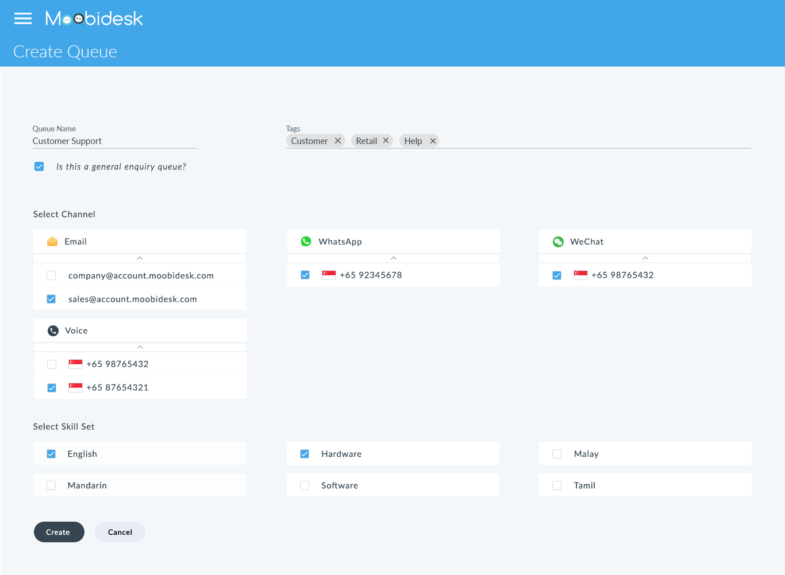

# Queue Management

The Queue module controls how incoming conversations are distributed to available agents based on routing rules, priority, and agent availability.

## Queue Overview

### Queue List View

Active queues display:
- **Queue Name**: Identifier for the queue
- **Waiting**: Conversations pending agent assignment
- **Active**: Conversations currently being handled
- **Assigned Agents**: Number of agents allocated to the queue
- **Avg Wait Time**: Average time before agent pickup

### Queue Types

| Type | Purpose | Routing Logic |
|------|---------|---------------|
| **General** | Default queue for all channels | Round-robin to available agents |
| **Skill-Based** | Specialized inquiries | Routes to agents with required skills |
| **VIP** | High-priority customers | Priority routing to senior agents |
| **Overflow** | Backup for high-volume periods | Receives transfers from at-capacity queues |

## Creating Queues

Administrators configure queues:

1. Navigate to Settings → Queues → Add Queue
2. Enter queue details:
   - **Name**: Descriptive queue identifier
   - **Description**: Internal purpose notes
   - **Priority**: 1 (lowest) to 10 (highest)
3. Configure routing settings:
   - **Distribution Method**: Round-robin, Least-active, or Skill-based
   - **Max Wait Time**: SLA threshold in seconds
   - **Overflow Queue**: Fallback if wait time exceeds threshold
4. Assign agents to queue
5. Save configuration

## Routing Methods

### Round-Robin

Distributes conversations sequentially to agents in rotation.

**Best For**: Balanced workload distribution, general inquiries

### Least-Active

Routes to the agent with the fewest active conversations.

**Best For**: Optimizing agent capacity utilization

### Skill-Based

Matches conversation requirements to agent expertise.

**Best For**: Technical support, specialized services, multilingual support

**Configuration**:
1. Define required skills for queue (e.g., "Billing + Spanish")
2. Set minimum proficiency level (1-5)
3. System routes to agents meeting criteria
4. Falls back to general routing if no match within timeout

## Priority Management

### Queue Priority

Assign priority levels (1-10) to control routing order:
- **High Priority (8-10)**: VIP customers, escalations - processed first
- **Medium Priority (4-7)**: Standard customer inquiries
- **Low Priority (1-3)**: Marketing responses, non-urgent requests

### Within-Queue Priority

Individual conversations can be escalated:
1. Supervisor opens queued conversation
2. Selects "Increase Priority"
3. Conversation moves to front of queue
4. Next available agent receives it immediately

## SLA (Service Level Agreement)

### Configuring SLAs

Set performance thresholds per queue:
- **First Response Time**: Target seconds for initial agent reply
- **Resolution Time**: Target seconds for conversation close
- **Abandon Rate**: Acceptable percentage of customer-abandoned chats

### SLA Monitoring

Real-time SLA compliance displayed in:
- Dashboard top bar (system-wide)
- Queue detail view (per queue)
- Agent performance reports

**SLA Status**:
- **Green**: Meeting targets
- **Yellow**: Approaching threshold (within 10%)
- **Red**: Breaching SLA

### SLA Escalations

When SLA thresholds are breached:
1. System sends alert to supervisors
2. Conversation priority automatically increases
3. Notifications sent to available agents
4. Incident logged in reports

## Agent Assignment

### Manual Assignment

Supervisors can manually route conversations:
1. View queue list
2. Select waiting conversation
3. Click "Assign to Agent"
4. Choose specific agent
5. Conversation immediately appears in agent's chat panel

### Bulk Assignment

Assign multiple conversations simultaneously:
1. Filter queue by criteria (channel, tag, time range)
2. Select multiple conversations
3. Choose "Bulk Assign"
4. Select destination agents or queue
5. Confirm assignment

## Queue Transfers

### Automatic Overflow

Configure overflow routing:
1. Set maximum wait time threshold (e.g., 180 seconds)
2. Designate backup queue
3. When threshold exceeded, conversation auto-transfers
4. Transfer logged in conversation history

### Manual Queue Transfer

Agents can transfer conversations between queues:
1. Open conversation
2. Select "Transfer to Queue"
3. Choose destination queue
4. Add transfer reason (optional)
5. Conversation re-enters routing logic

## Best Practices

### Queue Design

- Create queues aligned to business functions (Sales, Support, Billing)
- Limit to 5-7 queues to avoid agent confusion
- Use clear, descriptive queue names

### Routing Optimization

- Set realistic SLA targets based on historical data
- Use skill-based routing for 20% of inquiries (specialized cases)
- Configure overflow for high-traffic periods

### Agent Allocation

- Assign agents to 2-3 queues maximum
- Balance experienced and new agents across queues
- Adjust assignments based on real-time demand

### Monitoring

- Review queue performance daily during ramp-up
- Adjust routing rules based on SLA trends
- Investigate frequent queue transfers for process improvements
