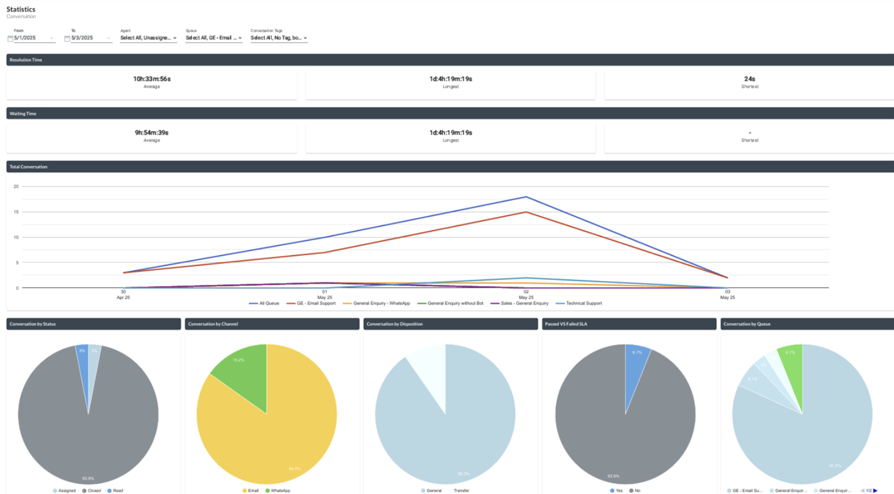

# Reports & Statistics

Moobidesk provides comprehensive analytics across conversations, agent performance, queue efficiency, and customer satisfaction.

## Real-Time Statistics

### Dashboard Overview

The Statistics module provides a visual summary of conversation activity and performance based on selected filters such as date range, agent, queue, and conversation tags.

**Statistic Filtering:**
- Date Range
- Agent
- Queue
- Conversation Tag

**Time metrics:**

The dashboard displays key time-based performance metrics:
- **Resolution Time**: Time taken to complete a conversation (Average, Longest, Shortest)
- **Waiting Time**: Time taken before a conversation is handled (Average, Longest, Shortest)

**Conversation Trends:**
- **Total Conversation**: Displays conversation volume over time in a trend chart
- Allows comparison across queues

**Conversation Breakdown:**

Statistics include visual breakdowns of conversations by:
- **Status** (e.g., Assigned, Closed, Read)
- **Channel** (e.g., Email, WhatsApp)
- **Disposition** (e.g., General, Transfer)
- **Queue**
- **SLA Result** (Passed vs Failed)

## Real-Time Statistics

### Conversation Report

Provides insight into:
- Total conversations within the selected period
- SLA compliance
- Assignment and resolution timing

### Transcript Report

Displays total inbound and outbound message volume within the selected period.

### Agent Report

Provides agent-level performance metrics, including:
- Total conversations assigned
- Response time
- Resolution performance

### Agent Auxcode Report

Provides a log of agent status (Auxcode) activity within a selected period.

## Data Export

### Export Format

- **CSV**: Raw data format for spreadsheet or external processing

### Export Process

To export report data:
1. Navigate to the desired report (e.g., Conversation Report, Transcript Report, Agent Report, Agent Auxcode Report)
2. Select the required filters (e.g., date range)
3. Click Download
4. A download link will be sent to your email once the export is ready

## Analytics Best Practices

### Monitoring Frequency

**Daily**: Agent performance, queue status, SLA compliance
**Weekly**: Conversation volume trends, CSAT trends, broadcast performance
**Monthly**: Strategic metrics, capacity planning, process improvements

### Key Performance Indicators (KPIs)

**Efficiency**:
- Average handle time: Target <8 minutes
- First response time: Target <30 seconds
- SLA compliance: Target >95%

**Quality**:
- CSAT score: Target >4.5/5
- Abandon rate: Target <5%
- Transfer rate: Target <10%

**Productivity**:
- Conversations per agent per hour: Target 6-8
- Concurrent conversations: Target 3-5
- Utilization rate: Target 70-85%

### Actionable Insights

Use reports to drive improvements:
- **High transfer rates**: Provide additional agent training
- **Long handle times**: Review conversation efficiency, update canned messages
- **Low CSAT in specific queue**: Investigate root cause, adjust staffing
- **High abandon rates**: Add agents during peak hours
- **SLA breaches by time of day**: Adjust shift schedules

### Data-Driven Decisions

Leverage analytics for:
- **Capacity Planning**: Forecast staffing needs based on trends
- **Training Needs**: Identify skill gaps from performance data
- **Process Optimization**: Find bottlenecks in conversation flow
- **Customer Experience**: Improve based on CSAT feedback themes
