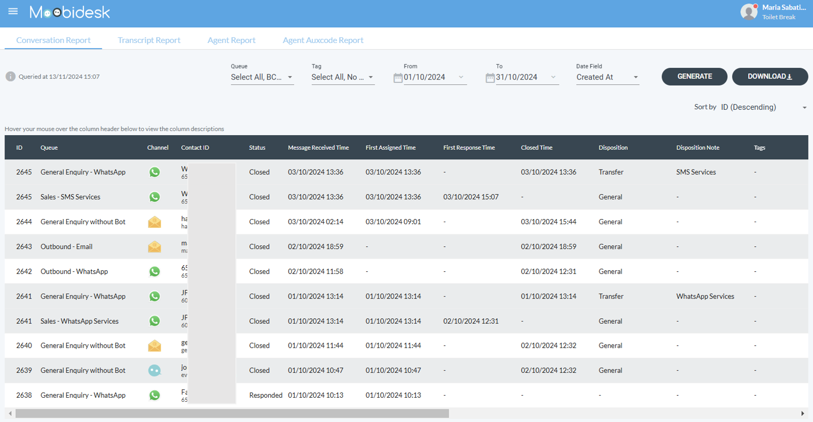
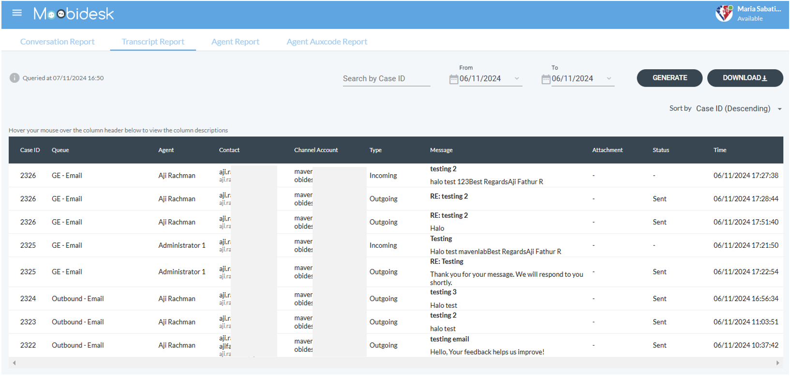

# Reports & Statistics

Moobidesk provides comprehensive analytics across conversations, agent performance, queue efficiency, and customer satisfaction.

## Real-Time Statistics

### Dashboard Overview

The main dashboard displays live metrics:

**System-Wide**:
- **Active Chats**: Conversations currently in progress
- **Queued Chats**: Waiting for agent assignment
- **Active Agents**: Agents currently available
- **SLA Compliance**: Real-time service level adherence

**Agent Performance**:
- Active conversations per agent
- Average response time
- Conversations handled today
- Current status distribution (Available, Busy, Away, Offline)

**Queue Status**:
- Wait time by queue
- Conversations in each queue
- SLA compliance by queue

### Auto-Refresh

Statistics update automatically:
- **Dashboard**: Every 30 seconds
- **Agent View**: Real-time
- **Queue View**: Every 10 seconds

## Historical Reports

### Conversation Reports

#### Conversation Volume

Track conversation trends over time.

**Metrics**:
- Total conversations by date range
- Channel breakdown (WhatsApp, Email, Facebook)
- New vs returning contacts
- Peak traffic hours/days

**Filters**:
- Date range (today, last 7 days, last 30 days, custom)
- Channel
- Queue
- Agent

#### Conversation Details

Drill into individual conversation data.

**Included Data**:
- Conversation ID and timestamp
- Contact information
- Channel
- Assigned agent
- Queue
- Duration (start to resolution)
- First response time
- Status (resolved, abandoned)
- Tags and labels applied
- SLA compliance

**Export**: Download as CSV for external analysis

### Agent Performance Reports

#### Agent Productivity

Evaluate individual and team performance.

**Metrics**:
- **Conversations Handled**: Total assigned conversations
- **Average Handle Time**: Mean time from assignment to resolution
- **First Response Time**: Time to first agent reply
- **Average Response Time**: Mean reply time throughout conversation
- **Concurrent Conversations**: Average number of simultaneous chats
- **Resolved Conversations**: Successfully completed conversations
- **Transferred Conversations**: Conversations transferred to others

**Time Periods**: Today, Yesterday, Last 7 days, Last 30 days, Custom range

**Comparison**: Compare agents side-by-side

#### Agent Availability

Understand time allocation across activities.

**Metrics**:
- **Online Time**: Total logged-in duration
- **Available Time**: Time in "Available" status
- **Busy Time**: Time handling conversations or in wrap-up
- **Away Time**: Time in "Away" status, broken down by aux code
- **Break Time**: Aux code breakdown (Break, Lunch, Training, Meeting)

**Aux Code Detail**:
- Time spent in each aux code
- Frequency of aux code usage
- Comparison across agents

#### Agent Leaderboard

Gamify performance with ranked metrics.

**Rankings**:
- Most conversations handled
- Fastest average response time
- Highest CSAT scores
- Most resolved conversations
- Highest SLA compliance

**Time Frame**: Daily, Weekly, Monthly

### Queue Reports

#### Queue Performance

Analyze queue efficiency and bottlenecks.

**Metrics**:
- **Total Conversations**: Volume through each queue
- **Average Wait Time**: Time from queue entry to agent pickup
- **Max Wait Time**: Longest wait experienced
- **Abandoned Rate**: Percentage of conversations abandoned before pickup
- **SLA Compliance**: Percentage meeting first response target
- **Transfers In/Out**: Queue transfer patterns

**Insights**:
- Identify understaffed queues
- Spot peak demand periods
- Optimize routing rules

#### SLA Performance

Monitor service level agreement adherence.

**Metrics**:
- **First Response SLA**: Percentage meeting initial response target
- **Resolution SLA**: Percentage resolved within target time
- **Breaches**: Count of SLA violations
- **At Risk**: Conversations approaching SLA threshold

**Breakdown**:
- By queue
- By agent
- By time of day
- By channel

### Customer Satisfaction (CSAT)

#### CSAT Scores

Measure customer satisfaction after conversation resolution.

**Collection Methods**:
- Post-conversation survey (1-5 stars or thumbs up/down)
- Automatic request after resolution
- WhatsApp quick reply buttons

**Metrics**:
- **Average CSAT**: Mean satisfaction score
- **Response Rate**: Percentage of customers providing feedback
- **Distribution**: Breakdown by score (5-star, 4-star, etc.)
- **Trend**: CSAT over time

**Segmentation**:
- By agent
- By queue
- By channel
- By conversation tags

#### Feedback Comments

Review qualitative customer feedback.

**Features**:
- Filter by CSAT score
- Search feedback text
- Tag common themes
- Export for sentiment analysis

### Broadcast Reports

#### Campaign Performance

Analyze broadcast campaign effectiveness.

**Metrics**:
- **Sent**: Total messages sent
- **Delivered**: Successfully delivered to recipient devices
- **Read**: Messages opened by customers
- **Replied**: Customers who responded
- **Failed**: Delivery failures with reason breakdown

**Engagement**:
- Delivery Rate: Delivered ÷ Sent
- Read Rate: Read ÷ Delivered
- Response Rate: Replied ÷ Delivered

**Comparison**: Compare campaigns side-by-side

#### Template Performance

Evaluate which message templates drive engagement.

**Metrics**:
- Usage frequency
- Average delivery rate
- Average read rate
- Average response rate
- Failure rate by template

**Optimization**: Identify high-performing templates for future campaigns

## Custom Reports

### Report Builder

Create custom reports with specific metrics and filters:

1. Navigate to Reports → Custom Reports → Create New
2. Select report type (Conversation, Agent, Queue, CSAT)
3. Choose metrics to include
4. Apply filters (date range, channel, tags, etc.)
5. Select grouping (by day, week, agent, queue)
6. Save report for future use

### Scheduled Reports

Automate report delivery:
1. Create or select existing report
2. Click "Schedule"
3. Set frequency (Daily, Weekly, Monthly)
4. Choose delivery method (Email, Dashboard)
5. Add recipients
6. Save schedule

**Delivery Formats**: PDF, CSV, Excel

## Data Export

### Export Options

Export any report for external analysis:
- **CSV**: Raw data for spreadsheet analysis
- **Excel**: Formatted workbook with charts
- **PDF**: Presentation-ready report

### Bulk Export

Export all conversations for compliance or backup:
1. Navigate to Reports → Data Export
2. Select date range
3. Choose data scope (All conversations, Specific queue, Specific agent)
4. Include attachments (optional)
5. Request export
6. Download link sent via email when ready

**Note**: Large exports may take several hours to process

## Dashboards

### Pre-Built Dashboards

Access role-specific dashboards:

**Agent Dashboard**:
- Personal statistics
- Active conversations
- Personal CSAT trend

**Supervisor Dashboard**:
- Team performance overview
- Queue status
- Agent availability
- SLA compliance alerts

**Manager Dashboard**:
- System-wide metrics
- Trend analysis
- Comparative queue performance
- Strategic insights

### Custom Dashboards

Build personalized dashboards:
1. Navigate to Reports → Dashboards → Create
2. Add widgets (metric cards, charts, tables)
3. Configure each widget (metric, filters, visualization)
4. Arrange layout
5. Save dashboard
6. Set as default (optional)

## Analytics Best Practices

### Monitoring Frequency

**Daily**: Agent performance, queue status, SLA compliance
**Weekly**: Conversation volume trends, CSAT trends, broadcast performance
**Monthly**: Strategic metrics, capacity planning, process improvements

### Key Performance Indicators (KPIs)

**Efficiency**:
- Average handle time: Target <8 minutes
- First response time: Target <30 seconds
- SLA compliance: Target >95%

**Quality**:
- CSAT score: Target >4.5/5
- Abandon rate: Target <5%
- Transfer rate: Target <10%

**Productivity**:
- Conversations per agent per hour: Target 6-8
- Concurrent conversations: Target 3-5
- Utilization rate: Target 70-85%

### Actionable Insights

Use reports to drive improvements:
- **High transfer rates**: Provide additional agent training
- **Long handle times**: Review conversation efficiency, update canned messages
- **Low CSAT in specific queue**: Investigate root cause, adjust staffing
- **High abandon rates**: Add agents during peak hours
- **SLA breaches by time of day**: Adjust shift schedules

### Data-Driven Decisions

Leverage analytics for:
- **Capacity Planning**: Forecast staffing needs based on trends
- **Training Needs**: Identify skill gaps from performance data
- **Process Optimization**: Find bottlenecks in conversation flow
- **Customer Experience**: Improve based on CSAT feedback themes
