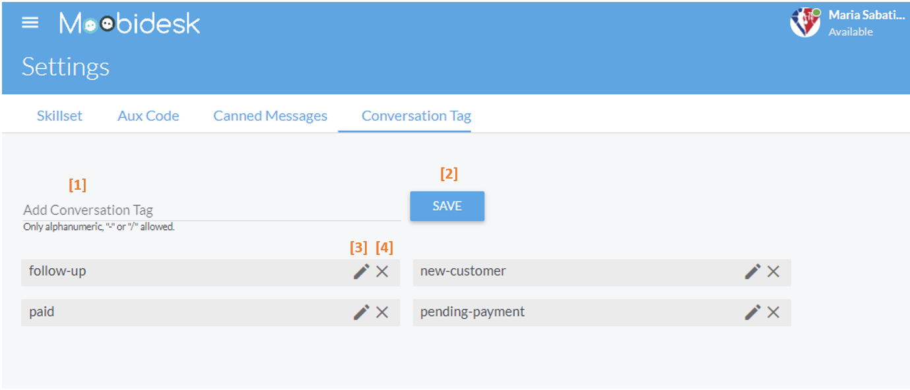
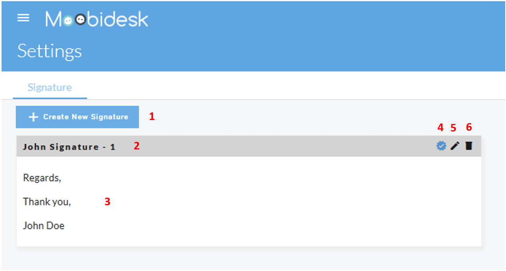

# Settings & Configuration

The Settings module provides system-wide configuration for administrators to customize Moobidesk for their organization's needs.

## User Management



### Creating Users

1. Navigate to Settings → Users → Add User
2. Enter user details:
   - **Full Name**: Display name
   - **Email**: Login email and notifications
   - **Username**: Unique login identifier
   - **Role**: Agent, Supervisor, Manager, or Administrator
3. Set password (or email auto-generated password)
4. Save user

### User Configuration

**Agent Settings**:
- **Max Concurrent Conversations**: 1-20 (default: 5)
- **Assigned Queues**: Select queues agent can receive from
- **Skill Sets**: Assign skills with proficiency levels (1-5)
- **Default Status**: Status on login (Available, Busy, Away)

**Permissions**: Role-based access automatically applied

### Deactivating Users

- Select user → Set status to "Inactive"
- User cannot log in but historical data retained
- Reactivate at any time to restore access

## Queue Configuration

### Creating Queues

1. Navigate to Settings → Queues → Add Queue
2. Configure queue:
   - **Name**: Descriptive identifier
   - **Description**: Internal purpose
   - **Priority**: 1 (low) to 10 (high)
   - **Distribution**: Round-robin, Least-active, or Skill-based
   - **SLA Target**: First response time in seconds (e.g., 30)
   - **Overflow Queue**: Backup queue for high wait times
   - **Auto-Resolve**: Time before inactive conversations auto-close (default: 24 hours)

3. Assign agents to queue
4. Save configuration

### Queue Rules

Configure routing logic:
- **Required Skills**: Must-have agent skills for assignment
- **Preferred Skills**: Nice-to-have skills (prioritized, not required)
- **Business Hours**: Queue active times
- **After-Hours Action**: Route to different queue or auto-respond
- **Max Wait Time**: Threshold before overflow routing

## Skill Sets

### Defining Skills

Create skill categories for intelligent routing:

1. Navigate to Settings → Skills → Add Skill
2. Enter skill name (e.g., "Spanish Language", "Technical Support", "VIP Handling")
3. Add description for internal reference
4. Save skill

### Assigning Skills to Agents

1. Select agent in User Management
2. Navigate to Skills tab
3. Add skills with proficiency levels:
   - **1**: Beginner
   - **2**: Basic
   - **3**: Intermediate
   - **4**: Advanced
   - **5**: Expert

**Routing Logic**: Higher proficiency agents receive priority for skill-based queues

## Auxiliary (Aux) Codes

### Creating Aux Codes

Define reasons for agent unavailability:

1. Navigate to Settings → Aux Codes → Add Code
2. Configure code:
   - **Code Name**: "Break", "Lunch", "Training", "Technical Issue"
   - **Status**: Away or Busy
   - **Paid/Unpaid**: For payroll integration
   - **Color**: Visual identifier in dashboards

3. Save code

### Common Aux Codes

| Code | Status | Use Case |
|------|--------|----------|
| Break | Away | Scheduled 15-minute breaks |
| Lunch | Away | Meal breaks |
| Training | Away | Learning activities |
| Meeting | Away | Team or client meetings |
| Technical Issue | Away | System problems |
| Wrap-up | Busy | Post-conversation documentation |
| Admin | Busy | Administrative tasks |

## Canned Messages



### Creating Templates

Build pre-written message library:

1. Navigate to Settings → Canned Messages → Add Message
2. Configure template:
   - **Title**: Internal reference name
   - **Category**: Group similar messages (Greetings, FAQs, Closings)
   - **Shortcut**: Quick trigger (e.g., `/greeting`, `/refund`)
   - **Message**: Template content with variables
   - **Channels**: WhatsApp, Email, Facebook, or All

3. Save template

### Variable Substitution

Use placeholders for personalization:
- `{{first_name}}`: Contact first name
- `{{last_name}}`: Contact last name
- `{{email}}`: Contact email
- `{{phone}}`: Contact phone number
- `{{agent_name}}`: Current agent name
- `{{agent_email}}`: Current agent email
- `{{queue_name}}`: Current queue
- Custom attributes: `{{custom_field_name}}`

**Example**:

```text
Hi {{first_name}}, I'm {{agent_name}} from the {{queue_name}} team.
How can I help you today?
```

### Categories

Organize templates by purpose:
- **Greetings**: Welcome messages
- **Information**: Product details, policies
- **Troubleshooting**: Step-by-step instructions
- **Apologies**: Service recovery
- **Closings**: End conversation messages

## Conversation Tags

### Creating Tags

Categorize conversations for reporting:

1. Navigate to Settings → Tags → Add Tag
2. Enter tag name (e.g., "Billing Issue", "Product Question", "Complaint")
3. Select color for visual identification
4. Save tag

### Tag Categories

**Issue Types**:
- Billing Issue
- Technical Problem
- Account Question
- Product Inquiry

**Resolution Types**:
- Resolved - First Contact
- Escalated
- Follow-up Required
- Cannot Resolve

**Customer Types**:
- VIP Customer
- New Customer
- Returning Customer
- At-Risk Customer

**Use in Reports**: Filter and segment conversation analytics by tags

## Conversation Labels

### Creating Labels

Workflow management markers:

1. Navigate to Settings → Labels → Add Label
2. Configure label:
   - **Name**: "Follow-up Required", "Escalated", "Bug Report"
   - **Color**: Visual indicator
   - **Auto-Apply Rules**: Automatically label based on conditions (optional)

3. Save label

### Label Automation

Configure automatic labeling:
- **Keyword Triggers**: Label if message contains "refund", "cancel", "broken"
- **SLA Breach**: Auto-label when SLA exceeded
- **Transfer Count**: Label after 2+ transfers
- **Customer Sentiment**: Label based on negative keywords

## Email Signatures

### Creating Signatures

Configure agent email signatures:

1. Navigate to Settings → Signatures → Add Signature
2. Enter signature content (supports HTML):

   ```html
   Best regards,
   {{agent_name}}
   {{queue_name}} Team

   Email: {{agent_email}}
   Phone: +1-800-XXX-XXXX
   ```

3. Assign to users or queues
4. Save signature

**Variables**: Same as canned messages

### Default Signatures

- Set default signature for all agents
- Override with queue-specific signatures
- Agent-specific signatures take highest priority

## Channel Configuration

### WhatsApp Business API

Configure WhatsApp integration:

1. Navigate to Settings → Channels → WhatsApp
2. Connect WhatsApp Business API account
3. Configure:
   - **Business Phone Number**: Your verified WhatsApp number
   - **Business Profile**: Name, description, address, website
   - **Message Templates**: Sync approved templates
   - **24-Hour Window**: Enable/disable automatic session tracking

### Email

Configure email integration:

1. Navigate to Settings → Channels → Email
2. Connect email account:
   - **Email Address**: `support@yourcompany.com`
   - **SMTP Settings**: Outgoing mail server
   - **IMAP Settings**: Incoming mail server
3. Configure:
   - **Auto-Response**: Acknowledge new emails
   - **Threading**: Group related emails
   - **Signature**: Default email signature

### Facebook Messenger

Configure Facebook integration:

1. Navigate to Settings → Channels → Facebook
2. Connect Facebook Page
3. Authorize Moobidesk access
4. Select pages to monitor
5. Configure:
   - **Auto-Response**: Instant reply to new messages
   - **Business Hours**: Active response times

## System Settings

### Business Hours

Define operational schedule:

1. Navigate to Settings → Business Hours
2. Set hours for each day:
   - Monday-Friday: 9:00 AM - 6:00 PM
   - Saturday: 10:00 AM - 2:00 PM
   - Sunday: Closed
3. Configure timezone
4. Set after-hours behavior:
   - Auto-respond with expected response time
   - Route to overflow queue
   - Queue for next business day

### SLA Configuration

Set service level targets:

1. Navigate to Settings → SLA
2. Configure targets:
   - **First Response Time**: 30 seconds (default)
   - **Resolution Time**: 15 minutes (default)
   - **Max Abandon Rate**: 5%
3. Set escalation rules:
   - Alert supervisors at 80% of target
   - Auto-escalate at 100% of target
4. Save configuration

### Notifications

Configure system alerts:

**Agent Notifications**:
- New conversation assigned
- Conversation transferred to you
- Customer replied
- SLA approaching threshold

**Supervisor Notifications**:
- Queue wait time exceeded
- Agent capacity reached
- SLA breach occurred

**Delivery Methods**:
- In-app notifications
- Email alerts
- Browser push notifications (requires permission)

## Integrations

### CRM Integration

Sync customer data with external CRM:

1. Navigate to Settings → Integrations → CRM
2. Select CRM platform (Salesforce, HubSpot, Zoho)
3. Authenticate connection
4. Map fields:
   - Moobidesk Contact → CRM Contact
   - Custom Attributes → CRM Fields
5. Configure sync frequency (real-time, hourly, daily)

**Sync Direction**:
- **Unidirectional**: Moobidesk → CRM only
- **Bidirectional**: Two-way sync

### API Access

Generate API credentials for custom integrations:

1. Navigate to Settings → Integrations → API
2. Create API key
3. Set permissions (read-only, read-write)
4. Copy API key and endpoint URL
5. Refer to API documentation for integration guides

### Webhooks

Configure real-time event notifications:

1. Navigate to Settings → Integrations → Webhooks
2. Add webhook endpoint URL
3. Select events to subscribe:
   - Conversation created
   - Conversation resolved
   - Message received
   - Agent assigned
4. Test webhook connection
5. Save configuration

## Data & Privacy

### Data Retention

Configure data storage policies:

1. Navigate to Settings → Data & Privacy → Retention
2. Set retention periods:
   - **Conversations**: 90 days, 1 year, 3 years, Indefinitely
   - **Attachments**: Same as conversations or separate
   - **Logs**: 30 days, 90 days, 1 year

3. Configure auto-deletion for expired data

### GDPR Compliance

Tools for privacy regulation adherence:

**Data Export**: Generate complete contact data export on request
**Right to Deletion**: Permanently delete contact and all associated data
**Audit Logs**: Track all data access and modifications

## Backup & Restore

### Automated Backups

System automatically backs up:
- All conversations and messages
- Contact database
- System configuration
- Frequency: Daily (retained for 30 days)

### Manual Backup

Create on-demand backup before major changes:
1. Navigate to Settings → Backup
2. Click "Create Backup"
3. Download backup file
4. Store securely offline

### Restore

Restore from backup:
1. Navigate to Settings → Restore
2. Select backup date
3. Choose restore scope (Full system, Contacts only, Conversations only)
4. Confirm restore (overwrites current data)

## Best Practices

### Initial Setup Checklist

- Create user accounts for all agents
- Configure queues aligned to business functions
- Set up skill sets for specialized routing
- Create canned message library
- Define aux codes
- Configure business hours and SLA targets
- Test channel integrations

### Ongoing Maintenance

- Review and update canned messages monthly
- Audit user access quarterly
- Optimize queue routing based on performance data
- Keep skill assignments current as agents develop
- Archive inactive users promptly
- Back up configuration before major changes
