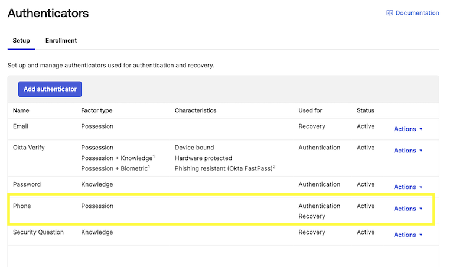
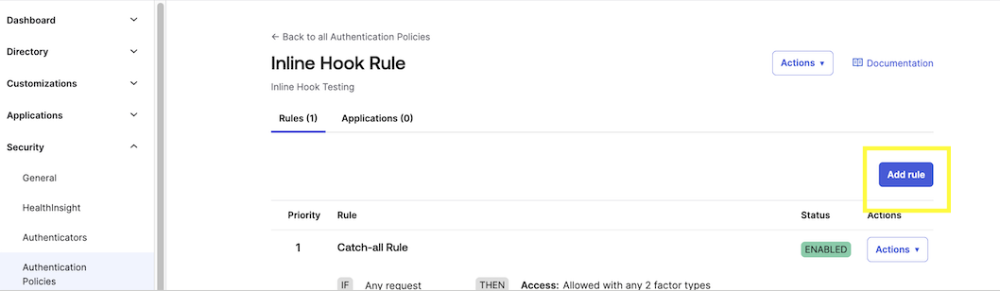
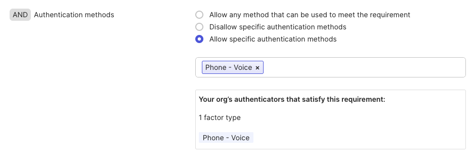
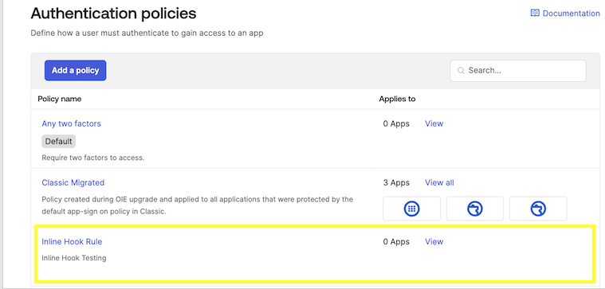
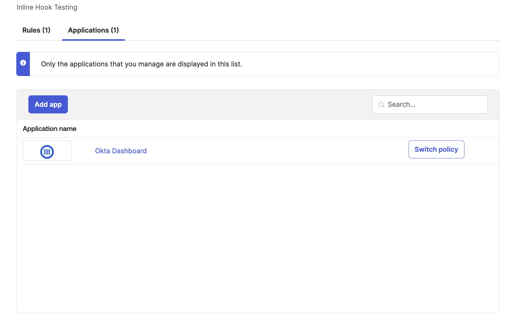

# Okta - Bring Your Own Telephony (BYOT) via Voice

## Overview

This guide demonstrates how to implement voice-based One-Time Password (OTP) delivery for Okta authentication using 8x8's Voice API. This integration allows you to create a custom telephony provider that delivers OTPs via voice calls instead of SMS.

The integration works by creating a webhook service that receives OTP delivery requests from [Okta's Inline Hook](https://developer.okta.com/docs/api/openapi/okta-management/management/tag/InlineHook/#tag/InlineHook/operation/createTelephonyInlineHook) and uses 8x8's Voice API to deliver the OTP via a voice call to the user's phone number.

### Integration Flow

**Detailed Flow:**

1. **User initiates login** with multi-factor authentication enabled
2. **Okta triggers** the Inline Hook with user details and OTP
3. **Your webhook service** receives the request and extracts phone number and OTP
4. **Service calls 8x8 Voice API** to initiate a voice call with the OTP message
5. **User receives voice call** with spoken OTP and completes authentication

<br />

## Prerequisites

Before you begin, ensure you have:

- **Okta Account** with admin access to configure Inline Hooks
- **8x8 Account** with access to Voice API credentials
- **JavaScript/Node.js knowledge** for backend development
- **Public HTTPS endpoint** for receiving Okta webhooks (consider using ngrok for development)

## Requirements

- Node.js
- npm package manager

## Implementation

### Step 1: Backend Code Setup

Create a new Node.js project and install dependencies:

```bash
mkdir okta-voice-otp
cd okta-voice-otp
npm init -y
npm install express dotenv
```

### Step 2: Environment Configuration

Create a `.env` file with your configuration:

```env
# Server Configuration
PORT=3000
OKTA_SECRET=your_okta_webhook_secret_here

# 8x8 Voice API Configuration
EIGHTYEIGHTX_SUBACCOUNT_ID=your_subaccount_id
EIGHTYEIGHTX_API_KEY=your_api_key
EIGHTYEIGHTX_SOURCE_NUMBER=+1234567890

# Voice Configuration
VOICE_PROFILE=en-US-Jenny
OTP_REPETITIONS=2
```

### Step 3: Main Server Implementation

Create `server.js`:

```javascript
const express = require('express');
const https = require('https');
const dotenv = require('dotenv');

dotenv.config();

const app = express();
const PORT = process.env.PORT || 3000;

// Middleware
app.use(express.json());

// Health check endpoint
app.get('/health', (req, res) => {
  res.status(200).json({ status: 'OK', timestamp: new Date().toISOString() });
});

/**
 * Sends an OTP to a user via an 8x8 voice call.
 * @param {string} phoneNumber - The recipient's phone number in E.164 format
 * @param {string} otpCode - The one-time password to be delivered
 * @returns {Promise<Object>} Response from 8x8 API
 */
async function sendVoiceOTP(phoneNumber, otpCode) {
  const subaccountId = process.env.EIGHTYEIGHTX_SUBACCOUNT_ID;
  const apiKey = process.env.EIGHTYEIGHTX_API_KEY;
  const sourceNumber = process.env.EIGHTYEIGHTX_SOURCE_NUMBER;
  const voiceProfile = process.env.VOICE_PROFILE || 'en-US-Jenny';
  const repetitions = parseInt(process.env.OTP_REPETITIONS) || 2;

  const payload = JSON.stringify({
    callflow: [
      {
        action: 'makeCall',
        params: {
          source: sourceNumber,
          destination: phoneNumber
        }
      },
      {
        action: 'say',
        params: {
          text: `Your verification code is ${otpCode.split('').join(', ')}. I repeat, your verification code is ${otpCode.split('').join(', ')}.`,
          voiceProfile: voiceProfile,
          repetition: repetitions
        }
      },
      {
        action: 'hangup'
      }
    ]
  });

  const options = {
    hostname: 'voice.wavecell.com',
    port: 443,
    path: `/api/v1/subaccounts/${subaccountId}/callflows`,
    method: 'POST',
    headers: {
      'Content-Type': 'application/json',
      'Authorization': `Bearer ${apiKey}`,
      'Content-Length': Buffer.byteLength(payload)
    }
  };

  return new Promise((resolve, reject) => {
    const req = https.request(options, (res) => {
      let data = '';
      res.on('data', (chunk) => {
        data += chunk;
      });
      res.on('end', () => {
        try {
          const response = JSON.parse(data);
          if (res.statusCode >= 200 && res.statusCode < 300) {
            console.log('[8x8 Service] Voice call initiated successfully:', response);
            resolve(response);
          } else {
            console.error('[8x8 Service] API error:', response);
            reject(new Error(`8x8 API error: ${response.message || 'Unknown error'}`));
          }
        } catch (error) {
          console.error('[8x8 Service] Failed to parse response:', error);
          reject(error);
        }
      });
    });

    req.on('error', (error) => {
      console.error('[8x8 Service] Request error:', error);
      reject(error);
    });

    req.write(payload);
    req.end();
  });
}

/**
 * Validates the incoming Okta webhook request
 * @param {Object} req - Express request object
 * @returns {boolean} True if request is valid
 */
function validateOktaRequest(req) {
  // For production, implement proper Okta webhook signature validation if needed
  const oktaSecret = process.env.OKTA_SECRET;
  const authHeader = req.headers.authorization;

  // If auth header is provided, validate it
  if (authHeader && oktaSecret) {
    return authHeader === `Bearer ${oktaSecret}`;
  }

  // Allow requests without auth headers for simplicity
  // In production, consider implementing webhook signature validation
  return true;
}

// Okta Voice OTP webhook endpoint
app.post('/okta-voice-otp', async (req, res) => {
  try {
    console.log('[Server] Received Okta webhook request');

    // Validate request
    if (!validateOktaRequest(req)) {
      console.warn('[Server] Unauthorized request received');
      return res.status(401).json({ error: 'Unauthorized' });
    }

    // Extract data from Okta payload
    const { data } = req.body;
    if (!data || !data.userProfile || !data.messageProfile) {
      console.error('[Server] Invalid Okta payload structure');
      return res.status(400).json({ error: 'Invalid payload structure' });
    }

    const phoneNumber = data.messageProfile.phoneNumber || data.userProfile.mobilePhone;
    const otpCode = data.messageProfile.otpCode;

    if (!phoneNumber || !otpCode) {
      console.error('[Server] Missing phone number or OTP code');
      return res.status(400).json({ error: 'Missing required fields' });
    }

    console.log(`[Server] Processing OTP delivery for ${phoneNumber.replace(/\d(?=\d{4})/g, '*')}`);

    // Respond to Okta immediately
    res.status(200).json({
      commands: [{
        type: 'com.okta.telephony.action',
        value: [{
          status: 'SUCCESSFUL',
          provider: '8x8-voice'
        }]
      }]
    });

    // Handle voice call asynchronously
    try {
      await sendVoiceOTP(phoneNumber, otpCode);
      console.log('[Server] Voice OTP delivery initiated successfully');
    } catch (error) {
      console.error('[Server] Failed to send voice OTP:', error.message);
      // Note: We already responded to Okta, so this is logged for monitoring
    }

  } catch (error) {
    console.error('[Server] Webhook processing error:', error);
    res.status(500).json({ error: 'Internal server error' });
  }
});

// Global error handler
app.use((error, req, res, next) => {
  console.error('[Server] Unhandled error:', error);
  res.status(500).json({ error: 'Internal server error' });
});

// Start server
app.listen(PORT, () => {
  console.log(`[Server] Voice OTP service running on port ${PORT}`);
  console.log(`[Server] Webhook endpoint: http://localhost:${PORT}/okta-voice-otp`);
});

module.exports = app;
```

### Step 4: Package Configuration

Update your `package.json`:

```json
{
  "name": "okta-voice-otp",
  "version": "1.0.0",
  "description": "Okta BYOT with 8x8 Voice API for OTP delivery",
  "main": "server.js",
  "scripts": {
    "start": "node server.js",
    "dev": "node server.js"
  },
  "keywords": ["okta", "8x8", "voice", "otp", "byot"],
  "author": "Your Name",
  "license": "MIT",
  "dependencies": {
    "express": "^4.18.0",
    "dotenv": "^16.0.0"
  }
}
```

## Configuration

### Step 5: Okta Inline Hook Setup

1. **Access Okta Admin Console**
   - Log into your Okta organization as an administrator
   - Navigate to **Workflow > Inline Hooks**

2. **Create New Inline Hook**
   - Click **Add Inline Hook**
   - Select **Telephony** as the hook type


<br />

3. In the **Create Inline Hook** page, fill in the following values.

   | Field | Description | Example Value |
   |-------|-------------|---------------|
   | **Name** | Can be any value. We use "8x8 - Voice Authentication" | 8x8 - Voice Authentication |
   | **URL** | Should be set to the URL of your backend server that you send the code. | <https://example.com/endpoint> |
   | **Authentication Field** | Will be sent as part of the request header. Authentication Field is for your backend to authenticate the webhook from Okta. It can be any value<br/><br/>Refer to Okta's [page](https://developer.okta.com/docs/reference/hooks-best-practices/) on authentication and Inline Hooks for reference. | Authentication |
   | **Authentication Secret (Used with Authentication Field)** | Will be sent as part of the request header. This should be the value your backend uses to authenticate | secretvalue |

   After entering the values, click **Save**.
4. **Configure Hook Settings**
   - Set the hook to trigger on authentication events
   - Enable the hook for your organization

### Step 6: Authentication Policy Configuration

1. **Create Authentication Policy**
   - Navigate to **Security > Authentication > Authentication Policies**
   - Create a new policy or edit existing one

2. **Configure MFA Rules**
   - Add a rule that requires phone verification
   - Set the telephony provider to use your custom hook
   - Configure when voice calls should be used (fallback, primary, etc.)

3. **Assign Policy**
   - Assign the policy to relevant applications and user groups

## Testing the Integration

### Step 7: Test the Implementation

1. **Start Your Service**

   ```bash
   npm start
   ```

2. **Expose Your Local Service** (for development)

   ```bash
   # Using ngrok
   ngrok http 3000
   ```

3. **Update Okta Hook URL** with your ngrok URL

4. **Test Authentication Flow**
   - Attempt to sign in to an application with MFA enabled
   - Verify that voice call is initiated
   - Complete authentication with received OTP

## Request/Response Examples

### Okta Webhook Request Example

```json
{
    "eventId": "rZxqX4QGT1KIwr8KSh3C6A",
    "eventTime": "2025-09-29T09:05:04.000Z",
    "eventType": "com.okta.telephony.provider",
    "eventTypeVersion": "1.0",
    "contentType": "application/json",
    "cloudEventVersion": "0.1",
    "source": "https://integrator-xxxxxx.okta.com/api/v1/inlineHooks/calhawlks9zOkRrau0h7",
    "requestType": "com.okta.user.telephony.mfa-verification",
    "data": {
        "context": {
            "request": {
                "id": "8d9c47117943da0585412539965xxxx",
                "method": "POST",
                "url": {
                    "value": "/api/internal/v1/inlineHooks/com.okta.telephony.provider/generatePreview"
                },
                "ipAddress": "42.61.17.54"
            }
        },
        "userProfile": {
            "firstName": "Harris",
            "lastName": "Doe",
            "login": "harris@example.com",
            "userId": "00uvw9bdliXTkH8qR697"
        },
        "messageProfile": {
            "msgTemplate": "Your code is 11111",
            "phoneNumber": "9876543210",
            "otpExpires": "2025-09-29T09:09:59.759Z",
            "deliveryChannel": "Voice",
            "otpCode": "11111",
            "locale": "en"
        }
    }
}
```

### Your Service Response Example

```json JSON
{
    "error": null,
    "commands": [
        {
            "type": "com.okta.telephony.action",
            "value": [
                {
                    "status": "SUCCESSFUL",
                    "provider": "8x8-voice",
                    "transactionId": null,
                    "transactionMetadata": null
                }
            ]
        }
    ],
    "debugContext": {}
}
```

<br />

## Using the Inline Hook

Now that the Inline Hook has been added, in order to require it for signing into your Okta organization.

### Add Authenticator

Ensure that in the **Security - Authenticators** page that Phone is added as an Authenticator option.



 If it is not already on the list then click **Add Authenticator** to add it.

### Create new Authentication Policy Rule

Click **Add Rule** on the **Security - Authentication Policies** page.



In the **Edit Rule** page, the only change we will make is for AND Authentication methods where we should include the **Phone - Voice** method along with any other methods we wish to offer the user authenticating into Okta.



### Add to Application

After creating the Policy, add it to one of your Applications.





### Signing In

When attempting to login to the application that you have configured above, you should receive the following screen prompting you to register for Phone Verification.

The code should be sent to your phone via a phone call, follow the prompts to finish logging into application.

### Security Considerations

- **Webhook Validation**: Implement proper signature validation for production use
- **Environment Variables**: Never hardcode credentials in your source code
- **HTTPS**: Always use HTTPS for webhook endpoints in production
- **Rate Limiting**: Implement rate limiting to prevent abuse
- **Logging**: Log events for monitoring but avoid logging sensitive data

### Troubleshooting

#### Common Issues

1. **Voice call not initiated**
   - Verify 8x8 API credentials and subaccount ID
   - Check phone number format (E.164)
   - Review API response for error messages

2. **Okta webhook not received**
   - Confirm webhook URL is accessible from internet
   - Verify SSL certificate is valid
   - Check Okta hook configuration and authentication

3. **Authentication failures**
   - Validate webhook secret configuration
   - Review request headers and authentication method

#### Monitoring and Logs

Monitor your service logs for:

- Incoming Okta webhook requests
- 8x8 API responses
- Error conditions and failed calls
- Performance metrics

## Conclusion

You've successfully implemented voice-based OTP delivery for Okta using 8x8's Voice API. This integration provides an alternative to SMS for users who prefer or require voice-based authentication methods.
