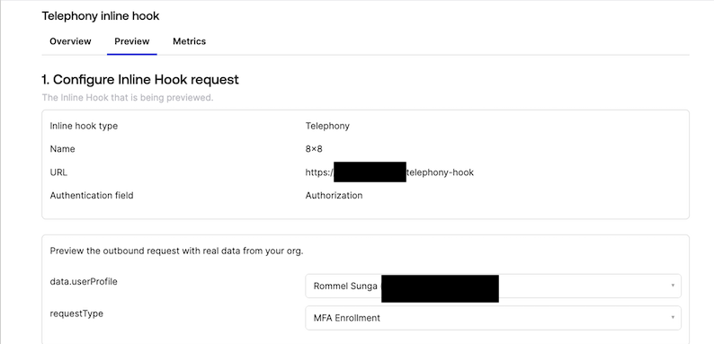
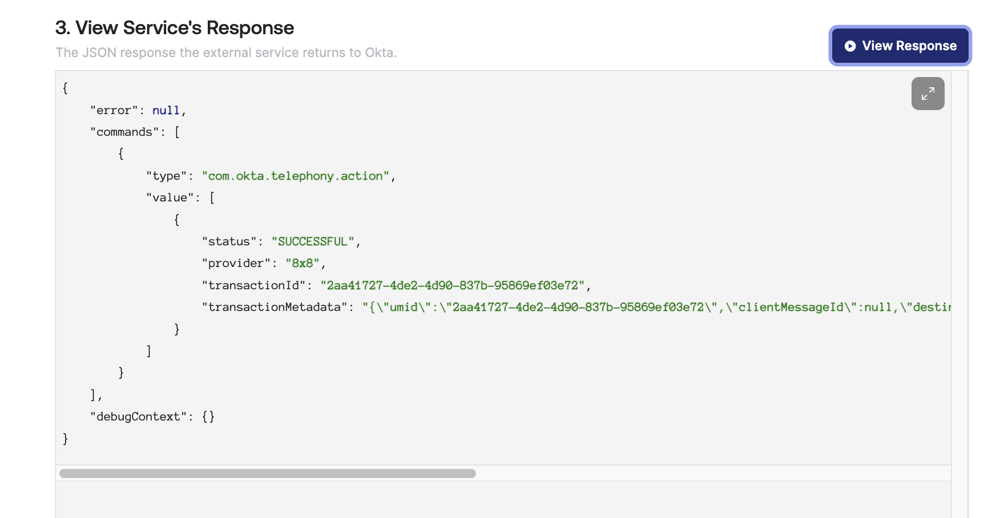
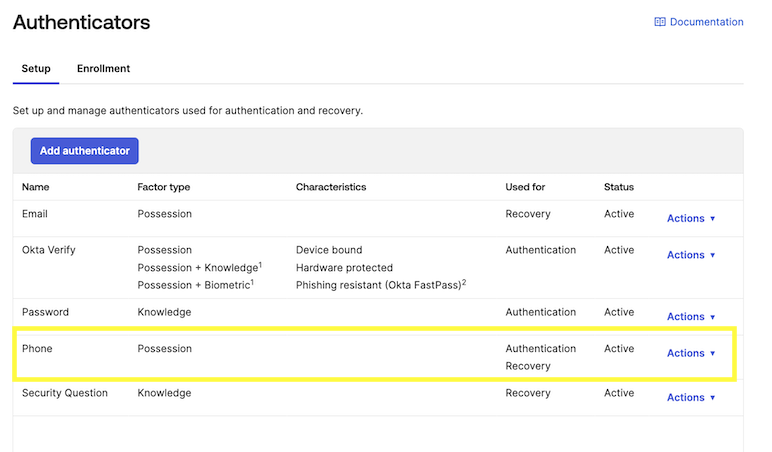
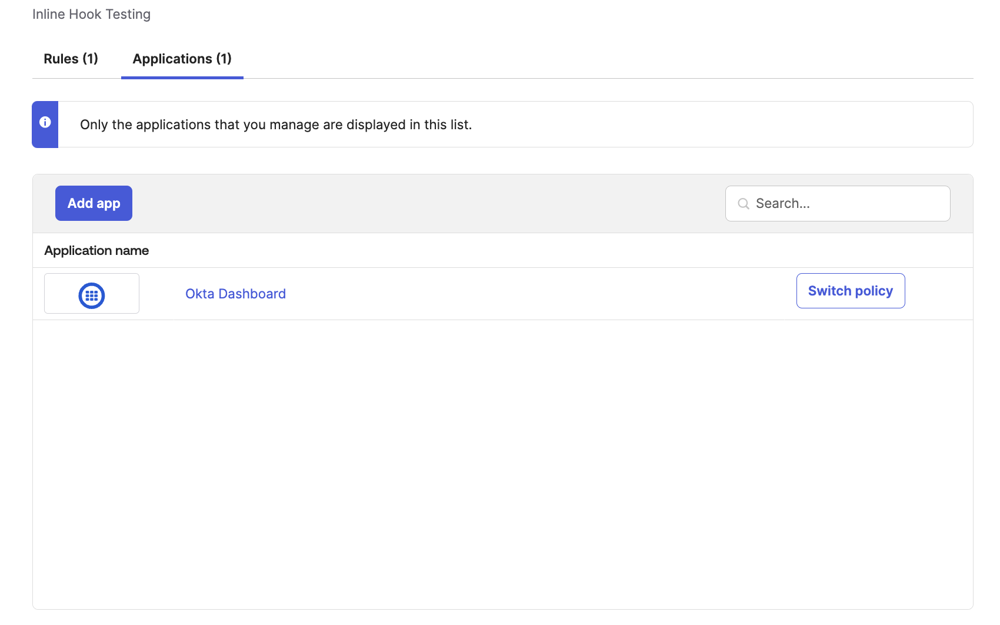
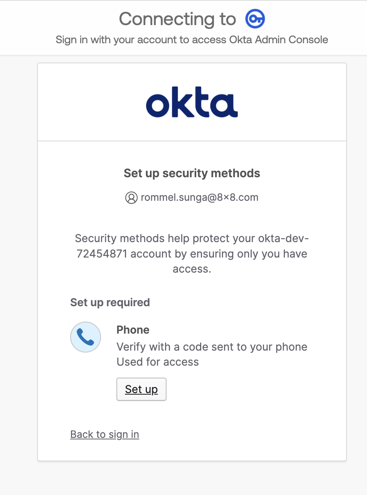
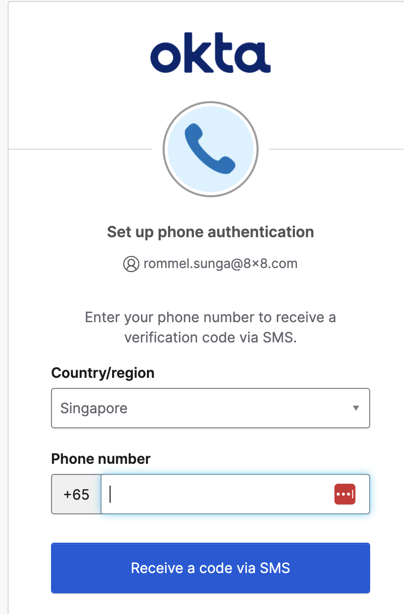

# Okta - (BYOT) Bring Your Own Telephony Guide

## Overview

This guide will take you through how to integrate 8x8's SMS API into Okta as an authenticator method using an Okta [Inline Hook](https://developer.okta.com/docs/concepts/inline-hooks/). Specifically we will be using Okta's [Telephony Inline Hook](https://developer.okta.com/docs/reference/telephony-hook/) to add 8x8's SMS API as an option.

For Okta's own guide on bringing your own telephony provider, refer to Okta's reference guide [here](https://support.okta.com/help/s/article/bring-your-own-telephony-required-for-sms-and-voice?language=en_US) and use Option 2.

The diagram below explains how the flow will look like from using Okta together with the Node.js server we will be building in this tutorial to send OTPs via 8x8 SMS API.


## Video Demo

This Video Demo shows the integration in action and explains a high level of the setup steps in this guide. We recommend referring to this text guide for the full setup.

<iframe
  src="https://www.youtube.com/embed/EZ-uKf--nPc?si=-YePWMizF8fJdgww"
  height="500px"
  width="100%"
  allow="picture-in-picture; web-share"
  allowFullScreen>
</iframe>

## Requirements

* Okta Account (an Okta Dev Account is fine for testing).
* 8x8 Account and Subaccount with a SMS Sender.
* JavaScript Knowledge for running the sample code.
* API Endpoint for Okta to send a HTTP request. Required as part of their Inline Hook integration.

## Setup

## Setup Backend Code

We will need an example endpoint for Okta to send it's HTTP request to. We have provided some example Node.js server code below for you to use:

server.js

```javascript
const express = require('express');
const bodyParser = require('body-parser');
const axios = require('axios');
const { apiKey, subaccount, sender, authKey } = require('./config');

const app = express();
const PORT = 3000;

// Middleware to parse JSON bodies
app.use(bodyParser.json());

// Function to send a successful response to Okta
const sendSuccessResponse = (res, umid, transactionMetadata) => {
    res.status(200).json({
        commands: [
            {
                type: "com.okta.telephony.action",
                value: [
                    {
                        status: "SUCCESSFUL",
                        provider: "8x8",
                        transactionId: umid,
                        transactionMetadata: JSON.stringify(transactionMetadata)
                    }
                ]
            }
        ]
    });
};

// Function to send an error response to Okta
const sendErrorResponse = (res, errorData) => {
    const errorSummary = `8x8 Error Code: ${errorData.code}. 8x8 Error Message: ${errorData.message}`;
    res.status(500).json({
        error: {
            errorSummary: errorSummary
        }
    });
};

app.post('/telephony-hook', async (req, res) => {
    // Print the request body
    console.log('Received request body:', req.body);

    // Check if the Authorization header is correct
    const authHeader = req.headers['authorization'];
    if (authHeader !== authKey) {
        console.log('Unauthorized request');
        return res.status(401).json({ error: 'Unauthorized' });
    }

    // Check if the required fields are present
    const { msgTemplate, phoneNumber } = req.body.data.messageProfile;
    if (!msgTemplate || !phoneNumber) {
        console.log('Invalid request data:', req.body.data);
        return res.status(400).json({ error: 'Invalid request data' });
    }

    // Send OTP using 8x8's SMS API
    try {
        const response = await axios.post(
            `https://sms.8x8.com/api/v1/subaccounts/${subaccount}/messages`,
            {
                source: sender,
                destination: phoneNumber,
                text: msgTemplate,
                encoding: "AUTO"
            },
            {
                headers: {
                    'Authorization': `Bearer ${apiKey}`
                }
            }
        );

        // Print successful response
        console.log('OTP sent successfully:', response.data);

        // Respond with a successful delivery response
        sendSuccessResponse(res, response.data.umid, response.data);
    } catch (error) {
        // Print error response
        console.log('Failed to send OTP:', error.message);

        // Handle errors from the SMS API and respond with an error delivery response
        if (error.response && error.response.data) {
            sendErrorResponse(res, error.response.data);
        } else {
            sendErrorResponse(res, { code: 'UNKNOWN', message: 'An unknown error occurred' });
        }
    }
});

app.listen(PORT, () => {
    console.log(`Server is running on port ${PORT}`);
});

```

The code takes as input a inline hook from Okta which is simply an HTTPS request. Then it will extract the phone number and message from the request body and use that information to send an API call to 8x8's SMS API to send an OTP to the destination number. It will return either success or error information to Okta as a final step.

Please note it requires parameters set in a **config.js** file as below. All values should be replaced and set with the corresponding values unique to your 8x8 Account and Okta Inline Hook configuration. The apiKey, subaccount and sender can be found in 8x8 Connect under [API Keys](https://connect.8x8.com/messaging/api-keys) and [Numbers](https://connect.8x8.com/messaging/virtual-numbers).

| Key | Value |
| --- | --- |
| apiKey | Your 8x8 API Key. |
| subaccount | Your 8x8 Subaccount. |
| sender | Your 8x8 SMS Sender ID or Virtual Number |
| authKey | Should be set to the same value as the Authentication Secret from the Inline Hook guide setup below. Used by your server to authenticate the request from Okta. |

Here is the example **config.js** file for reference where the values should be replaced.

config.js

```
// config.js
module.exports = {
    apiKey: 'your_8x8_api_key',
    subaccount: 'your_8x8_subaccount',
    sender: 'YourSender',
    authKey: '1234'
};

```

Here is the example package.json for your Node.js application. It includes the packages axios, body-parser and expressed used in the backend server code.

package.json

```json
{
  "name": "okta_inline_hook_integration",
  "version": "1.0.0",
  "main": "server.js",
  "scripts": {
    "test": "echo \"Error: no test specified\" && exit 1",
    "start": "node server.js"
  },
  "keywords": [],
  "author": "",
  "license": "ISC",
  "description": "",
  "dependencies": {
    "axios": "^1.7.3",
    "body-parser": "^1.20.2",
    "express": "^4.19.2"
  }
}

```

After placing this code in the same directory, you can run the following commands to start the server.

Shell - Install Packages and Start Server

```bash
npm install
npm start

```

The output should appear as follows.

Shell - Start Server Ouptut

```bash
> okta_inline_hook_integration@1.0.0 start
> node server.js

Server is running on port 3000

```

The server should be exposed to the public internet so that Okta can send a webhook. The exact method is left to you but some options may include ngrok and localtunnel if you are running on your local laptop/desktop dev environment.

For production, however, this should be running behind a proper web server setup.

## Create Inline Hook

Go to **Workflow > Inline Hooks** on the Okta Dashboard. Select **Add Inline Hook** and **Telephony**.


## Adding Inline Hook as Authenticators

In the **Create Inline Hook** page, fill in the following values.

| Field | Description | Example Value |
| --- | --- | --- |
| **Name** | Can be any value. We use "8x8 - SMS Authentication" | 8x8 - SMS Authentication |
| **URL** | Should be set to the URL of your backend server that you send the code.<br>For this tutorial we host it locally and use ngrok to expose it for demo purposes. In production you will need a hosting solution. | [https://example.com/endpoint](https://example.com/endpoint) |
| **Authentication Field** | Will be sent as part of the request header. Authentication Field is for your backend to authenticate the webhook from Okta. It can be any value<br>Refer to Okta's [page](https://developer.okta.com/docs/reference/hooks-best-practices/) on authentication and Inline Hooks for reference. | Authentication |
| **Authentication Secret (Used with Authentication Field)** | Will be sent as part of the request header. This should be the value your backend uses to authenticate | secretvalue |


After entering the values, click **Save**.

## Preview the Telephony Inline Hook

In the next page you should see the following confirming a few of the values from setting up the Inline Hook. Select an Okta user to preview from your organization in **data.userProfile** and select anything for the **requestType**, we use MFA enrollment.



Afterwards click **Generate Request** in Step 2 on this page, it will generate an example JSON that will be sent to your endpoint so that you know what format to expect from Okta. If needed, change any of the JSON Values such as the **messageProfile.phoneNumber** field which we use in our tutorial code to send an OTP.


Click **View Response** to send the example Inline hook to your server. You should see the JSON response below from the server upon a successful request.



From our example Node.js server you should see the following output, showing the API request sent from Okta and also the output of the API call to 8x8's SMS API.

Server Code Output

```text
Received request body: {
  eventId: '3IPD5oQfQdOttCCjUWMk3Q',
  eventTime: '2024-08-07T22:15:30.000Z',
  eventType: 'com.okta.telephony.provider',
  eventTypeVersion: '1.0',
  contentType: 'application/json',
  cloudEventVersion: '0.1',
  source: '<redacted>',
  requestType: 'com.okta.user.telephony.pre-enrollment',
  data: {
    context: { request: [Object] },
    userProfile: {
      firstName: 'Rommel',
      lastName: 'Sunga',
      login: '<redacted>',
      userId: '00uit3mfz9gLSSzgQ5d7'
    },
    messageProfile: {
      msgTemplate: 'Your code is 11111',
      phoneNumber: '<Destination Phone Number>',
      otpExpires: '2024-08-07T22:20:25.057Z',
      deliveryChannel: 'SMS',
      otpCode: '11111',
      locale: 'EN-US'
    }
  }
}
OTP sent successfully: {
  umid: 'f68ac2f8-9da3-48d8-b8ec-f9702dad3b5b',
  clientMessageId: null,
  destination: '<Destination Phone Number>',
  encoding: 'GSM7',
  status: {
    code: 'QUEUED',
    description: 'SMS is accepted and queued for processing'
  }
}

```

The SMS should also be delivered to your phone.


This demonstrates the inline hook is now successfully working. Now you can attach the Okta inline hook to any action that would trigger the inline hook in Okta.

### Using the Inline Hook

Now that the Inline Hook has been added, in order to require it for signing into your Okta organization.

## Add Authenticator

Ensure that in the **Security - Authenticators** page that Phone is added as an Authenticator option.



 If it is not already on the list then click **Add Authenticator** to add it.

## Create new Authentication Policy Rule

Click **Add Rule** on the **Security - Authentication Policies** page.


In the **Edit Rule** page, the only change we will make is for AND Authentication methods where we should include the **Phone - SMS** method along with any other methods we wish to offer the user authenticating into Okta.


## Add to Application

After creating the Policy, add it to one of your Applications.




## Signing In

When attempting to login to the application that you have configured above, you should receive the following screen prompting you to register for Phone Verification.



Again the code should be sent to your phone via SMS, follow the prompts to finish logging into application.


For subsequent sign-ins to the application it should utilize SMS as a verification method.

### Conclusion

In this tutorial we have shown how to create a Telephony Inline Hook that makes use of 8x8's SMS API to send OTPs via SMS. With this integration, you can leverage the ability of 8x8's SMS API to send an OTP while integrating with Okta.
