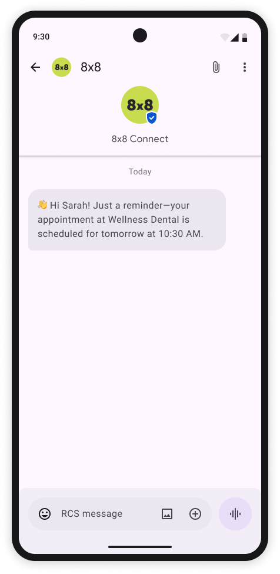
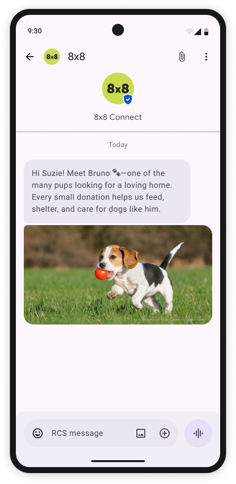
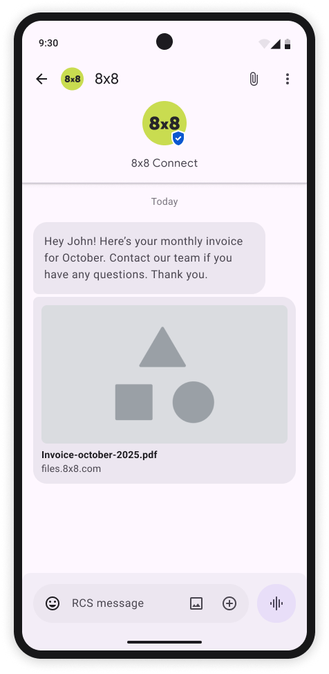
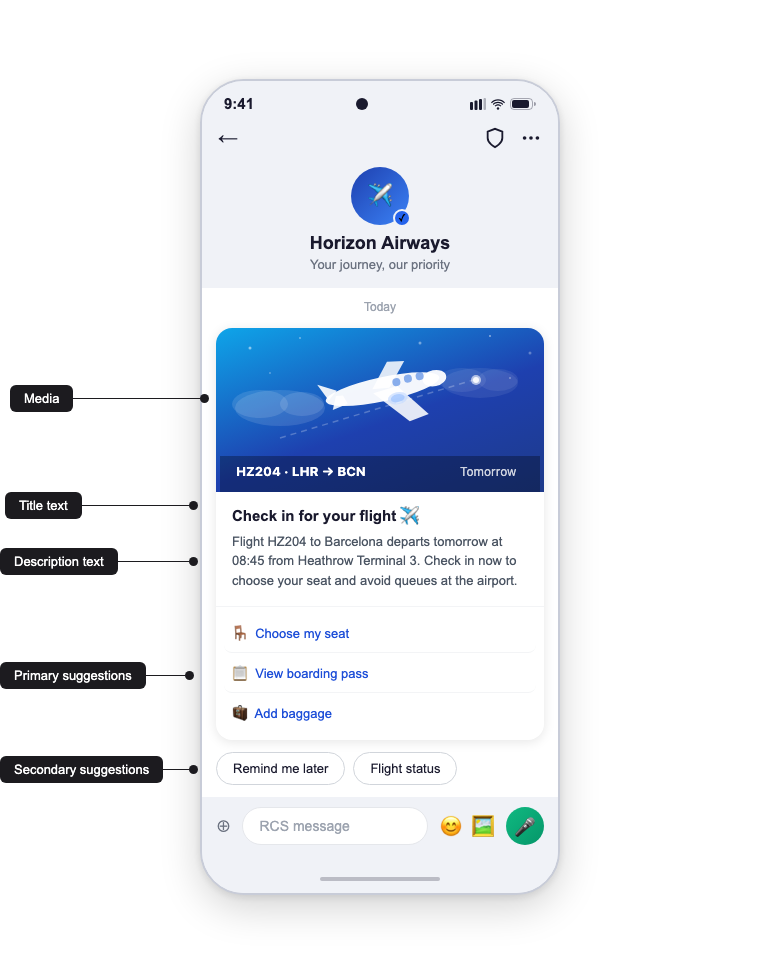
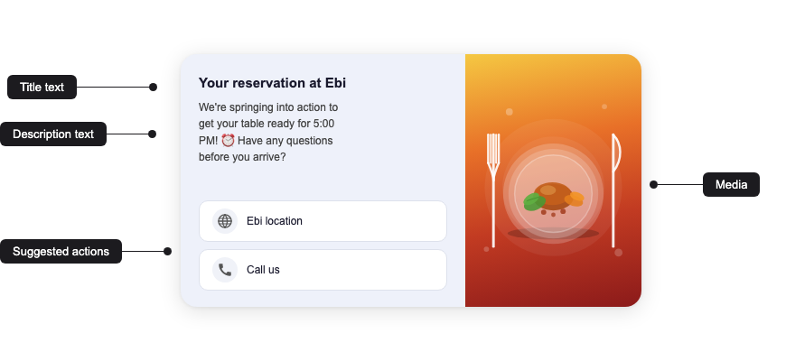
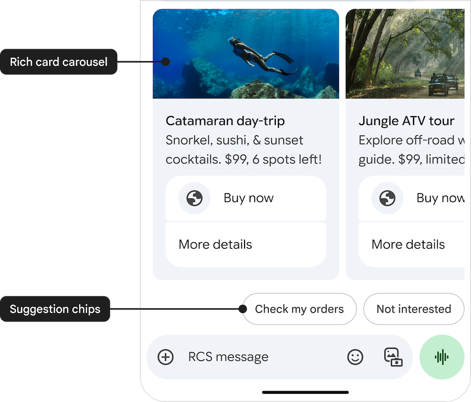
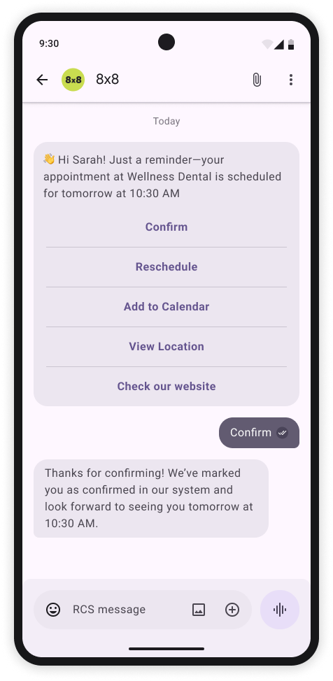

# Message types and samples

> **Please see [Messaging API](/connect/reference/send-message) for the full API reference.**
>
>

## Text Message

**Content:** Text only

**Character Limit:** Up to 3072 characters

**Use Cases:** OTP codes, simple alerts

### Payload sample

```json
{
    "user": {
        "msisdn": "+10000000000"
    },
    "type": "Text",
    "content": {
        "text": ":wave: Hi Sarah! Just a reminder—your appointment at Wellness Dental is scheduled for tomorrow at 10:30 AM"
    }
}

```

The corresponding message the user will receive:



---

## Sending a Rich Media Message

* Media Types Supported: Images, videos, documents
* File formats: .ogx, .pdf, .aac, .mp3, .mpeg, .mp3, .mp4, .mp4, .3gp, .jpeg, .jpg, .gif, .png, .h263, .m4v, .mp4, .mp4, .mpeg, .webm
* Text Caption: Up to 2,000 UTF-8 characters
* File Size Limits: 100MB
* File URL limit: 2,048 characters

### Image & text

```json
{
    "user": {
        "msisdn": "+10000000000"
    },
    "type": "Image",
    "content": {
        "url": "https://www.example.com/image.jpg",
        "text": "Hi Suzie! Meet Bruno :feet:—one of the many pups looking for a loving home. Every small donation helps us feed, shelter, and care for dogs like him."
    }
}

```

The corresponding message the user will receive:



---

### Video & text

```json
{
    "user": {
        "msisdn": "+10000000000"
    },
    "type": "Video",
    "content": {
        "url": "https://www.example.com/video.mp4",
        "text": "Hi Suzie! Meet Bruno :feet:—one of the many pups looking for a loving home. Every small donation helps us feed, shelter, and care for dogs like him."
    }
}

```

The corresponding message the user will receive:


---

### Audio & text

```json
{
    "user": {
        "msisdn": "+10000000000"
    },
    "type": "Audio",
    "content": {
        "url": "https://www.example.com/video.mp4",
        "text": "Hi There, this is a Sample RCS Audio Message"
    }
}

```

The corresponding message the user will receive:

---

### File & text

```json
{
    "user": {
        "msisdn": "+10000000000"
    },
    "type": "Text",
    "content": {
        "url": "https://example.com/links/Invoice-october-2025.pdf",
        "text": "Hey John! Here's your monthly invoice for October. Contact our team if you have any questions. Thank you"
    }
}

```

The corresponding message the user will receive:



---

## Rich Card

A **Rich Card** bundles a title, description, a single media asset (image or video), and up to four in-card suggestions into one interactive message. Use rich cards for product promotions, appointment confirmations, order summaries, or any scenario where visual content needs to be paired with clear calls to action.

**Content:** Title + description + media + in-card suggestions + optional message-level suggestions

**Card Orientation:** `vertical` or `horizontal`

**Media Height** (vertical cards only): `SHORT`, `MEDIUM`, or `TALL`

**Use Cases:** Product showcase, booking confirmation, loyalty reward, order summary

### Rich Card — Vertical

A vertical card displays the media at the top, followed by the title, description, and in-card suggestions. Use `MEDIUM` or `TALL` media height when the image is the primary content; use `SHORT` when the text is the primary content.

#### Payload sample

```json
{
  "user": {
    "msisdn": "+441234567890"
  },
  "type": "RichCard",
  "content": {
    "richCard": {
      "cardOrientation": "vertical",
      "title": "Hey Melissa! New year, new shoes? 👟",
      "description": "Check out our latest arrivals, including the AirPulse, perfect for your next run! Plus, get a free gait analysis with any purchase this week.",
      "media": {
        "height": "SHORT",
        "contentInfo": {
          "fileUrl": "https://www.example.com/rich_card_vertical.jpg",
          "thumbnailUrl": "https://www.example.com/rich_card_vertical.jpg",
          "forceRefresh": false
        }
      },
      "suggestions": [
        {
          "reply": {
            "text": "🛍️ View new arrivals",
            "postbackData": "view_new_arrivals"
          }
        },
        {
          "reply": {
            "text": "📋 Book Gait Analysis",
            "postbackData": "book_gait_analysis"
          }
        },
        {
          "action": {
            "text": "👗 Shop now",
            "postbackData": "shop_now",
            "openUrlAction": {
              "url": "https://developer.8x8.com/connect/docs/rcs/message-types",
              "application": "WEBVIEW",
              "webviewViewMode": "FULL",
              "description": "Shop Bridgepoint Runners"
            },
            "fallbackUrl": "https://developer.8x8.com/connect/docs/rcs/message-types"
          }
        }
      ]
    },
    "suggestions": [
      {
        "reply": {
          "text": "Check my orders",
          "postbackData": "check_my_orders"
        }
      },
      {
        "reply": {
          "text": "Not interested",
          "postbackData": "not_interested"
        }
      }
    ]
  }
}
```

The corresponding message the user will receive:



The annotations map directly to the payload:

* **Media** → `content.richCard.media`
* **Title text** → `content.richCard.title`
* **Description text** → `content.richCard.description`
* **Primary suggestions** → `content.richCard.suggestions` (in-card, up to 4)
* **Secondary suggestions** → `content.suggestions` (message-level, up to 7)

### Rich Card — Horizontal

A horizontal card displays the media to the left or right of the text block. Use it when the text is the primary content and the image plays a supporting role (e.g. confirmations, itineraries, compact receipts). Horizontal cards do not use `media.height` — the carrier sizes the media to the text block.

#### Payload sample

```json
{
  "user": {
    "msisdn": "+441234567890"
  },
  "type": "RichCard",
  "content": {
    "richCard": {
      "thumbnailImageAlignment": "right",
      "cardOrientation": "horizontal",
      "title": "Your reservation at Ebi",
      "description": "We're springing into action to get your table ready for 5:00 PM! 🕔 Have any questions before you arrive?",
      "media": {
        "contentInfo": {
          "fileUrl": "https://www.example.com/rich_card_horizontal.jpg",
          "thumbnailUrl": "https://www.example.com/rich_card_horizontal.jpg",
          "forceRefresh": false
        }
      },
      "suggestions": [
        {
          "action": {
            "text": "Ebi location",
            "postbackData": "ebi_location",
            "viewLocationAction": {
              "latLong": {
                "latitude": 37.7749,
                "longitude": -122.4194
              },
              "label": "Ebi Restaurant"
            }
          }
        },
        {
          "action": {
            "text": "Call us",
            "postbackData": "call_ebi",
            "dialAction": {
              "phoneNumber": "+12025551234"
            }
          }
        }
      ]
    },
    "suggestions": []
  }
}
```

The corresponding message the user will receive:



### Suggestions: in-card vs. message-level

A rich card supports two separate suggestion arrays:

| Location | Path | Limit | Renders as |
| --- | --- | --- | --- |
| **In-card** | `content.richCard.suggestions` | Up to 4 | Buttons inside the card, tied to the card content. |
| **Message-level** | `content.suggestions` | Up to 7 additional | Chips below the card, for broader follow-up actions. |

Together, a single message can expose up to **11** suggestions (4 in-card + 7 message-level).

### Rich Card field reference

| Field | Type | Description |
| --- | --- | --- |
| `cardOrientation` | string | `vertical` or `horizontal`. |
| `thumbnailImageAlignment` | string | Horizontal cards only. `left` or `right` — positions the media relative to the text block. |
| `title` | string | Card headline. Max 200 characters. |
| `description` | string | Supporting body text. Max 2 000 characters. |
| `media.height` | string | `SHORT`, `MEDIUM`, or `TALL`. Vertical cards only. |
| `media.contentInfo.fileUrl` | string (URL) | Public URL of the image or video asset. |
| `media.contentInfo.thumbnailUrl` | string (URL) | Public URL of the thumbnail (used for video). |
| `media.contentInfo.forceRefresh` | boolean | If `true`, the carrier re-fetches the media instead of serving a cached copy. |
| `suggestions[]` | array | In-card chips. Each entry contains either a `reply` or an `action`. |

### Limits

| Field | Limit |
| --- | --- |
| **Title** | 200 characters |
| **Description** | 2 000 characters |
| **In-card suggestions** | Up to 4 chips |
| **Message-level suggestions** | Up to 7 chips |
| **Media file size** | Up to 100 MB |
| **Card payload size** | 250 KB |

### Best practices

* Keep titles short and scannable; use the description for supporting detail.
* Pair every card with at least one suggestion so users have a clear next step.
* Provide a `fallbackUrl` on every `openUrlAction` for clients that cannot open the webview.
* Serve media over HTTPS from a stable, publicly reachable URL — the carrier may cache the asset.
* Use message-level suggestions for persistent actions (e.g. "Check my orders") and keep in-card suggestions tied to the card's specific offer.

---

## Carousel

A **Carousel** is a horizontally swipeable collection of rich cards delivered in a single message. Use carousels to present multiple comparable items — product variants, tour packages, available appointment slots, or menu choices — so the user can browse options inline without leaving the conversation.

Each card in the carousel follows the same content model as a standalone rich card (title, description, media, in-card suggestions), but cards in a carousel share a common `cardWidth` and are always rendered vertically.

**Content:** List of 2–10 cards + optional message-level suggestions

**Card Width:** `small` or `medium` — applied to every card in the carousel

**Use Cases:** Product catalogue, tour or package selection, menu, appointment slots, booking options

### Payload sample

```json
{
  "user": {
    "msisdn": "+441234567890"
  },
  "type": "Carousel",
  "content": {
    "carousel": {
      "cardWidth": "medium",
      "cards": [
        {
          "title": "Catamaran day-trip",
          "description": "Snorkel, sushi, & sunset cocktails. $99, 6 spots left!",
          "media": {
            "height": "short",
            "contentInfo": {
              "fileUrl": "https://www.example.com/catamaran.jpg",
              "thumbnailUrl": "https://www.example.com/catamaran.jpg",
              "forceRefresh": false
            }
          },
          "suggestions": [
            {
              "action": {
                "text": "Buy now",
                "postbackData": "buy_catamaran",
                "openUrlAction": {
                  "url": "https://developer.8x8.com/connect/docs/rcs/message-types",
                  "application": "WEBVIEW",
                  "webviewViewMode": "FULL",
                  "description": "Buy catamaran day-trip"
                },
                "fallbackUrl": "https://developer.8x8.com/connect/docs/rcs/message-types"
              }
            },
            {
              "reply": {
                "text": "More details",
                "postbackData": "details_catamaran"
              }
            }
          ]
        },
        {
          "title": "Jungle ATV tour",
          "description": "Explore off-road with an expert guide. $99, limited spots!",
          "media": {
            "height": "short",
            "contentInfo": {
              "fileUrl": "https://www.example.com/atv.png",
              "thumbnailUrl": "https://www.example.com/atv.png",
              "forceRefresh": false
            }
          },
          "suggestions": [
            {
              "action": {
                "text": "Buy now",
                "postbackData": "buy_atv_tour",
                "openUrlAction": {
                  "url": "https://developer.8x8.com/connect/docs/rcs/message-types",
                  "application": "WEBVIEW",
                  "webviewViewMode": "FULL",
                  "description": "Buy jungle ATV tour"
                },
                "fallbackUrl": "https://developer.8x8.com/connect/docs/rcs/message-types"
              }
            },
            {
              "reply": {
                "text": "More details",
                "postbackData": "details_atv_tour"
              }
            }
          ]
        }
      ]
    },
    "suggestions": [
      {
        "reply": {
          "text": "Check my orders",
          "postbackData": "check_my_orders"
        }
      },
      {
        "reply": {
          "text": "Not interested",
          "postbackData": "not_interested"
        }
      }
    ]
  }
}
```

The corresponding message the user will receive:



The annotations map directly to the payload:

* **Rich card carousel** → `content.carousel.cards` (the swipeable cards themselves)
* **Suggestion chips** → `content.suggestions` (message-level, shown below the carousel)

### Carousel field reference

| Field | Type | Description |
| --- | --- | --- |
| `cardWidth` | string | `small` or `medium`. Applies to every card in the carousel. |
| `cards[]` | array | 2 to 10 card objects. Each card has the same shape as a standalone vertical rich card, minus `cardOrientation`. |
| `cards[].title` | string | Card headline. Max 200 characters. |
| `cards[].description` | string | Card body. Max 2 000 characters. |
| `cards[].media.height` | string | `short`, `medium`, or `tall`. Applies per card. |
| `cards[].media.contentInfo.fileUrl` | string (URL) | Public URL of the image or video. |
| `cards[].media.contentInfo.thumbnailUrl` | string (URL) | Public URL of the thumbnail (used for video). |
| `cards[].suggestions[]` | array | In-card chips. Up to 4 per card. |
| `content.suggestions[]` | array | Message-level chips shown below the carousel. Up to 7. |

### Limits

| Field | Limit |
| --- | --- |
| **Cards per carousel** | 2 minimum, 10 maximum |
| **Card title** | 200 characters |
| **Card description** | 2 000 characters |
| **In-card suggestions (per card)** | Up to 4 chips |
| **Message-level suggestions** | Up to 7 chips |
| **Media file size (per card)** | Up to 100 MB |
| **Total payload size** | 250 KB |

### Best practices

* Keep `cardWidth` consistent with the content density — use `small` when titles and descriptions are short; use `medium` when you need room for longer copy or larger media.
* Keep the number of cards manageable. 3–5 cards typically convert best; 10 cards is the absolute ceiling.
* Lead with the most relevant card — users often only browse the first two or three before making a decision.
* Use the same suggestion pattern on every card (e.g. "Buy now" + "More details") so users learn the pattern quickly.
* Serve media over HTTPS from a stable, publicly reachable URL — the carrier may cache the asset.
* Use message-level suggestions for actions that apply to the whole conversation ("Check my orders", "Not interested") rather than to a specific card.

---

## Suggested Actions

Suggestions in RCS Business Messaging provide interactive buttons, chips, or quick replies that guide users seamlessly through rich conversational experiences. By using suggestions, brands can streamline user journeys, enhance engagement, improve conversions, and gather immediate user feedback.

### Available Suggestion Types

| Suggestion type | One-line description | Typical brand use cases | Core benefit |
| --- | --- | --- | --- |
| **Suggested Reply** | Sends a predefined text back to your agent or bot. | *Yes/No*, choose size/colour, CSAT "👍/👎", OTP confirmation. | Keeps flow structured and speeds funnel completion. |
| **Dial a Number** | Opens the dialer with a preset phone number. | Escalate to live agent, click-to-call for abandoned carts, fraud alerts. | Instant voice escalation builds trust and saves high-value sales. |
| **View a Location** | Launches maps focused on a given pin or search term. | Store locator, nearest ATM/locker, travel itinerary. | Drives measurable footfall from messaging. |
| **Open URL / Webview** | Opens browser or in-app webview (full/half/tall). | Secure checkout, product page, claim form, loyalty sign-in. | Seamless upsell without forcing an app download. |
| **Create Calendar Event** | Pre-fills a calendar entry in the user's default calendar. | Doctor appointments, flight reminders, webinar invites. | Cuts no-shows by embedding reminders directly in the calendar. |



### Best practices

* Limit to 4‑5 suggestions per message to avoid cognitive overload.
* Use clear, action‑oriented labels (e.g. "Track Order" instead of "Order").
* Always set postback data so downstream systems can act on replies.
* Include capability fallback (SMS or URL) when the user's client does not support a given action.
* Instrument analytics to track tap‑through and optimise suggestion wording.

### Implementation Example

```json
{
  "user": {
    "msisdn": "+441234567890"
  },
  "type": "Text",
  "content": {
    "text": "👋 Hi Sarah! Just a reminder—your appointment at Wellness Dental is scheduled for tomorrow at 10:30 AM",
    "suggestions": [
      {
        "reply": {
          "text": "Confirm",
          "postbackData": "user_confirmed"
        }
      },
      {
        "reply": {
          "text": "Reschedule",
          "postbackData": "user_rescheduled"
        }
      },
      {
        "action": {
          "text": "Add to Calendar",
          "postbackData": "add_event_to_calendar",
          "createCalendarEventAction": {
            "title": "Dental Appointment",
            "description": "Appointment at Wellness Dental",
            "startTime": "2026-02-15T10:30:00Z",
            "endTime": "2026-02-15T11:00:00Z"
          }
        }
      },
      {
        "action": {
          "text": "View Location",
          "postbackData": "view_clinic_location",
          "viewLocationAction": {
            "latLong": {
              "latitude": 37.7749,
              "longitude": -122.4194
            },
            "label": "Wellness Dental"
          }
        }
      },
      {
        "action": {
          "text": "Visit Website",
          "postbackData": "open_website",
          "openUrlAction": {
            "url": "https://developer.8x8.com/connect/docs/rcs/message-types",
            "application": "WEBVIEW",
            "webviewViewMode": "FULL",
            "description": "Visit our website"
          },
          "fallbackUrl": "https://developer.8x8.com/connect/docs/rcs/message-types"
        }
      }
    ]
  }
}
```

## Overview of file types and limits

### Supported **File** formats are

| Category | Extensions / MIME types | Notes |
| --- | --- | --- |
| **Images** | `.jpeg` / `.jpg` (`image/jpeg`), `.png` (`image/png`), `.gif` (`image/gif`) | Supported in rich cards & media messages |
| **Video** | `.h263` (`video/h263`), `.m4v` (`video/m4v`), `.mp4` (`video/mp4`, `video/mpeg4`), `.mpeg` (`video/mpeg`), `.webm` (`video/webm`) | Supported in rich cards & media messages |
| **Audio** | `.aac` (`audio/aac`), `.mp3` (`audio/mp3`, `audio/mpeg`, `audio/mpg`), `.mp4` (`audio/mp4`, `audio/mp4-latm`), `.3gp` (`audio/3gpp`), `.ogx` / `.ogg` (`application/ogg`, `audio/ogg`) | Media messages only |
| **Documents** | `.pdf` (`application/pdf`) | Media messages (not rich cards) |
| **File size cap** | Up to **100 MB** per attachment |  |

### Limits

| Message element / field | Limit |
| --- | --- |
| **Plain text message** | 3 072 characters |
| **Rich-card title** | 200 characters |
| **Rich-card description** | 2 000 characters |
| **Suggested-reply text** | 25 characters |
| **Suggested-action text** | 25 characters |
| **Suggestion chips per message** | Up to 11 chips (4 in-card + 7 extra) |
| **Carousel cards per message** | Up to 10 cards |
| **Text caption with media** | 2 000 characters |
| **Postback data** (per suggestion) | 2 048 characters |
| **Rich-card payload size** | 250 KB |
