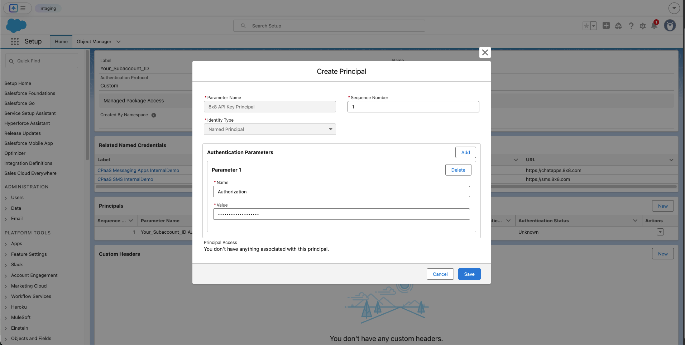
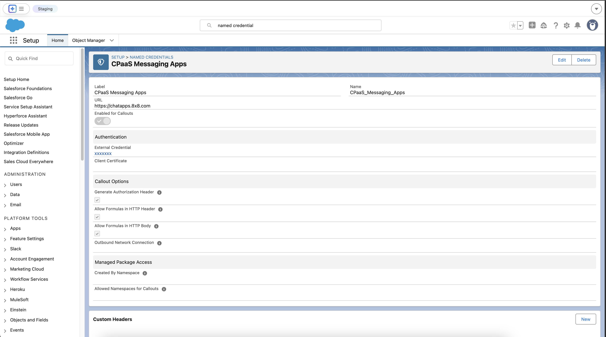
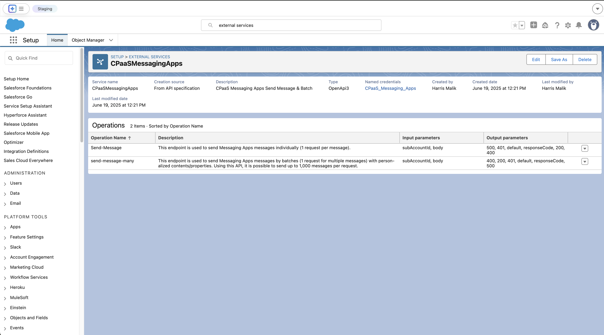
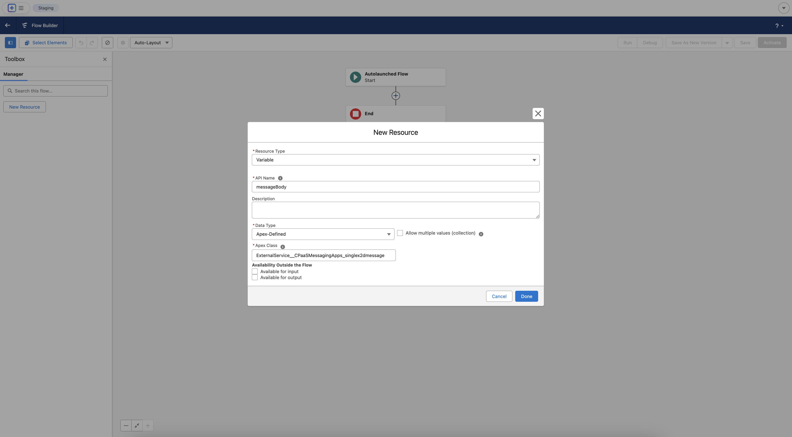
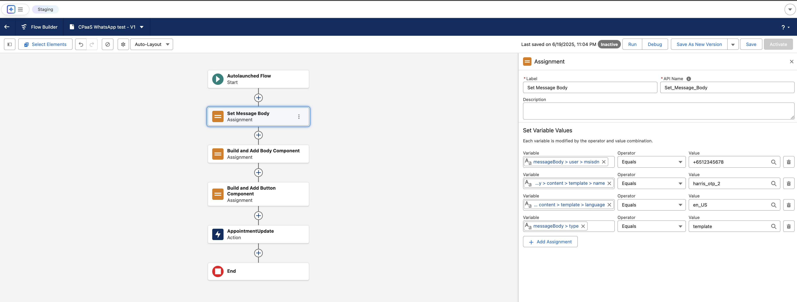
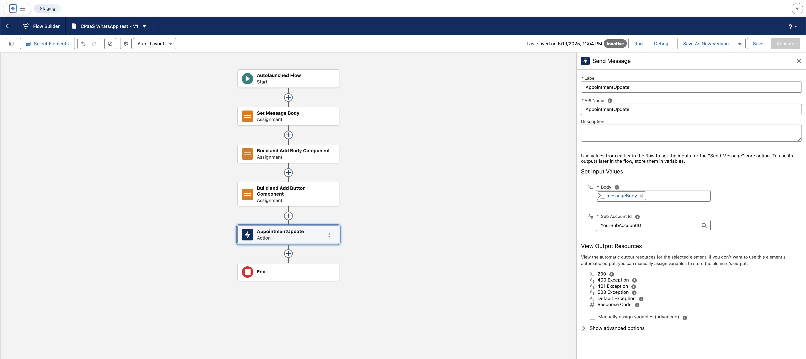

# Sending Messages in Salesforce Flow Builder

This guide will walk you through the entire process of connecting Salesforce to the 8x8 Business Messaging API (e.g. for WhatsApp) to send messages directly from your Salesforce environment from Flow Builder, by utilizing [External Services](https://help.salesforce.com/s/articleView?id=platform.external_services.htm). You can also follow the same invocable actions in Orchestrator, Einstein bots, or OmniStudio Assets.  

We will accomplish this using Salesforce's declarative tools, which allow you to build robust integrations without writing complex code.

> 👍 **Good to know**
>
> While this guide focuses on WhatsApp Authentication template, you can use the same approach for other WhatsApp templates, or other [supported messaging apps](/connect/reference/list-of-supported-chatapps-channels) following their respective schema. For **SMS**, refer to [this guide](https://8x8-enterprise-group.readme.io/connect/docs/salesforce-flowbuilder-8x8-sms-integration)
>
>

## Prerequisites and Requirements

Before you begin, ensure your Salesforce environment and 8x8 account meet the following requirements.

### **Salesforce Platform Requirements**

* **Salesforce Experience:** **Lightning Experience**.
* **Required Editions:** **Enterprise**, **Performance**, **Unlimited**, and **Developer** Editions.
* **Feature Integration:** The actions created from an External Service can be used in declarative tools like **Flow Builder**, Orchestrator, Einstein bots, or Omnistudio.
* **User Permissions Needed**:
  * To **define** an external service: The user needs **Modify All Data** OR **Modify Metadata Through Metadata API Functions** permissions.
  * To **invoke** an external service action from a flow: The user needs the **Run Flows** permission.

### **8x8 Account Requirements**

* **8x8 Connect Account:** An active account with access to the messaging channels you wish to use.
* **API Credentials:** Your 8x8 Subaccount ID and your API Key (Bearer Token).

---

## Part 1: The Foundation - Setting Up Authentication

First, we need to teach Salesforce how to securely authenticate with the 8x8 Messaging API. This involves creating a secure chain of credentials. A Named Credential specifies the callout endpoint's URL and its required authentication parameters in one definition.

### **Step 1.1: Create the External Credential**

The External Credential is a secure vault that will hold your API key.

1. Navigate to **Setup** ⚙️. In the Quick Find box, type `External Credentials` and select it.
2. Click **New**.
3. Enter the following details:
  * **Label**: `8x8 CPaaS Authentication`
  * **Name**: `8x8_CPaaS_Authentication` (this will auto-populate)
  * **Authentication Protocol**: Select `Custom`.
4. Click **Save**.

### Step 1.2: Create the Principal

The Principal represents the specific identity and secret used for authentication.

1. On the External Credential page you just saved, scroll down to **Principals** and click **New**.
2. Enter the following details:
  * **Principal Name**: `8x8 API Key Principal`
  * **Sequence Number**: `1`
3. Under **Authentication Parameters**, click **Add Parameter**.
  * **Name**: `Authorization`
  * **Value**: `Bearer YOUR_API_TOKEN` (Replace `YOUR_API_TOKEN` with the actual API key from [this page](https://8x8-enterprise-group.readme.io/connect/docs/authentication)).
4. Click **Save**.

Create Principal

### Step 1.3: Create the Named Credential

The Named Credential links the API's address (URL) to the authentication secret you just stored.

1. Navigate to **Setup** ⚙️. In the Quick Find box, type `Named Credentials` and select it.
2. Click **New**.
3. Enter the following details:
  * **Label**: `8x8 Messaging API`
  * **Name**: `8x8_Messaging_API`
  * **URL**: `https://chatapps.8x8.com` (Asia-Pacific deployment region; see full [list of regions](/connect/docs/data-center-region#api-endpoints-and-platform-region)
  * **External Credential**: Select the `8x8 CPaaS Authentication` credential you created above.
  * Ensure the **Generate Authorization Header** checkbox is checked.
4. Click **Save**.

> ℹ️ **Sending SMS**
>
> For SMS, use the corresponding [sms endpoint](/connect/docs/data-center-region#api-endpoints-and-platform-region) (default is sms.8x8.com) and the appropriate SMS OAS accordingly
>
>

Completed Named Credential and External Credential

---

## Part 2: Defining the API Operations

Next, we will use your OAS file to teach Salesforce about the specific 8x8 API calls.

1. Navigate to **Setup** ⚙️. In the Quick Find box, type `External Services` and select it.
2. Click **Add External Service**.
3. Select **From API Specification**.
4. Configure the service:
  * **Service Name**: `CPaasMessagingApps`
  * **Named Credential**: Select the **`8x8 Messaging API`** Named Credential you just created.
  * **Service Schema**: Select **Upload from local** and upload the complete [OAS](https://8x8-enterprise-group.readme.io/connect/reference/messaging-apps-api-get-started)  `.json` file or select "Complete Schema" and paste the schema below (contains only send single and send batch API)

```
{
    "openapi": "3.0.0",
    "info": {
        "title": "8x8 Send Message API (Single and Batch)",
        "version": "1.0",
        "description": "A minimal OpenAPI spec for the 8x8 Send Message and Send Message Batch operations."
    },
    "servers": [
        {
            "url": "https://chatapps.8x8.com",
            "description": "Asia-Pacific region"
        },
        {
            "url": "https://chatapps.us.8x8.com",
            "description": "North America region"
        },
        {
            "url": "https://chatapps.8x8.uk",
            "description": "Europe region"
        },
        {
            "url": "https://chatapps.8x8.id",
            "description": "Indonesia region"
        }
    ],
    "paths": {
        "/api/v1/subaccounts/{subAccountId}/messages": {
            "post": {
                "summary": "Send message",
                "description": "This endpoint is used to send Messaging Apps messages individually (1 request per message).",
                "tags": [
                    "Send Message API"
                ],
                "operationId": "Send-Message",
                "security": [
                    {
                        "apiKey": []
                    }
                ],
                "parameters": [
                    {
                        "name": "subAccountId",
                        "in": "path",
                        "description": "You must replace *{subAccountId}* with the subaccountid that you want to use.",
                        "required": true,
                        "schema": {
                            "type": "string"
                        }
                    }
                ],
                "requestBody": {
                    "description": "Messaging API: request model for send single message",
                    "required": true,
                    "content": {
                        "application/json": {
                            "schema": {
                                "$ref": "#/components/schemas/single-message-request"
                            }
                        }
                    }
                },
                "responses": {
                    "200": {
                        "description": "Success response",
                        "content": {
                            "application/json": {
                                "schema": {
                                    "$ref": "#/components/schemas/single-message-response"
                                }
                            }
                        }
                    },
                    "400": {
                        "description": "Bad Request"
                    },
                    "401": {
                        "description": "Unauthorized"
                    },
                    "500": {
                        "description": "Internal Server Error"
                    }
                }
            }
        },
        "/api/v1/subaccounts/{subAccountId}/messages/batch": {
            "post": {
                "summary": "Send message batch",
                "description": "This endpoint is used to send Messaging Apps messages by batches (1 request for multiple messages) with personalized contents/properties. Using this API, it is possible to send up to 1,000 messages per request.",
                "tags": [
                    "Send Message API"
                ],
                "operationId": "send-message-many",
                "security": [
                    {
                        "apiKey": []
                    }
                ],
                "parameters": [
                    {
                        "name": "subAccountId",
                        "in": "path",
                        "description": "You must replace *{subAccountId}* with the subaccountid that you want to use.",
                        "required": true,
                        "schema": {
                            "type": "string"
                        }
                    }
                ],
                "requestBody": {
                    "description": "Messaging API: request model for send batch of messages",
                    "content": {
                        "application/json": {
                            "schema": {
                                "$ref": "#/components/schemas/batch-message-request"
                            }
                        }
                    }
                },
                "responses": {
                    "200": {
                        "description": "Success response",
                        "content": {
                            "application/json": {
                                "schema": {
                                    "$ref": "#/components/schemas/batch-message-response"
                                }
                            }
                        }
                    },
                    "400": {
                        "description": "Bad Request"
                    },
                    "401": {
                        "description": "Unauthorized"
                    },
                    "500": {
                        "description": "Internal Server Error"
                    }
                }
            }
        }
    },
    "components": {
        "securitySchemes": {
            "apiKey": {
                "type": "http",
                "scheme": "bearer",
                "description": "8x8 Messaging API accepts an ApiKey Bearer Token authentication method."
            }
        },
        "schemas": {
            "user": {
                "type": "object",
                "properties": {
                    "msisdn": {
                        "type": "string"
                    },
                    "country": {
                        "type": "string"
                    }
                }
            },
            "channel-override": {
                "type": "object",
                "properties": {
                    "channel": {
                        "$ref": "#/components/schemas/channel-type"
                    },
                    "fallbackAfter": {
                        "type": "integer"
                    },
                    "successStatus": {
                        "$ref": "#/components/schemas/success-status"
                    }
                }
            },
            "content": {
                "type": "object",
                "properties": {
                    "text": {
                        "type": "string"
                    },
                    "url": {
                        "type": "string",
                        "format": "uri"
                    },
                    "fallbackText": {
                        "type": "string"
                    },
                    "sms": {
                        "$ref": "#/components/schemas/sms-settings"
                    },
                    "location": {
                        "$ref": "#/components/schemas/location"
                    },
                    "interactive": {
                        "$ref": "#/components/schemas/interactive"
                    },
                    "video": {
                        "$ref": "#/components/schemas/video"
                    },
                    "template": {
                        "type": "object",
                        "properties": {
                            "name": {
                                "type": "string"
                            },
                            "language": {
                                "type": "string"
                            },
                            "components": {
                                "type": "array",
                                "items": {
                                    "type": "object",
                                    "properties": {
                                        "type": {
                                            "type": "string",
                                            "enum": [
                                                "header",
                                                "footer",
                                                "body",
                                                "button"
                                            ]
                                        },
                                        "parameters": {
                                            "type": "array",
                                            "items": {
                                                "type": "object",
                                                "properties": {
                                                    "type": {
                                                        "type": "string",
                                                        "enum": [
                                                            "text",
                                                            "image",
                                                            "video",
                                                            "document",
                                                            "location",
                                                            "payload",
                                                            "couponCode"
                                                        ]
                                                    },
                                                    "text": {
                                                        "type": "string"
                                                    },
                                                    "url": {
                                                        "type": "string"
                                                    },
                                                    "location": {
                                                        "type": "object",
                                                        "properties": {
                                                            "latitude": {
                                                                "type": "number"
                                                            },
                                                            "longitude": {
                                                                "type": "number"
                                                            },
                                                            "name": {
                                                                "type": "string"
                                                            },
                                                            "address": {
                                                                "type": "string"
                                                            }
                                                        }
                                                    },
                                                    "payload": {
                                                        "type": "string"
                                                    },
                                                    "couponCode": {
                                                        "type": "string"
                                                    }
                                                }
                                            }
                                        },
                                        "index": {
                                            "type": "integer"
                                        },
                                        "subType": {
                                            "type": "string",
                                            "enum": [
                                                "QuickReply",
                                                "Url",
                                                "CopyCode"
                                            ]
                                        }
                                    }
                                }
                            }
                        }
                    }
                }
            },
            "content-type": {
                "type": "string",
                "enum": [
                    "Text",
                    "Audio",
                    "Video",
                    "Image",
                    "Location",
                    "File",
                    "Template"
                ]
            },
            "channel-type": {
                "type": "string",
                "enum": [
                    "SMS",
                    "WhatsApp",
                    "Facebook",
                    "GoogleRCS",
                    "Viber",
                    "Line",
                    "WeChat",
                    "Zalo",
                    "Instagram"
                ]
            },
            "success-status": {
                "type": "string",
                "enum": [
                    "Accepted",
                    "Sent",
                    "Delivered",
                    "Read"
                ]
            },
            "sms-settings": {
                "type": "object",
                "properties": {
                    "encoding": {
                        "type": "string"
                    },
                    "source": {
                        "type": "string"
                    }
                }
            },
            "location": {
                "type": "object",
                "properties": {
                    "latitude": {
                        "type": "number"
                    },
                    "longitude": {
                        "type": "number"
                    },
                    "name": {
                        "type": "string"
                    },
                    "address": {
                        "type": "string"
                    }
                }
            },
            "video": {
                "type": "object",
                "properties": {
                    "thumbnail": {
                        "type": "string"
                    },
                    "filesize": {
                        "type": "number"
                    },
                    "duration": {
                        "type": "number"
                    }
                }
            },
            "interactive": {
                "type": "object",
                "properties": {
                    "type": {
                        "type": "string",
                        "enum": ["button", "list", "product", "product_list"]
                    },
                    "action": {
                        "type": "object"
                    },
                    "header": {
                        "type": "object"
                    },
                    "body": {
                        "type": "object"
                    },
                    "footer": {
                        "type": "object"
                    }
                }
            },
            "single-message-response": {
                "type": "object",
                "properties": {
                    "status": {
                        "type": "object",
                        "properties": {
                            "state": {
                                "type": "string"
                            },
                            "timestamp": {
                                "type": "string",
                                "format": "date-time"
                            }
                        }
                    },
                    "umid": {
                        "type": "string",
                        "format": "uuid"
                    },
                    "user": {
                        "$ref": "#/components/schemas/user"
                    },
                    "clientMessageId": {
                        "type": "string"
                    }
                }
            },
            "batch-message-response": {
                "type": "object",
                "properties": {
                    "batchId": {
                        "type": "string",
                        "format": "uuid"
                    },
                    "clientBatchId": {
                        "type": "string"
                    },
                    "acceptedCount": {
                        "type": "integer"
                    },
                    "rejectedCount": {
                        "type": "integer"
                    },
                    "messages": {
                        "type": "array",
                        "items": {
                            "$ref": "#/components/schemas/single-message-response"
                        }
                    }
                }
            },
            "single-message-request": {
                "type": "object",
                "required": [
                    "user",
                    "type",
                    "content"
                ],
                "properties": {
                    "user": {
                        "$ref": "#/components/schemas/user"
                    },
                    "clientMessageId": {
                        "type": "string"
                    },
                    "type": {
                        "$ref": "#/components/schemas/content-type"
                    },
                    "content": {
                        "$ref": "#/components/schemas/content"
                    },
                    "scheduled": {
                        "type": "string",
                        "format": "date-time"
                    },
                    "expiry": {
                        "type": "string",
                        "format": "date-time"
                    },
                    "dlrCallbackUrl": {
                        "type": "string",
                        "format": "uri"
                    },
                    "channels": {
                        "type": "array",
                        "items": {
                            "$ref": "#/components/schemas/channel-override"
                        }
                    }
                }
            },
            "batch-message-request": {
                "type": "object",
                "required": [
                    "messages"
                ],
                "properties": {
                    "clientBatchId": {
                        "type": "string"
                    },
                    "template": {
                        "$ref": "#/components/schemas/batch-message-template"
                    },
                    "messages": {
                        "type": "array",
                        "items": {
                            "$ref": "#/components/schemas/single-message-request"
                        }
                    },
                    "includeMessagesInResponse": {
                        "type": "boolean",
                        "default": false
                    }
                }
            },
            "batch-message-template": {
                "type": "object",
                "properties": {
                    "type": {
                        "$ref": "#/components/schemas/content-type"
                    },
                    "content": {
                        "$ref": "#/components/schemas/content"
                    },
                    "dlrCallbackUrl": {
                        "type": "string",
                        "format": "uri"
                    },
                    "channels": {
                        "type": "array",
                        "items": {}
                    }
                }
            }
        }
    }
}

```

* Select the checkboxes next to the operation names, **Save**, then **Done**.

Salesforce will now parse the file and make the `Send-Message` and `send-message-many` operations available as actions in Flow Builder.

External Services created for both API operations

---

## Part 3: Building the Automation in Flow Builder

This is where we build the logic to construct the message and send it. In this example we'll be sending a **WhatsApp Authentication template message**.

### Step 3.1: Create the Flow and Key Variables

1. Navigate to **Setup** ⚙️ > **Flows** and click **New Flow**. Select **Autolaunched Flow**.
2. From the toolbox on the left, create the following three variables by clicking **New Resource**. These will be used to build the complex request body.
3. * **Variable 1: The Main Body**
  * **Resource Type**: `Variable`
  * **API Name**: `messageBody`
  * **Data Type**: `Apex-Defined`
  * **Apex Class**: Search for and select the auto-generated class for the request body. It will be named similar to `ExternalService__CPaaSMessagingApps_singlex2dmessagex2drequest`.

Configuring the first Variable **messageBody**

Repeat the same steps for the rest of the variables as shown below

* **Variable 2: A Single Component**

  * **Resource Type**: `Variable`
  * **API Name**: `componentVariable`
  * **Data Type**: `Apex-Defined`
  * **Apex Class**: Search for the auto-generated class for a component. It will be named similar to `ExternalService__CPaaSMessagingApps_content_template_components`.
* **Variable 3: A Single Parameter**

  * **Resource Type**: `Variable`
  * **API Name**: `parameterVariable`
  * **Data Type**: `Apex-Defined`
  * **Apex Class**: Search for the auto-generated class for a parameter. It will be named similar to `ExternalService__CPaaSMessagingApps_content_template_components_parameters`.

### Step 3.2: First Assignment - Set Core Message Properties

1. On the flow canvas, click the `+` icon after the Start element and add an **Assignment** element.
2. **Label**: `Set Core Message Body`
3. Configure the following assignments:
  * `{!messageBody.user.msisdn}` | `Equals` | `+6512345678` (A test phone number)
  * `{!messageBody.type}` | `Equals` | `template`
  * `{!messageBody.content.template.name}` | `Equals` | `your_authentication_template_name`
  * `{!messageBody.content.template.language}` | `Equals` | `en_US`



#### Step 3.3: Second Assignment - Build the "Body" Component

1. Click the `+` on the canvas after the first assignment and add a new **Assignment** element.
2. **Label**: `Build and Add Body Component`
3. Configure the assignments to build the component from the inside out:
  * `{!parameterVariable.type}` | `Equals` | `text`
  * `{!parameterVariable.text}` | `Equals` | `123456` (Your sample OTP code)
  * `{!componentVariable.type}` | `Equals` | `body`
  * `{!componentVariable.parameters}` | **`Add`** | `{!parameterVariable}`
  * `{!messageBody.content.template.components}` | **`Add`** | `{!componentVariable}`

### Step 3.4: Third Assignment - Build the "Button" Component

1. Click the `+` again and add a final **Assignment** element.
2. **Label**: `Build and Add Button Component`
3. This time, we must first clear our helper variable before reusing it. Configure as follows:
  * `{!componentVariable.parameters}` | `Equals` | `{!$GlobalConstant.EmptyString}`
  * `{!parameterVariable.type}` | `Equals` | `text`
  * `{!parameterVariable.text}` | `Equals` | `123456`
  * `{!componentVariable.type}` | `Equals` | `Button`
  * `{!componentVariable.subType}` | `Equals` | `url`
  * `{!componentVariable.index}` | `Equals` | `0`
  * `{!componentVariable.parameters}` | **`Add`** | `{!parameterVariable}`
  * `{!messageBody.content.template.components}` | **`Add`** | `{!componentVariable}`

### Step 3.5: The Action - Make the API Call

1. Click the final `+` and add an **Action** element.
2. Search for your `CPaasMessagingApps` actions and select **Send-Message**.
3. **Label**: `Send WhatsApp Message`
4. Configure the inputs:
  * **subAccountId**: Enter your 8x8 Subaccount ID string here.
  * **body**: Select your main variable, `{!messageBody}`.



---

## Part 4: Permissions and Testing

This final step ensures your user can run the flow and execute the callout.

### Step 4.1: Assign Permissions

1. Navigate to **Setup** ⚙️ > **Permission Sets** and create a **New** Permission Set.
2. **Label**: `CPaaS API Access`
3. In the new Permission Set, find and click on **External Credential Principal Access**.
4. Click **Edit**. Add the `8x8 CPaaS Authentication : 8x8 API Key Principal` from the available list to the enabled list. Click **Save**.
5. **Manage Assignments** for the Permission Set and assign it to your user.

### Step 4.2: Debug the Flow

1. Return to your saved Flow.
2. Click the **Debug** button.
3. Click **Run**.
4. Check the debug log on the right for a success message ("All done.") and check your phone for the WhatsApp message.

You have now successfully built a low-code integration to send messages with the 8x8 Messaging API from Salesforce.
