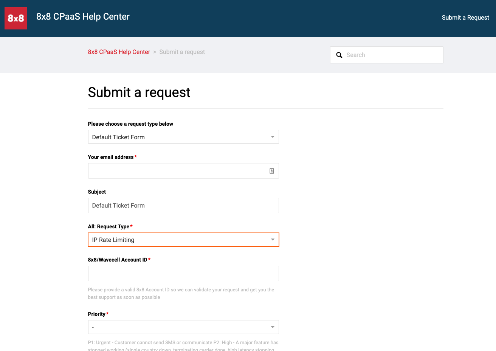

# Security

We know that security is important to customers. We take the responsibility to ensure that the 8x8 Embeddable Communications and APIs platform is absolutely secure, private, and reliable, so customers can have peace of mind: [Security Page on 8x8 Website](https://www.8x8.com/products/apis/security)

## **Built-in security**

8x8 proactively provides application security and authentication to all our users by building security right into our software:

* Two-Factor Authentication (2FA) to the [8x8 Connect](https://connect.8x8.com/) customer portal can be achieved via the Authenticator app or SMS Verification (OTP).
* 8x8 Connect supports single sign-on via SAML.
* [Number Lookup API](/connect/reference/getting-started-with-number-lookup-api): Cleans user database and steps up on anti-fraud measures by checking the validity of phone numbers and their current locations.
* [Mobile Verification API](/connect/reference/page): Generates and authenticates SMS-based or phone call-based mobile verification requests.
* [Number Masking API](/connect/docs/getting-started-with-number-masking): Enables users to connect to a phone call while keeping their phone numbers private.
* [Remove Personally Identifiable Information (PII) API](/connect/reference/delete-pii): Removes PII for particular messages from 8x8 databases.

## **Artificial Inflated Traffic (AIT, SMS Pumping, SMS Flooding)**

### **Overview**

For customers who expose the API endpoints publicly and route traffics to the 8x8 Embeddable Communications and APIs platform, your endpoints might be susceptible to various attacks. As attackers increasingly automate attacks, it’s easy for them to target hundreds, if not thousands of services at once.  

For these reasons, it is important to understand what are the threats and how to stop them.  

In this section, we will discuss the risk of SMS AIT attacks specifically and what are the possible mitigations to protect your business.  

**1.** What is an SMS AIT attack?  

An SMS AIT attack occurs when a high volume of cellular SMS messages are sent to saturate and overload the website’s backend. In your normal business activity, you may allow the user to send a request to an interface that triggers an SMS message to be sent back to the user’s phone number (e.g. verification code for sign-up or sign-in). However, if there is no defense to protect the SMS interface, attackers can leverage programs to send high-frequency requests to these interfaces resulting in the following harms

* Excessive SMS charges caused by malicious traffic.
* User information leaks (bypass 2FA using brute-force against the account).
* Performance degradation for legit users. [SMS API rate limiting](/connect/docs/api-rate-limiting) might be applied in extreme cases.
* Brand reputation damage for harmed SMS recipients.

#### Mitigations

 To protect your business from such attacks, we believe in a shared responsibility model between 8x8 and you as a customer. Please see this [page](recommendations-to-mitigate-sms-fraud-attacks) for more specific recommendations that you can implement.

### **Client IP Rate Limiting**

**1.** Why do we offer rate-limiting by client IP address?  

The purpose of using client IP for rate limiting is to control traffic from the same origin IP that could potentially cause harm to your service. And this is a built-in feature in some APIs offered by the 8x8 platform.  

In your business cases, you may want to implement a simple security defense to block some common automated scripting attacks. You can leverage this feature from us to gain security capability quickly in the most cost-effective way. In the meantime, as your business grows, you can consider scaling your security with more sophisticated protection and commercial security products (like WAF) as your business needs.  

**2.** How to use rate-limiting with client IP  

There are many ways how to apply this measure in your business context. You may want to enforce the rate limit in your service locally after obtaining the actual origin IP of end-users, or you can delegate the rate-limiting to us simply by filling up the `clientIP` field with that IP address. Endpoints that support rate-limiting by clientIp are:

1. [Code generation API](/connect/reference/verify-request-v2)
2. [Send SMS API](/connect/reference/send-sms)
3. [Send SMS batch API](/connect/reference/send-sms-batch)  

To enable IP rate limiting to these endpoints for your service, you will need to do it in 2 steps:  

**Step 1:**  

Submit the request form on the [Help Center](https://support.wavecell.com/hc/en-us/requests/new?ticket_form_id=900000421766) portal. The content should be similar to the following screenshot. The customer support will help you create the IP rate limiting rule specifically to your `SubAccount` and its related endpoint.  



**Step 2:**  

Fill up the `clientIp` field in the request with the origin client IP address and forward the request to 8x8 APIs.


**3.** Risk of IP spoofing vulnerability  

Please be aware that one of the common attacks to circumvent IP rate limiting is IP spoofing. Normally, an attacker sends a large amount of traffic by rotating different proxies to hide its actual origin IP. Hence, to fetch the actual origin client IP, you will need to look up the `X-Forwarded-For` header in the HTTP request if it is tunneled by a proxy. The `X-Forwarded-For` contains a list of IPs that includes proxy IP and actual origin IP addresses with the following format:

```text
X-Forwarded-For: <client>, <proxy1>, <proxy2>

```

**Examples:**

```text
X-Forwarded-For: 2001:db8:85a3:8d3:1319:8a2e:370:7348
X-Forwarded-For: 203.0.113.195
X-Forwarded-For: 203.0.113.195, 70.41.3.18, 150.172.238.178

```

It is important to parses the IP address correctly from this header, instead of always getting the first one from the list (cause it might be replaced to fake IP by a bad actor proxy).  

**Useful Links:**

* [https://developer.mozilla.org/en-US/docs/Web/HTTP/Headers/X-Forwarded-For](https://developer.mozilla.org/en-US/docs/Web/HTTP/Headers/X-Forwarded-For)
* [https://blog.cloudflare.com/multi-user-ip-address-detection/](https://blog.cloudflare.com/multi-user-ip-address-detection/)
* [https://www.f5.com/company/blog/security-rule-zero-a-warning-about-x-forwarded-for](https://www.f5.com/company/blog/security-rule-zero-a-warning-about-x-forwarded-for)
* [https://www.alibabacloud.com/blog/protect-your-website-how-to-avoid-sms-traffic-flooding-attacks_65223](https://www.alibabacloud.com/blog/protect-your-website-how-to-avoid-sms-traffic-flooding-attacks_65223)
* [https://cloud.google.com/architecture/rate-limiting-strategies-techniques](https://cloud.google.com/architecture/rate-limiting-strategies-techniques)
* [https://www.cloudflare.com/learning/bots/what-is-rate-limiting/](https://www.cloudflare.com/learning/bots/what-is-rate-limiting/)
* [https://en.wikipedia.org/wiki/CAPTCHA](https://en.wikipedia.org/wiki/CAPTCHA)
