# Sending SMS using Multi-Channel Sender (MCS)

## Multi-channel Sender

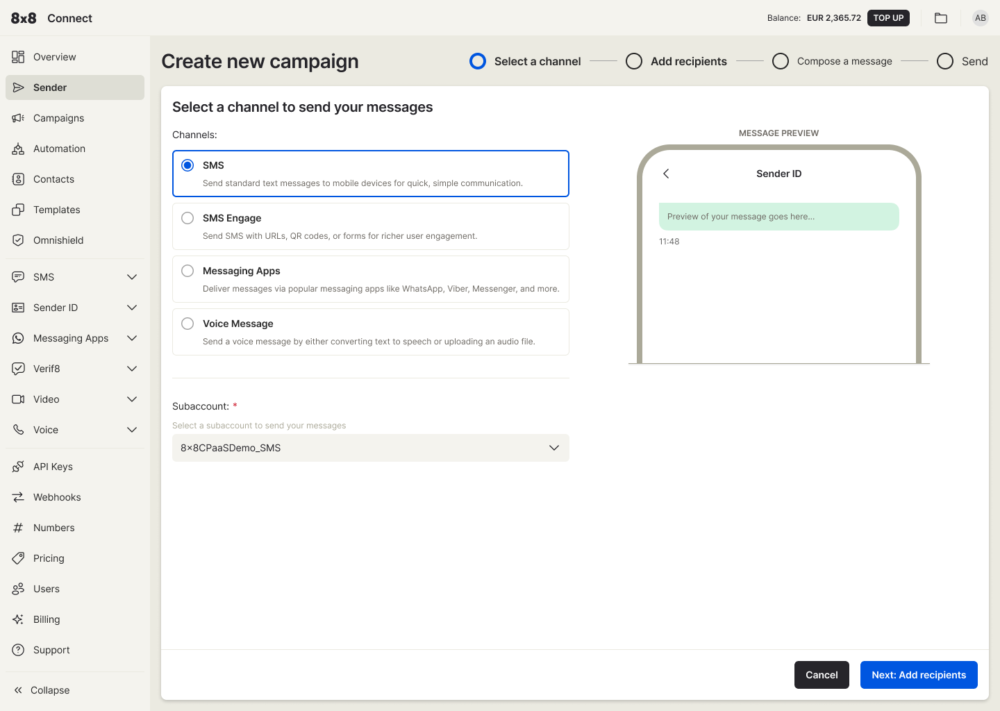The Multi-Channel Sender (MCS) campaign creation feature in Connect

The **Multi-Channel Sender (MCS)**, or just **Sender**, is a powerful campaign creation feature within Connect that lets you send various message types. You can use it to dispatch SMS, SMS Engage, WhatsApp, Viber, and Voice (text-to-speech) messages. 

You'll find it conveniently located in the top left navigation menu, right after "Overview."

## Video Guide

Below is a video guide that covers how to send an SMS message which serves to accompany the content presented on this documentation page.

<iframe
  src="https://www.youtube.com/embed/infb_4pahHo?si=ggHftxI_AM5Fq1N7"
  height="500px"
  width="100%"
  allow="picture-in-picture; web-share"
  allowFullScreen>
</iframe>

## Sending SMS

You can personalise, schedule and send up to a million SMS in one go. 

**Steps on sending SMS**  

*(For this tutorial we will highlight the method for uploading a file since it is the most popular way to send SMS)*

1. **Select "SMS" as your channel and select your subaccount.**  

*(After you sign up, a sub-account is created and pre-selected for you. You may change this if you have different sub-accounts, which can be created by submitting a request to [cpaas-support@8x8.com](mailto:cpaas-support@8x8.com))*

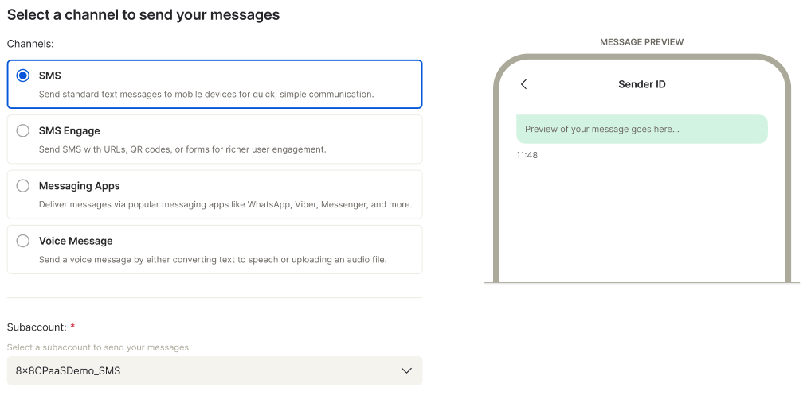
2. **Click "Add recipients and you will be redirected to Recipients page to enter your destination number(s).**  

There are four(4) ways you can do this.  

a. Upload a file  

b. Type a mobile number  

c. Add contacts from your contact list  

d. Add group from your contact groups

3. **You can upload your contact list** by either clicking the "Drag & drop to upload" icon or simply dragging and dropping your file directly. For best results, we recommend using a .csv file formatted according to our default layout (you can find a sample file in this step for reference).

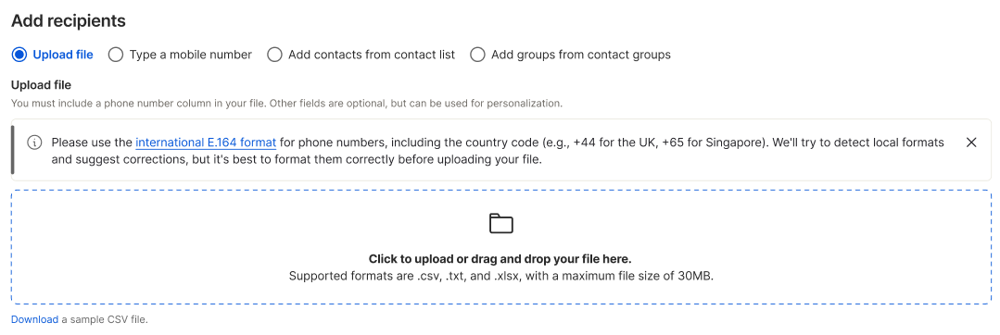
4. **Once you've uploaded your contacts, you can easily adjust the column labels to match your data.**  

You'll find standard options like `Mobile`, `FirstName`, `LastName`, and `ClientmessageId` ready for selection. Need something more specific? Just type in a custom field name and press Enter to create and then select it..

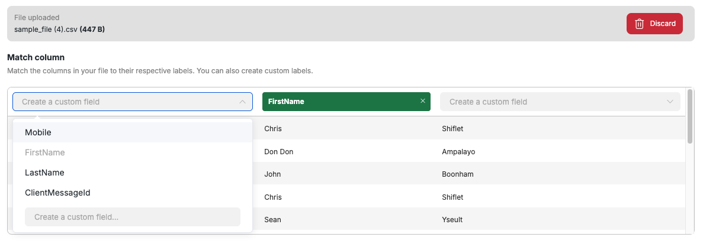
Creating a custom field *(From the screenshot below, the user typed and entered a new field called `Nickname`)* 

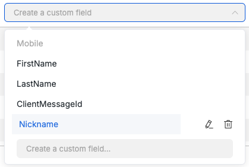
5. **Click "Process contacts" to review your contact list.** On this screen, you can verify all the fields you've selected, check country destinations, and see the total valid numbers, as well as any duplicates. If you want specific contacts to receive the same message multiple times, you can choose to "include duplicates."  

**Handling Mixed Country Codes in Destination Lists**  

If your destination list has phone numbers with different country codes than your current selection for local numbers, a notification will pop up under the Destinations card. You'll get an option to force apply the selected country code to all numbers.

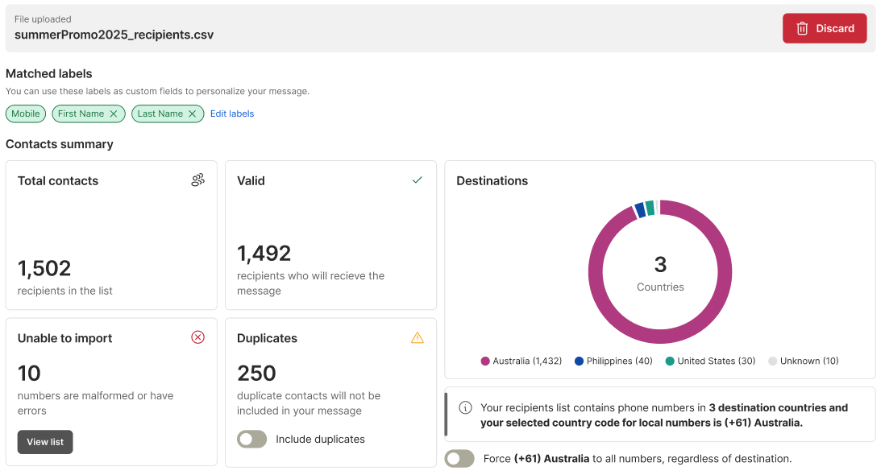
6. **Next, click "Compose a message" to start writing your message.**  

Before crafting your message, always enter your Sender ID. We'll automatically save it for you, so next time, just search and pick it from the dropdown list.

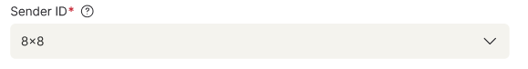

> 📘 **Note:**
> 
> Some countries don't support alphanumeric Sender IDs, and even when they do, pre-registration is often required. We also advise against using single-character spacing in your Sender ID, as this can negatively impact message delivery. The impact of single spacing can vary significantly between operators and countries.
> 
> For any assistance with your Sender IDs, please reach out to our [support team](mailto:cpaas-support@8x8.com).
> 
> 

Compose your message in the text area. To personalize it, simply click on a field from the "**Insert custom field**" list below.

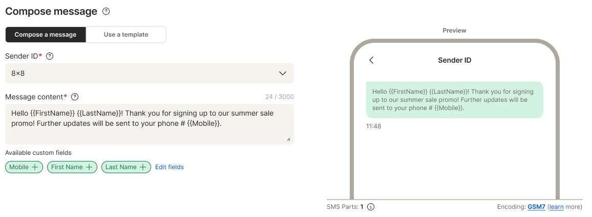
**SMS Character Encoding Warning**  

Our system helps you manage message length and cost when composing SMS. You'll see a warning **if your message contains non-GSM7 characters and uses 2 or more SMS parts**, just to raise awareness of your increased campaign cost.

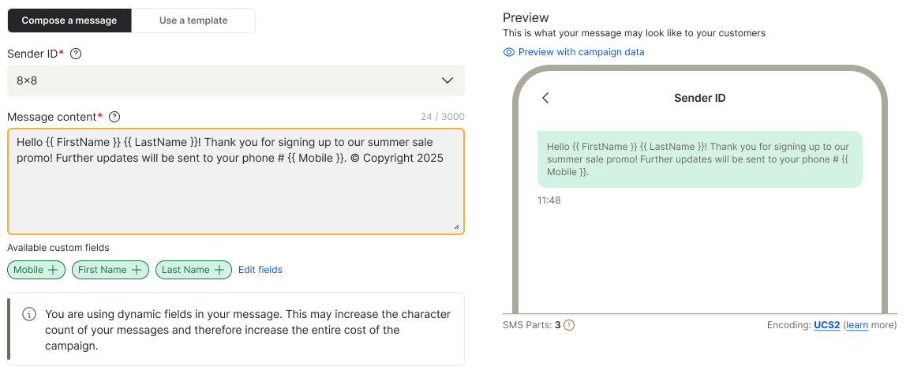
  

**Warning Indicators**  

When these conditions are met, you'll see:

* A warning banner.
* The text area border turns yellow.
* A yellow warning icon appears next to the SMS Parts counter.

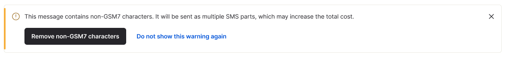
**What You Can Do**  

The warning banner won't stop you from proceeding; the "Next: Confirm and save" button remains active. You have three options:

* **Close (X) button:** Hides the banner. The yellow border and warning icon remain. This isn't saved, so the warning will reappear for future messages under the same conditions.
* **Remove non-GSM7 characters:** Cleans your message by removing non-GSM7 characters. The banner dismisses, the text area border resets, and the warning icon disappears. This isn't saved, so the warning will reappear for future messages under the same conditions.
* **Do not show this warning again:** Hides the banner, resets the text area, and removes the warning icon. This preference is saved in your cookies, so the warning won't appear again for future messages if you're creating messages on the same device.

You can also simply proceed to the next step without interacting with the banner at all.

7. Once your message is ready, click **"Send your message(s)"**. Every message you send, regardless of quantity, is treated as a campaign. A campaign name is generated for you by default, but you're welcome to change it.  

  
  

You'll also need to decide when to send your message: **"Send message now"** is pre-selected for immediate delivery, or you can schedule it for a later time.

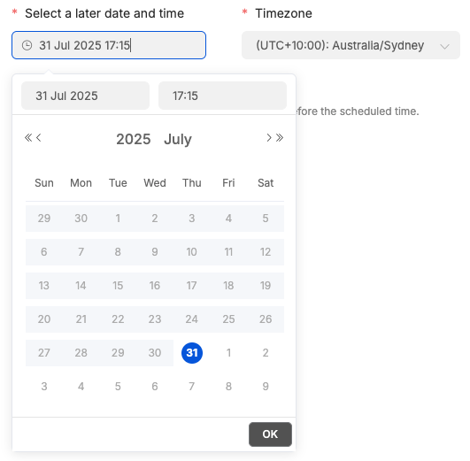

> ❗️ **Scheduled messages**
> 
> *Keep in mind you can only cancel scheduled messages **up to 3 minutes before their send time**. Messages cannot be cancelled if this deadline is missed.*
> 
> 

8. Click "Send" to process and send your message. If you need to re-enter all the fields, simply click "Cancel".
9. After submitting, you'll be redirected to the list of Campaigns where you can see the last campaign created and its status right at the top of the list.

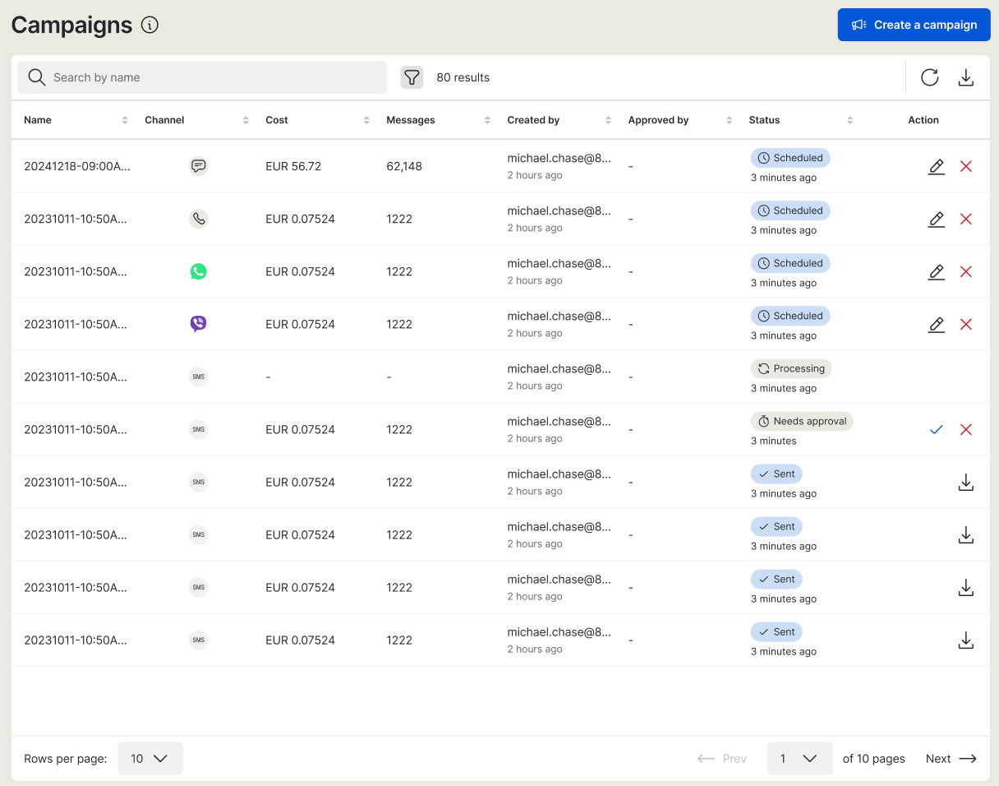

