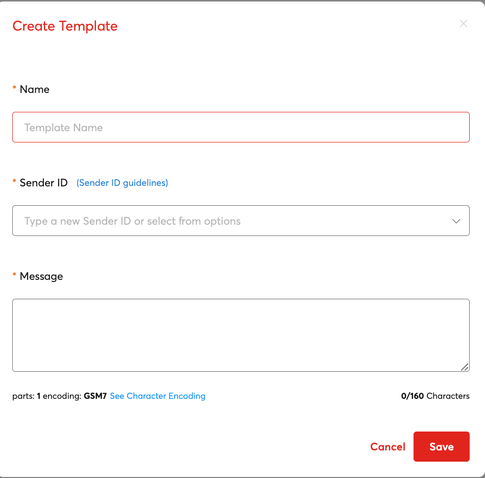
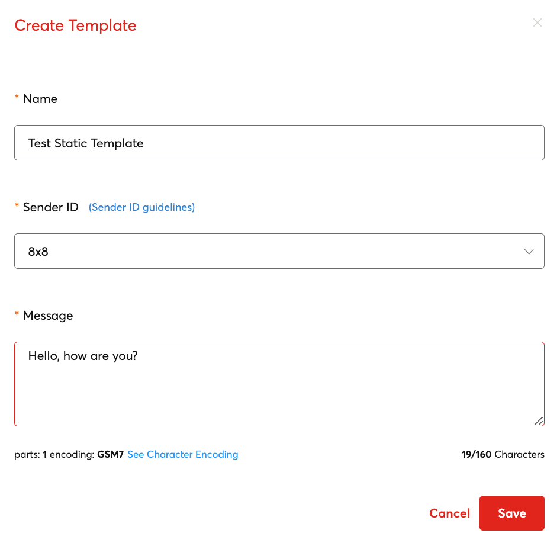
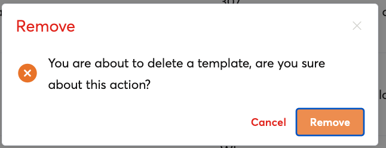
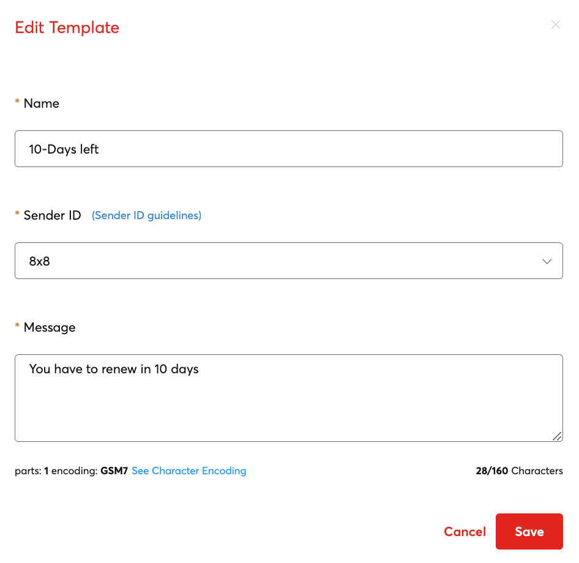

# SMS Template Management

Templates is a feature within 8x8's Platform that will allow you to create message templates for later use, this page specifically covers SMS templates, although there are separate templates for our Messaging Apps functionality.

Templates can have simple pre-filled messages beforehand or complex messages with parameters that can be customized to every message recipient.

## Video Guide

We have created a video guide below to accompany this documentation page which will take you through creating SMS Templates.

<iframe
  src="https://www.youtube.com/embed/BP2TErV3FEk?si=0Be9q1wIC1gp8Wbp"
  height="500px"
  width="100%"
  allow="picture-in-picture; web-share"
  allowFullScreen>
</iframe>

## Creating Templates

To create a template, go to the Templates page of the Connect Dashboard.

Templates is located in the 8x8 Connect Dashboard

Afterwards click **Create new template** which will pop up a dialog box.

**Name:** A template name which you can use to search for and identify the template.

**Sender ID:** Choose an SMS Sender ID to associate the template to.

**Message:** Message Body of the template. This can either be a static message body or a variable message body.

### Message body types

Message body types can either be **static** or **dynamic**.

This is a **static** message type with a fixed message that cannot be modified or changed.

Static Message Body

This is a **dynamic** message type with a parameters *`{{FirstName}}`* and *`{{date}}`* that are designed to be overwritten with actual values when sent through 8x8.

Dynamic Message Body

How these are sent are covered in the Multi-Channel Sender Section.

## Deleting Templates

To delete a template, you can find a template in the list and then click the **Trash** icon, this will bring up a confirmation dialog to delete the template.

## Editing Templates

To edit existing templates, first find your template in the list either by the search functionality or by manually scrolling.

When you have found your template you can click the Pencil Icon to edit and make any changes.

