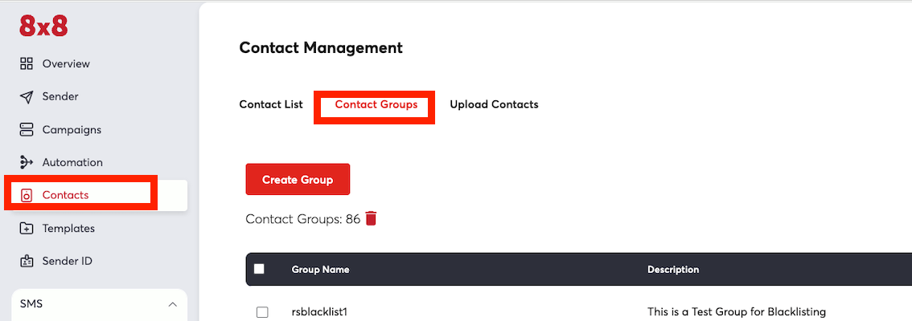
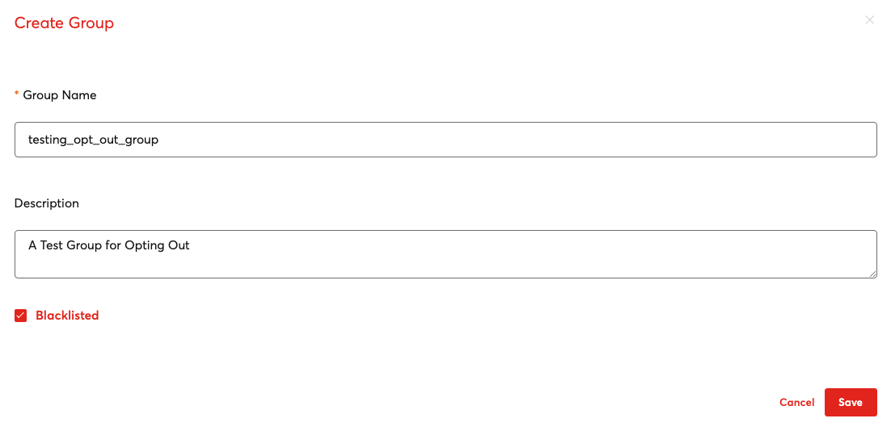
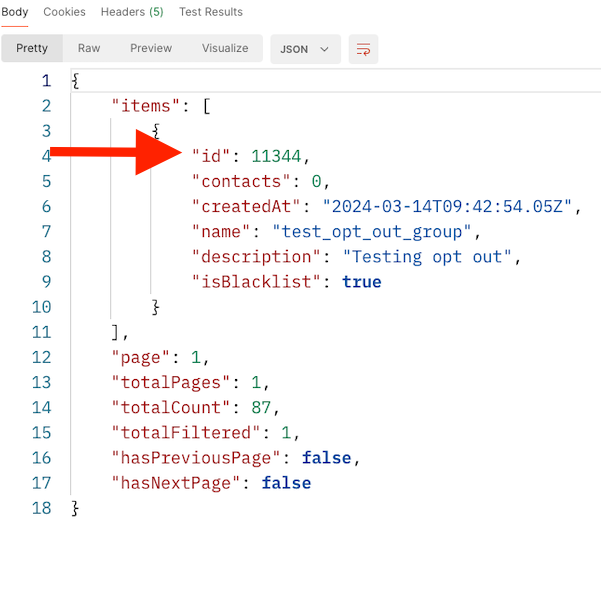
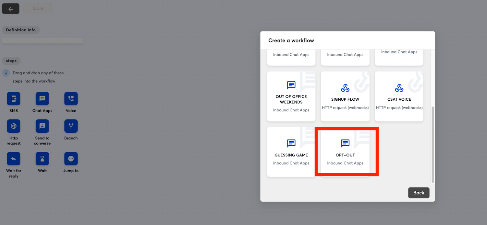
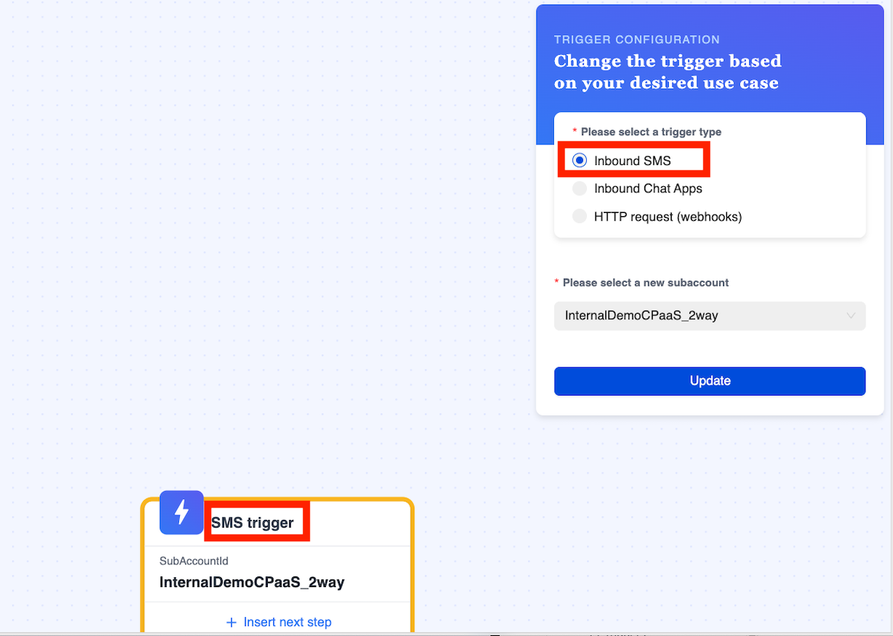
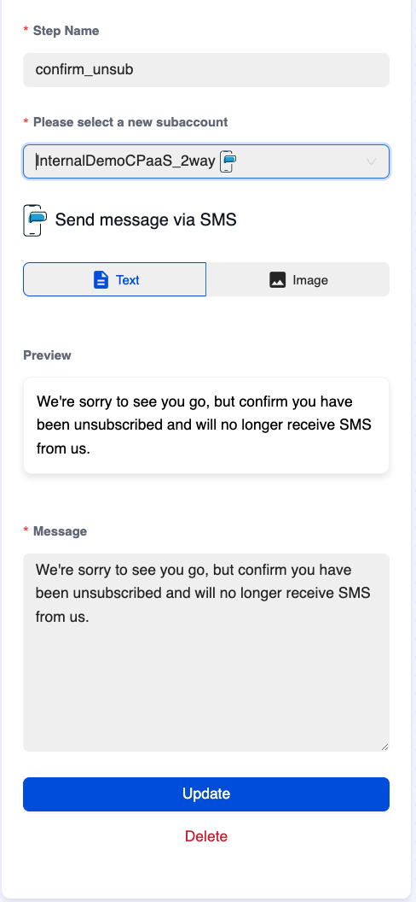
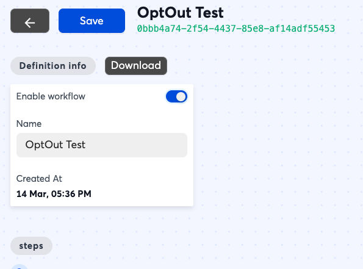
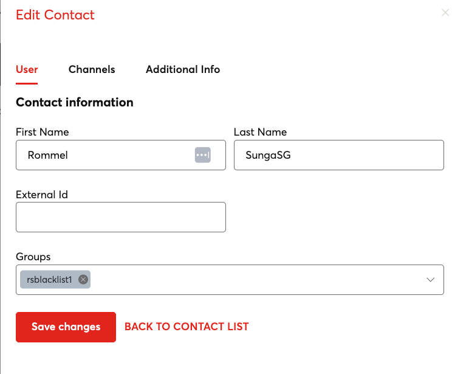

# Tutorial: Opt Out Keyword (SMS)

## Overview

This tutorial will show you how to use Automation Builder to build an opt-out flow for SMS.

## Limitations

## Contacts API operates at the Account-level

The **Contacts API** is designed to function at the **Account-level** and does NOT support operation at the **Subaccount** level. Contacts added to blacklist groups will be blacklisted across the **entire Account, affecting all Subaccounts** hence it is not recommended for use cases where you may need to manage separate opt out lists per subaccount. If you need opt-out management at the Subaccount level, you'll have to handle it separately using a third-party system. Please see [this](tutorial-opt-out-keyword-messaging-apps-whatsapp-for-third-party-system) related tutorial for ideas on how to integrate with third-party systems.

## Contacts API blacklist syncs hourly

The Contacts API's blacklist sync occurs hourly. Consequently, customers added to a blacklist group may continue to receive messages until the sync process updates our system.

## Tutorial Steps

8x8 has already pre-built an Automation Builder template which allows you to add a keyword which will allow customers to opt out of further communications. We will use this template as the basis of the tutorial.

There is setup work we need to do which is covered in the tutorial such as creating the opt-out group via Contacts and obtaining the opt-out group's ID via the Contact API.

## Create Opt-Out Group

Visit the [Contacts](https://connect.8x8.com/messaging/contacts) page in Connect where we will create a new group. Once on this page below, click into "Contact Groups" and hit the red **Create Group** button.



We should be seeing the screen below, you can fill in any values for the Group Name and Description, but ensure that "Blacklisted" is checked since this controls whether the user is sent messages after being added to the group.



## Get Opt Out group ID

Once the group is created, we will need to find the Group ID. The Group ID can be obtained via the Contacts API. You can use the group name to search for it. Please see the [documentation](/connect/reference/search-groups) for the "Search for Groups" endpoint for further information.

The URL for the request should be similar to this format with account name and full or partial group name substituted with your values.

```
https://contacts.8x8.com/api/v1/accounts/<Account Name>/groups?name=<full or partial group name>
```




The response body will contain a JSON object, the first item in the array should contain your new group, note down the id which in this case is 11344 but may be different. Note down what your group id is for subsequent steps.

## Pre-Built Template

First go to the Automation Builder page and select the blue button for "Create Custom Workflow"


## Opt-Out Template

From the pop up in the next page, select "Opt-Out"



## Building the Workflow

In the next page the workflow should be pre-populated with steps, click on the "Trigger" step which is the first step in the flow. Select the subaccount which has the Messaging Apps (Previously known as Chat Apps) number or account that you wish to associate with this opt-out flow. Once it is selected click "Update" to save it to the step.



## Deciding the Keyword

The keyword is controlled by the "Branch" Step in red, you can modify this if you wish to change the condition to trigger the opt out.


>
> 📘 Note: The default workflow will try to detect the presence of "STOP" in every message and it is case sensitive.
>

Once the keyword for opt-out is decided the next step will show the HTTP Request to add a Contact to the blacklisted contact group.

## Add Contact to Contact Group

Once that is done, you can move on to modifying the HTTP Request itself.


The values should mostly be in place, however you will need to replace the request body with the version below which has the Group ID that you saved earlier substituted.

| Field | Value |
| --- | --- |
| Step Name | Any Value |
| URL | POST [https://contacts.8x8.com/api/v1/accounts/contacts](https://contacts.8x8.com/api/v1/accounts/contacts) |
| Header - Content Type | application/json |
| Header - Authorisation | Bearer  |
| Request Body | {<br>"groups": [<br>{<br>"id": <br>}<br>],<br>"addresses": {<br>"msisdn": "{{data.payload.recipient.channelId}}"<br>}<br>} |

Note as usual your API key can be obtained from the API Keys [section](https://connect.8x8.com/messaging/api-keys) of the Connect Dashboard.

## Opt Out Message

For Opt Out Messaging, the default message only mentions SMS, however the contact blacklist works across SMS and Messaging Apps (formerly Chat Apps) so you can replace the message with the channels that you use to communicate with the customer.



After saving these changes, the opt out flow can be enabled by enabling the button at the top left and saving. It will activate immediately and any message that contains the keyword will result in a user being added to the opt-out group.



## Testing

Once the automation workflow is in place, you can test it by sending the opt-out keyword via SMS to the phone number attached to your subaccount.

## Removing from Group

In order to remove a customer from a blacklist, you can either manually remove them by visiting the Contact Groups [page](https://connect.8x8.com/messaging/contacts) by visiting their contact details and change their groups.



Another option is you can use the [API to remove a contact ](/connect/reference/delete-contacts-from-group) from a group.

In either case after removing the contact from the Opt-Out group, you can shortly begin sending messages to them again.
