# Usage samples

> ❗️ **Customer Service Window**
>
> WhatsApp only allows freeform text messages to be sent once a [customer service window](https://developers.facebook.com/docs/whatsapp/pricing/#customer-service-windows) has started. A customer service window starts when a user initiates a conversation or when a user replies to a pre-approved template sent by the business.  
>
> This customer service window lasts 24 hours, and lasts 72 hours if the customer service window is initiated via a [click-to-whatsapp ad](https://business.whatsapp.com/products/ads-that-click-to-whatsapp).  
>
> Outside of the customer service window, only pre-approved WhatsApp templates can be sent to users.
>
>

> 👍 **Please see [Messaging API](/connect/reference/send-message) for the full API reference.**
>
>

## Freeform messages

### Text message

If you want to **send a text message**, your request will look like this:

```json
{
    "user": {
        "msisdn": "+65000000"
    },
    "type": "text",
    "content": {
        "text": "Thank you for your recent purchase from TechStore! If you have any questions or need support, reply 'HELP' to connect with our support team."
    }
}

```

The user will receive this corresponding message:


---

### Text message with an image

If you want to send an image with an optional `text`, your request will look like this:

```json
{
    "user": {
        "msisdn": "+6500000000"
    },
    "content": {
        "url": "https://www.example.com/image.jpg",
        "text": "Welcome to the world of 8x8 ChatApps APIs!\nCommunications for the customer obsessed."
    },
    "type": "Image"
}

```

The user will receive this corresponding message with the corresponding image from the URL that you specify.


---

## Template Messages

### Template message with text only

Depending on the use case and content, your template submitted can be categorised as a Marketing or Utility template.

This template has a single parameter where you can specify the actual OTP code in your API call.

```json
{
    "user": {
        "msisdn": "+65000000"
    },
    "type": "template",
    "content": {
    "template": {
      "language": "en_GB",
      "name": "<Template Name>",
      "components": [
        {
          "type": "body",
          "parameters": [
            {
              "type": "text",
              "text": "#523534"
            }
          ]
        }
      ]  
    }
  }
}

```

The user will receive this corresponding message:


---

### Authentication template message

```json
 {
            "user": {
                "msisdn": "+65000000"
            },
            "content": {
                "template": {
                    "name": "<insertTemplateName>",
                    "language": "en",
                    "components": [
                        {
                            "type": "body",
                            "parameters": [
                                {
                                    "type": "text",
                                    "text": "12345"
                                }
                            ]
                        },
                        {
                            "type": "Button",
                            "subType": 1,
                            "index": 0,
                            "parameters": [
                                {
                                    "type": "text",
                                    "text": "12345"
                                }
                            ]
                        }
                    ]
                }
            },
            "type": "template"
        }

```

This will result in the following message being sent with the appropriate verification code filled in as a parameter from your API call.

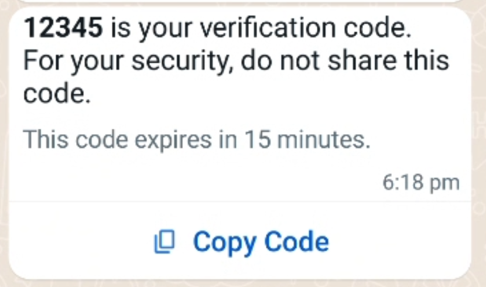

In addition, you can also specify a fallback to SMS option which will automatically deliver the message to the user via SMS, if the message cannot be delivered via WhatsApp (such as if the user does not have WhatsApp). It is possible to specify a different body message to fit within the character limit of the SMS message. Please see the section below for details on SMS fallback.

---

### Template message with image

This template has 1 image header and a predefined text body.

```json
{
    "user": {
        "msisdn": "+650000000"
    },
    "type": "template",
    "content": {
        "template": {
            "language": "en",
            "name": "<insertTemplateName>",
            "components": [
                {
                    "type": "header",
                    "parameters": [
                        {
                            "type": "image",
                            "url": "www.example.com/image.jpg"
                        }
                    ]
                }
            ]
        }
    }
}

```

The user will receive this corresponding message. Note the text is decided in the template itself and you can have dynamic parameters in the text. The image URL itself is already dynamic.

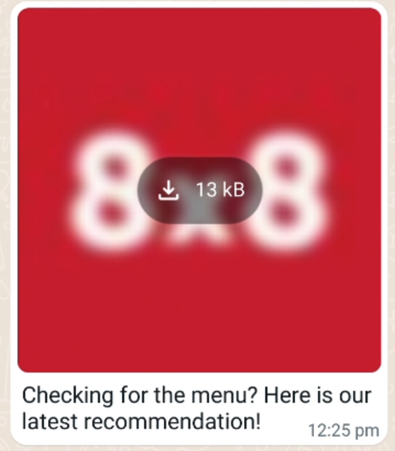

---

### Template message with Document

This template message allows you to send a document. In this example below we use a **PDF** although any valid [MIME-type document](https://developer.mozilla.org/en-US/docs/Web/HTTP/Basics_of_HTTP/MIME_types/Common_types) should be supported.

```json
{
    "user": {
        "msisdn": "+6500000000"
    },
    "type": "template",
    "content": {
    "template": {
      "language": "en",
      "name": "<insertTemplateName>",
      "components": [
        {
          "type": "header",
          "parameters": [
            {
              "type": "document",
              "url": "https://example.com/links/TestPDFfile.pdf"
            }
          ]
        }
      ]  
    }
  }
}

```

The user will receive this corresponding message with a download link to the PDF document.

> 📘 **Note**
>
> The text and buttons are part of the original template and are NOT defined in the request body above. They are optional and you can omit them from the template.
>
>

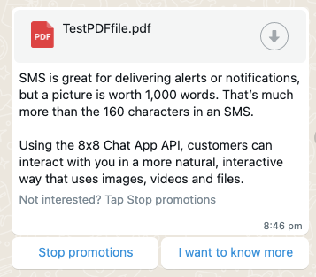

---

### Template message with Location

This template is a location template and it allows you to specify a set of coordinates as well as a name for a location that will be sent to the recipient.

```json
{
    "user": {
        "msisdn": "+65000000"
    },
    "type": "template",
    "content": {
        "template": {
            "language": "en",
            "name": "<Insert Template Name>",
            "components": [
                {
                    "type": "header",
                    "parameters": [
                        {
                            "type": "location",
                            "location": {
                                "latitude": "38.8693",
                                "longitude": "-77.0536",
                                "name": "Metro Station",
                                "address": "1 Connector Drive"
                            }
                        }
                    ]
                }
            ]
        }
    }
}

```

The user will receive this corresponding message with a pin to indicate the user location which can open up a navigation app on their phone (such as Google Maps).

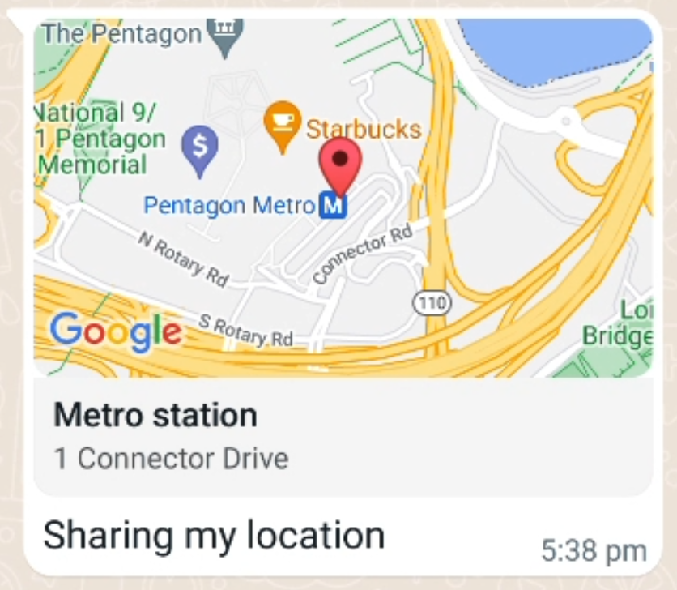

---

### Template message with a dynamic call-to-action (CTA) button

Below is an example of a Dynamic CTA Button Message with 2 CTA buttons. Please note the number of buttons may change depending on the template you use.

```json
{
    "user": {
        "msisdn": "+65000000"
    },
    "content": {
        "template": {
            "name": "<Template Name>",
            "language": "en_US",
            "components": [
                {
                    "type": "body",
                    "parameters": [
                        {
                            "type": "text",
                            "text": "12345"
                        }
                    ]
                },
                {
                    "type": "header",
                    "parameters": [
                        {
                            "type": "image",
                            "url": "https://fastly.picsum.photos/id/173/200/300.jpg?hmac=9Ed5HxHOL3tFCOiW6UHx6a3hVksxDWc7L7p_WzN9N9Q"
                        }
                    ]
                },
                {
                    "type": "button",
                    "index": 0,
                    "subType": "url",
                    "parameters": [
                        {
                            "type": "text",
                            "text": "samplecta"
                        }
                    ]
                }
            ]
        }
    },
    "type": "template"
}

```

The corresponding message will appear as below where the text parameters specified above will be passed to the **"Check Out"** and **"Call Us"** Buttons

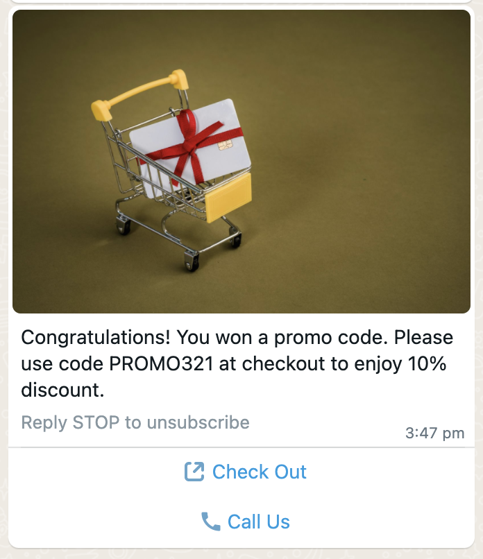

---

### Template message with Coupon Code

Below is an example of a Coupon Code Template Message with 1 copy code button. You can use copy code button in conjunction to other marketing related templates, for example CTA button and Coupon Code button.

```json
{
    "user": {
        "msisdn": "+65000000"
    },
    "type": "template",
    "content": {
        "template": {
            "language": "en_US",
            "name": "<Template_name>",
            "components": [
                {
                    "type": "button",
                    "index": "0",
                    "subType": "copyCode",
                    "parameters": [
                        {
                            "type": "couponCode",
                            "couponCode": "25OFF"
                        }
                    ]
                }
            ]
        }
    }
}

```

---

## Interactive messages

### Interactive message with reply buttons

These types of messages do not require to be submitted for template approval, similar to freeform messages. They can be sent in an ongoing conversation via our [Automation Builder](/connect/docs/automation-builder) or any third-party workflow/chatbot builder.

This message type can support **up to 3 reply buttons**:

```json
{
    "user": {
        "msisdn": "+65000000"
    },
    "type": "interactive",
    "content": {
        "interactive": {
            "action": {
                "buttons": [
                    {
                        "type": "reply",
                        "reply": {
                            "title": "contact-us",
                            "id": "option-1"
                        }
                    },
                    {
                        "type": "reply",
                        "reply": {
                            "title": "faq",
                            "id": "option-2"
                        }
                    },
                    {
                        "type": "reply",
                        "reply": {
                            "title": "office",
                            "id": "option-3"
                        }
                    }
                ]
            },
            "body": {
                "text": "Welcome to 8x8 Inc. How may we help?"
            },
            "footer": {
                "text": "This is an official message from 8x8."
            },
            "header": {
                "type": "text",
                "text": "8x8 Inc."
            },
            "type": "button"
        }
    }
}

```

The user will receive this corresponding message.


If the user clicks on each button, it will send the corresponding reply.


---

### Interactive message with a list of menu options

```json
{
  "user": {
    "msisdn": "+65000000"
  },
  "type": "interactive",
  "content": {
    "interactive": {
      "action": {
        "button": "Book Slot",
        "sections": [
          {
            "rows": [
              {
                "id": "slot-1",
                "title": "Monday, Oct 9",
                "description": "9:00 AM - 10:00 AM"
              },
              {
                "id": "slot-2",
                "title": "Monday, Oct 9",
                "description": "11:00 AM - 12:00 PM"
              }
            ],
            "title": "Oct 9, 2024"
          },
          {
            "rows": [
              {
                "id": "slot-3",
                "title": "Tuesday, Oct 10",
                "description": "2:00 PM - 3:00 PM"
              },
              {
                "id": "slot-4",
                "title": "Tuesday, Oct 10",
                "description": "4:00 PM - 5:00 PM"
              }
            ],
            "title": "Oct 10, 2024"
          }
        ]
      },
      "body": {
        "text": "Looking for personalized assistance? Our Customer Success team has the following slots available. Tap to select a time."
      },
      "footer": {
        "text": "For urgent inquiries, email user@example.com"
      },
      "header": {
        "type": "text",
        "text": "Customer Success personalized sessions"
      },
      "type": "list"
    }
  }
}

```

This will send the corresponding message.

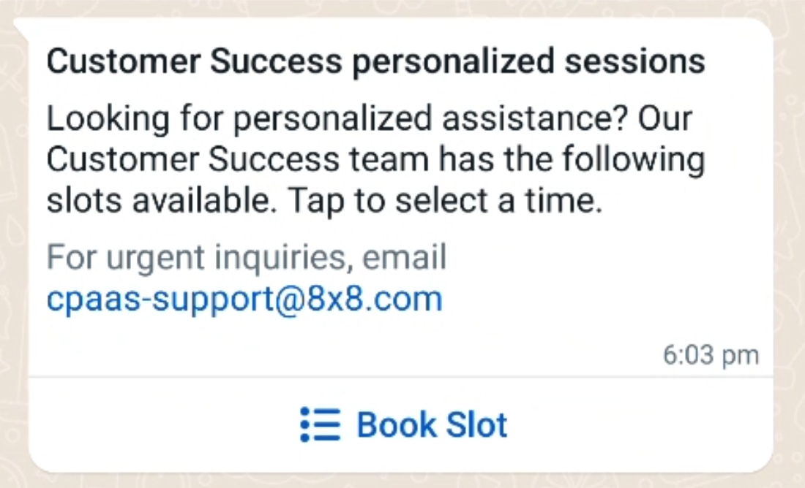
If the customer selects the "Book Slot" option then they will be presented with the options for

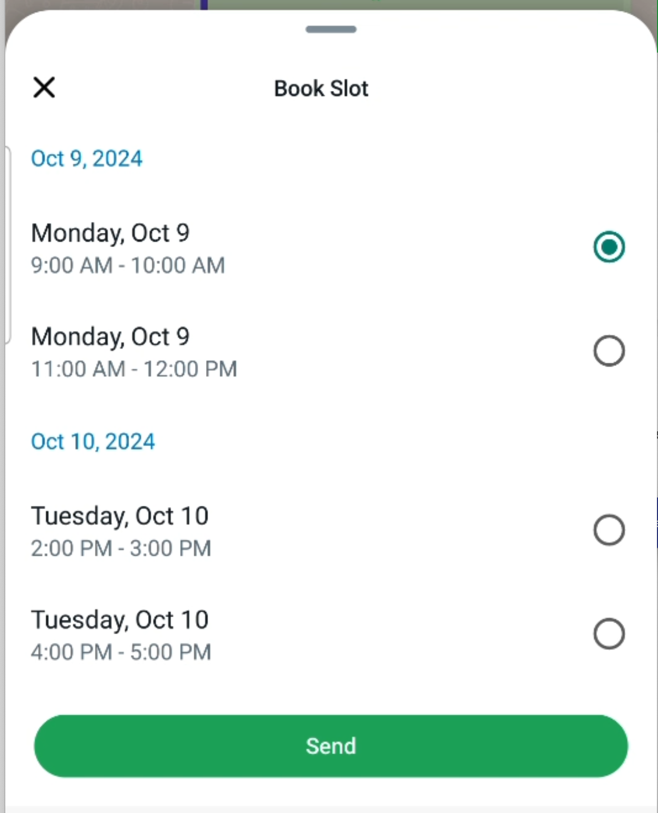
After clicking "Send" then the user will send the corresponding reply.

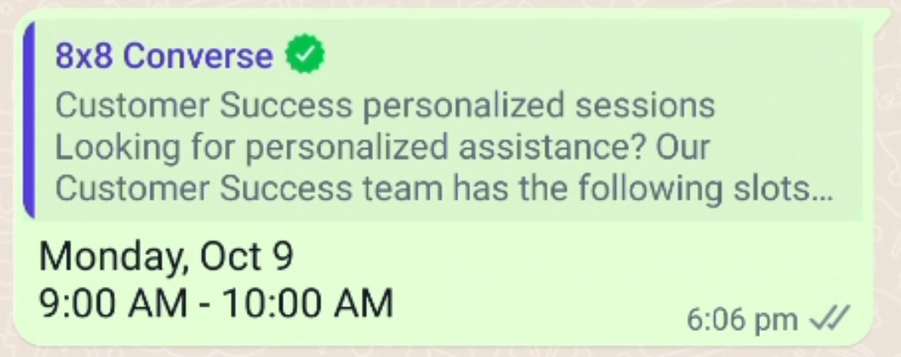

---

## WhatsApp Commerce

> 👍 **Pre-requisite: You should have a catalog [created](https://www.facebook.com/business/help/1275400645914358?id=725943027795860) and [connected](https://www.facebook.com/business/help/158662536425974) to your WhatsApp Business Account (WABA)**
>
>

### Interactive message with a single product item from a business catalog

This type of message will feature a single item from a business catalog, it will pull information from the catalog to generate the message.

> ❗️ **Customer Service Window**
>
> WhatsApp only allows catalog messages to be sent once a [customer service window](https://developers.facebook.com/docs/whatsapp/pricing/#customer-service-windows) has started. A customer service window starts when a user initiates a conversation or when a user replies to a pre-approved template sent by the business.  
>
> This customer service window lasts 24 hours, and lasts 72 hours if the customer service window is initiated via a [click-to-whatsapp ad](https://business.whatsapp.com/products/ads-that-click-to-whatsapp).  
>
> Outside of the customer service window, only pre-approved WhatsApp templates can be sent to users.
>
>

```json
{
    "user": {
        "msisdn": "+65000000"
    },
    "type": "interactive",
    "content": {
        "interactive": {
            "action": {
                "catalog_id": "<YourCatalogId>",
                "product_retailer_id": "<YourProductRetailerId>"
            },
            "body": {
                "text": "8x8 Shirt"
            },
            "footer": {
                "text": "Experience the power of communication with this 8x8 Shirt!"
            },
            "type": "product"
        }
    }
}

```

> 📘 **Business Catalog Values**
>
> The value for  which is your **Catalog ID** and  which is your **Business ID** can be found from your Catalog in the Meta Commerce Manager.
>
>

Here is what the corresponding message will look like to the customer receiving the message:

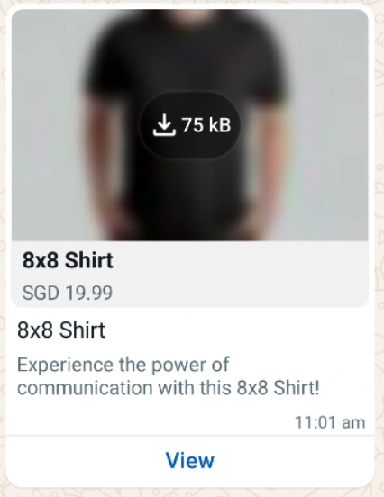

#### Customer Flow

Once the customer clicks **View**, they will be taken to a page containing the following information pulled from the business catalog.

* Item Description
* Item Price
* Item URL (as provided in the catalog)

There is also an option to message the business for any questions or clarifications.


Additionally, the customer can choose to **Add to Cart**, which will add the item to a shopping cart.

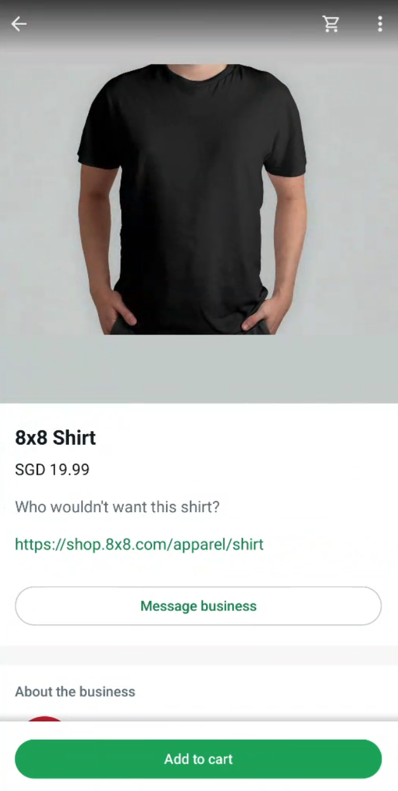

Once the item is added you can view the cart which will take you to the **Place order** screen.

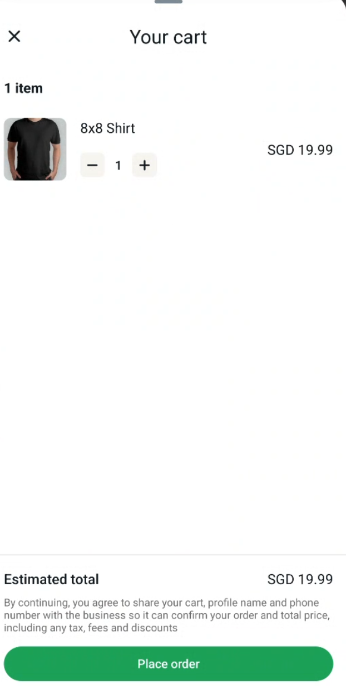

Selecting **Place Order** will send a message to the business with the cart items, so that the business can process the order.

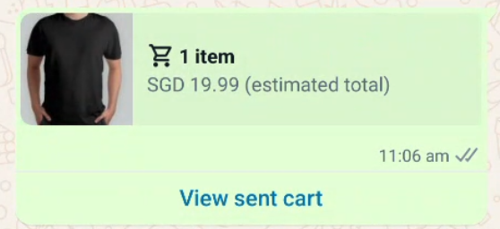
  
At this point, WhatsApp leaves it to the business to define the next steps for this order, such as requesting address information for delivery or collecting payment information. It is possible for example to use webhooks or Automation Builder to listen for a cart message for a customer and then reply accordingly.

Finally, the **View sent cart** option will allow the customer to confirm what items were purchased in the order.

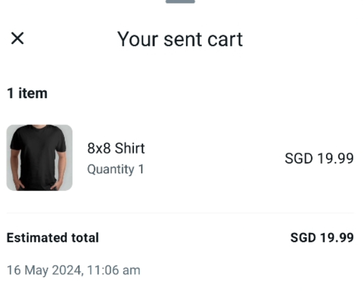
  
---

### Interactive message with a list of product items from a business catalog

This option can send multiple product items from a business catalog to a customer. This may be useful if there is a collection of items (ex. pants, shirts, hats) that the business is looking to send to a customer.

> ❗️ **Customer Service Window**
>
> WhatsaApp only allows catalog messages to be sent once a [customer service window](https://developers.facebook.com/docs/whatsapp/pricing/#customer-service-windows) has started. A customer service window starts when a user initiates a conversation or when a user replies to a pre-approved template sent by the business.  
>
> This customer service window lasts 24 hours, and lasts 72 hours if the customer service window is initiated via a [click-to-whatsapp ad](https://business.whatsapp.com/products/ads-that-click-to-whatsapp).  
>
> Outside of the customer service window, only pre-approved WhatsApp templates can be sent to users.
>
>

```json
{
    "user": {
        "msisdn": "+65000000"
    },
    "type": "interactive",
    "content": {
        "interactive": {
            "action": {
                "catalog_id": "<YourCatalogId>",
                "product_retailer_id": "<YourProductRetailerId>",
                "sections": [
                    {
                        "product_items": [
                            {
                                "product_retailer_id": "<id>"
                            },
                            {
                                "product_retailer_id": "<id>"
                            }
                        ],
                        "title": "Section title"
                    }
                ]
            },
            "body": {
                "text": "8x8 Limited Edition Items"
            },
            "footer": {
                "text": "This collection contains only the finest from 8x8.  "
            },
            "header": {
                "type": "text",
                "text": "8x8 Collection"
            },
            "type": "product_list"
        }
    }
}

```

> 📘 **Business Catalog Values**
>
> The value for  which is your **Catalog ID** and  which is your **Business ID** can be found from your Catalog in the Meta Commerce Manager. The second set of 's can be found from each individual item in the catalog as their **Content ID**.
>
>

Here is what the corresponding catalog message will look like.

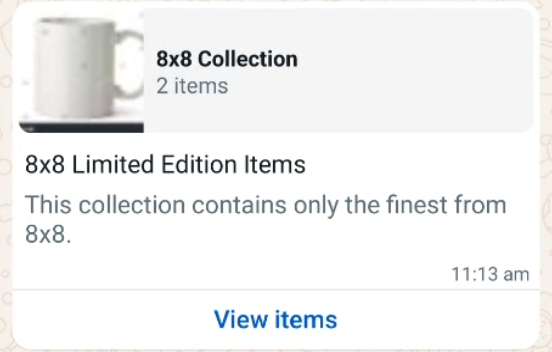

#### Customer Flow

After the customer clicks on **View Items**, it will appear as follows:

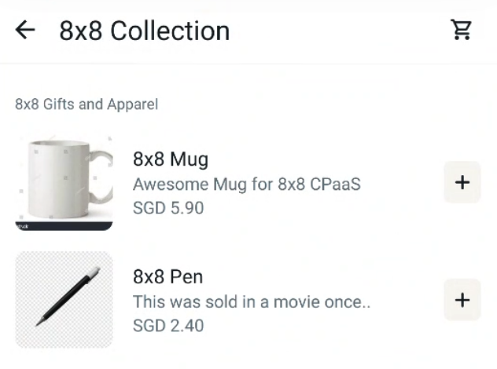
  
The customer can click on an individual item to bring up the single-item page


After selecting **Add to Cart**, the catalog message will now reflect items added to the cart and their amounts.

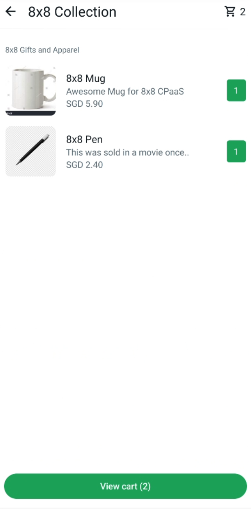

**View Cart** will give the option of seeing the items in the cart and then allowing the customer to **Place Order**.


After the customer selects **Place order**, this will send a message to the business containing information about the cart.

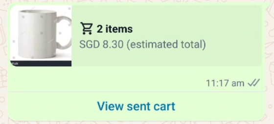

At this point, WhatsApp leaves it to the business to define the next steps for this order, such as requesting address information for delivery or collecting payment information. It is possible for example to use webhooks or Automation Builder to listen for a cart message for a customer and then reply accordingly.

**View sent cart** would let the customer confirm the items sent in the cart.

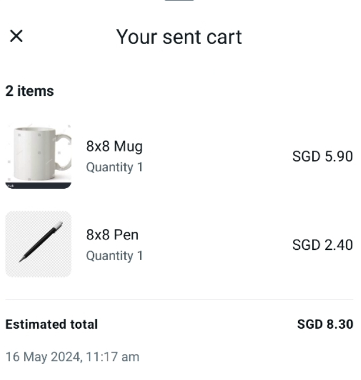
  
## Optional: Adding SMS Fallback

If you want to add a fallback to SMS, add the following fields to the "`content`" object in your existing JSON payload. The **fallbackText** will be used instead of the WhatsApp Template Body.

```json
{
  "fallbackText": "This is the text that will be sent in the SMS instead of the WhatsApp Template.",
  "sms": {
    "encoding": "AUTO",
    "source": "<senderId>"
  }
}

```

> 📘 **Note**
>
> You may find out more about SenderID [here](/connect/docs/getting-started#1-source-sms-senderid)
>
>

## Send Message in Batch

Besides using the Messaging Apps API to send messages individually, you can also send multiple messages with a [single API call](/connect/reference/send-message-many) by defining a **messages** array as in the examples below.

### Batch WhatsApp template message with Documents

Below is an example of a batch of messages that are using a WhatsApp Template to send documents to different users.

```json
{
    "includeMessagesInResponse": true,
    "messages": [
        {
            "user": {
                "msisdn": "+6511111111"
            },
            "type": "template",
            "content": {
                "template": {
                    "language": "en",
                    "name": "<insertTemplateName>",
                    "components": [
                        {
                            "type": "header",
                            "parameters": [
                                {
                                    "type": "document",
                                    "url": "https://example.com/links/TestPDFfile.pdf"
                                }
                            ]
                        }
                    ]
                }
            }
        },
        {
            "user": {
                "msisdn": "+6522222222"
            },
            "type": "template",
            "content": {
                "template": {
                    "language": "en",
                    "name": "<insertTemplateName>",
                    "components": [
                        {
                            "type": "header",
                            "parameters": [
                                {
                                    "type": "document",
                                    "url": "https://example.com/links/TestJSFile.js"
                                }
                            ]
                        }
                    ]
                }
            }
        }
    ]
}

```

> 📘 **Different Files / Messages**
>
> Note that we are sending two different whatsapp messages with different files attached. These messages are being sent to two different recipients.
>
>

The first recipient (**+6511111111**) will see this message as a PDF file was defined in their message object.

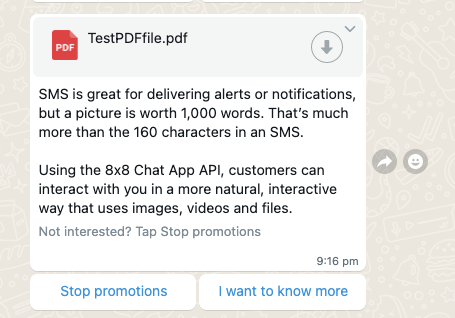

The second recipient (**+6522222222**) will see a different message as a different file was defined in their message object.

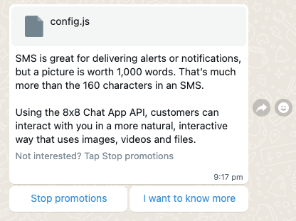

This example shows the flexibility of the messages array in that you can customize the message that you send for each recipient.
