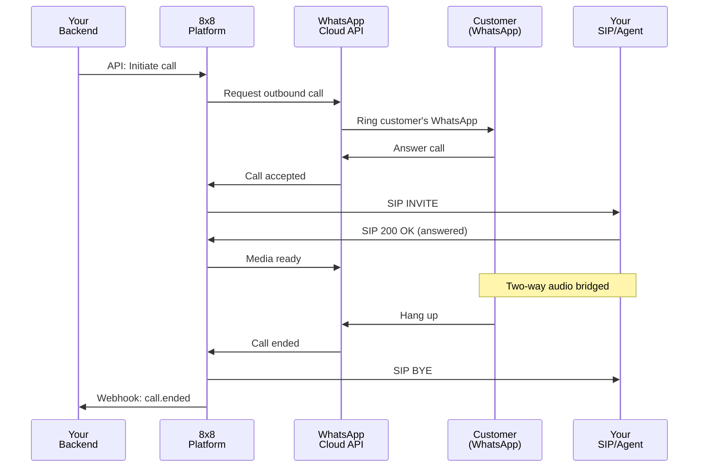

## What is Business-initiated Calling?

Business-initiated calling allows your business to initiate voice calls to customers via WhatsApp. Unlike user-initiated calls where the customer starts the conversation, business-initiated calls are outbound from your perspective – you're calling the customer through their WhatsApp app.

**Important:** Meta's WhatsApp policies require that customers **explicitly grant permission** before your business can call them. This protects customers from unwanted calls and ensures compliance with WhatsApp's platform rules.

## Opt-in Requirement

### Meta's Call Permission Policy

Before you can call a customer via WhatsApp, they must:

1. **Receive a permission request** via WhatsApp template message
2. **Tap "Allow"** to grant calling permission
3. **Have an active permission window** (permissions can expire)

This is different from messaging, where customers opt in by messaging you first. For calling, you must explicitly request permission even if you already have a messaging conversation.

### Permission Validity

**IMPORTANT:** Call permissions are time-limited and must be carefully managed.

Call permissions are valid for:

- **24-hour window** from the moment the customer grants permission (not from when you request it)
- Permissions can be **revoked** by the customer at any time through WhatsApp settings
- You must **request permission again** after the 24-hour period expires
- **One permission = one call opportunity** - don't assume you can make multiple calls on the same permission

**Best practice:** Request permission immediately before you intend to call (within minutes), not hours or days in advance. This ensures:
- Permission hasn't expired when you actually call
- Customer expects the call and is more likely to answer
- Better compliance with Meta's policies

### Geographic Availability

**⚠️ Important:** Business-initiated calling has significant geographic restrictions set by Meta.

**Business-initiated calls (BIC) are NOT available in:**
- 🇺🇸 United States
- 🇨🇦 Canada
- 🇹🇷 Turkey
- 🇪🇬 Egypt
- 🇻🇳 Vietnam
- 🇳🇬 Nigeria

**All calling features are blocked in sanctioned countries:**
- 🇨🇺 Cuba, 🇮🇷 Iran, 🇰🇵 North Korea, 🇸🇾 Syria
- 🇺🇦 Ukraine (Crimea, Donetsk, Luhansk regions)

**Business phone number requirements:**
- Your business phone number must have a country code from a BIC-supported country
- Customer phone numbers can be from any country where Cloud API is available
- Internet connectivity (WiFi or mobile data) required for all calls

**Important considerations:**
- Voice quality depends on customer's network connection
- Local telecommunications regulations may impose additional restrictions
- Geographic restrictions are subject to change based on Meta's policies

:::warning Critical
If your business operates in or serves customers in USA, Canada, Turkey, Egypt, Vietnam, or Nigeria, you CANNOT use business-initiated calling. Consider [user-initiated calling](/connect/docs/voice/whatsapp-business-calling/user-initiated) instead, which has broader availability.
:::

**To verify current availability:**
- Check Meta's [WhatsApp Cloud API documentation](https://developers.facebook.com/docs/whatsapp/cloud-api/calls) for latest updates
- Consult with your 8x8 account manager for specific regional considerations

## How to Request Call Permission

### Step 1: Create Permission Request Template

In Meta's WhatsApp Business Manager, create a template message specifically for requesting call permission. Templates must be approved by Meta before use.

**Template category:** `UTILITY` or `MARKETING` (depending on use case)

**Template example 1: Generic call permission**

```text
Name: call_permission_request
Category: UTILITY
Language: en_US

Message:
Hello {{1}},

We'd like to call you via WhatsApp to discuss {{2}}. This will be a free call over data/WiFi.

Would you like to allow us to call you?

Buttons:
- [Quick Reply] Allow calls
- [Quick Reply] Not now
```

**Variables:**
- `{{1}}`: Customer's name
- `{{2}}`: Call purpose (e.g., "your recent order", "your support ticket")

**Template example 2: Appointment reminder with callback**

```text
Name: appointment_callback_request
Category: UTILITY
Language: en_US

Message:
Hi {{1}},

Your appointment is scheduled for {{2}} at {{3}}.

Would you like us to call you to confirm the details?

Buttons:
- [Quick Reply] Yes, call me
- [Quick Reply] No, thanks
```

**Variables:**
- `{{1}}`: Customer's name
- `{{2}}`: Date (e.g., "tomorrow", "January 15th")
- `{{3}}`: Time (e.g., "2:00 PM")

**Template example 3: Support callback offer**

```text
Name: support_callback_request
Category: UTILITY
Language: en_US

Message:
Hello {{1}},

We see you have a question about {{2}}. Our support team can call you on WhatsApp to help.

Would you like a callback?

Buttons:
- [Quick Reply] Yes, please call
- [Quick Reply] No, I'll wait for chat
```

**Variables:**
- `{{1}}`: Customer's name
- `{{2}}`: Issue description (e.g., "your recent order", "account setup")

**Template guidelines:**
- Keep messages concise and clear about why you want to call
- Explicitly mention it's a WhatsApp call (free, over data/WiFi)
- Provide context about what the call will cover
- Always include clear "Allow" and "Decline" options
- Use `UTILITY` category for transactional calls (appointments, support)
- Use `MARKETING` category for promotional/sales calls (requires 24-hour messaging window)

### Step 2: Send Permission Request

Use the WhatsApp Business API (Meta Cloud API) to send the template message to your customer. Include the customer's name and the specific purpose of the call in the template parameters.

### Step 3: Handle Customer Response

When the customer receives the permission request, they'll see your message with buttons to grant or decline permission:


When the customer responds to the permission request, you'll receive a webhook from Meta's Cloud API. The webhook will indicate whether the customer:
- **Granted permission** - They tapped "Allow calls"
- **Declined permission** - They tapped "Not now" or ignored the request

Store the permission status in your system with a timestamp and expiry time (typically 24 hours from when granted).

## How It Works

### Step-by-Step Call Flow

1. **Send permission request template**
   - Your system sends WhatsApp template via Meta's API
   - Template asks customer for call permission

2. **Customer grants permission**
   - Customer taps "Allow" button in WhatsApp
   - Meta sends webhook to your system with permission confirmation

3. **Your system triggers outbound call**
   - Your backend makes API request to 8x8
   - Request includes customer's WhatsApp number and call parameters

4. **8x8 signals Meta Cloud API**
   - 8x8 initiates the call through Meta's Cloud API
   - Meta validates that customer has granted permission

5. **Customer's WhatsApp rings**
   - Customer sees incoming call with your branded business name
   - Call uses VoIP (data/WiFi), not cellular network

6. **Customer answers**
   - When customer picks up, call is established
   - Media path is created through Meta → 8x8 → Your SIP endpoint

7. **8x8 bridges media to your SIP endpoint**
   - 8x8 initiates SIP call to your configured contact center/PBX
   - Your system routes to agent or IVR
   - Agent/system answers, two-way audio flows

8. **Call proceeds normally**
   - Agent speaks with customer
   - Call is recorded/logged as per your policies
   - Either party can hang up

9. **Call ends**
   - CDRs generated on both 8x8 and your platform
   - Webhooks sent for call completion
   - Analytics updated

### Visual Call Flow



## Use Cases

### 1. Appointment Reminders with Callback

**Scenario:** Medical office wants to confirm appointments

**Flow:**
1. Send permission request 24 hours before appointment
2. Customer grants permission
3. Call customer 1 hour before appointment
4. Automated message confirms appointment
5. Option to speak with receptionist if needed

**Benefits:**
- Reduces no-shows
- Provides personal touch
- Allows for last-minute rescheduling

### 2. Delivery Updates with Live Agent

**Scenario:** Package delivery running late, customer needs update

**Flow:**
1. Detect delayed delivery in system
2. Send permission request to customer
3. Customer grants permission
4. Call customer to explain delay
5. Agent provides ETA and resolution

**Benefits:**
- Proactive communication
- Reduces support ticket volume
- Improves customer satisfaction

### 3. Sales Follow-ups

**Scenario:** Customer inquired about product, needs follow-up

**Flow:**
1. Customer chats with sales bot on WhatsApp
2. Bot requests call permission for detailed discussion
3. Customer grants permission
4. Sales rep calls within 5 minutes
5. Close sale or schedule demo

**Benefits:**
- Faster sales cycle
- Higher conversion rates
- Better lead qualification

### 4. Support Callbacks

**Scenario:** Customer has complex issue, chat isn't sufficient

**Flow:**
1. Customer struggling with chat-based support
2. Agent requests permission to call
3. Customer grants permission
4. Agent calls to screen-share or troubleshoot
5. Issue resolved faster

**Benefits:**
- Improved first-call resolution
- Reduced handling time
- Better customer experience

## Permission Management

### Tracking Opt-ins

Your system should track customer call permissions in a database with the following information:
- Customer phone number
- Permission granted status (yes/no)
- When permission was granted
- When permission expires
- Whether permission was revoked
- Number of permission requests sent
- Last request timestamp

**Key considerations:**
- Limit permission requests to avoid spamming customers (e.g., max 3 requests)
- Store expiry timestamp when permission is granted (typically 24 hours)
- Immediately revoke permission when customer opts out

### Permission Expiry

Implement a scheduled job (run hourly) to automatically expire permissions that have passed their validity period. Mark expired permissions as inactive in your database.

### Permission Revocation

Monitor your WhatsApp webhook for opt-out keywords (e.g., "stop calls", "no calls") and immediately:
- Revoke the customer's call permission
- Add them to a do-not-call list
- Cancel any pending calls
- Send confirmation that they've been removed from the call list

## Best Practices

### 1. Only Call When Customer Expects It

**Good practices:**
- ✅ Request permission immediately before calling (within minutes)
- ✅ State the specific purpose in permission request
- ✅ Call within the time frame you promised
- ✅ Limit to use cases where voice adds value over chat

**Bad practices:**
- ❌ Request permission for "future calls" without specific purpose
- ❌ Call hours or days after permission granted
- ❌ Use permission for different purposes than stated
- ❌ Make multiple calls on same permission

### 2. Respect Opt-out Requests Immediately

When a customer opts out of calls:
- Revoke their permission immediately
- Add them to your do-not-call list
- Cancel any pending calls scheduled for them
- Log the opt-out event for compliance

**Response time:**
- Process opt-out within 1 minute
- Cancel calls scheduled within next hour
- Never call after opt-out (obvious but critical)

### 3. Provide Value in Every Call

**Checklist before calling:**
- [ ] Is the information too complex for a message?
- [ ] Does the customer need immediate assistance?
- [ ] Will a voice conversation save time for both parties?
- [ ] Do you have something actionable to discuss?

**Examples:**

✅ **Good:** "Your package was delayed. Let's reschedule delivery for a time that works for you."

❌ **Bad:** "Just checking if you received our message about..."

✅ **Good:** "You have an appointment in 1 hour. Would you like directions or need to reschedule?"

❌ **Bad:** Generic "How was your experience?" calls

### 4. Track and Optimize

**Metrics to monitor:**

| Metric | Target | Insight |
|--------|--------|---------|
| Permission grant rate | > 60% | How well your request message resonates |
| Call answer rate | > 75% | If customers want to talk after granting permission |
| Call completion rate | > 90% | Technical quality and customer engagement |
| Customer satisfaction | > 4.0/5 | Overall experience with business-initiated calls |
| Opt-out rate | < 5% | If you're respecting customer preferences |

**A/B testing ideas:**
- Different permission request templates
- Timing between permission grant and call
- Agent introduction scripts
- Call purposes (transactional vs. promotional)

### 5. Maintain Compliance

**Regulatory requirements:**
- Follow **TCPA** (US), **GDPR** (EU), and local telemarketing laws
- Keep records of permissions for audit trail
- Honor Do Not Call lists
- Provide clear opt-out mechanisms

**Audit trail requirements:**

Maintain detailed logs of all permission-related events for each customer:
- When permission was requested and for what purpose
- When permission was granted or denied
- Permission expiry timestamp
- When calls were initiated and completed
- Call duration and outcome
- Any opt-out or revocation events

## Troubleshooting

### Common Issues

**Problem: Call fails with "permission denied"**
- Verify customer has granted permission in your database
- Check permission hasn't expired (< 24 hours old)
- Confirm customer hasn't revoked permission
- Ensure you're using correct customer WhatsApp number

**Problem: Customer doesn't receive permission request**
- Verify template is approved by Meta
- Check customer's WhatsApp number is correct and active
- Ensure you have an active 24-hour messaging window
- Review template message delivery status

**Problem: Low permission grant rate**
- Make the value proposition clear in permission request
- State specific reason for call (not generic)
- Send request at appropriate time (not late night)
- Test different template wording

**Problem: High opt-out rate**
- Review if calls match stated purpose
- Check call timing (not too frequent)
- Ensure agents provide value in conversation
- Survey customers who opt out for feedback

## Next Steps

- **[User-initiated calling](/connect/docs/voice/whatsapp-business-calling/user-initiated)** – Learn about inbound calls from customers
- **[Supported calling scenarios](/connect/docs/voice/whatsapp-business-calling/scenarios)** – Explore routing and integration options
- **[Voice API Introduction](/connect/docs/voice/api-introduction)** – Understand 8x8's voice capabilities

## Additional Resources

- [Meta – Business-initiated calls](https://developers.facebook.com/docs/whatsapp/cloud-api/calls/business-initiated-calls)
- [Meta – WhatsApp Platform Policy](https://developers.facebook.com/docs/whatsapp/policy/)
- [8x8 Voice API Introduction](/connect/docs/voice/api-introduction)
- [WhatsApp Business Terms](https://www.whatsapp.com/legal/business-terms/)

## Support Channels

- **Technical support:** [support@cpaas.8x8.com](mailto:support@cpaas.8x8.com)
- **Sales inquiries:** Contact your account manager or visit [cpaas.8x8.com/en/contact-us](https://cpaas.8x8.com/en/contact-us/)
- **Support Portal:** [https://support.cpaas.8x8.com/hc/en-us](https://support.cpaas.8x8.com/hc/en-us)
