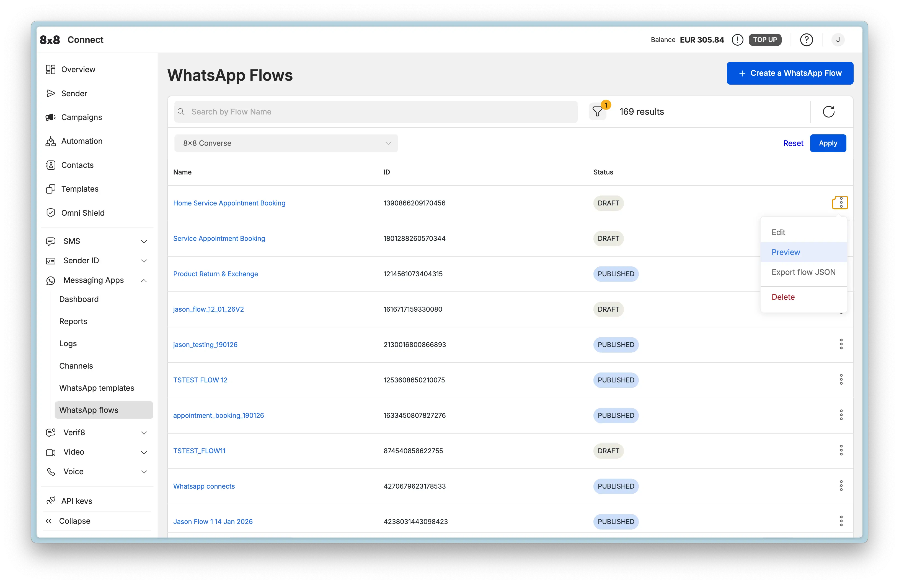
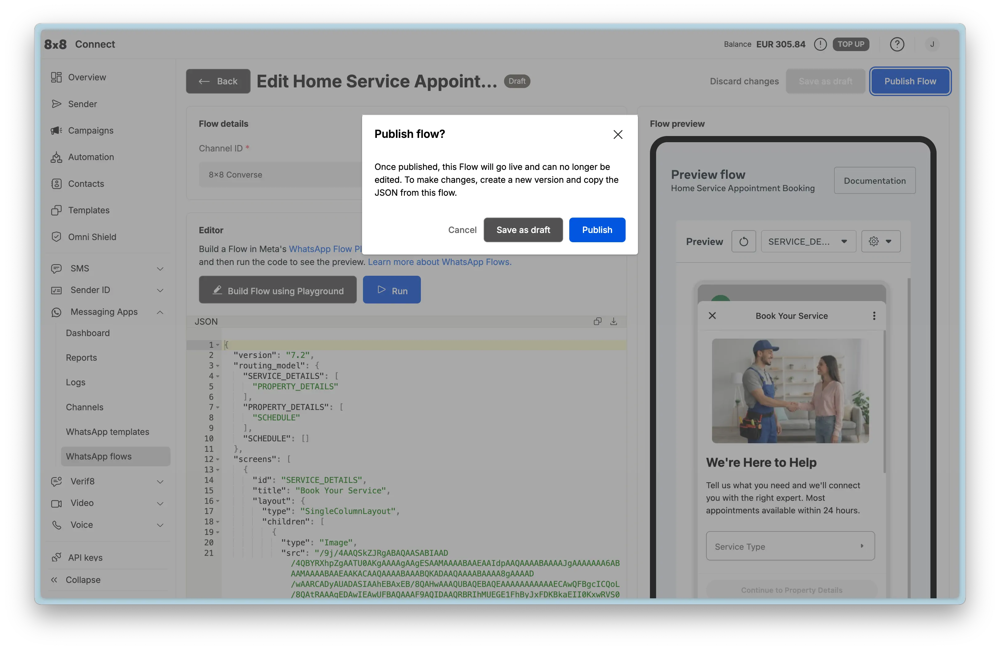
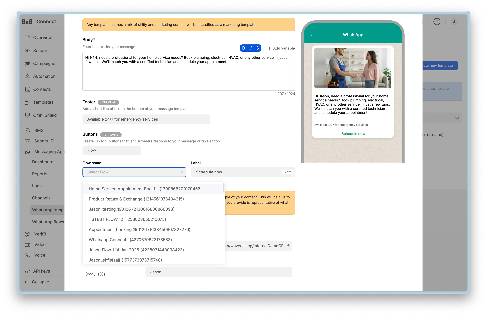

# WhatsApp Flows in 8x8 Connect

This guide walks you through creating, testing, and deploying WhatsApp Flows using the visual, no-code interface in the 8x8 Connect portal. Perfect for business users, marketers, and anyone who prefers a UI-based approach over API integration.

## Overview

The 8x8 Connect UI provides a complete visual environment for Flow management:

- **No coding required** - Build Flows with JSON editor and live preview
- **Live preview** - Test Flows interactively before publishing
- **Template integration** - Create templates with Flow buttons
- **Campaign management** - Send Flows to customer segments
- **Response viewing** - See all submissions in a table view
- **Export capabilities** - Download Flow JSON for version control

**Prerequisites:**
- Access to [8x8 Connect](https://connect.8x8.com/)
- Active WhatsApp Channel
- Appropriate user permissions

---

## Accessing WhatsApp Flows

**Steps:**
1. Log into [8x8 Connect](https://connect.8x8.com/)
2. Navigate to **Messaging Apps** > **WhatsApp flows** at [https://connect.8x8.com/chat/flows](https://connect.8x8.com/chat/flows)
3. View existing flows with status indicators:
   - **Draft** - Editable, not yet published
   - **Published** - Live and available for use (immutable)
   - **Deprecated** - No longer recommended for new messages
4. Use the search bar to find specific flows by name

### Flow Management Actions

Click the **⋮** menu on any Flow to access:
- **Edit** - Modify Flow JSON (Draft flows only)
- **Preview** - Test flow experience in browser before publishing
- **View responses** - See all customer submissions with filtering and export options
- **Export flow JSON** - Download JSON for backup or API use
- **Delete** - Remove flow (Draft flows only, not in use by templates)

---

## Creating a New Flow

### Step 1: Create Flow

1. Navigate to [https://connect.8x8.com/chat/flows/create](https://connect.8x8.com/chat/flows/create) or click **+ Create a WhatsApp Flow** button
2. Fill in Flow details:
   - **Channel ID**: Select your WhatsApp Business Account
   - **Flow name**: Descriptive name for internal reference (e.g., "Home Service Appointment Booking")

3. Build your Flow JSON using one of these methods:

**Option A: Use Meta's Playground**
- Visit [WhatsApp Flows Playground](https://developers.facebook.com/docs/whatsapp/flows/playground/)
- Design flow visually with drag-and-drop interface
- Export JSON and copy into the editor
- **Note:** This is a one-way tool - you can export from playground to JSON, but cannot import JSON back into the playground

**Option B: Use Example JSON**
- Browse [Flow Examples](./whatsapp-flows-examples.md) for industry-specific templates
- Copy JSON from the example that matches your use case
- Customize field names, labels, and validation rules

**Option C: Write Custom JSON**
- Refer to the [Component Reference](./whatsapp-flows-components.md)
- Build JSON structure following WhatsApp Flows schema (version 7.3)
- Use the inline editor with syntax highlighting

4. **Live Preview**: See real-time rendering on the right panel
5. Click **Run** to test the flow interactively in a mobile-sized preview

### Step 2: Preview and Test

The preview interface allows you to:
- See full-screen mobile preview of your Flow
- Navigate through all screens as a user would
- Test form validations and required fields
- Verify conditional logic and navigation paths
- Check data flow between screens

**Testing checklist:**
- [ ] All screens render correctly on mobile layout
- [ ] Required fields enforce validation
- [ ] Navigation buttons work as expected
- [ ] Terminal screen submits data properly
- [ ] All text fits in mobile view without truncation
- [ ] Images and icons load correctly

### Step 3: Publish Flow

**Important:** Once published, the Flow becomes live and **cannot be edited**. This is a Meta/WhatsApp restriction to ensure consistency for users.

**To make changes after publishing:**
1. Edit the existing flow (this creates a new draft version)
2. Copy the modified JSON
3. Create a new flow with the updated JSON
4. Publish the new version
5. Update your templates to reference the new Flow ID
6. Optionally deprecate the old version

Click **Publish** when you're confident the Flow is ready for production use.

---

## Using Flows with Templates

### Create Template with Flow Button

Templates allow you to initiate conversations with Flow buttons. This is the most common way to send Flows.

1. Navigate to **Templates** section in 8x8 Connect
2. Click **Create new template**
3. Enter template details:
   - **Template name**: Unique identifier (lowercase, underscores, e.g., `appointment_booking_v1`)
   - **Category**: Select `UTILITY` for transactional/service Flows (appointments, feedback, customer service) or `MARKETING` for promotional Flows (offers, campaigns). **Choose the appropriate category to avoid template rejection.**
   - **Language**: Select primary language

4. Compose template body:
   - Add body text describing the Flow purpose
   - Optional: Use variables like `{{1}}` for personalization
   - Optional: Add footer text for additional context

5. Add Flow Button:
   - In **Buttons** section, click **Add button**
   - Select **Flow** button type
   - Choose your published flow from the dropdown
   - Set button label (e.g., "Schedule now", "Book appointment", "Share feedback")
   - **Note:** Maximum 25 characters for button text

6. Submit for WhatsApp approval
7. Wait for approval (typically 24-48 hours)

**Template Approval Tips:**
- Use clear, professional language in template body
- Avoid promotional content in UTILITY templates
- Match button text to template content
- Test with example values before submitting

### Send Template via Campaign

Once your template is approved, send it to customers via Campaigns:

1. **Select Channel:** Navigate to **Campaigns** from the main menu, click **"Create a new campaign"**, and select **"Messaging Apps"**

2. **Choose Sender:** Select the **Subaccount** and specify the WhatsApp Channel you want to send from

3. **Add Recipients:** Upload your customer list. You can:
   - Upload a file (.csv, .txt, .xlsx) containing phone numbers and data for personalization
   - Manually type in numbers
   - Select contacts from your saved Contact Groups

4. **Map Fields:** If you upload a file, map your columns to system fields (like `Mobile`) or custom fields (like `FirstName`) that can be used as variables

5. **Compose Message:**
   - Select your **approved WhatsApp Template** with Flow button from the list
   - **Variable Mapping:** If your template has variables (e.g., `{{1}}`), map them to the custom fields from your uploaded file (e.g., map `{{1}}` to your `FirstName` column)
   - **Media Replacement:** If your template includes a media header (image, video, document), you can specify the media to be used by providing a publicly accessible Media URL or using the direct file upload option
   - **Media Optimization:** All media is automatically processed and optimized by Meta's media hosting for fast, reliable delivery

6. **Review and Send:** Name your campaign, review the details, and choose to send it immediately or schedule it for a later time

**Campaign Best Practices:**
- Segment audiences for relevant flows (don't send all flows to everyone)
- Schedule sends during business hours (higher completion rates)
- A/B test different template body copy and button labels
- Monitor completion rates in webhook analytics

---

## Viewing and Managing Responses

### Viewing Responses in 8x8 Connect

You can view all Flow submissions directly in the 8x8 Connect portal without setting up webhooks.

> **Important: Permission Required**
>
> Flow responses are only visible to users with **log access permission** in 8x8 Connect. Without this permission, response data will be masked and not visible. Contact your account administrator to request log access if needed.

**To view Flow responses:**

1. Navigate to **Messaging Apps** > **WhatsApp flows** at [https://connect.8x8.com/chat/flows](https://connect.8x8.com/chat/flows)
2. Click on the Flow name to open its details
3. Click **View responses** or navigate to the responses tab
4. View submission data in a table format

**Default Columns (Always Present):**
- **Date Submitted**: Timestamp when the user completed the Flow
- **Phone Number**: Customer's WhatsApp number

**Dynamic Columns (Based on Your Flow):**
The table also displays columns for each field collected in your Flow. For example:
- If your Flow collects "Name", "Email", "Preferred Date" - these will appear as columns
- If your Flow collects "Order Number", "Return Reason", "Resolution Type" - these will appear as columns
- Column names match the field names defined in your Flow JSON

**Additional Column:**
- **Action**: Click **View details** to see the complete submission with all form fields

**Features:**
- **Filter** responses by date range and channel
- **Export** responses to CSV for analysis (first 1,000 responses displayed in UI, use Export button to download all responses)
- **View details** for individual submissions to see complete form data

**Use Cases:**
- Manual review of customer submissions
- Quality assurance and testing
- Data analysis and reporting without code
- Customer support lookups
- Export data for offline analysis or integration with other tools

---

## Configuring Webhooks for Automated Processing

While the portal provides manual response viewing, webhooks enable automated processing and integration with your systems.

### Webhook Setup

1. In 8x8 Connect, navigate to **Messaging Apps** > **Webhooks**
2. Click **Add webhook endpoint**
3. Enter your endpoint URL (must be HTTPS)
4. Select event types:
   - `inbound_message_received` (required for Flow submissions)
   - Optionally select other events (delivery status, etc.)
5. Save configuration

**Webhook Requirements:**
- Must respond with `200 OK` within 5 seconds
- Must use HTTPS (not HTTP)
- Must handle duplicate submissions (idempotency)
- Should process asynchronously after acknowledgment

**For complete webhook setup and submission handling:** [WhatsApp Webhooks Documentation](./whatsapp-webhooks.md)

**For webhook payload structure and processing code:** [API Reference - Webhook Integration](./whatsapp-flows-api.md#webhook-integration)

---

## Testing Your Flows

### Testing Checklist

Complete these steps to validate your Flow implementation:

- [ ] **Preview Flow:** Open preview and test all screens and field validations
- [ ] **Test All Paths:** Verify all navigation branches and conditional logic
- [ ] **Validate Required Fields:** Confirm required field enforcement works
- [ ] **Test Validation Rules:** Try invalid inputs (bad email, negative numbers)
- [ ] **Create Test Template:** Create template with Flow button and submit for approval
- [ ] **Send to Test Number:** Send Flow to your test WhatsApp number
- [ ] **Complete Flow:** Fill out all fields and submit as a user would
- [ ] **Verify Portal Response:** Check responses appear in 8x8 Connect portal
- [ ] **Verify Webhook (if configured):** Confirm webhook receives `nfmReply` payload
- [ ] **Parse Data:** Verify all submitted fields parse correctly from `responseJson`
- [ ] **Check Logs:** Review 8x8 Connect portal logs for delivery status
- [ ] **Send Confirmation:** Test automated response after submission
- [ ] **Test Error Cases:** Verify webhook handles malformed submissions gracefully

### Common Validation Errors

| Error | Cause | Solution |
|-------|-------|----------|
| `Invalid flowJson` | JSON not properly formatted or has syntax errors | Validate JSON structure; use online JSON validator before uploading |
| `Screen not found` | Navigation references non-existent screen ID | Check all screen IDs in routing match actual screen definitions |
| `Flow not published` | Attempting to send unpublished Flow | Publish Flow before sending; verify status is `PUBLISHED` |
| `Invalid flowId` | Wrong Flow ID or Flow deleted | Verify Flow ID from Flow list; check Flow wasn't accidentally deleted |
| `Button not visible` | Template not approved or button misconfigured | Check template approval status; verify button type is `FLOW` |
| `Cannot open Flow` | Flow deprecated or incorrect version | Ensure Flow status is `PUBLISHED`, not `DRAFT` or `DEPRECATED` |

### Testing with Preview

The preview interface is your primary testing tool:

1. Create or update your Flow in 8x8 Connect
2. Click **Preview** from the Flow actions menu
3. Interact with the Flow in the browser preview
4. Test all screens, navigation paths, and data entry
5. Verify submission payload structure (shown at the end)

**Tip:** Keep the preview open while iterating on your Flow JSON. Make edits, click **Run** to see changes immediately.

---

## Troubleshooting

### Common Issues

| Symptom | Likely Cause | Solution |
|---------|--------------|----------|
| **Flow button not visible in WhatsApp** | Template not approved or button misconfigured | Verify template approval status in 8x8 Connect; check button definition matches Flow button syntax |
| **Cannot open Flow when clicked** | Flow not published or incorrect `flowId` | Publish Flow; verify `flowId` in template matches published Flow |
| **Interactive message rejected** | Sent outside 24-hour service window | Use Template message to re-open conversation window |
| **Flow edit button disabled** | Flow is published (immutable) | Create new Flow with modified JSON; update templates to new Flow ID |
| **No responses showing in portal** | Missing log access permission | Request log access permission from administrator |
| **Preview shows old version** | Browser cache or cached preview | Clear browser cache; refresh preview |

### Debugging Tips

**1. Use Preview Extensively**

Test every change in the preview before publishing. The preview shows exactly how users will see the Flow.

**2. Check Flow Status**

Verify Flow is in expected state:
- Navigate to **Messaging Apps** > **WhatsApp flows** at [https://connect.8x8.com/chat/flows](https://connect.8x8.com/chat/flows)
- Confirm status shows **Published** (not Draft)
- Check created/updated timestamps

**3. Review Portal Logs**

8x8 Connect provides detailed message logs:
- Navigate to **Logs** in the portal
- Filter by Channel ID and date range
- Look for Flow message delivery status and errors

**4. Test with Simple Flow First**

Start with a minimal single-screen Flow before building complex multi-screen flows.

**5. Verify Template Approval**

- Check template status in Templates section
- Ensure Flow button is configured correctly
- Confirm Flow ID matches published Flow

---

## Next Steps

### Continue Learning

- **[Flow Component Reference](./whatsapp-flows-components.md)** - Learn about all available UI components
- **[Flow Examples](./whatsapp-flows-examples.md)** - See production-ready industry-specific examples
- **[Best Practices & Governance](./whatsapp-flows-best-practices.md)** - Design guidelines and security

### For Developers

- **[Flow API Reference](./whatsapp-flows-api.md)** - Programmatic Flow management
- **[WhatsApp Webhooks](./whatsapp-webhooks.md)** - Complete webhook integration guide

### Related Features

- **[Template Message API](./template-message-api-library.mdx)** - Send templates programmatically
- **[8x8 Automation Builder](/connect/docs/automation-builder)** - Combine Flows with conversational workflows
