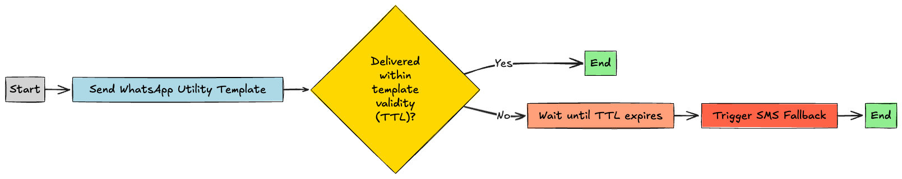

# WhatsApp SMS Fallback

Ensure your critical messages always reach customers by configuring SMS fallback for WhatsApp messages. When a WhatsApp message cannot be delivered, such as when a customer doesn't have WhatsApp installed or their device is offline, the message automatically falls back to SMS delivery.

---

## Overview

The 8x8 platform supports two approaches for configuring fallback delivery:

1. **Subaccount-Level Configuration**: Fallback rules configured at the subaccount level by the 8x8 team (requires contacting your account manager)
2. **API-Level Configuration**: Fallback rules specified per message in the API request (overrides subaccount settings)

This guide focuses on implementing SMS fallback for WhatsApp messages using the API approach, providing you with flexible, per-message control over fallback behavior.

> 📘 **Need More Advanced Fallback Options?**
>
> For complex multi-channel fallback orchestration (WhatsApp → Viber → SMS), timing controls, and status-based fallback triggers, see the comprehensive [Messaging Apps Fallback Management](/connect/docs/chatapps-fallback-management) guide.

---

## Why Use SMS Fallback?

SMS fallback ensures message delivery in scenarios where WhatsApp is unavailable:

- **User doesn't have WhatsApp**: Automatically deliver via SMS instead
- **WhatsApp account inactive**: Reach users who have uninstalled or deactivated WhatsApp
- **Device offline**: Deliver via SMS when the recipient's device is unreachable on WhatsApp
- **Network issues**: Bypass WhatsApp delivery failures due to connectivity problems
- **Template rejection**: Fall back to SMS if WhatsApp template delivery fails

**Common Use Cases:**

- One-time passwords (OTP) and authentication codes
- Delivery notifications and order confirmations
- Appointment reminders and booking confirmations
- Time-sensitive alerts and notifications

---

## Configuring SMS Fallback for Template Messages

To add SMS fallback to a WhatsApp template message, include the `fallbackText` and `sms` configuration within the `content` object of your API request.

### Basic SMS Fallback Example

```json
{
  "user": {
    "msisdn": "+6511111111"
  },
  "type": "template",
  "content": {
    "template": {
      "language": "en_US",
      "name": "order_confirmation",
      "components": [
        {
          "type": "body",
          "parameters": [
            {
              "type": "text",
              "text": "John"
            },
            {
              "type": "text",
              "text": "ABC-123"
            }
          ]
        }
      ]
    },
    "fallbackText": "Hi John, your order ABC-123 has been confirmed. Thank you for shopping with us!",
    "sms": {
      "encoding": "AUTO",
      "source": "YourBrand"
    }
  }
}
```

### Key Parameters

| Parameter | Description | Required |
|-----------|-------------|----------|
| **`fallbackText`** | The SMS message text that will be sent if WhatsApp delivery fails. This replaces the WhatsApp template body. Max length depends on encoding (160 chars for GSM-7, 70 for Unicode). | Yes |
| **`sms.encoding`** | SMS encoding format: `AUTO` (recommended), `GSM`, or `UNICODE`. `AUTO` automatically selects the most efficient encoding. | Yes |
| **`sms.source`** | Your SMS Sender ID. This appears as the sender when delivered via SMS. Must be registered and approved for your account. | Yes |

> 📘 **SMS Sender ID**
>
> Learn more about SMS Sender IDs and registration requirements in the [Getting Started guide](/connect/docs/getting-started#1-source-sms-senderid).

---

## Configuring SMS Fallback for Interactive Messages

Interactive WhatsApp messages (buttons, lists, location) can also have SMS fallback. Since interactive elements cannot be rendered in SMS, you should provide clear, text-based alternatives in the `fallbackText`.

### Interactive Button Message with SMS Fallback

```json
{
  "user": {
    "msisdn": "+6511111111"
  },
  "type": "interactive",
  "content": {
    "interactive": {
      "type": "button",
      "body": {
        "text": "Thank you for your order! Would you like to track your delivery or contact support?"
      },
      "action": {
        "buttons": [
          {
            "type": "reply",
            "reply": {
              "id": "track_order",
              "title": "Track Order"
            }
          },
          {
            "type": "reply",
            "reply": {
              "id": "contact_support",
              "title": "Contact Support"
            }
          }
        ]
      }
    },
    "fallbackText": "Thank you for your order! Track your delivery: https://example.com/track or contact support: +6512345678",
    "sms": {
      "encoding": "AUTO",
      "source": "YourBrand"
    }
  }
}
```

### Interactive List Message with SMS Fallback

```json
{
  "user": {
    "msisdn": "+6511111111"
  },
  "type": "interactive",
  "content": {
    "interactive": {
      "type": "list",
      "header": {
        "type": "text",
        "text": "Appointment Booking"
      },
      "body": {
        "text": "Please select your preferred appointment slot:"
      },
      "action": {
        "button": "View Slots",
        "sections": [
          {
            "title": "Available Slots",
            "rows": [
              {
                "id": "slot_1",
                "title": "Mon 10:00 AM",
                "description": "January 15, 2024"
              },
              {
                "id": "slot_2",
                "title": "Tue 2:00 PM",
                "description": "January 16, 2024"
              }
            ]
          }
        ]
      }
    },
    "fallbackText": "Appointment Booking - Available slots: 1) Mon Jan 15 10:00 AM, 2) Tue Jan 16 2:00 PM. Reply with slot number to book.",
    "sms": {
      "encoding": "AUTO",
      "source": "HealthClinic"
    }
  }
}
```

### Best Practices for Interactive Message Fallback

1. **Include Action URLs**: Provide direct links in the SMS fallback text so users can still take action
2. **List Options Clearly**: When falling back from list/button messages, enumerate options clearly (e.g., "1) Option A, 2) Option B")
3. **Provide Contact Info**: Include phone numbers or email addresses for support as alternatives
4. **Keep It Concise**: SMS has character limits—prioritize the most important information
5. **Test Fallback Text**: Ensure your fallback message makes sense as a standalone SMS without WhatsApp context

---

## Coordinating Fallback Timing with WhatsApp Template TTL

WhatsApp Utility and Authentication templates support configurable Time-To-Live (TTL) settings, which define how long WhatsApp will attempt to deliver a message before it expires. To prevent duplicate message delivery, your SMS fallback timing must be carefully coordinated with the template TTL.

### Understanding the Timing Challenge

Consider this scenario:

1. You send a WhatsApp Authentication template with a **10-minute TTL**
2. You configure SMS fallback with a **60-second delay**
3. **Problem**: SMS is sent after 60 seconds, but WhatsApp continues attempting delivery for 10 minutes
4. **Result**: The customer may receive **both** the WhatsApp message and the SMS, creating a poor user experience

### Solution: Align Fallback Timing with TTL

**Rule of Thumb**: Set your `fallbackAfter` duration to **exceed** the WhatsApp template's TTL.

```json
{
  "channels": [
    {
      "channel": "WhatsApp",
      "fallbackAfter": 900,
      "successStatus": "Delivered"
    },
    {
      "channel": "SMS"
    }
  ],
  "user": {
    "msisdn": "+6511111111"
  },
  "type": "template",
  "content": {
    "template": {
      "language": "en_US",
      "name": "otp_authentication",
      "components": [
        {
          "type": "body",
          "parameters": [
            {
              "type": "text",
              "text": "123456"
            }
          ]
        },
        {
          "type": "button",
          "subType": "url",
          "index": "0",
          "parameters": [
            {
              "type": "text",
              "text": "123456"
            }
          ]
        }
      ]
    },
    "fallbackText": "Your verification code is: 123456",
    "sms": {
      "encoding": "AUTO",
      "source": "YourApp"
    }
  }
}
```

In this example:

- **WhatsApp Template TTL**: 10 minutes (600 seconds)
- **Fallback Delay**: 15 minutes (900 seconds)
- **Result**: WhatsApp has its full 10-minute delivery window before SMS fallback is triggered

### Timing Configuration Diagram



**Flow Explanation:**

1. **Send WhatsApp Template**: Message sent with 10-minute TTL
2. **WhatsApp Delivery Window**: WhatsApp attempts delivery for up to 10 minutes
3. **TTL Expires**: If not delivered within 10 minutes, message expires
4. **Fallback Trigger**: After 15 minutes (exceeding TTL), SMS fallback is sent
5. **SMS Delivery**: Message delivered via SMS as fallback

> 📘 **Learn More About WhatsApp TTL**
>
> For detailed guidance on configuring WhatsApp template validity periods, see the [WhatsApp Template Validity Period (TTL) Guide](/connect/docs/guide-whatsapp-template-validity-period-ttl).

---

## Simple SMS Fallback (Without Channels Array)

For basic use cases where you want automatic SMS fallback without complex timing or channel orchestration, you can omit the `channels` array and simply include the `fallbackText` and `sms` configuration.

```json
{
  "user": {
    "msisdn": "+6511111111"
  },
  "type": "template",
  "content": {
    "template": {
      "language": "en_US",
      "name": "delivery_notification",
      "components": [
        {
          "type": "body",
          "parameters": [
            {
              "type": "text",
              "text": "Sarah"
            },
            {
              "type": "text",
              "text": "ORD-789"
            }
          ]
        }
      ]
    },
    "fallbackText": "Hi Sarah, your order ORD-789 is out for delivery and will arrive today.",
    "sms": {
      "encoding": "AUTO",
      "source": "ShopName"
    }
  }
}
```

In this simple configuration:

- The platform uses **subaccount-level fallback settings** configured by the 8x8 team
- SMS fallback happens automatically when WhatsApp delivery fails
- No need to specify timing or success status parameters

> 📘 **Subaccount-Level Configuration**
>
> To configure default fallback rules at the subaccount level (channel priority, timing, success criteria), contact your account manager or [8x8 Support](https://connect.8x8.com/support/tickets/create).

---

## Testing Your Fallback Configuration

To verify your SMS fallback is working correctly:

1. **Test with Non-WhatsApp Number**: Send to a phone number that doesn't have WhatsApp installed
   - Expected: SMS should be delivered immediately or after the configured delay

2. **Test with Expired Template**: Use an expired or disabled WhatsApp template
   - Expected: SMS fallback should trigger when WhatsApp delivery fails

3. **Monitor Message Status**: Track message status via webhooks or the Messages API
   - Watch for WhatsApp failure events followed by SMS delivery events

4. **Verify SMS Content**: Confirm the `fallbackText` appears correctly in SMS
   - Check for character encoding issues (special characters, emojis)
   - Ensure message fits within SMS length limits

### Sample Webhook Events

When fallback occurs, you'll receive webhook events showing the channel transition:

```json
{
  "messageId": "abc123",
  "channel": "WhatsApp",
  "status": "Failed",
  "timestamp": "2024-01-15T10:00:00Z"
}
```

Followed by:

```json
{
  "messageId": "abc123",
  "channel": "SMS",
  "status": "Delivered",
  "timestamp": "2024-01-15T10:15:00Z"
}
```

---

## Error Codes Related to Fallback

When implementing fallback, you may encounter these error codes:

| Error Code | Description | Resolution |
|------------|-------------|------------|
| **3017** | Too long Fallback text | Reduce the `fallbackText` length to fit within SMS limits (160 chars GSM-7, 70 chars Unicode) |
| **3022** | Invalid Fallback Channel | Check that the channel name is correctly specified (e.g., "SMS", not "sms") |
| **3023** | Invalid Fallback Delay range | Ensure `fallbackAfter` is a positive integer within acceptable limits |
| **3024** | Invalid Fallback Status | Verify `successStatus` is one of: `Accepted`, `Sent`, `Delivered`, or `Read` |
| **3027** | Invalid Fallback SubAccount Channel | The specified fallback channel is not configured for your subaccount—contact support |
| **3051** | Invalid Fallback ChannelID | Check that the channel ID is valid and accessible to your account |

For a complete list of API error codes, see the [API Error Codes Reference](/connect/docs/api-error-codes).

---

## Frequently Asked Questions

### Can I use different message content for WhatsApp vs. SMS?

Yes! The WhatsApp message uses your template content, while the SMS uses the `fallbackText` you specify. This lets you adapt the message for SMS constraints and remove WhatsApp-specific formatting.

### How long should I set the fallback delay?

For time-sensitive messages (OTP, alerts):

- **With TTL**: Set `fallbackAfter` to exceed the template TTL (e.g., TTL=600s, fallback=900s)
- **Without TTL**: Set 120-300 seconds for reasonable WhatsApp delivery attempt time

For non-urgent messages (marketing, updates):

- Consider longer delays (15-30 minutes) to give WhatsApp maximum delivery opportunity

### Does SMS fallback cost extra?

Yes. SMS fallback will incur standard SMS pricing in addition to the WhatsApp message attempt. The WhatsApp message attempt is charged even if it fails, and the fallback SMS is charged separately.

### Can I fallback to multiple channels (WhatsApp → Viber → SMS)?

Yes! For multi-channel fallback orchestration, use the advanced `channels` array configuration. See the [Messaging Apps Fallback Management](/connect/docs/chatapps-fallback-management) guide for details.

### Will users receive both WhatsApp and SMS if fallback timing is wrong?

Yes, this is possible if `fallbackAfter` is less than the template TTL. WhatsApp may deliver after the SMS has already been sent, resulting in duplicate messages. Always ensure fallback timing exceeds TTL.

### Can I configure fallback for session messages (non-template)?

Yes. Session messages (sent within the 24-hour customer service window) can have SMS fallback configured the same way as template messages.

---

## Related Resources

- [Messaging Apps Fallback Management](/connect/docs/chatapps-fallback-management) - Advanced multi-channel fallback orchestration
- [WhatsApp Template Validity Period (TTL)](/connect/docs/guide-whatsapp-template-validity-period-ttl) - Configure template TTL settings
- [Message Types & Templates](/connect/docs/whatsapp/message-types-templates) - WhatsApp template structure and components
- [Getting Started with SMS API](/connect/docs/getting-started-with-sms-api) - SMS Sender ID registration and configuration
- [Message Status Reference](/connect/reference/message-status-references) - Understanding message delivery statuses
- [Supported Messaging Apps](/connect/reference/list-of-supported-chatapps-channels) - Complete list of available channels

---

> ❗️ **Need Help?**
>
> Contact your account manager or [8x8 Support](https://connect.8x8.com/support/tickets/create) for assistance with:
>
> - Subaccount-level fallback configuration
> - Channel setup and activation
> - SMS Sender ID registration
> - Fallback timing optimization
