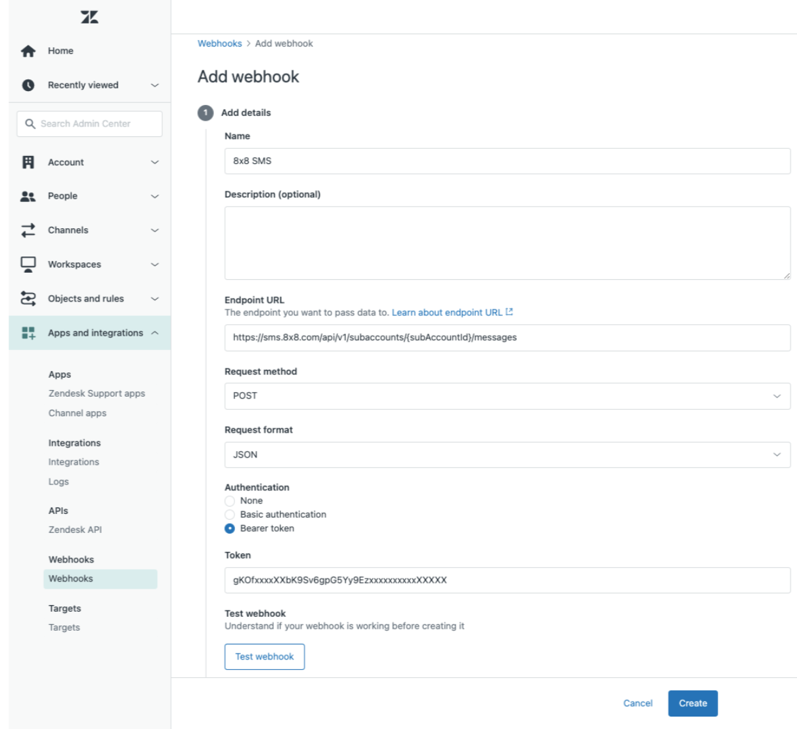

# Zendesk - Notifications Webhook

## Zendesk Support

[Zendesk](https://www.zendesk.com/) is a customer support system for tracking, prioritizing, and solving support tickets. 

With this integration, we can leverage the Zendesk triggers system and 8x8 API to send SMS when an event occurs on Zendesk.

## Some use cases

* Send notification to ticket requester when the status of ticket changes
* Alert admin when a new ticket is submitted

## Product scope

* Zendesk Support

## What you'll need

* A 8x8 account
* Your Zendesk Support account (Ensure that you have admin access)

## Create a new 8x8 Webhook in Zendesk

1. From your Zendesk account, go to the Admin section
2. Go to "Settings".
3. Select "Apps and integrations".
4. Select Webhook
5. On the top right corner, click "Actions" and select "Create webhook"
6. Give a name to the Webhook (ex: “8x8 SMS”)
7. In the Endpoint URL section enter:  

`https://sms.8x8.com/api/v1/subaccounts/{subAccountId}/messages`
8. In Request method select "POST"
9. In Request format, select "JSON"
10. In the Authentication section, select "Bearer token" and find this "API Key" in 8x8 connect. These are all available on 8x8's [Customer Portal - API Keys](https://connect.8x8.com/messaging/api-keys)
11. Click "Create"


11. Try sending a message to a phone number you own by using the following JSON object and replacing the values for your use:

```json
{
"source": "Zendesk", 
"destination": "+12345678", 
"text": "Hello world!"
}

```

  

12. If the Webhook works as expected, you should get a code \*\*HTTP/1.1 200 OK as a response from 8x8 API\*\*, telling you that the request was correctly formatted, authenticated and the SMS is accepted and queued for processing.
```json
{
  "umid": "bda3d56d-1424-e711-813c-06ed3428fe67",
  "clientMessageId": "client-message-id",
  "destination": "+12345678",
  "encoding": "GSM7",
  "status": {
    "code": "QUEUED",
    "description": "SMS is accepted and queued for processing"
  }
}

```

## Add a Zendesk trigger leveraging the newly created 8x8 webhook

1. From your Zendesk account, go to the Admin section
2. Go to "Settings".
3. Select "Objects and rules".
4. Select Triggers under Business rules
5. Select Add trigger in the right section
6. Give a name and description to the trigger (ex: “Solved ticket status update”)
7. Add a new condition: Ticket: status Is New
8. Add a new action: Notification: "Notify active webhook" and then select the webhook created in the earlier section of the tutorial.
9. Add JSON body based on 8x8 API documentation:

```json
{
"source": "Your company", 
"destination": "+12345678", 
"text": "Hello world!"
}

```

  

10. Replace JSON fixed parameters using Zendesk available placeholders like so:

```json
{
"source": "YourCompany",
"destination": "{{ticket.requester.phone}}",
"text": "Dear {{ticket.requester.name}}, your YourCompany ticket about {{ticket.title}} has been solved. See details at {{ticket.link}}. Best regards. YourCompany support team."
}
```
