# Zendesk Support

## Zendesk Support

[Zendesk](https://www.zendesk.com/) is a customer support system for tracking, prioritizing, and solving support tickets. 

By integrating 8x8 Chat Apps product into Zendesk Support you get the best on both products, a simple and unique Chat Apps API with no deployment needed, as well as the best customer service front end, with advanced configurations available.

## Video Demo

To see the integration in action, please view this video.

<iframe
  src="https://www.youtube.com/embed/jYnGmSxDFLY?si=yjJzqyfO2iqHmzhA"
  height="500px"
  width="100%"
  allow="picture-in-picture; web-share"
  allowFullScreen>
</iframe>

## Some use cases

* Send and receive notifications about ticket updates from different Chat apps channels(Whatsapp, Viber, Zalo, Line, 2-Way SMS and more)

## Product scope

* Zendesk Support

## What you'll need

* A 8x8 account with Chat Apps enabled
* Your Zendesk Support account with Team Plan

## Setting up Zendesk for the Integration

### Tag Setup

In order to filter by the tickets sent by 8x8, you will need to create a **Zendesk Tag**. To create the tag, you can assign a new tag by clicking the "Tags" field of an existing ticket. This can be any ticket in the system, but you will need to assign it the tag you wish to use to create it in the system. The tag can be removed from the ticket afterwards. 

The tag can be any value, however for this tutorial we are assuming you are using a tag called **ChatApps**. If you choose to use a different value, please note that the tutorial will show ChatApps where your tag would be instead.


### Queue Setup

Navigate to the **Settings** Page, then go to the Admin Center through the link.

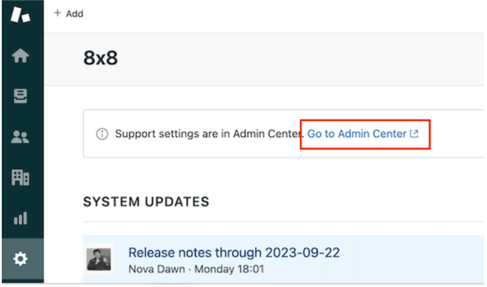

Once on the **Admin Center** Page, go to **Objects and Rules** and then **Tickets**. In the **Tickets** menu, go to **Settings** check **Enable tags on tickets**.

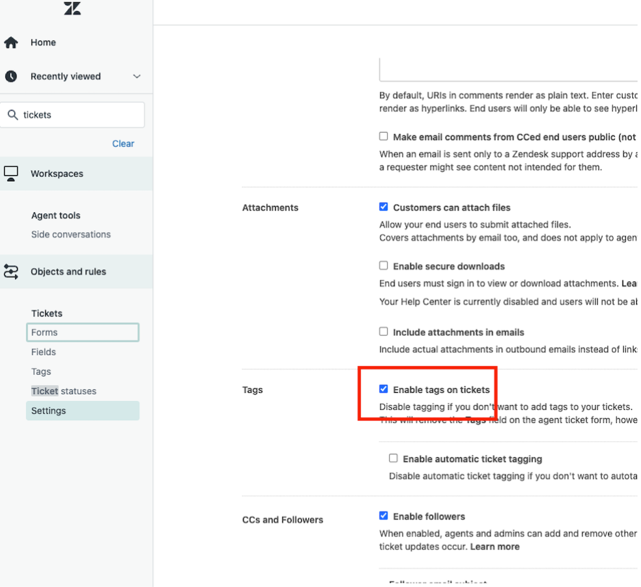

Go to **Workspaces** > **Agent Tools** > **Views**. Click on **Add View**

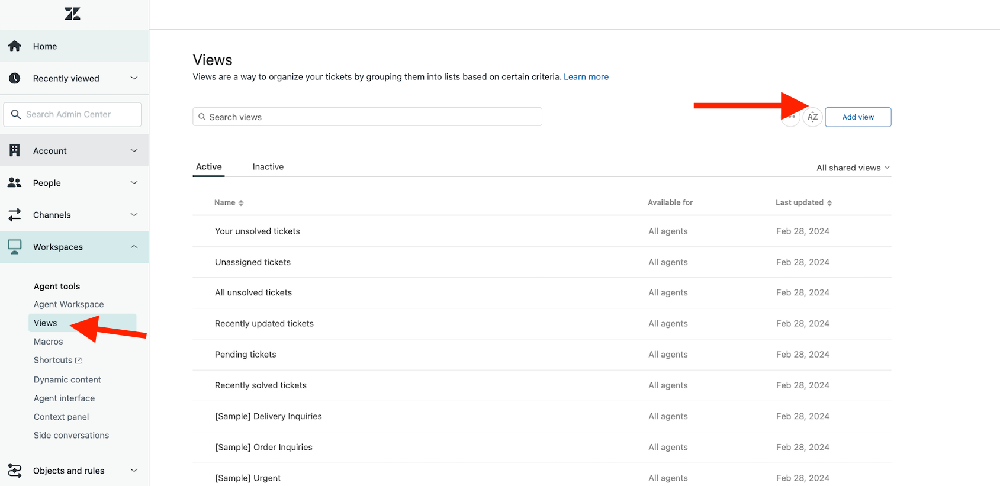

Create the queue with the following conditions.

* **Tickets must meet all of these conditions to appear in the view**
	+ Status Category - Less Than - Solved
* **Tickets can meet any of these conditions to appear in the view**
	+ Tags - Contains at Least one of the Following - ChatApps


### Webhook Setup

Once the queue is created, navigate back to the **Admin Center**. Then in the side menu go to **Apps and Integrations** > **Webhooks**, you can search for "webhook" on the left search bar to find this easier. Once on this page, click the **Create Webhook** button.

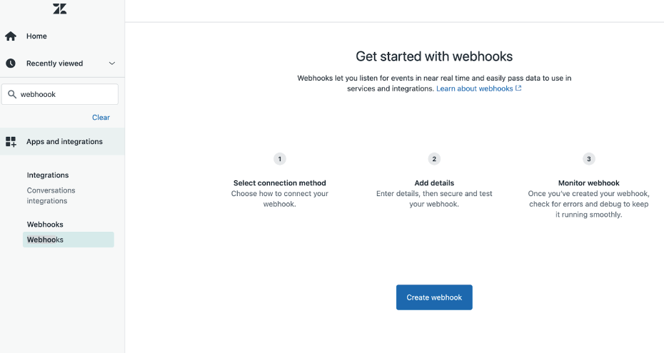

In the next screen, select **Trigger or Automation**

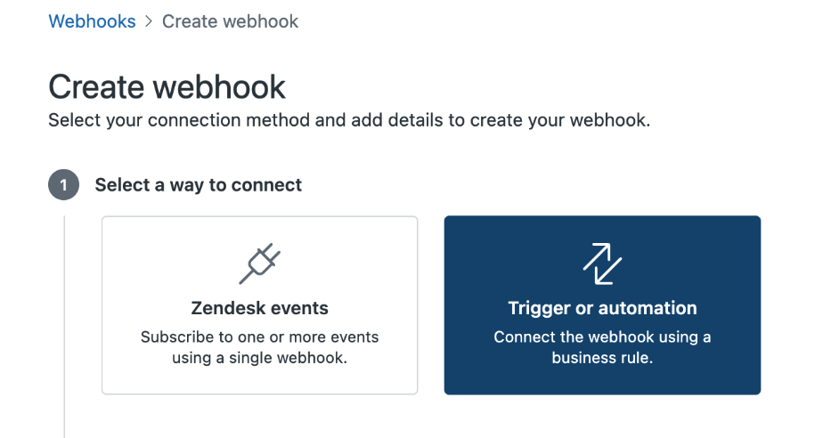

In the next screen, set the following fields:

* **Name:** Any Value
* **Description:** Any Value
* **Endpoint URL:** [https://api.wavecell.com/webhook/zendesk/](https://api.wavecell.com/webhook/zendesk/)<Your 8x8 Subaccount>?accessKey= srCUHbcYumHyxLxWmQjYfKWeg0qiRsEXfTHz640tClF032XxFpgnyzge7O  

**Please note you will need to substitute your 8x8 subaccount in the URL.**
* **Request Method:** POST
* **Request format:** JSON
* **Authentication:** None
* **Headers:** None

You may test the webhook as well and ensure that it is returning a 200 Response Code.

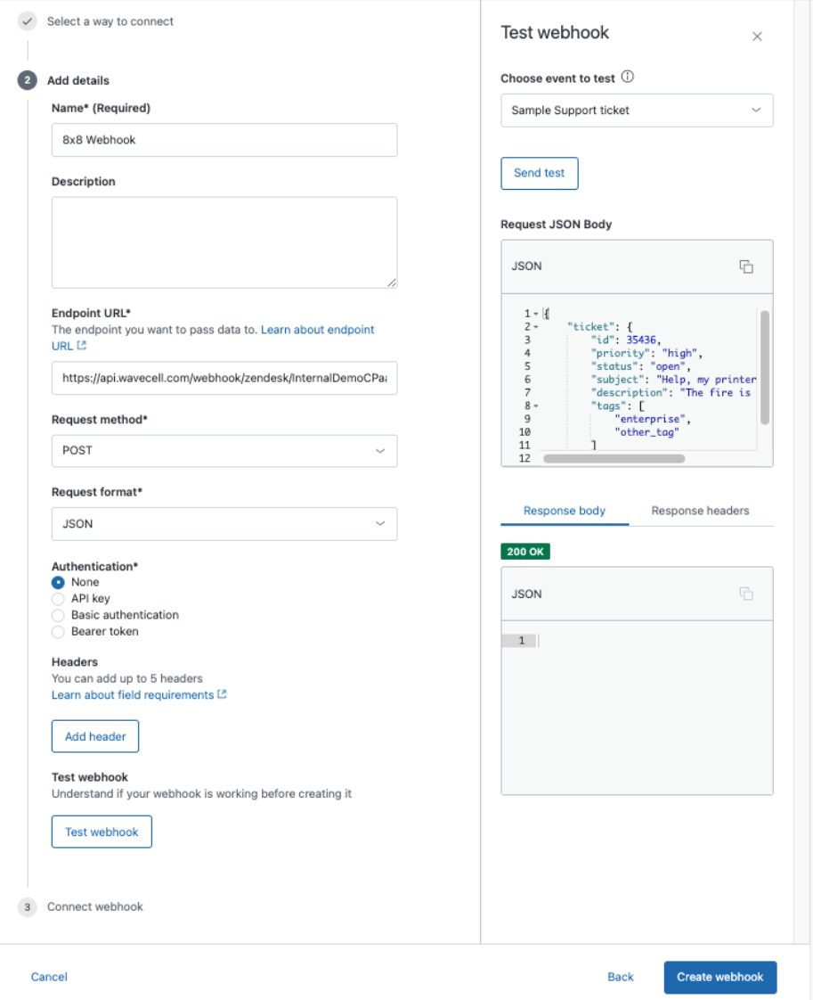

After adding the webhook, return to the **Admin Center** again and navigate to **Objects and Rules** > **Business Rules** > **Triggers**.

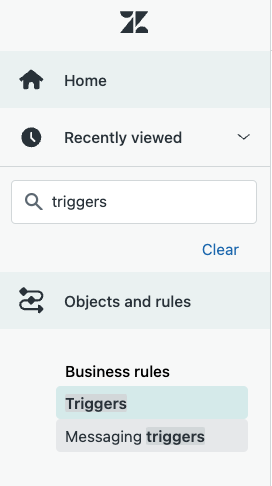
On the **Triggers** page, click **Add Trigger**.

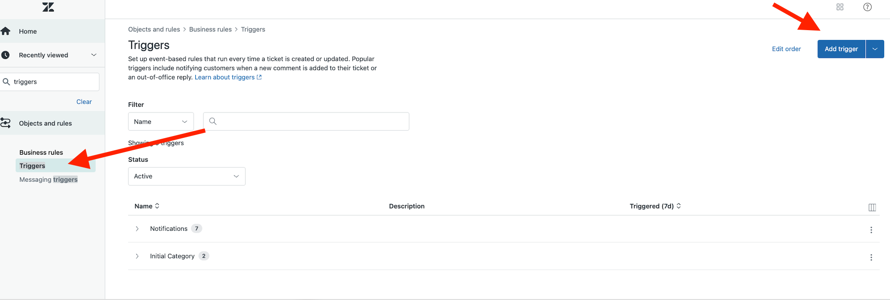

Configure the new trigger as follows:

* **Trigger Name**: Any Value (We use Chatapps new public comment
* **Description:** Any Value
* **Category:** Add Category
* **Category Name:** Any Value (We use Initial Category)
* **Conditions:** 
	+ Meet ALL of the following conditions:
	+ Ticket > Tags - Contains at least one of the following - ChatApps
	+ Ticket > Comment - Is - Public
* **Actions:**
	+ Notify by > Active Webhook > (Choose the Webhook you had previously created)
	+ **Endpoint:** https://api.wavecell.com/webhook/zendesk/<Insert your 8x8 Subaccount here>?accessKey=srCUHbcYumHyxLxWmQjYfKWeg0qiRsEXfTHz640tClF032XxFpgnyzge7O.  
	
	**Please note you will need to substitute your subaccount in the URL.**
	+ **JSON Body**
	+ ```
	{
	  "event": "newComment",
	  "ticketUrl": "{{ticket.link}}",
	  "ticketId": "{{ticket.id}}",
	  "ticketStatus": "{{ticket.status}}", 
	  "ticketExternalId": "{{ticket.external_id}}", 
	  "createdAt": "{{ticket.created_at_with_timestamp}}", 
	  "updatedAt": "{{ticket.updated_at_with_timestamp}}", 
	  "lastPublicComment": {
	    "authorName": "{{ticket.latest_public_comment.author.name}}",
	    "authorId": "{{ticket.latest_public_comment.author.id}}",
	    "authorExternalId": "{{ticket.latest_public_comment.author.external_id}}",
	    "createdAt": "{{ticket.latest_public_comment.created_at_with_time}}",
	    "text": "{{ticket.latest_public_comment.value}}", 
	    "attachments":[
	      
	      { "fileName": "{{attachment.filename}}", 
	      "url": "{{attachment.url}}" } 
	      ,
	      
	       
	    ]
	  } 
	}
	
	```


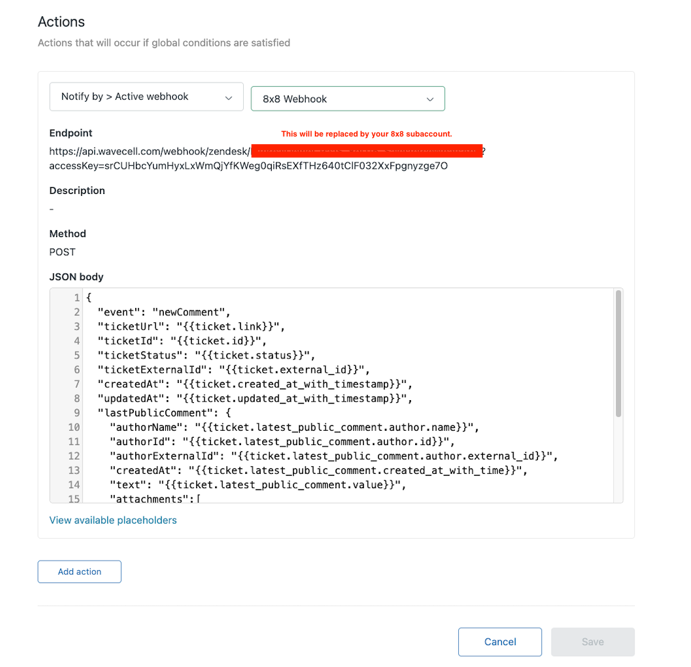
After creating trigger, create another trigger as follows.

* **Trigger Name**: Any Value (We use Chatapps status changed)
* **Description:** Any Value
* **Category:** Add Category
* **Category Name:** Any Value (We use Initial Category)
* **Conditions:** 
	+ Meet ALL of the following conditions:
	+ Ticket > Tags - Contains at least one of the following - ChatApps
	+ Ticket > Ticket Status - Changed
* **Actions:**
	+ Notify by > Active Webhook > (Choose the Webhook you had previously created)
	+ **Endpoint:** https://api.wavecell.com/webhook/zendesk/<Insert your 8x8 Subaccount here>?accessKey=srCUHbcYumHyxLxWmQjYfKWeg0qiRsEXfTHz640tClF032XxFpgnyzge7O.  
	
	**Please note you will need to substitute your subaccount in the URL.**
	+ **JSON Body**
	
	```
	{
	"event": "statusChanged",
	"ticketUrl": "{{ticket.link}}",
	"ticketId": "{{ticket.id}}",
	"ticketStatus": "{{ticket.status}}", 
	"ticketExternalId": "{{ticket.external_id}}", 
	"createdAt": "{{ticket.created_at_with_timestamp}}", 
	"updatedAt": "{{ticket.updated_at_with_timestamp}}"
	}
	
	```

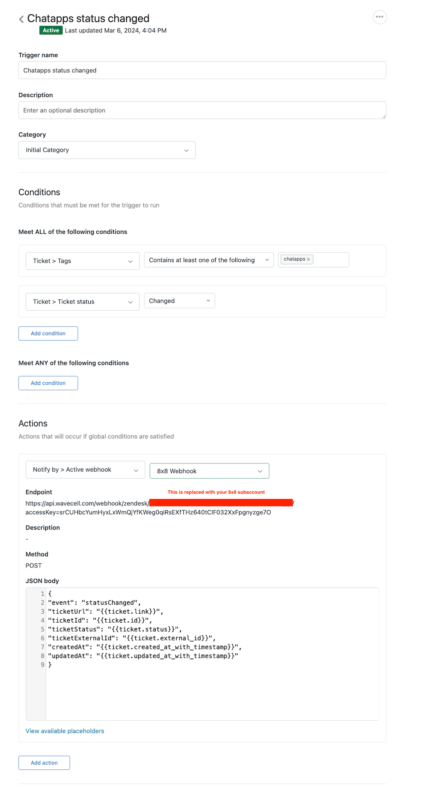

### Create Zendesk API Token

In order to give 8x8 access to the Zendesk API, you will need to generate an API token. Return to the **Admin Center**, then in the sidebar navigate to **Apps and Integrations** > **APIs** > **Zendesk API**. In the next screen agree to the Zendesk Terms and Conditions and click **Get Started**.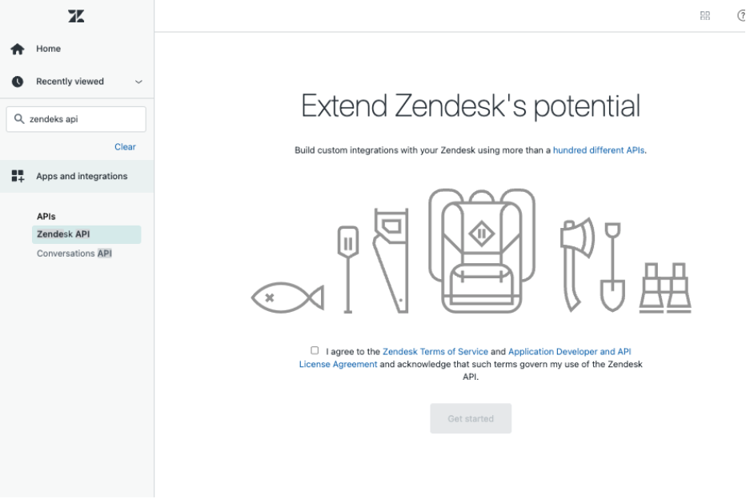

Once on this screen, check the button for **Token Access** to enable it. Afterwards click "**Add API Token**"

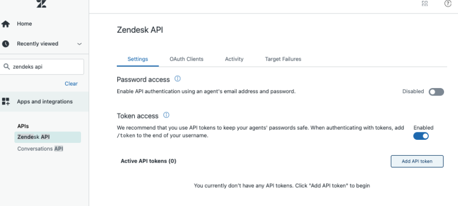

Once you are shown your API Tokens value, record it as you will need to send this information to our team to enable your Zendesk integration.


#### Send Information to 8x8 to Enable Zendesk Integration.

After completing all of the steps above, the setup should be complete on your end. Now send an email to [cpaas-support@8x8.com](mailto:cpaas-support@8x8.com) with the title "Enable Zendesk Integration" and provide the following details:

a. URL, the path to customer zendesk api: https://{YOUR_SUBDOMAIN}.zendesk.com/api/v2

b. Email, of user who will be used to access zendesk, required permissions: create and  

update tickets, create end users. This is the email registered in your Zendesk.

c. ApiToken, your Zendesk ApiToken for the user with the previous email address.

d. TicketTag, Ticket tag which will be automatically added to tickets created by Zendesk  

broker (chatapps, for instance)

e. DefaultTicketSubject, the subject which will be used for new ticket when the discussion starts  

from the image, not from the text message.

#### Using the Integration

Once your integration is setup properly, you should be able to receive a message in your ChatApps channel and a ticket with your tag will automatically generated on Zendesk.

Here is an example WhatsApp message that is sent to the WABA associated with an 8x8 Subaccount.


To check for the reply, you can view the tickets automatically generated from the view you created.


Here is what the ticket will look like once in a conversation. The messages from the Zendesk Agent are under "Customer Service Agent (Rommel Sunga) and then replies from the customer are under "Rommel Sunga".


The customer service agent can send replies as "Public Reply" and those messages will be sent to the customer.


This will show up as a reply on the customer's WhatsApp.


Once the issue is resolved, the agent can mark the ticket as solved.

> 📘 **Solved Tickets**
> 
> Note that by default, when a customer replies again to your WABA, their replies will go to the existing ticket unless the existing ticket even if it is solved. 
> 
> You can choose an action as per your requirements, for example to mark the ticket as **Open or In Progress** when this occurs by creating a Triggers in the Zendesk Admin Center.
> 
> 

New Message coming into a ticket after the ticket was solved.


The message comes in from the customer, but the ticket remains solved.

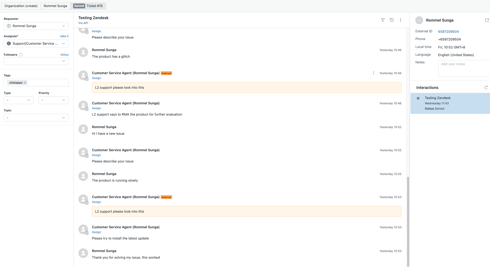

This example trigger will set all tickets tagged with ChatApps to pending for example, if a new reply comes in after they are solved.

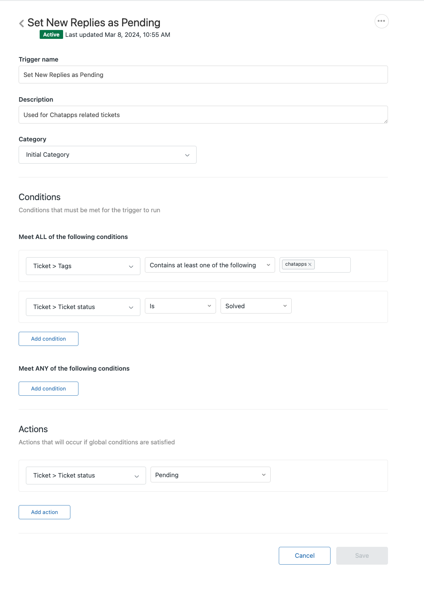
