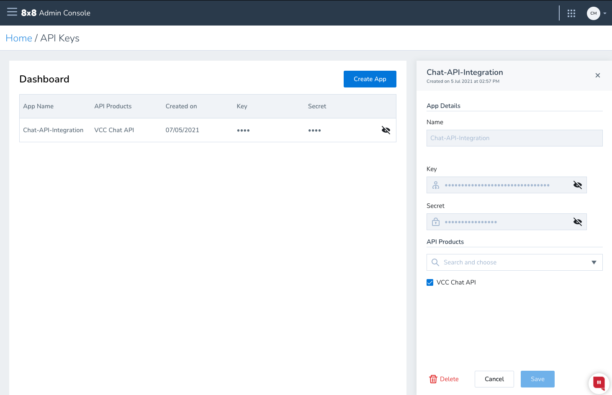

# API key

> ❗️ **PLEASE NOTE - This API is going to be deprecated on 30th September 2023, it will no longer work after this date. Please use our [Chat Gateway](/actions-events/docs/chat-gateway) which offers all of the Chat API's functionalities as well as additional features.**
>
>

## Procedure

You can obtain an API key using your [8x8 Admin Console](https://admin.8x8.com/) implementation.

To obtain your 8x8 API key:

1. Access your 8x8 Admin Console implementation.
2. Click **API Keys**

3. Click **Create App**

4. Add your Application.

  * Enter an application name
  * Under API products select **VCC Chat API** to create an API key enabled for the Contact Center Chat API and click Save.
  * You can edit your application or inspect the **API Key & Secret** by clicking on the entry.

## Access token

Copy your API Key and secret to [create a temporary access token](/contactcenter/reference/createaccesstoken).

You use the temporary access token to call the Chat API endpoints.

Refer to [create a temporary access token](/contactcenter/v2.0/reference/createaccesstoken) to obtain another token after the one you are currently using expires.
