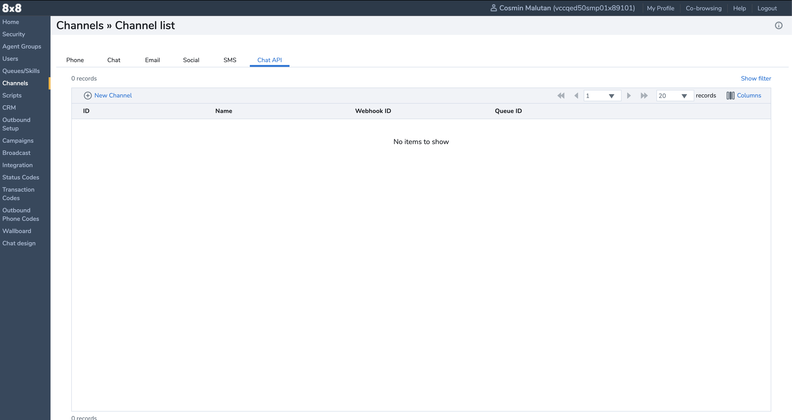
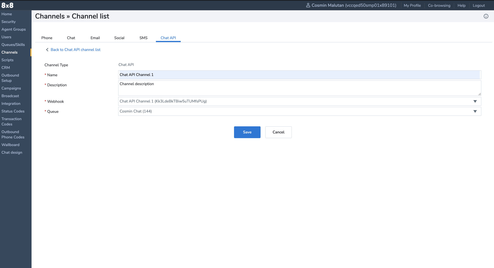

# Channel

> ❗️ **PLEASE NOTE - This API is going to be deprecated on 30th September 2023, it will no longer work after this date. Please use our [Chat Gateway](/actions-events/docs/chat-gateway) which offers all of the Chat API's functionalities as well as additional features.**
>
>

After creating a webhook you can then create a channel. The channel contains a webhook that passes the outbound messages and notifications.

The channel has a **[chat queue](https://support.8x8.com/cloud-contact-center/virtual-contact-center/administrators/how-to-create-inbound-queue-8x8-contact-center)** (ideally with an agent assigned), for routed inbound conversations.

A Channel can be created either via UI or via API.

## Create a channel using Configuration Manager

1. Access [Configuration Manager](https://docs.8x8.com/8x8WebHelp/VCC/configuration-manager-general/content/cfgoverview.htm).
2. Go to **Channels > Chat API**

3. Click **New Channel**

4. Complete the **Name**, **Webhook**, and **Queue** fields
5. Click **Save**

## Create a channel using API

1. Obtain your **[API key](/contactcenter/v2.0/docs/api-key)**
2. Call the **[Create a Channel endpoint](/contactcenter/reference/createchatapichannel)**
