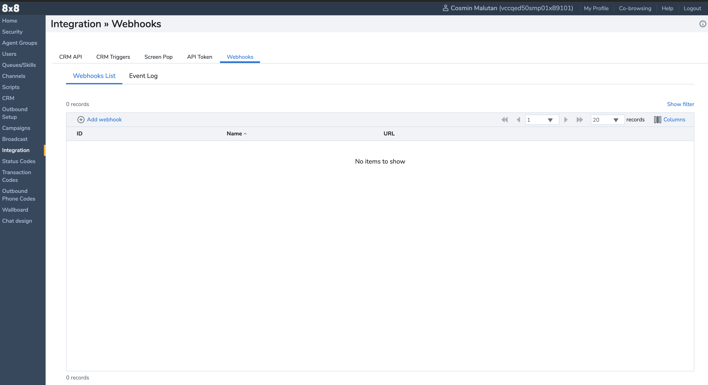
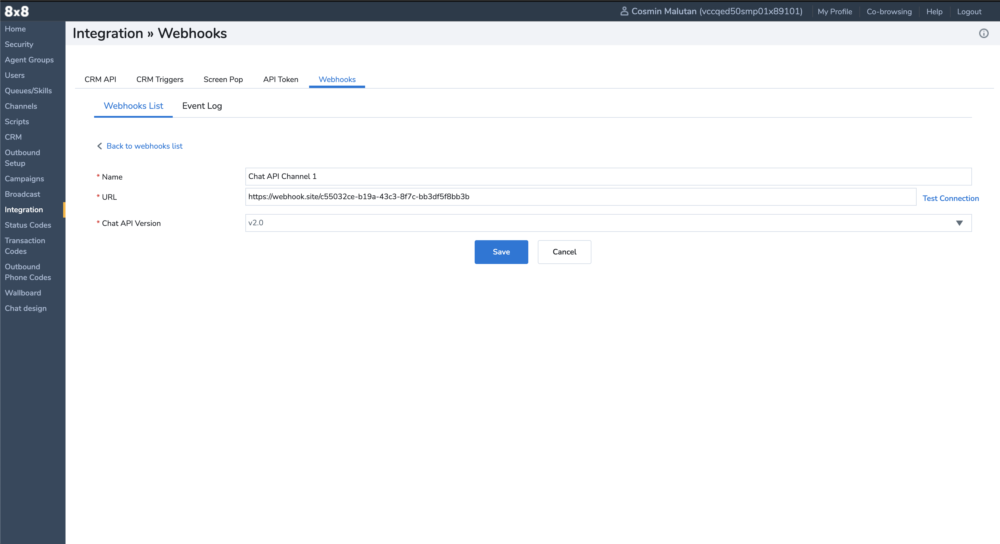

# Webhooks

> ❗️ **PLEASE NOTE - This API is going to be deprecated on 30th September 2023, it will no longer work after this date. Please use our [Chat Gateway](/actions-events/docs/chat-gateway) which offers all of the Chat API's functionalities as well as additional features.**
>
>

Before you can set up your Chat channel, you must first create a Webhook. Whenever an agent adds a message to a conversation that you create using the Chat API, 8x8 makes an HTTP call to the Webhook URL.

A Webhook can be created either via UI or via API.

## Create a Webhook using Configuration Manager

1. Access your **[Configuration Manager](https://docs.8x8.com/8x8WebHelp/VCC/configuration-manager-general/content/cfgoverview.htm)** implementation.
2. Go to **Integrations > Webhooks**.

3. Click **Add webhook**

3. Click **Save**

## Create a Webhook using API

1. Access your **[API key](/contactcenter/v2.0/docs/api-key)**
2. Call the **[Create a WebHook endpoint](/contactcenter/reference/createwebhook)**
