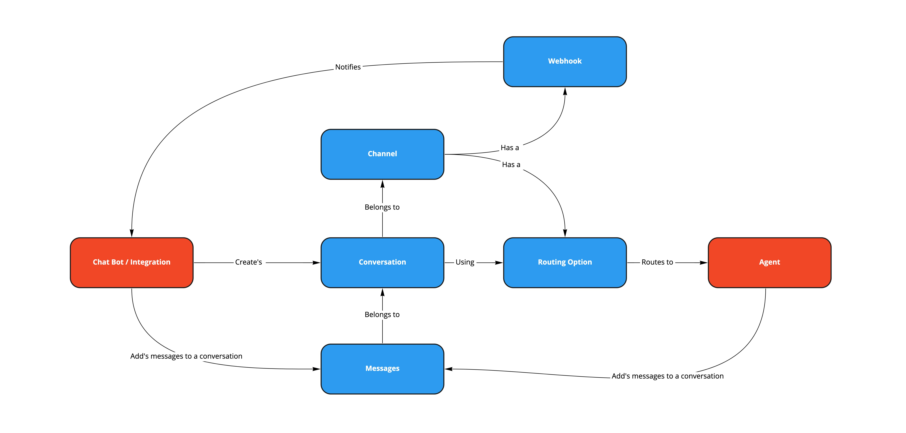

# Key Elements

> ❗️ **PLEASE NOTE - This API is going to be deprecated on 30th September 2023, it will no longer work after this date. Please use our [Chat Gateway](/actions-events/docs/chat-gateway) which offers all of the Chat API's functionalities as well as additional features.**
> 
> 

Before getting started using the Chat API, we recommend familiarizing yourself with the concepts and chat elements that you will be working with and are referenced in the following diagram:

## Channel

The channel is the medium through which the customer relays their inquiry within their Contact Center implementation. This can be any of the traditional communication channels such as phone, email, or chat.

## Conversation

The conversation refers to the information exchanged between the Contact Center agent and a customer. Before the exchange of messages can happen you create a conversation using the Chat API. You can add a customer's messages to the conversation. The agent assigned to the conversation can read the added messages and reply with their own.  

It is common to use a conversation for each customer case and reuse them if the case gets reopened.

## Message

A message is a statement conveyed from one conversation participant to the other.

## Participant

A participant communicates in the conversation or is the one who sends and receives messages. It can be the customer, a bot, or an agent

## Routing Option

A routing entity is a resource that defines the rules through which a conversation is routed to an agent. The agent can join the conversation and address the customer's inquiry. This can be a chat queue with additional routing options forthcoming (e.g., scripts).

## Webhook

A webhook (also called a web callback), is a way for an app to provide another application with real-time information and notification.

For the case of a Chat API integration, 8x8 has to notify your application or bot whenever an agent joins the conversation and adds messages.

Therefore, 8x8 will call the webhook URL whenever a new message from the agent is being added to a conversation or a system event is triggered (interaction queued/transferred, agent joined/left, etc.)
