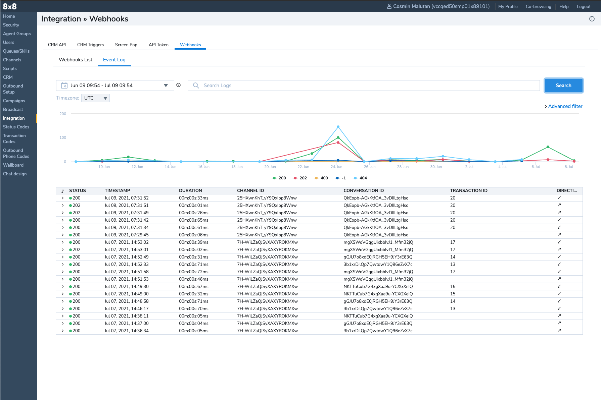
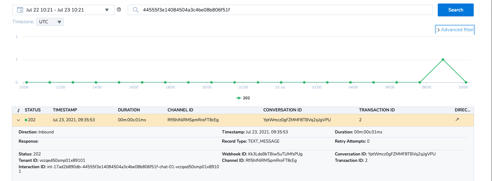

# Troubleshooting

> ❗️ **PLEASE NOTE - This API is going to be deprecated on 30th September 2023, it will no longer work after this date. Please use our [Chat Gateway](/actions-events/docs/chat-gateway) which offers all of the Chat API's functionalities as well as additional features.**
>
>

## Event Log

You can access the **Event Log** in **[Configuration Manager](https://docs.8x8.com/8x8WebHelp/VCC/configuration-manager-general/content/cfgoverview.htm) > Integration > Webhooks > Event Log** for issue notification to help you troubleshoot your Chat implementation.

In this view, you can see all conversation related requests made to the Chat API marked as **Inbound**. This view also includes all the requests that 8x8 made to your webhook URL (**[Setup](/contactcenter/docs/workflow#setup-flow)**), marked in this view as **Outbound** in **Direction** column.

## Properties

The records listed in **Event Log** contain the following properties:

| Property        | Type                                                                                                                                                                                                       | Description                                                                                                                                                                                                                                                                                                                                                                                                      |
| --------------- | ---------------------------------------------------------------------------------------------------------------------------------------------------------------------------------------------------------- | ---------------------------------------------------------------------------------------------------------------------------------------------------------------------------------------------------------------------------------------------------------------------------------------------------------------------------------------------------------------------------------------------------------------- |
| Direction       | Enum:    - Outbound    - Inbound                                                                                                                                                       | This describes the direction of the request from 8x8's perspective:   - **Outbound** - 8x8 requests made on your Webhook  - **Inbound** - requests you make towards the Chat API                                                                                                                                                                                                             |
| Status          | Status codes according to HTTP protocol, defined in [RFC 2610](https://datatracker.ietf.org/doc/html/rfc2616#section-10).                                                                                  | The value is either the status returned when 8x8 sends you a notification or the status when the Chat API is called (e.g., create conversation, add message).                                                                                                                                                                                                                                                    |
| Tenant ID       | String                                                                                                                                                                                                     | The tenant ID provided by 8x8.                                                                                                                                                                                                                                                                                                                                                                                   |
| Interaction ID  | String                                                                                                                                                                                                     | The Interaction ID provides routing information. When a chat interaction is being offered to an agent, it has the reference to the conversation resource, and the agent joins the conversation.    This value can be missing on the first event as the interaction is being created after the conversation. You can find it in the events and correlate it with the conversation ID.                   |
| Response        | String                                                                                                                                                                                                     | The response body                                                                                                                                                                                                                                                                                                                                                                                                |
| Timestamp       | **`MMM DD, YYYY, HH:MM:SS`**                                                                                                                                                                               | The request timestamp                                                                                                                                                                                                                                                                                                                                                                                            |
| Record Type     | Enum:   - **`VERIFY_WEBHOOK`** - **`START_CUSTOMER`** - **`CUSTOMER_REJOINED`** - **`CUSTOMER_LEFT`** - **`TEXT_MESSAGE`** - **`AGENT_JOINED`** - **`AGENT_LEFT`** | The record type contains the operation represented in the event.                                                                                                                                                                                                                                                                                                                                                 |
| Webhook ID      | String                                                                                                                                                                                                     | The webhook ID for the conversation. See **[Webhooks](/contactcenter/docs/create-a-webhook)**                                                                                                                                                                                                                                                                                                                    |
| Channel ID      | String                                                                                                                                                                                                     | The ID of the Channel that relates to the conversation. See **[Channels](/contactcenter/docs/create-a-chat-api-channel)**                                                                                                                                                                                                                                                                                        |
| Conversation ID | String                                                                                                                                                                                                     | The ID of the conversation, see **[Conversations](/contactcenter/docs/conversation)**                                                                                                                                                                                                                                                                                                                            |
| Transaction ID  | Number                                                                                                                                                                                                     | The Transaction ID is a unique identifier that overlaps with the interaction ID. This one can be used by an agent handling a conversation, if something was wrong and further investigation is recommended.    See **[How to get transaction ids in 8x8 Contact Center](https://support.8x8.com/cloud-contact-center/virtual-contact-center/agents/how-to-get-transaction-ids-in-8x8-contact-center)** |
| Duration        | 00m:00s:00ms                                                                                                                                                                                               | How long the request takes.                                                                                                                                                                                                                                                                                                                                                                                      |
| Retry Attempts  | Number                                                                                                                                                                                                     | The number of Outbound requests that are unsuccessful. The number value indicates the attempted retry.                                                                                                                                                                                                                                                                                                           |

### Search

You can search for a particular event in the search bar and use the located event to extract information for further review and analysis.

### Filters

You can filter using [properties](#properties).

To expand the filter view, click on **Advance filter**. Multiple filtering conditions can be applied using **logical operators** such as **`and`** and **`or`** to group them.

Conditions in filters are made of **relation operators** such as **`equals`**, **`not equal`**, **greater than**, **`greater than or equal to`**, **`less than`** or **`less than or equal to`**.

> 📘Note:
>
> Record [**properties**](#properties) contain different data types, so not all relation operators apply.
>
> For example:
>
> * **enums** - only equals or not equals
> * **string** - only equals or not equals
> * **number** - all relation operators
>
