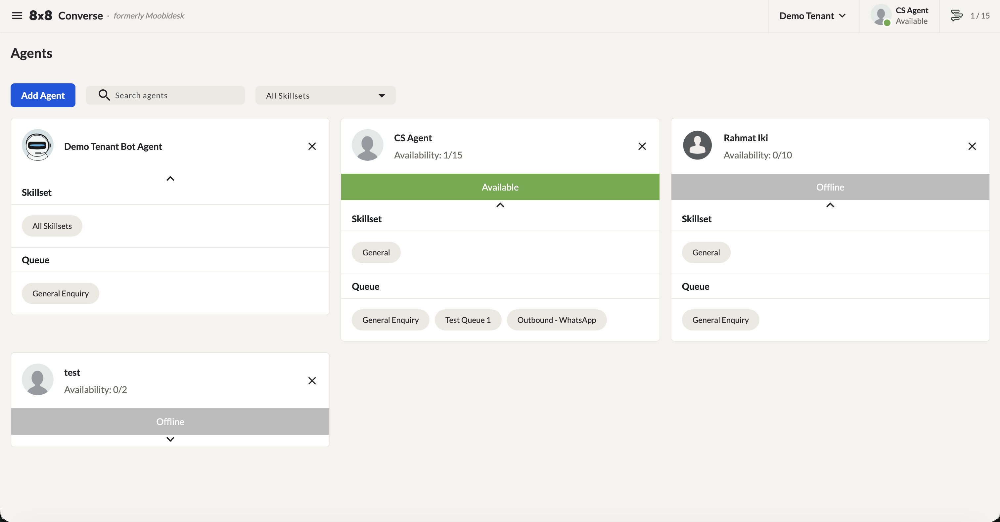
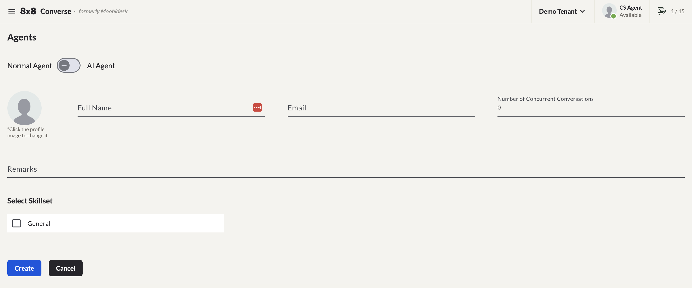
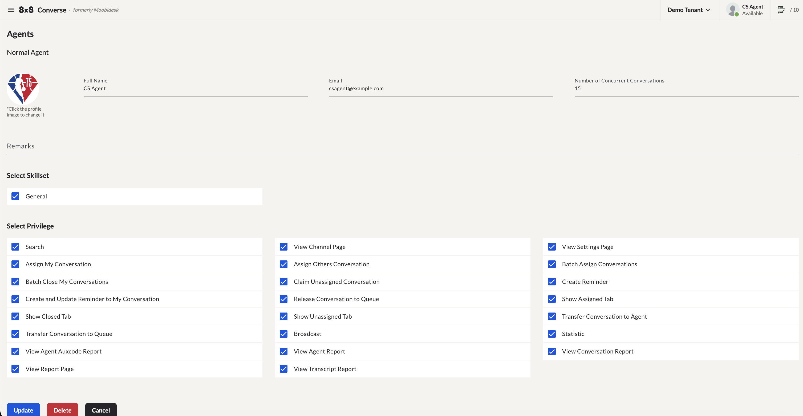

# Agent Management

The Agents page displays all agent accounts in your Converse organization.

## Agent List

Each agent card shows:

- **Name and profile picture**
- **Availability** — current active conversations out of the agent's maximum concurrent limit (e.g. `0/15`)
- **Status bar** — the agent's current status (Available, Away, Offline)
- **Skillset** — all skill tags assigned to the agent
- **Queue** — all queues the agent is eligible for, based on matching skill sets

Use the search bar to find an agent by name, or the **All Skillsets** dropdown to filter the list to agents with a specific skill set.

### Status Indicators

| Status | Description | Chat Assignment |
|--------|-------------|-----------------|
| **Available** | Ready to receive conversations | Enabled |
| **Away** | Any Aux Code selected — whether it's the default "Away" or a custom aux code created by a Manager (e.g. "Busy", "Lunch", "Training") | Disabled |
| **Offline** | Not logged in | Disabled |

## Creating an Agent

1. Navigate to **Agents → Add Agent**.
2. Choose **Normal Agent** or **AI Agent** using the toggle.
3. Enter the agent's **Full Name** and **Email**.
4. Set **Number of Concurrent Conversations** — the maximum number of conversations the agent can handle at the same time.
5. Optionally add **Remarks**.
6. Under **Select Skillset**, check all skill tags that apply to the agent.
7. Click **Create**.

## Editing an Agent

Select an agent from the list to open their profile. Editable fields include:

- Full Name, Email, Number of Concurrent Conversations, Remarks
- **Select Skillset** — the skill tags assigned to the agent
- **Select Privilege** — individual permission checkboxes controlling what the agent can do (see below)

Click **Update** to save changes, or **Delete** to remove the agent entirely.

### Select Privilege

The privilege checkboxes on the Edit Agent page control what an agent with the Agent role can see and do. Some privileges depend on others being enabled to actually display their related controls in the interface.

#### Default Additional Privileges

- **Search** — Lets the agent use the conversation search feature.
- **Broadcast** — Lets the agent access the Broadcast menu.
- **Assign My Conversation** — Lets the agent assign their own conversations to another agent or queue. To actually display the assignment options on the conversation page, one or more of the following must also be enabled:
  - **Release Conversation to Queue** — Shows or hides the "Release to queue" option.
  - **Transfer Conversation to Agent** — Shows or hides the "Assign to agent" option.
  - **Transfer Conversation to Queue** — Shows or hides the "Assign to queue" option.
- **Show Unassigned tab** — Lets the agent view the "Unassigned" folder on the Conversations page.
- **Show Assigned tab** — Lets the agent view the "Assigned" folder on the Conversations page.
- **Show Closed tab** — Lets the agent view the "Closed" folder on the Conversations page.

#### Other Additional Privileges

- **Batch Assign Conversations** — Lets the agent multi-select conversations for bulk assignment.
- **Assign Others Conversation** — Lets the agent reassign conversations from another agent (within the "Assigned" folder) to another agent or queue via bulk assignment. This requires **Batch Assign Conversations** to be enabled, along with one or more of the following to display the bulk assignment options:
  - **Transfer Conversation to Queue** — Shows or hides the "Assign to queue" option after selecting conversations.
  - **Transfer Conversation to Agent** — Shows or hides the "Assign to agent" option after selecting conversations.
  - **Release Conversation to Queue** — Shows or hides the "Release to queue" option after selecting conversations.
- **Batch Close My Conversations** — Lets the agent bulk close their own conversations.
- **Claim Unassigned Conversation** — Lets the agent claim conversations from the "Unassigned" folder.
- **Create and Update Reminder to My Conversation** — Lets the agent create and update reminders on their own conversations. To display the reminder options, one or more of the following must also be enabled:
  - **Create Reminder** — Shows or hides the "Reminder" option.
  - **Edit Reminder** — Shows or hides the "Edit" option on an existing reminder.
  - **Delete Reminder** — Shows or hides the "Delete" option on an existing reminder.
- **Create and Update Reminder to Others Conversation** — Lets the agent update reminders on conversations assigned to other agents.
- **View Report Page** — Lets the agent access the Reports page.
- **View Conversation Report** — Grants access to the Conversation Report tab under Reports.
- **View Transcript Report** — Grants access to the Transcript Report tab under Reports.
- **View Agent Report** — Grants access to the Agent Report tab under Reports.
- **View Agent Auxcode Report** — Grants access to the Agent Auxcode Report tab under Reports.
- **Statistic** — Lets the agent access the Statistics page.
- **View Setting Page** — Lets the agent access the Settings page.

## Skill Sets & Aux Codes

Available skill set and aux code options are configured under **Settings → Skill Sets** and **Settings → Aux Codes** — see [Settings & Configuration](/converse/docs/settings). For how skill sets determine which agents can be added to a queue, see [Queue Management](/converse/docs/queue).

## Performance Monitoring

Supervisors and Managers can view agent performance in:

- **Statistics** — Real-time agent activity
- **Agent Report** — Conversations handled, closed, occupancy rate, average handling time
- **Agent Auxcode Report** — Breakdown of time spent in each aux code
