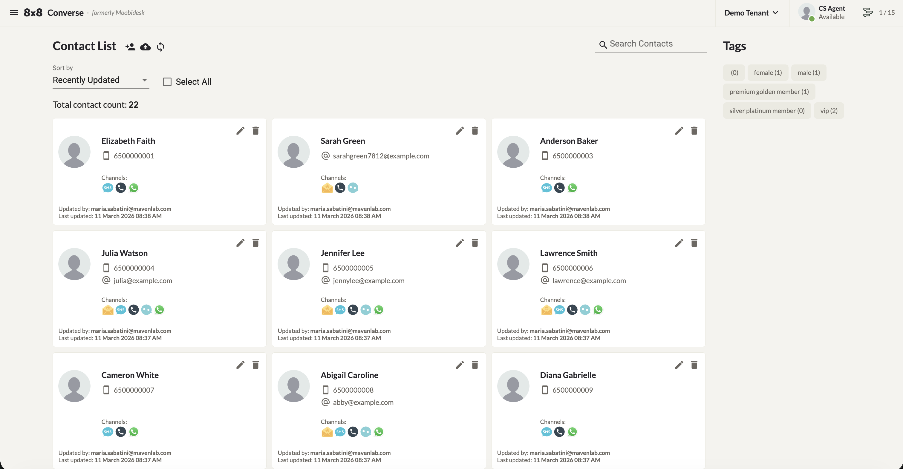
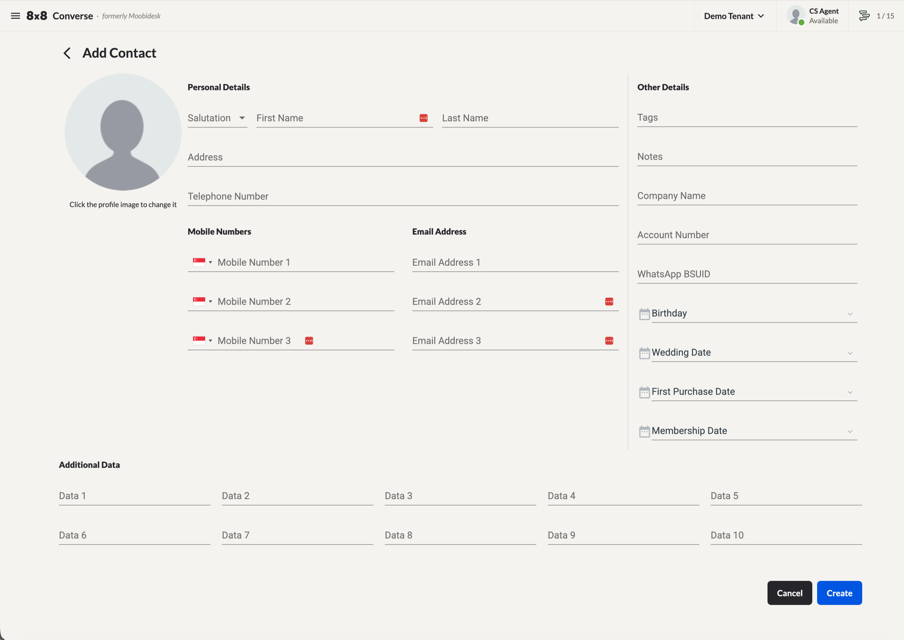
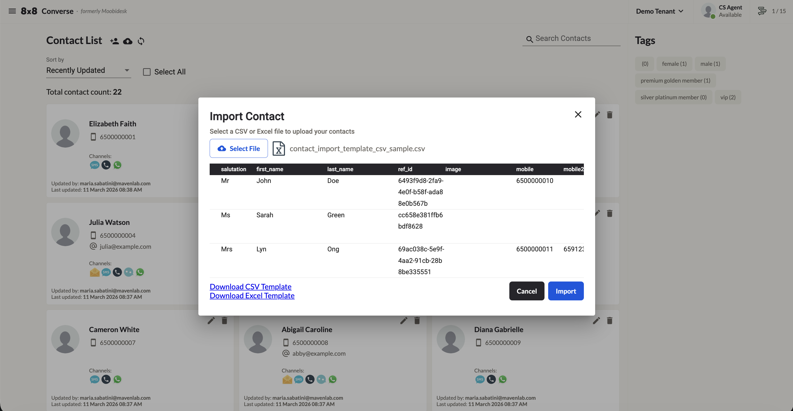

# Contact Management

The Contacts page displays all contacts stored in your Converse account.

## Contact List View

The contact list includes the following controls:

- **Sort By** — Sort contacts alphabetically, by Recently Added, or by Recently Updated.
- **Total Contacts** — Total number of contacts stored.
- **Select All** — Select all displayed contacts for bulk actions (delete or export).
- **Search** — Search by contact name, mobile number, or email.
- **Contact Tags filter** — Shows tags with counts. Click a tag to filter the list. Selecting multiple tags shows contacts matching all selected tags.
- **Contact card** — Each card shows: name, mobile number, email, communication channel, last updated by, and last update timestamp.
- **Pagination** — Navigate through multiple pages.

## Adding a Contact

1. Click the **Add Contact** icon.
2. Fill in the contact's details and click **Create**.

## Editing a Contact

1. Click the **Edit** icon on the contact card.
2. Update the contact's details and click **Update**.

## Exporting Contacts

1. Select the contacts to export, or click **Select All**.
2. Click the **Export Contact** icon.
3. Choose the fields to export (or select **All Fields**) and click **Submit**.
4. A download link will be sent to your email.

## Importing Contacts

Converse uses a specific CSV template for contact imports. Do not remove or rename any column headers.

### Step 1 — Download the template

1. Click the **Import Contact** icon.
2. Click **Download the CSV template** to save it locally.

### Step 2 — Fill in the template

| Field | Description | Example |
|-------|-------------|---------|
| `salutation` | Title (Mr, Mrs, Ms, Miss) | Mr |
| `first_name` | First name | John |
| `last_name` | Last name | Doe |
| `ref_id` | Unique identifier for future updates | cc658e381ffb6bdf8628 |
| `image` | HTTPS URL to profile image (leave blank for default) | `https://…` |
| `mobile` | Primary mobile — country code required, no spaces or special characters | 6599998888 |
| `mobile2` | Secondary mobile | 6598887777 |
| `mobile3` | Tertiary mobile | 6591239876 |
| `email` | Primary email | `johndoe@gmail.com` |
| `email2` | Secondary email | — |
| `email3` | Tertiary email | — |
| `tags` | Contact tag | vip |
| `notes` | Additional notes | Overseas Travel |
| `company_name` | Company name | GovCMS |
| `account_number` | Account number | P273-222-9012 |
| `home_address` | Home address | 123 Ang Mo Kio Ave 7 |
| `home_phone` | Home phone | 6566667777 |
| `birthday` | Birthday (DD/MM/YYYY) | 12/12/1980 |
| `wedding_anniversary` | Wedding date | 02/05/2016 |
| `first_purchase_anniversary` | First purchase date | 06/01/2018 |
| `membership_date` | Membership date | 06/01/2018 |
| `data1` – `data10` | Custom additional fields | Preferred customer |

### Step 3 — Upload the file

1. Click **Select File** and choose the completed template.
2. If the format is invalid, an error message will appear — correct the file and retry.
3. If the format is valid, a preview is shown. Click **Submit** to import or **Cancel** to abort.

## Deleting Contacts

### Delete a single contact

1. Click the **Delete** icon on the contact card.
2. Confirm by clicking **Delete** in the prompt, or **Cancel** to abort.

### Delete multiple contacts

1. Select multiple contacts by clicking their contact cards.
2. Click the **Bulk Delete** icon.
3. Confirm deletion in the prompt.
