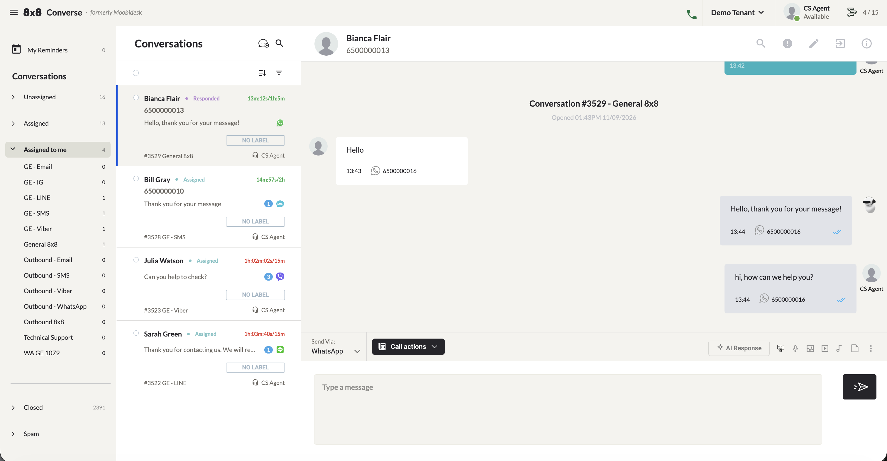
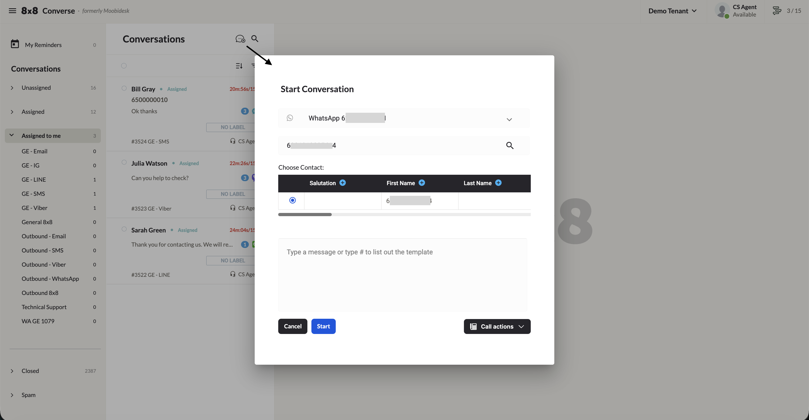
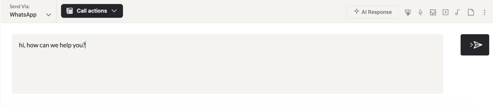
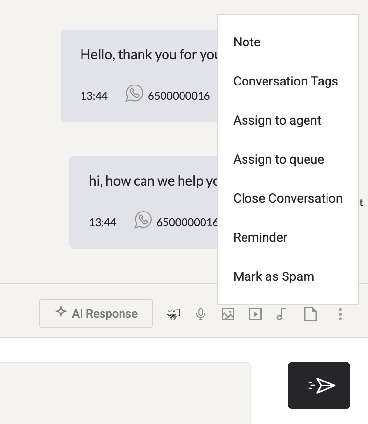
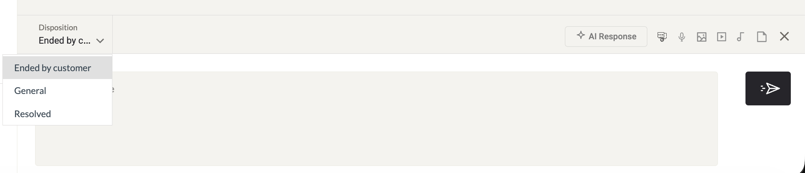
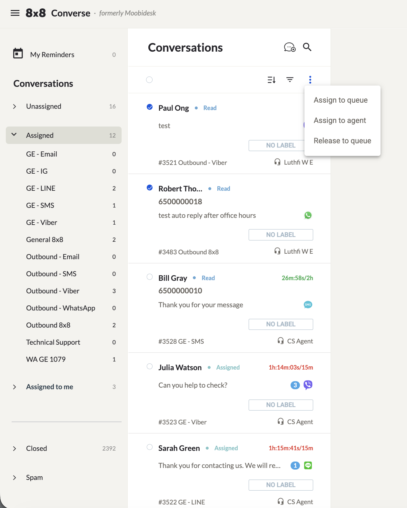

# Conversations

The Conversations (Chats) page is the main workspace for sending and receiving messages across all supported channels — WhatsApp, SMS, Viber, Email, Line, Webchat, Facebook Messenger, and Instagram Messaging. It is the default landing page for all user roles.

## Conversation Folders & Interface

| Folder | Description |
|--------|-------------|
| **Unassigned** | New conversations not yet assigned to any agent. Behavior depends on routing mode — see below. |
| **Assigned** | All conversations assigned to any agent. |
| **Assigned to Me** | Conversations assigned to the current agent. |
| **Sub-Tabs (Queue)** | Selecting a queue sub-tab filters to conversations in that queue. |
| **Closed** | Completed conversations. |
| **Spam** | Conversations marked as spam. To remove, open the conversation and click the unspam option. |
| **My Reminders** | Upcoming reminders you have set on conversations. |

### Routing Modes

- **Pick-Me**: New conversations land in the Unassigned folder. Agents preview and manually claim a conversation to assign it to themselves.
- **Round-Robin**: New conversations are automatically assigned to the next available agent. The Unassigned folder is view-only in this mode.

Each open conversation provides:

- **Conversation ID** — A unique ID (e.g. `#123`) shown at the top of the chat
- **Channel indicator** — Icon showing which channel (WhatsApp, Email, Facebook, etc.) is in use
- **Agent name** — Name of the agent currently handling the conversation
- **SLA timer** — Color-coded timer for each stage and overall SLA (🟢 within SLA, 🟡 approaching SLA limit, 🔴 SLA exceeded)
- **Conversation label** — Click "No Label" to assign a label from the list
- **Concurrent conversation counter** — Shows current active count and maximum (e.g. `2/5`)

## Starting a Conversation

1. Click the **New Conversation** icon in the conversation list column.
2. Select the channel account to send from.
3. Enter the recipient's number.
4. Type your message or retrieve a canned message by typing `#` followed by a keyword.

## Replying to Conversations

- Type in the response box and click **Send** or press **Enter**.
- Retrieve canned messages by typing `#` followed by the associated keyword.
- For the Email channel, a **Signature** selector appears at the bottom of the message field.
- Messages are auto-saved as drafts locally in your browser until sent.

### WhatsApp Delivery Status

| Indicator | Meaning |
|-----------|---------|
| Single grey tick | Sent from Converse but not yet delivered to recipient |
| Double grey tick | Delivered to recipient's device (not yet read, or read receipts off) |
| Double blue tick | Read by recipient (only if read receipts are on) |
| Exclamation mark | Delivery failed — click for failure reason |

## Actions (Three-Dots Menu)

### Create a Note

Add an internal comment visible only to agents — never sent to the customer. Notes can include images, videos, audio, or documents, and appear alongside the conversation thread.

### Add Conversation Tags

Search and select existing tags, or type a new tag name and press **Enter** to create it. Multiple tags can be added per conversation. Click the blue arrow to save or **X** to cancel.

### Set a Reminder

Set a reminder to follow up on a conversation at a later time. Once set, the reminder appears in the **My Reminders** folder, and an email will be sent to the agent at the scheduled time.

### Assign to Agent

1. Click **Assign Agent**.
2. Select the destination agent and click **Next**.
3. Select the queue to group the conversation under and confirm.

### Assign to Queue

1. Click **Assign Queue**.
2. Select the destination queue and click **Next**.
3. Add a note and click **Assign**.

### Close Conversation

1. Click **Close Conversation**.
2. Select a **Disposition** category.
3. Optionally enter a note.
4. Click **Close**.

## Message-Level Actions

Click the three-dots icon next to any individual message to:

- **Reply** — Reply directly to that message.
- **Delete** — Remove the message from the Converse interface only. The message remains visible to the customer.

## Icon Reference

| Icon | Action |
|------|--------|
| Search (conversation list) | Search by phone number, name, or other info |
| Search (in-conversation) | Search message history by keyword within the current conversation |
| Spam | Mark conversation as spam |
| Edit (pencil) | Edit contact information or add tags/notes to the contact |
| Release | Release conversation back to the queue |
| Information | Show/hide the contact information and audit trail panel |

## Bulk Actions

### Bulk Assign / Release

1. Go to the **Assigned** folder.
2. Select all conversations (checkbox at top) or individual conversations.
3. Click the three-dots icon and choose: **Assign to Queue**, **Assign to Agent**, or **Release to Queue**.

### Bulk Close

1. Go to a queue under **Assigned to Me**.
2. Select conversations using their checkboxes.
3. Click the three-dots icon and choose **Close Conversation**.
4. Select a **Disposition**, optionally add a note, and click **Close**.
