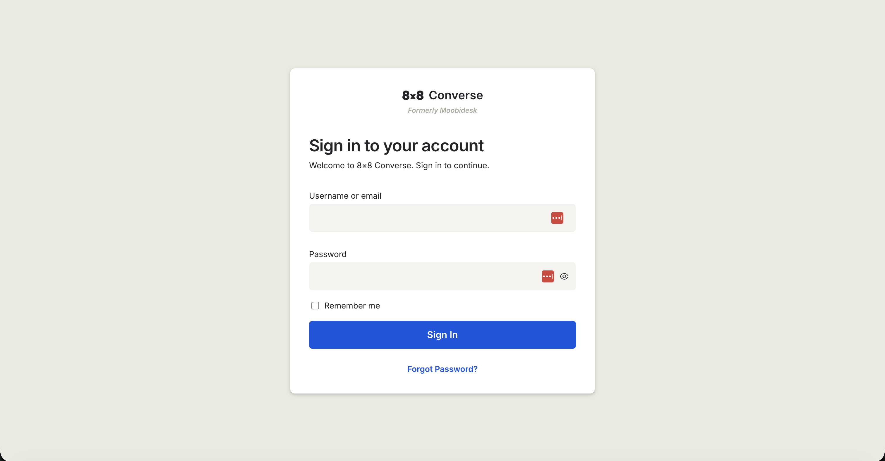
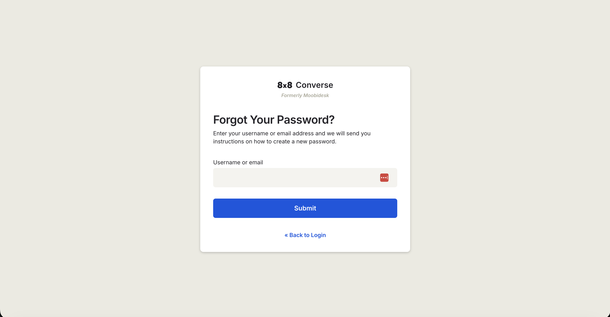
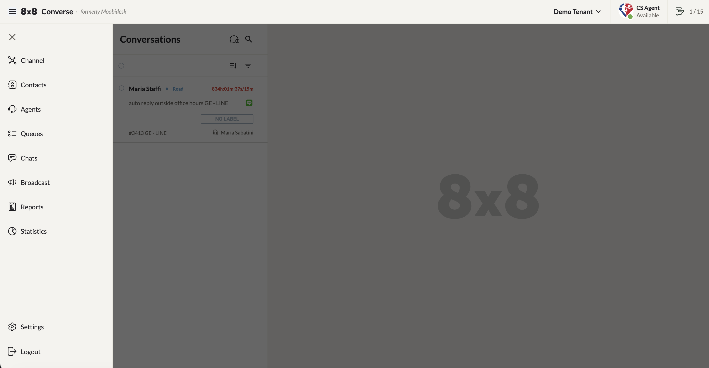
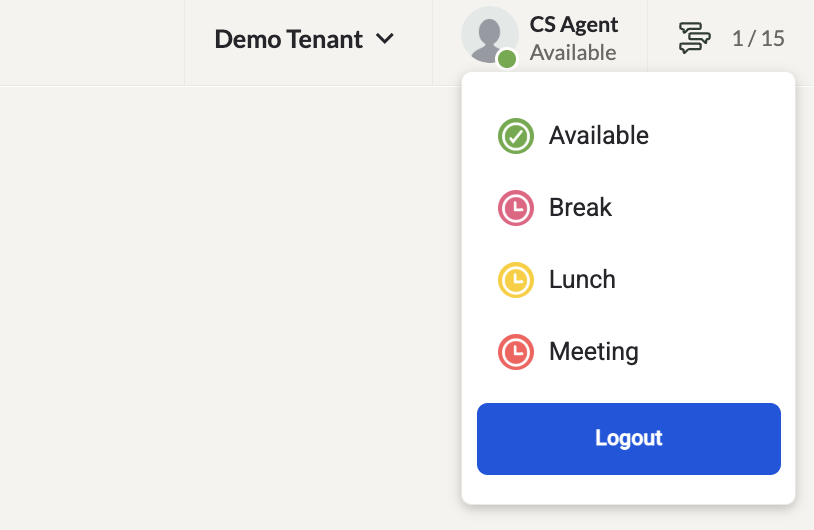

# Getting Started

:::note
**Converse** was formerly known as **Moobidesk**. All functionality is identical — only the product name has changed.
:::

## Login & Access

Access Converse through your organization's URL:

```text
https://e18.moobidesk.com
```

Enter your registered email address and password, then click **Sign In**.



### Forgot your password?

1. Click **Forgot Password?** on the login page.
2. Enter the email address associated with your Converse account and click **Submit**.
3. A password reset link will be sent to your email.
4. Click the link to open the reset page, then enter and confirm your new password.



## Logging Out

Always log out when you finish your session to ensure new messages are not routed to you.

1. Click your profile picture in the top-right corner of the page.
2. Select **Logout** from the dropdown menu.

## Dashboard Overview

The main navigation sidebar provides quick access to all feature areas:



| Module | Description |
|--------|-------------|
| **Channels** | Communication channels integrated into Converse |
| **Contacts** | Customer contact database |
| **Agents** | Agent management and configuration |
| **Queue** | Conversation routing queues |
| **Chats** | Active conversation management (default landing page) |
| **Broadcast** | WhatsApp broadcast campaigns |
| **Reports** | Downloadable performance reports |
| **Statistics** | Real-time conversation analytics |
| **Settings** | System configuration |

## Status & Capacity Indicator

The top-right corner of the header bar displays:

- Your current availability status (Available, Busy, Away, or a custom Aux Code), shown beneath your name. Click to change status.
- Your concurrent conversation count and the maximum you can handle — e.g. `1/15`.



## Browser & Device Requirements

- **Desktop browsers**: Chrome (recommended), Firefox, Safari
- **Mobile**: iOS (Apple App Store) and Android (Google Play Store)

## Channel Support

Converse supports multi-channel engagement across:

- WhatsApp
- SMS
- Viber
- Email
- Line
- Webchat
- Facebook Messenger
- Instagram Messaging

## Next Steps

- Learn about [user roles & permissions](/converse/docs/user-roles)
- Set up your [agents](/converse/docs/agents)
- Configure [queue routing rules](/converse/docs/queue)
