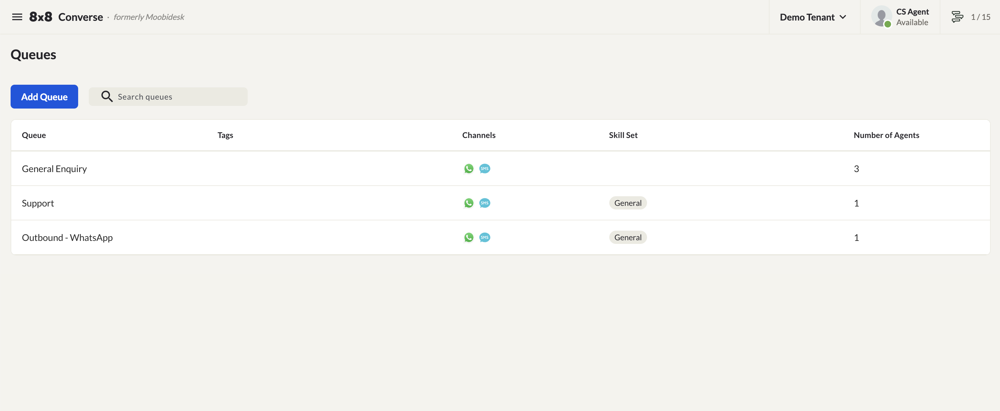
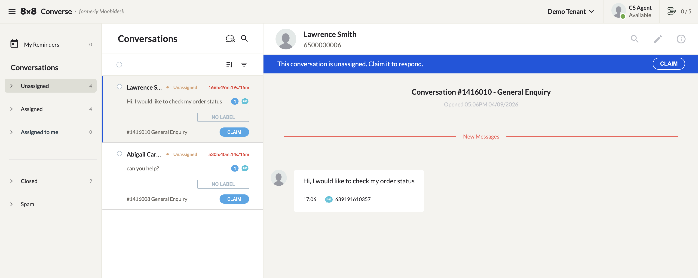
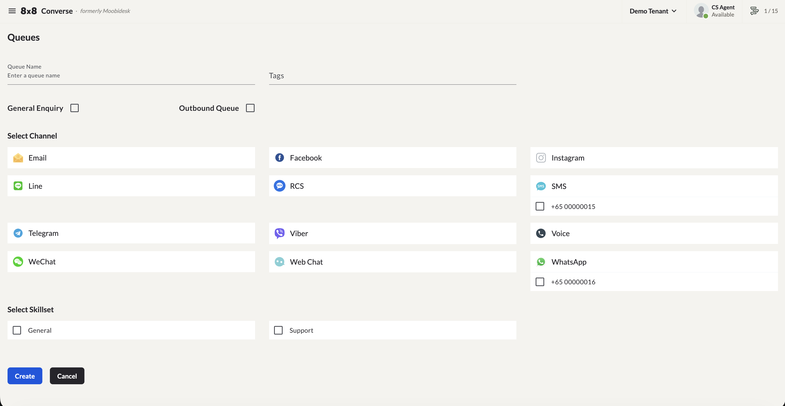
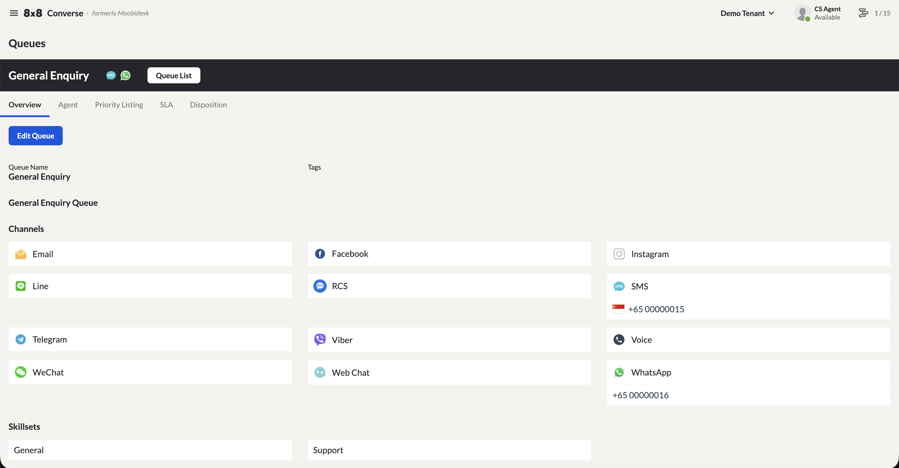

# Queue Management

Converse uses queues to control how conversations reach agents. Every conversation lives in exactly one queue at a time, and every service has one routing model that decides how conversations inside any queue get assigned to agents.

## Queue Types

There are three types of queue:

| Type | Purpose |
|------|---------|
| **General Enquiry** | The entry point for every new inbound conversation. Every new conversation lands here first, then is assigned to any available agent in the queue. |
| **Regular / Destination Queue** | Used to hand a conversation to a specific team — for department- or skill-based handling. Conversations only reach these queues when transferred here from another queue. |
| **Outbound** | Required for an agent to start a conversation with a customer. Only agents assigned to an Outbound queue can initiate outbound conversations. |

## How a Conversation Reaches a Queue

1. A customer sends a message to a connected channel account.
2. If they already have an active conversation, the message is appended to it — no new queue routing happens.
3. If not, a new conversation is created in the **General Enquiry** queue.
4. The service's routing model (Round Robin or Pick-Me) takes over from there to get it to an agent.

From General Enquiry, a conversation can be transferred to a Regular / Destination Queue — for example, to route it to a specialized team. Once it lands in a queue, the same routing model applies again to assign it to an agent there.

## Routing Models

A service is configured with exactly one routing model — Round Robin or Pick-Me — and every queue in that service follows it.

### Round Robin

Conversations are automatically assigned to eligible agents during business hours. Outside business hours, a conversation stays Unassigned and is picked up automatically once business hours reopen.

To be eligible for automatic assignment, an agent must:

- Have their status set to **Available**
- Be within their maximum concurrent conversation limit
- Share the queue's assigned skill set (see below)

Within a queue, agents can also be given a priority from 1 (highest) to 5 (lowest). Converse checks for an eligible agent starting at Priority 1, then works down through 2, 3, 4, and 5. If no eligible agent is found at any level, the conversation remains Unassigned.

### Pick-Me

Conversations stay in the Unassigned folder with no automatic distribution — an agent claims one manually by opening Unassigned and clicking **Claim**.

## Skill Sets

A skill set is what links agents to queues. It's attached to an agent when the agent is created, and to a queue when the queue is created — so when you go to add agents to a queue, only agents sharing that skill set are selectable. This is the mechanism that keeps, say, a "Technical Support" queue staffed only by agents equipped to handle it.

## Creating a Queue

1. Navigate to **Queues → Add Queue**.
2. Enter the **Queue Name** and select the **Queue Type**.
3. Select the **Assigned Channels** and the required **Skill Set**.
4. Click **Create**.

Once created, open the queue to configure it further across four tabs: **Agents**, **Priority Listing**, **Disposition**, and **SLA**.

- **Agents** — Assign agents to the queue. Only agents sharing the queue's skill set will appear.
- **Priority Listing** — Set each assigned agent's priority.
- **Disposition** — Set the disposition (category) options available when agents close conversations in this queue.
- **SLA** — Set the SLA for each channel account assigned to the queue. Each queue can have its own SLA targets:
  - **Assigned** — Time to assign the conversation to an agent
  - **Read** — Time for the agent to read it
  - **Responded** — Time for the agent to respond
  - **Closed** — Total time from assignment to closure (must be ≥ the sum of the other three)

Conversations are color-coded against these targets:

- 🟢 **Green** — Within SLA
- 🟡 **Yellow** — Approaching SLA limit
- 🔴 **Red** — SLA exceeded
