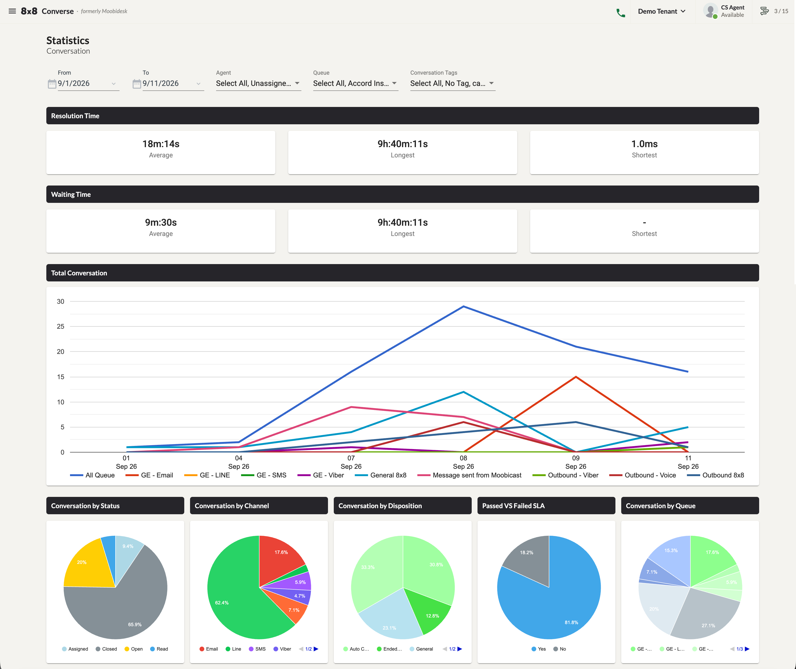
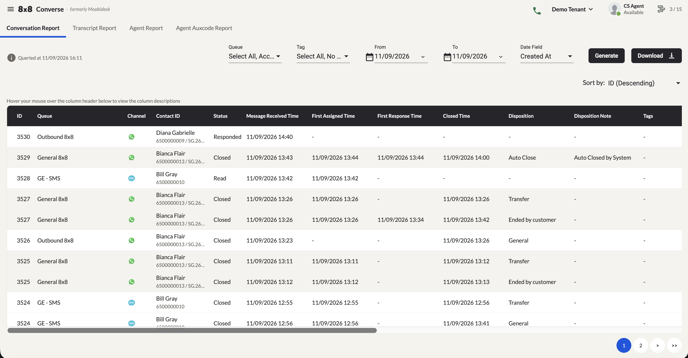

# Reports & Statistics

Converse provides four downloadable historical reports and a real-time statistics dashboard.

## Statistics Dashboard

The Statistics page shows a visual overview of conversation activity for any selected date range.

Available filters: **Date Range**, **Agent**, **Queue**, **Conversation Tag**.

### Metrics Displayed

- **Time metrics** — Resolution Time and Waiting Time, each showing Average, Longest, and Shortest values.
- **Conversation Trends** — Total conversation volume over time in a trend chart, comparable across queues.
- **Conversation Breakdowns** — By Status, Channel, Disposition, Queue, and SLA Result (Passed vs Failed).

## Downloadable Reports

Navigate to the Reports page. Four report types are available under separate tabs.

### Conversation Report

Filter by: queue and date range. Tracks:

- Communication Channel · Message Received time
- First Assigned and First Responded timestamps
- Closed time · Disposition · Handling Agent name
- Total Wait time · SLA compliance result (Met / Missed)

### Transcript Report

Filter by: case ID and date range. Captures all incoming and outgoing messages exchanged between agents and customers.

### Agent Report

Filter by: queue and date range. Tracks per agent:

- Total conversations assigned · Total conversations closed
- Occupancy rate · Average handling time

### Agent Auxcode Report

Filter by: agent name, auxcode, and date range. Tracks each agent's away status activity.

## Exporting Report Data

1. Navigate to the desired report tab.
2. Apply the required filters.
3. Select records using the checkboxes.
4. Click **Download Report** to save to your local directory, or **Download to Email** to receive a download link by email.
5. Download progress is shown in the bottom-right corner.
6. Files download as a ZIP archive containing summary and detail files where applicable.
