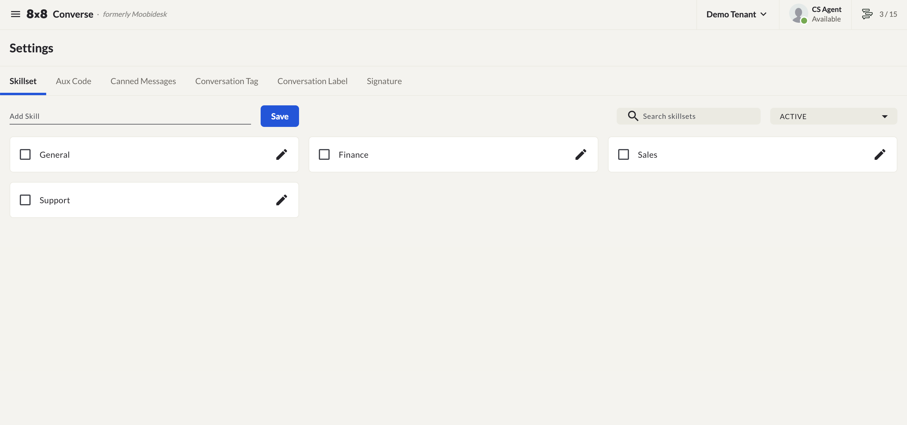
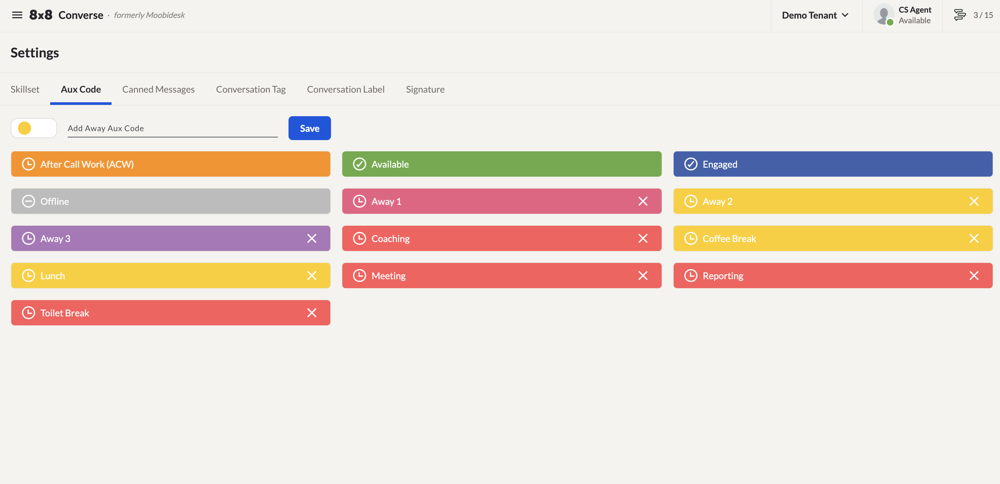
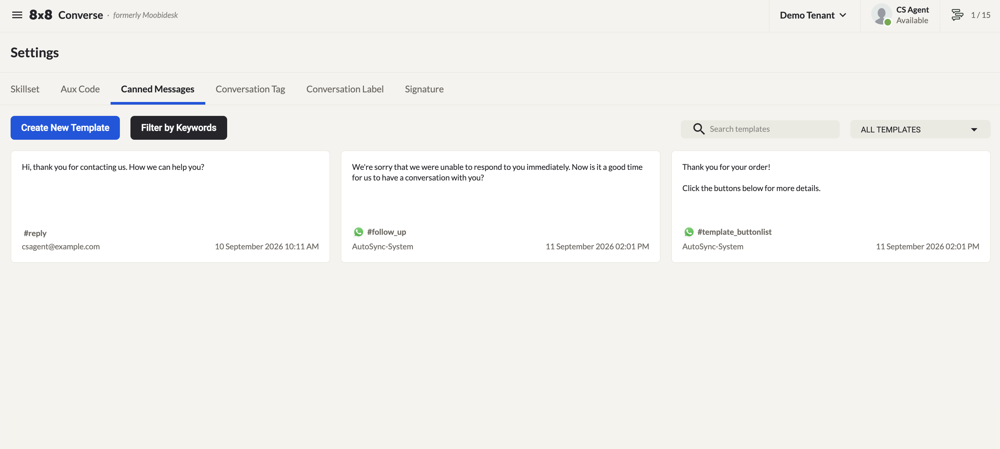
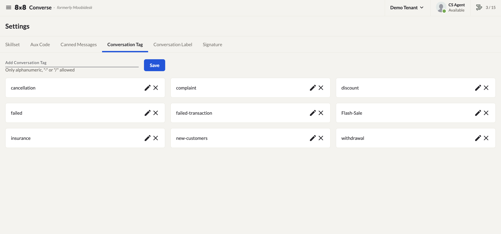
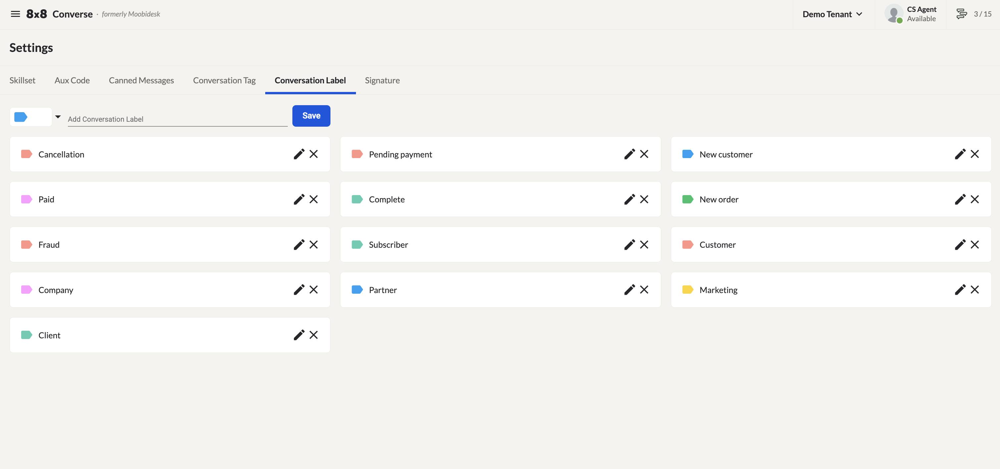
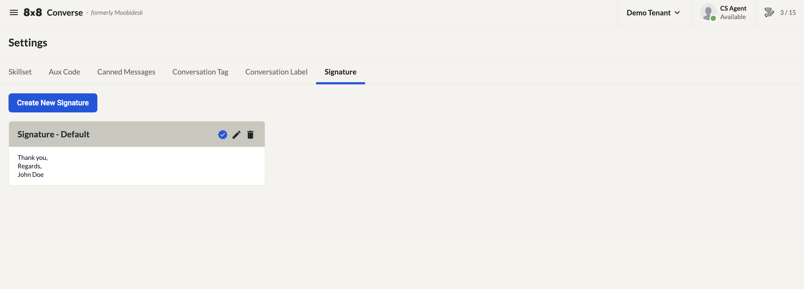

# Settings & Configuration

The Settings page lets you configure Skill Sets, Aux Codes, Canned Messages, Conversation Tags, Conversation Labels, and Email Signatures.

## Skill Sets

A skill set is the mapping between agents and queues: it's attached to an agent when the agent is created, and to a queue when the queue is created. When adding agents to a queue, only agents sharing that queue's skill set appear as selectable. See [Queue Management](/converse/docs/queue) for how this fits into queue setup.

### Adding a Skill Set

1. Navigate to **Settings → Skill Sets**.
2. Enter the skill name in the **Add Skill** field.
3. Click **Save**.

Skill sets can be archived rather than permanently deleted. View archived items by selecting the **ARCHIVED** filter.

## Auxiliary (Aux) Codes

An aux code is a named status indicating that an agent is temporarily unavailable to receive messages.

1. Navigate to **Settings → Aux Codes**.
2. Select a color from the dropdown.
3. Enter a name in the **Add Away Aux Code** field.
4. Click **Save**.

## Canned Messages

Use this page to create and manage pre-written response templates, including WhatsApp template messages.

### Adding a Canned Message

1. Click the **+** icon.
2. Enter the message text.
3. Assign one or more keywords.
4. Click **Create**.

### Retrieving Canned Messages in Conversations

In the conversation reply box, type `#` followed by a keyword associated with the canned message to retrieve it instantly.

### WhatsApp Template Messages

WhatsApp template messages must be approved by Meta before use. Submit your templates through your company's Meta Business Account for approval. Once approved, they will be automatically synced into your canned messages every hour.

## Conversation Tags

Conversation tags help categorize and filter conversations.

- **Add**: Enter the desired tag name in the **Add Conversation Tag** field and click **Save**.
- **Edit**: Click the pencil icon next to the tag, update the name, and click **Save**.
- **Delete**: Click the **X** icon next to the tag and confirm deletion.

## Conversation Labels

Conversation labels provide a workflow management marker for conversations.

- **Add**: Enter the desired label name in the **Add Conversation Label** field and click **Save**.
- **Edit**: Click the pencil icon next to the label, update the name, and click **Save**.
- **Delete**: Click the **X** icon next to the label and confirm deletion.

## Email Signatures

Manage email channel signatures on this page. Multiple signatures can be created, and one can be set as the default.

### Creating an Email Signature

1. Click **New Signature** (or the **+** icon).
2. Fill in the following fields:

| Field | Description |
|-------|-------------|
| **Signature Name** | Label shown in the signature selector when composing an email |
| **Signature Body** | The text content appended to the bottom of outgoing emails |
| **Choose File** | Upload an image to include below the signature text |
| **Set as Default** | Enable to automatically apply this signature to outgoing messages |

3. Click **Submit** to save, or **Cancel** to discard.

### Managing Existing Signatures

- Click **Set as Default** to make a signature the default for all outgoing emails.
- Click the **Edit** button to update content, then **Submit** to save.
- Click the **Delete** button to remove a signature.
