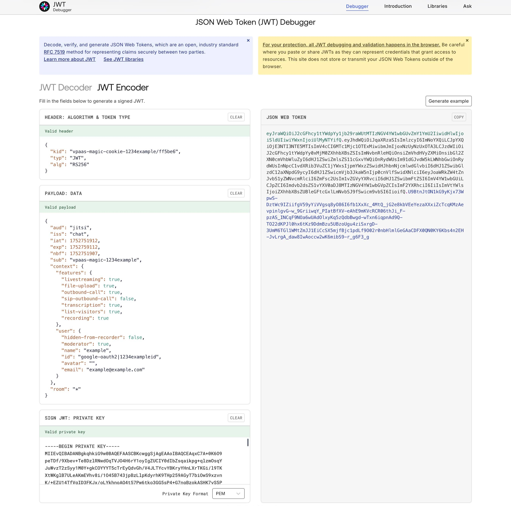

# The Jitsi JSON Web Token (JWT)

## Integration

For each user endpoint you enable for a meeting, you must generate a JWT token and sign it with a Private Key.

The JWT token is passed as a parameter to either the IFrame or Mobile SDK as described in the following sections.

## The Jitsi JWT

The header of the JWT contains 3 claims:

* #### **`alg`**

The algorithm used for signing the JWT
* #### **`kid`**

The kid listed for the uploaded API Key see [Generating the API key](/jaas/docs/api-keys-generate-add)
* #### **`typ`**

The JWT type

For example:

```
{
  "alg": "RS256",
  "kid": "vpaas-magic-cookie-1fc542a3e4414a44b2611668195e2bfe/4f4910",
  "typ": "JWT"
}

```

The following claims are expected in the JWT body:

* #### **`aud`**: **`“jitsi”`**

This value is hardcoded in the body
* #### **`context`**:

	+ #### **`user`**:
	
	
		- #### **`id`**
		
		
		The user's unique identifier
		- #### **`name`**
		
		
		The user name
		- #### **`avatar`**
		
		
		 The publicly available URL that points to the user avatar picture
		- #### **`email`**
		
		
		The user email
		- #### **`moderator`**
		
		
			* If the user is the moderator set to **`“true“`**
			* If this value is missing or is set to **`“false“`** the user will not have moderator permissions.
		- #### **`hidden-from-recorder`**
		
		
		If set to true, the user will not show up on meeting recording/streaming.
	+ #### **`features`**
	
	
	 The permissions given to the user for accessing specified features.
		- The key represents the permission name. The value can be either **`“true“`** or **`“false“`**.
		- #### Supported keys:
		
		
			* #### **`livestreaming`**
			* #### **`recording`**
			* #### **`transcription`**
			* #### **`sip-inbound-call`**
			* #### **`sip-outbound-call`**
			* #### **`inbound-call`**
			* #### **`outbound-call`**
			* #### **`file-upload`**
			* #### **`list-visitors`**
		- #### Additional supported keys (related to special chat and polls permissions set through advanced branding):
		
		
			* #### **`send-groupchat`**
			
			
			Whether the moderator can send group chat messages if [group chat requires permission](/jaas/docs/jaas-prefs-advanced-branding#groupchatrequirespermission).
			* #### **`create-polls`**
			
			
			Whether the moderator can create polls if [creating polls requires permission](/jaas/docs/jaas-prefs-advanced-branding#pollcreationrequirespermission).
	+ #### **`room`**
	
	
	 (optional) The configuration at the room level.
		- **`regex`**: If the value is **`true`** the room field from below can be a regex otherwise a literal match between the room name and the room claim from jwt will be performed.
* #### **`exp`**

The time after which the JWT expires
* #### **`iss`**: **`“chat”`**

This is a hardcoded value
* #### **`nbf`**

The time before which the JWT must not be accepted for processing
* #### **`room`**

 This field is the meeting room name if a literal comparision is needed, a regex if the condition from above is met or a wildcard (**“\*”**) if the token is issued for all rooms. Please review the `string.match()` method described in the [PatternsTutorial](http://lua-users.org/wiki/PatternsTutorial) for regex usage. Note the use of special symbols such as **“-”** that must be escaped with **“%”**.
* #### **`sub`**

 The AppID unique identifier (see [Webhooks](/jaas/docs/webhooks-overview) for more information)

For example:

```
{
  "aud": "jitsi",
  "context": {
    "user": {
      "id": "0f8b7760-c17f-4a12-b134-c6ac37167144",
      "name": "John Doe",
      "avatar": "https://link.to/user/avatar/picture",
      "email": "user@example.com",
      "moderator": "true"
    },
    "features": {
      "livestreaming": false,
      "outbound-call": false,
      "transcription": false,
      "recording": false
    },
    "room": {
      "regex": false
    }
  },
  "exp": 1696284052,
  "iss": "chat",
  "nbf": 1596197652,
  "room": "*",
  "sub": "vpaas-magic-cookie-1fc542a3e4414a44b2611668195e2bfe"
}

```

For the above examples, a JWT example can be found on the [jwt.io](https://jwt.io/) Auth0 JWT site and accessing the [debugger](https://jwt.io/#debugger-io?token=eyJhbGciOiJS) as shown in the following screenshot:



