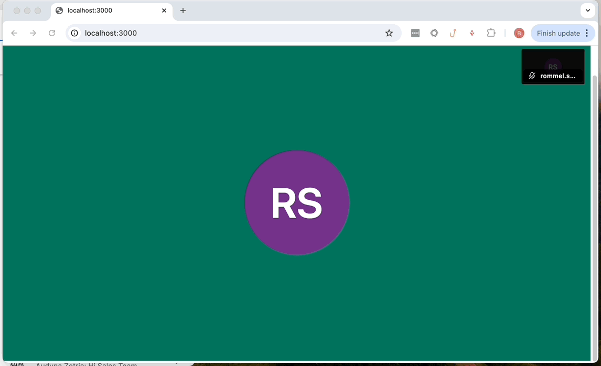

# Tutorial: Using Custom Buttons with the Iframe API

## Overview

In this tutorial, we will explore how to add custom buttons to the Jitsi Meet iframe to enhance user interaction during video conferencing. While Jitsi provides a robust set of built-in controls, there are scenarios where custom buttons can improve the user experience or integrate additional functionality.

**Why Use Custom Buttons?**

* **Customization:** Tailored interface for your application.
* **Feature Integration:** Allow/disallow certain actions based on events on your application.

## Requirements

* JaaS account
* Basic knowledge in JavaScript and HTML to use the sample code provided.

## Jitsi Iframe Code

The code below shows an example of a modified Iframe API code where there are buttons for Mute Camera and Mute Microphone that are separated from the JaaS Iframe interface.

> 📘 **Placeholders**
>
> Replace **{jaas_application_id}** and **{jaas_room_name}** in server.js below with the appropriate values from your application. Appropriate default values can be found by signing into your JaaS console at [https://jaas.8x8.vc/#/](https://jaas.8x8.vc/#/) and copying values from the Iframe code example.
>
>

index.html

```html
<!DOCTYPE html>
<html>

<head>
    <script src='https://8x8.vc/{jaas_application_id}/external_api.js' async></script>
    <style>
        html,
        body,
        #jaas-container {
            height: 100%;
            margin: 0;
        }

        #button-container {
            display: flex;
            justify-content: center;
            align-items: center;
            background-color: #f1f1f1;
            padding: 10px;
            box-shadow: 0 2px 5px rgba(0, 0, 0, 0.1);
            display: none;
            /* Hide the button container initially */
        }

        button {
            margin: 0 10px;
            padding: 10px 15px;
            background-color: #007bff;
            color: white;
            border: none;
            border-radius: 5px;
            cursor: pointer;
            transition: background-color 0.3s;
        }

        button:hover {
            background-color: #0056b3;
        }
    </style>
    <script type="text/javascript">
        let api;

        window.onload = () => {
            api = new JitsiMeetExternalAPI("8x8.vc", {
                roomName: "{jaas_application_id}/{room_name}",
                parentNode: document.querySelector('#jaas-container')
            });

            // Listen for the videoConferenceJoined event
            api.addEventListener('videoConferenceJoined', () => {
                document.getElementById('button-container').style.display = 'flex'; // Show buttons when local participant joins
            });

            document.getElementById('mute-mic').onclick = () => api.executeCommand('toggleAudio');
            document.getElementById('mute-camera').onclick = () => api.executeCommand('toggleVideo');
        }
    </script>
</head>

<body>
    <div id="button-container">
        <button id="mute-mic">Toggle Mute Mic</button>
        <button id="mute-camera">Toggle Mute Camera</button>
    </div>
    <div id="jaas-container"></div>
</body>

</html>

```

The important changes to the default iframe code are outlined below for convenience.

First we create a **div** for the buttons in the index.html.

Buttons <div>

```html
<div id="button-container">
  <button id="mute-mic">Toggle Mute Mic</button>
  <button id="mute-camera">Toggle Mute Camera</button>
</div>

```

Second we listen for the local participant to join the JaaS room before loading the buttons, otherwise it may show in the prejoin lobby.

Load Buttons on Room Join

```javascript
api.addEventListener('videoConferenceJoined', () => {
  document.getElementById('button-container').style.display = 'flex'; // Show buttons when local participant joins
});

```

Third we add the functionality to those buttons by adding **onclick()** events and calling the appropriate Iframe API methods, in this case toggleAudio and toggleVideo.

onClick Event

```
document.getElementById('mute-mic').onclick = () => api.executeCommand('toggleAudio');
document.getElementById('mute-camera').onclick = () => api.executeCommand('toggleVideo');

```

Through this code the buttons are able to call functionality from the Iframe API.

## Backend Server

While the backend server does not have any influence on the custom buttons, we include a sample Node.js backend for convenience. This can be replaced with any backend of your choice.

server.js

```
const express = require('express');
const app = express();
const PORT = 3000;

// Serve the HTML file
app.get('/', (req, res) => {
  res.sendFile(__dirname + '/index.html');
});

app.listen(PORT, () => {
  console.log(`Server is running at http://localhost:${PORT}`);
});

```

## Running the Application

To run the application use the following lines of code:

Run Server Commands

```
npm init -y
npm install express
node server.js

```

We should see following application hosted at **<https://localhost:3000>**


When the **Toggle Mute Mic** button is clicked, our local participant's mic icon toggles on the top right. When the **Toggle Mute Camera** button is clicked then the video feed is toggled on off, signified by the black screen appearing momentarily.

## Conclusion

In this tutorial we covered how to add custom buttons outside of the Iframe API's interface. You may also wish to make changes to the actual iframe API (such as disabling buttons) which can easily be done using the [toolbarButtons](customize-ui-buttons) option in configOverwrite for example. Additionally, you can call different functions from the Iframe API. Feel free to adapt these concepts shared in this tutorial to fit your use case.
