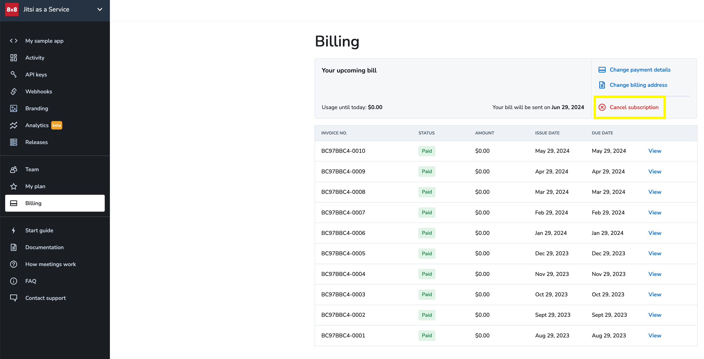

# FAQ

8x8 Jitsi as a Service (JaaS) is an enterprise-ready video meeting platform that allows developers, organizations, and businesses to easily build and deploy video solutions. Jitsi’s powerful global platform helps you deliver secure, branded video experiences to your audience. The following FAQ provides details on how we deliver, secure, and support customizations for this service.

## General

Access general information and common questions about Jitsi as a service.

## What codecs are supported by JaaS? [codecs / network]

By default we use opus and vp8; we may switch to other codecs like vp9, when the conditions are optimal.

## Do I need to configure a TURN server if using JaaS Pro? [network]

No. We handle that for you, which is one of the advantages of using JaaS vs. your own build.

## Is there an API available to retrieve dial-in numbers and PIN codes? [dial-in / numbers / sip / pstn]

JaaS provides the APIs to retrieve PIN codes and DIDs. Please see the [dial-in documentation](/jaas/docs/jaas-prefs-dial-in) for more information. 

```
**For the Meeting ID - HTTP GET**
https://8x8.vc/v1/_jaas/vmms-conference-mapper/v1/access?conference=  
**YOUR_MEETING_NAME**@conference.**YOUR_VPAAS_MAGIC_COOKIE**.8x8.vc
**Response:**  
{"message":"Successfully retrieved conference mapping","id":"**YOUR_MEETING_ID**”,  
”conference":"**YOUR_MEETING_NAME**@conference.**YOUR_VPAAS_MAGIC_COOKIE**.8x8.vc",  
"url":"**YOUR_VPAAS_MAGIC_COOKIE/YOUR_MEETING_NAME**",  
"fqn":"**YOUR_VPAAS_MAGIC_COOKIE/YOUR_MEETING_NAME**","name":"**YOUR_MEETING_NAME**",  
"tenant":"**YOUR_VPAAS_MAGIC_COOKIE**","hasPasscode":false}            **For the DIDs List - HTTP GET**  
**YOUR_CONFERENCE_URL**  
```

## What is the maximum number of participants in one meeting?

JaaS allows a maximum of 500 participants per meeting. But if you want more, you can always opt for streaming your meeting to achieve an unlimited number of viewers.

To reach a larger number of viewer-only participants, JaaS supports streaming directly to YouTube or to an RTMP destination of your choice.

## Maximum concurrent meetings?

There is no limit to the number of concurrent meetings.

## How can we technically identify a user who doesn’t have a sign-in form?

JaaS stores an identifier on the device's local storage, and this will remain in effect as long as the user uses the same browser and same device and doesn't clear their local cache data. This works similarly for mobile devices; an identifier remains across updates and gets removed if the user deletes the app.

## Can we avoid duplicate users (e.g. if they join on both mobile and web)?

Since JaaS does not store any user data, we only have knowledge of the participant’s identity when an identifier is stored on the user’s local device. As such, we cannot identify and mark as duplicate users.

## Is Jitsi Browser Agnostic? [browser]

JaaS performance is best using Chrome (or Firefox), however we are compliant with any modern browser that supports WebRTC. See a [list of supported browsers](https://jitsi.github.io/handbook/docs/user-guide/supported-browsers).

## Can we use the mobile browser instead of the SDKs? [browsers]

Yes, but we recommend to use the preferred chrome based browsers as the experience might be suboptimal in non-chrome based browsers like iOS Safari.

## Does JaaS offer Android or iOS Mobile SDKs? [android / iOS / mobile / SDKs]

Yes. The same SDKs for meet.jit.si can be used. See the [Mobile SDK documentation](/jaas/docs/mobile-sdk-overview) on how to change them to run on JaaS.

## Does JaaS have a staging environment?

Yes.  

We can offer customers on *paid plans* access to a completely separate staging (pre-production) environment. This will give you the ability to see and test against all in-development features and JaaS updates before they are rolled out to the JaaS production servers. 

If you are already on a pain plan and would like access, please reach out to your 8x8 account manager or our sales team. [cpaas-sales@8x8.com](mailto:cpaas-sales@8x8.com) 

## Quick Peek at JaaS in 45 seconds

This video will show a very quick peek at JaaS in 45 seconds.

[iframe](https://www.youtube.com/embed/yhNP-rI_DTM "youtube.com")
Video Credits to Matt Gardner (8x8 Director of Developer Relations)

## How to Integrate JaaS into your website?

The simplest way is via Iframe integration which you can find more details about [here](/jaas/docs/iframe-api-overview).

Spend 10 mins with Matt Gardner (8x8 Director of Developer Relations) in this [video](https://play.vidyard.com/8PXFWLEbnte435vF9yeiuU.html) and learn how to quickly integrate JaaS into your website.

## What's the difference between Jitsi and JaaS?

**Jitsi** is a set of open-source projects that allows you to easily build and deploy secure videoconferencing solutions. Jitsi is perhaps best known for the Jitsi Meet video conferencing platform, meet.jit.si where a hosted instance of Jitsi Meet provides that community with totally free video conferences. It is the Jitsi Videobridge that powers all of Jitsi's multi-party video capabilities.

* Unless you are only using the Jitsi branded meet.jit.si service you have to build and host Jitsi components yourself.
	+ A self installed Jitsi does not come with everything out of the box. You will have to install and setup everything to do with call recording, break in/out PSTN calling for example.
* 8x8 offers no commercial support, SLA or professional services for Self-hosted Jitsi deployments.

**Jitsi As A Service** or **JaaS** is a fully managed hosted enterprise-ready version of Jitsi and it's components. It's a focused video meeting platform that allows developers, organisations, and businesses to easily build and deploy video solutions without having to worry about all the server infrastructure required for real-time video solutions. JaaS is built as part of 8x8's worldwide infrastructure with datacenters in multiple countries, all the servers and software are looked after and maintained by 8x8.

**All 8x8 products that use video are built using our own JaaS infrastructure.**

## Why should i consider using JaaS over Jitsi?

* You do not need to host any Jitsi components yourself, making JaaS extremely quick to market with very low ongoing maintenance.
	+ Your Devops team will thank you!
* 8x8 provides commercial Support and SLA for JaaS customers.
* Call recording is all ready to go; as is Transcription, PSTN In/Out, SIP in/out and Streaming services to youTube or RTMP.
	+ A few features do carry an extra cost, such as streaming and call recording. Learn more about [JaaS pricing here](https://jaas.8x8.vc/#/pricing).
* No dev ops and no servers to worry about + GDPR, HIPAA, Industry leading SLA, webhooks, white-label branding are just some of the advantages of JaaS over a simple self-install of Jitsi.
* You can check our [comparison chart here](https://jaas.8x8.vc/#/comparison).
* [Meetings at your service!](https://www.8x8.com/products/apis/video)
* Want to [know more?](https://jaas.8x8.vc/#/)

***With Jitsi as a Service we give you all the power and security of Jitsi running on our global 8x8 platform. Freeing up your developers to spend more time focusing on your own applications and services***

## Do i get help & support with JaaS?

Help and support is here whenever you need it.

We want to build long-lasting partnerships with the companies that we work with and grow with our customers. Unlike some vendors who will mandate that you invest in expensive additional support packages we aim to place our customers business needs as the top priority right away and have a team with over 20+ years experience available to you.

Many long standing Jitsi & WebRTC experts in addition to Jitsi's founders still head up the Jitsi/JaaS development and product teams inside 8x8 today and are just as passionate as when the Jitsi project was first dreamt up!

In addition to the sales & solution engineering teams, the 8x8 support team is available to you 24x7, you can raise a support ticket from within the JaaS console, in addition to regular email.

## How do I cancel my JaaS account's subscription?

You can cancel your subscription by going to the JaaS Console and visiting the [Billing](https://jaas.8x8.vc/#/billing) Section. Under that section there is a **Cancel Subscription** button that you can use.


When you cancel your JaaS account, the cancellation will be processed at the end of the current billing cycle. However, you can still log in and access your data until the end of the current billing cycle. During this time, you have the option to revert the cancellation if you change your mind. 

If you do not revert the cancellation by the end of the billing cycle, your account and data will be permanently deleted. This approach ensures you get full value for your payment, as you pay at the beginning of the billing cycle and retain access and services until it concludes.

## We plan to grow, can you support us as we scale?

Yes, absolutely!

This is an important question and one that a lot of companies wish they could answer as confidently as the JaaS team. We have a highly available, massively scaled, reliable global infrastructure which is run and maintained by some of the best real-time communications engineers in the world.

This has made it even more important for us to focus on nurturing the relationships that we have with our customers and ensuring we continue to build strong partnerships as we aim to be a part of the journey for years to come. 

## Where can i find information?

### The JaaS Console

[This](https://jaas.8x8.vc/#/) is the JaaS console and hopefully the starting point for your journey. :-).  

Here you can sign up for a free developer account, which includes up to 25 MAU, to help get you going and start to test, evaluate and use JaaS. This portal includes everything you need to start from creating your API key/s and first JWTs through to the basic branding, checking your activity and also contacting support. Note that the advanced per room branding is handled programmatically, see information at link #2 below for that. The other configurable items are handled either through the JWT documentation or through the use of configoverwrite and the Jitsi config.js.  

Should you choose to use the contact support option in the portal during your early days please do also send the question to myself and MB as well and/or let me know the ticket number so that we can assist you directly as well as letting our support team know that we are in direct communication.

### JaaS documentation

[Here](/jaas/docs/jaas-onboarding) you can find the complete documentation for 8x8 JaaS. This covers all of the 8x8 "layer", everything JaaS related that is not specific to the underlying Jitsi itself. There are also several sections that have direct links into the Jitsi handbook for easy reference, such as:

* The [Section](/jaas/docs/customize-ui-overview) on ui customisation using config overwrite.
* The [section](/jaas/docs/jaas-prefs-advanced-branding) on the advanced per room branding.

### The Jitsi Handbook

[This](https://jitsi.github.io/handbook/docs/dev-guide/dev-guide-iframe) is the Jitsi handbook, it is the holy grail for Jitsi!  

There are two main approaches available to you with JaaS, using the iframe (and/or mobile sdks) or the low level lib-jitsi-meet API. The large majority of our customers all use the iframe/sdk route as this offers the fastest route to market combined with ongoing ease of implementation and maintenance. You may be surprised just how much you can still customize and control using the iFrame and/or SDK's instead of the low level API.

⚠️ **IMPORTANT NOTE**  

JaaS documentation will often refer to various Jitsi Meet developer guide subsections (The Jitsi Handbook). It's important to note that JaaS meetings are hosted on 8x8.vc domain, while the refered sections from the Jitsi Handbook all mention meet.jit.si domain, which can be confusing. When using pieces of information from the Jitsi handbook, please always use 8x8.vc instead of meet.jit.si as the domain value in your implementation, as meet.jit.si does not accommodate the JaaS infrastructure.

8x8.vc is the special 8x8 deployment of Jitsi infrastructure with support that does have a few extras when compared to the meet.jit.si deployment.

#### How do I customize my meeting invite URL?

You can change the base URL for your meeting invites from the Branding section of the JaaS Console. Please refer to [this](jaas-console-branding) page for more details.

#### lib-jitsi-meet vs IFrame API

The difference between the iFrame and the **lib-Jitsi-Meet** library is not really one of features, the iFrame is all built on top of our lib-jitsi-meet library. The main consideration here as to which one you use is more about how much control over the UI you want in addition to how you build and maintain your own product. 

**lib-Jitsi-meet**, often referred to as just '**LJM**' is a lower level API, it is the core library used by Jitsi Meet (and our iFrame API) which implements all the signalling, codec management and takes care of the WebRTC and real time media. This gives you a lot of flexibility and because it does not include any UI elements you have 100% control over what your users will see, how the video and buttons are rendered and what inUI interactions you present to them in your own applications.  

This flexibility and control brings with it more complexity from a development perspective. It requires a great understanding from your technical team of our stack, in addition to a longer development cycle making this approach longer to market and a little more complex to maintain in the long term.  

I would add however, that although it is a lower level API (especially if directly compared to our iFrame API) it still packs a lot of functionality not generally seen in other low-level libraries. You can see more detail on this here: [https://github.com/jitsi/ljm-getting-started](https://github.com/jitsi/ljm-getting-started)

The **IFrame API** on the other hand is a fully packaged ready to run video solution, with a UI, suited to embedding directly into another application. The iFrame API is higher level and built on top of LJM, it does include a full UI as i mentioned.  

It's very fast to market and relatively quick to implement with a lot less code required than the LJM route. It's very easy to maintain in the long run as a result.  

The IFrame API does still come with the ability to be customised, make certain controls visible or not etc. it is a more controlled environment. The idea is for us to focus on everything related to the video so that this part is easy for you and you can focus on the wrap-around in your application and what you do best.

It's really a development trade off, you won't lose out on features per se regardless of the route you choose.  

The large majority of our customers use the IFrame API.

Our general recommendation is starting off with the higher-level **IFrame API** and see if this meets with all your requirements. Thanks to features like Advanced Branding, quite a bit can still be customized in the meeting experience and this leads to a faster implementation time.

#### Is JaaS similar to Zoom or Microsoft Teams?

**Jitsi as a Service (JaaS)** differs from traditional platforms (e.g., Google Meet, Zoom, Microsoft Teams) because it is not a standalone application. Instead, JaaS is a solution for developers who need to embed video conferencing into their own websites or applications.

JaaS provides APIs and SDKs that allow developers to have more control over video functionality, user experience, and customizations based on their specific needs.

In contrast, platforms like Zoom or Teams offer pre-built applications with limited or no flexibility in terms of integration and customization.

##### In Meeting Section

Find answers to questions about using and managing meetings in Jitsi.

#### Does JaaS support real-time transcription? [transcription]

Yes. JaaS can send the audio captured from all participants in the room to an external speech-to-text service. Currently, only the Google Cloud Speech-to-Text API is supported. This service is charged separately.

> 
> Note: All subscriptions support transcriptions as long as there is a valid credit card attached and the JWT token used as moderator has transcription enabled - see [API keys](/jaas/docs/jaas-console-api-keys).
> 
> 
> 

Close Captioning can be enabled by each particpant whilst in the meeting. 

The transcript file is temporarily stored in the 8x8 cloud for 24 hours. At end of the meeting the transcript of the meeeting will be passed back using the TRANSCRIPTION_UPLOADED webhook event, which  

includes a preAuthenicatedLink to the location of that file to eanble you to downloaded it.

Once downloaded you can then store the transcript within your own data storage, for as long as you like. 

The transcript is deleted from the 8x8 cloud when the 24 hours expires. Once deleted, it is impossible to restore and it absolutely not stored on any 8x8 server, anywhere.

Learn more about the [TRANSCRIPTION_UPLOADED webhook here](/jaas/docs/webhooks-payload#transcription_uploaded)

This service is charged separately.

Learn more about [JaaS pricing here](https://jaas.8x8.vc/#/pricing).

#### Can I change the transcription language during a meeting?

The transcriber reliably accepts only the first language set at the beginning of the meeting. Changing the language multiple times during the same session may lead to unexpected results.

#### Why doesn’t the transcriber update to the new language immediately?

The transcriber maintains a long-running connection with Google and Oracle backends, setting the transcription language when the connection is first established. If an admin changes the language after the connection is active, the transcriber will continue using the original language until it reconnects. A reconnect only occurs after a period of inactivity (e.g., no audio sent for about 10 seconds).

#### Does Whisper support multiple languages?

At the moment, Whisper only supports English.

#### Is it possible to turn on and save transcriptions for every call programatically without the user selecting them?

Transcriptions can be programatically enabled by using this api command: [https://jitsi.github.io/handbook/docs/dev-guide/dev-guide-iframe-commands#setsubtitles](https://jitsi.github.io/handbook/docs/dev-guide/dev-guide-iframe-commands#setsubtitles). Once you turn on the transcription through toggleSubtitles, you will start receiving frontend and backend events with transcription chunks.

> 
> 
> > 
> >  Note: When only one participant uses the toggleSubtitle command and that participant leaves the meeting, the new chunks are not sent. To continuously get the transcription, use the toggleSubtitle command from each participant.
> > 
> > 
> > 
> 
> 
> 

#### Does JaaS support a Waiting Lobby? [lobby / knocking / participant access control]

Yes!

JaaS supports both a Prejoin page as well as a lobby.

### Lobby

The lobby can be enabled using the [SETTINGS_PROVISIONING webhook.](/jaas/docs/webhooks-payload#settings_provisioning). Once enabled, please see the [lobby config documentation](https://jitsi.github.io/handbook/docs/dev-guide/dev-guide-configuration/#lobby-1) for configuration options.

When the lobby is enabled, participants will be 'on hold' before joining a meeting, and moderators will be able to select and approve who can participate in the meeting.

In addition to enabling/disabling a passcode there are two types of lobby.  

WAIT_FOR_APPROVAL or WAIT_FOR_MODERATOR

* If WAIT_FOR_APPROVAL is returned (or the lobbyType filed is missing) all non-moderator participants must 'knock on the door' / 'ask to join' and be approved by a moderator from the room.
* if WAIT_FOR_MODERATOR is returned the lobby is automatically disabled after the first moderator joins.

### Prejoin Screen

The prejoin page is displayed AFTER the lobby but BEFORE joining a meeting.It allows participants to enter a display name and select certain video/audio devices in addition to mute/unmute device options.

[Read more on the Prejoin page](/jaas/docs/jaas-prefs-prejoin)

### Customisation

Both the lobby and the prejoin screen can have a level of customisation through using the [advanced branding feature, documented here.](/jaas/docs/jaas-prefs-advanced-branding)

#### How can I set a user as moderator for a meeting?

You can specify a user’s moderator permissions in the JWT of the user. The following is a synopsis, but see the [JWT documentation](/jaas/docs/api-keys-jwt) for more information.

***Moderator:***

* *If the user is the moderator, set to “**true**.”*
* *If this value is missing or is set to “**false**,” the user will not have moderator permissions.*

***Features*:** *Give permissions to individual users for accessing specific features.*

* *The key represents the permission name. The value can be either “true” or “false.”*
* *Supported keys: **livestreaming**, **recording**, **transcription**, **outbound-call** and **sip-outbound-call**.*

The features can be checked by using [jwt.io](https://jwt.io), e.g.:

```json
  "context": {
    "features": {
      "livestreaming": true,
      "outbound-call": true,
      "sip-outbound-call": true,
      "transcription": true,
      "recording": true
    },
    "user": {
      "hidden-from-recorder": false,
      "moderator": true
    }
  }

```

#### Does JaaS support remote screen access control? [remote control / remote access control]

Remote access control is possible, but browsers do not support it, so it is not offered out of the box. You can create a desktop app for it or use the [electron based app](https://github.com/jitsi/jitsi-meet-electron) that we provide (note that it has to be reconfigured to use JaaS instead of meet.jit.si).

#### How does recording meetings work? [recording / meeting recording]

Video call recording comes at an extra cost of $0.01 per min. Learn more about [JaaS pricing here](https://jaas.8x8.vc/#/pricing).

Recording can be initiated by the moderator (with recording permissions set in the [JWT](/jaas/docs/jaas-onboarding#the-jitsi-jwt1) or via the [iFrame API](https://jitsi.github.io/handbook/docs/dev-guide/dev-guide-iframe/#startrecording)

Call recording files are temporarily stored in the 8x8 cloud for 24 hours and can be retrieved via a link available in the UI and/or delivered via a Webhook event (data retention period is 24 hours).  

Alternatively users can select to store via Dropbox, only if enabled.

**To retrieve via webhook** At the end of a call, when the recording stops, JaaS uses the *RECORDING_ENDED* and *RECORDING_UPLOADED* webhook events to pass you the details for the call recording, including a preAuthenicatedLink to the location of that file to enable you to downloaded it.

Learn more about the [RECORDING_ENDED and RECORDING_UPLOADED webhooks here](/jaas/docs/webhooks-payload#recording_ended)

Once downloaded you can store the call recording within your own data storage, for as long as you like. 

The call recording is deleted from the 8x8 cloud when the 24 hours expires. Once deleted, it is impossible to restore and it absolutely not stored on any 8x8 server, anywhere.

#### How can we change the JaaS front-end and conference interface? [customization / front-end / interface]

The [iFrame API](https://jitsi.github.io/handbook/docs/dev-guide/dev-guide-iframe#creating-the-jitsi-meet-api-object) allows you to override the settings that are defined by [interface_config.js](https://github.com/jitsi/jitsi-meet/blob/master/interface_config.js) and [config.js](https://github.com/jitsi/jitsi-meet/blob/master/config.js). It also allows you to add jitsi actions to external buttons or processes (e.g. add a custom mute/unmute or chat button).

Use the [lib-jitsi-meet API](https://jitsi.github.io/handbook/docs/dev-guide/dev-guide-ljm-api) for deeper, lower-level integrations — especially for clients coming from open-source. **Please note: we do not recommend this option, unless you have tried the IFrame and is not suitable for you**. It is harder to maintain in the longer term since it is more exposed to potential changes on lib-jitsi-meet.js hosted by JaaS. 

#### Is it possible to change the name of the meeting room inside the conference? [customisation / front-end / interface / name / subject]

Yes. The meeting room is called “subject” in the jitsi world, and you can remove the subject by manipulating the information you send to jitsi using the API and configOverwrite. All you have to do to hide it is to provide a blank space for the subject:

```
api = new JitsiMeetExternalAPI(domain, {..., configOverwrite: {...,  
**subject: ' '**, ...}, ...})

```

See the [documentation](https://jitsi.github.io/handbook/docs/dev-guide/dev-guide-iframe#subject) for more information.

You can also force it through the [config.js](https://github.com/jitsi/jitsi-meet/blob/6f41ef75d7bdc51f4cbcb4a317598e096dddad69/config.js#L765).

#### Is it possible to remove the timer for the meeting? [customisation / front-end / interface / timer / clock]

Yes. You can force it through the [config.js](https://github.com/jitsi/jitsi-meet/blob/1ab0f1993a682d315b9c416ccd955390202c7882/config.js#L637). You’ll find there the following setting: 

```
hideConferenceTimer: true
```

#### What is the camera resolution used by a JaaS user? [customisation / front-end / interface / camera / video / stream]

The default camera resolution is 720p and JaaS users can increase it to up to 1080p. This default can be set using the [iFrame API](https://jitsi.github.io/handbook/docs/dev-guide/dev-guide-iframe#setvideoquality), or you can force the change on [config.js](https://8x8.vc/mymeeting#config.constraints.video.height.ideal=1080&config.constraints.video.width.ideal=1920). Learn more about [config.js customisation](https://github.com/jitsi/jitsi-meet/blob/master/config.js#L128).

#### Can I change the number of thumbnails on the grid by default? [customisation / front-end / interface / thumbnails / tiles / grid]

To force the number of tiles showing up, you can change the number of columns available through [interface_config.js](https://github.com/jitsi/jitsi-meet/blob/f69a31d9c6109c6604de4f445d2e6412b63ccb62/interface_config.js#L241). By default, the number goes up to 5x5 but it can secretly be forced to go up to 7x5.

#### Do I need to wait for a moderator? I see a dialog that tells me the conference has not started because no moderators have arrived yet.

If you are seeing this message, you are most likely trying to create a meeting outside your AppId. Please make sure you prefix your room names with the AppId available in your JaaS console account. You can find your AppId in the [API keys](/jaas/docs/jaas-console-api-keys) section of the JaaS console.

#### Can I check my system's working before joining meetings? Troubleshoot my camera, microphone, network connection and so on?

Yes, feel free to use our [tool](https://test.8x8.vc/).

#### Does JaaS support breakout rooms?

Yes!

Jitsi Breakout Rooms enables a moderator to split a Jitsi meeting into smaller groups. A moderator can bring particpants back into the main room at any time.

Each breakout room is a completely unique room they are completely separate from each other and from the main room in terms of audio/video. There is no audio/media "leak" or interference between rooms.

Breakout Rooms can be created at any time before or during a meeting. A Moderator can either assign participants to specific rooms or participants can join & leave rooms themselves.

#### What do they look like in UI?

Take 2 mins to watch Saghul doing a quick run through of how participants and Moderators can use Breakout rooms.

#### Can i pre-create and control breakout rooms using the iFrame API?

Yes!  

The following iFrame API controls are available to you.

### Functions

* listBreakoutRooms

### Commands

* addBreakoutRoom
* autoAssignToBreakoutRooms
* closeBreakoutRoom
* joinBreakoutRoom
* removeBreakoutRoom

### Events

* The `videoConferenceJoined` event includes a new boolean value to indiciate if the room is a breakout room or not.

You can read more details on the API in the [Jitsi handbook here.](https://jitsi.github.io/handbook/docs/dev-guide/dev-guide-iframe/#addbreakoutroom)

#### Can i disable breakout rooms?

Yes.  

There are several options for controlling breakout room features by using configOverWrite, [documented here.](https://github.com/jitsi/jitsi-meet/blob/master/config.js#L1102)

If you you are not yet familiar with using configOverWrite and customising your meetings,

### Breakout Room Notes

 Some noteworthy points for the current implementation of Breakout Rooms

* Only Moderators can create Breakout Rooms.
* The Breakout Room names are currently not editable.
* Call recording *currently*, only works in the main room. Individual breakout rooms cannot be recorded.
* In a password-protected meeting, participants will need to re-enter the password to get back into the main room.
	+ Breakout Rooms can be individually password-protected
* A Moderator can call all particpants back to the main room just by closing the breakout room.
	+ To close a breakout room the Moderator cannot be in that room, i.e. the Moderator needs to be in a different breakout room or the main room.
* For the Moderator to perform an action on a participant (move/kick/mute) they must be in the same room as that participant.
* It is possible to create Breakout rooms before other participants join the meeting, but participants can only be assigned after they join the meeting. This is because (amongst other things), guest users don’t exist in the Jitsi ecosystem until they join the meeting (since there’s no registration of any kind), so there’s no way of assigning them.

#### Can i still customise and brand the JaaS meeting experience?

Yes, absolutely!

We support a number of different ways for you to do that, from a quick and easy *watermark* and custom meeting URL to a more bespoke user interface and/or layout.  

The different options are covered by; **Branding, Advanced Branding** and **Customising your Meeting's UI**.

### Branding

The easiest, but most basic option; JaaS supports a high-level *branding* capability that allows you to easily customise the meeting experience from within the [JaaS console](https://jaas.8x8.vc/), no extra coding required.

For complete information on this please refer to the [Branding page](/jaas/docs/jaas-console-branding)

### Advanced Branding

Taking things a little further is our Advanced Branding capability; this allows you to configure elements on your meeting's UI on a *per-room* basis.

For complete information on this please refer to the [Advanced branding page](/jaas/docs/jaas-prefs-advanced-branding).

### Customising your Meeting's UI

The meeting's UI can be further customised through the configOverwrite and interfaceConfigOverwrite objects which are part of the JitsiMeetExternalAPI's options object.

This enables you to choose the video layout (gallery, focus etc.) as well as which buttons are displayed or even to remove the Jitsi toolbar completely and create your own buttons using the API, and many other elements.

For a complete list of all possible values, please refer to :

[config.js](https://github.com/jitsi/jitsi-meet/blob/master/config.js) for possible configOverwrite object values.  

[interface_config.js](https://github.com/jitsi/jitsi-meet/blob/master/interface_config.js) for possible interfaceConfigOverwrite object values.

> 📘 **Note**
> 
> Note that not all options found in the two config files are overwritable.
> 
> 

Please see below a snippet on how to use the config and interface config overwrites in your application:

```
const domain = '8x8.vc';
const options = {
    ...
    configOverwrite: { startWithAudioMuted: true },
    interfaceConfigOverwrite: { DISABLE_DOMINANT_SPEAKER_INDICATOR: true },
    ...
};
const api = new JitsiMeetExternalAPI(domain, options);

```

There is a wide array of configurable things for the conference, some of which are described in the main JaaS documentation website such as:  

[How to manage the UI buttons](/jaas/docs/customize-ui-buttons)  

[How to set the default language](/jaas/docs/customize-ui-default-language)

#### Does JaaS support screen annotation during screen sharing?

No, JaaS currently does not support screen annotation during screen sharing due to technical limitations.

##### Security and Compliance Section

Learn about the security features and compliance measures of Jitsi.

#### Where do you have data centers?

The JaaS integration incorporates the extensive functionality of the 8x8 Jitsi Platform that leverages the distributed Meetings infrastructure from datacenters around the world.  

The data centers supporting are located as below:

* **AP-Northeast-1 (Tokyo, Japan)**
* **AP-South-1 (Mumbai, India)**
* **AP-Southeast-2 (Sydney, Australia)**
* **EU-Central-1 (Frankfurt, Germany)**
* **EU-West-2 (London, U.K.)**
* **SA-East-1 (São Paulo, Brazil)**
* **US-East-1 (Ashburn, VA, U.S.)**
* **US-West-2 (Phoenix, OR, U.S.)**

#### How does 8x8 decide which data center to route a call through? [cluster / servers / location / routing]

JaaS selects the closest location to the first person entering or creating the meeting room; everyone else will just join that room.

#### Can we restrict JaaS to use a specific region or DC (Data Centre)?

JaaS is using a worldwide infrastructure with datacenter's in multiple countries.  

By default JaaS will always try to select the closest location to the first person entering/creating the meeting room; everyone else will then join the room setup in that location.

It is possible for you to force a specific cluster to be used instead of the ‘first-in-first-chosen’ approach, i.e. You can force the exclusive use of Frankfurt for example.  

This can be done by setting the DC specific domain in the script source when you initialise the iFrame, you need to modify it two places as indicated below.

### Examples

The Default (first-in-first-chosen):

```html

<script src='https://8x8.vc/external_api.js' async></script>

window.onload = () => { const api = new JitsiMeetExternalAPI("8x8.vc",

```

Restricted to Frankfurt:

```html
<script src='https://frankfurt.8x8.vc/external_api.js' async></script>

window.onload = () => { const api = new JitsiMeetExternalAPI("frankfurt.8x8.vc",

```

Using the approach outlined above the options currently available to you are:

* 8x8.vc (Default, closest location, First in First Chosen)
* frankfurt.8x8.vc (Germany)
* london.8x8.vc (UK)
* ashburn.8x8.vc (US-East)
* oregon.8x8.vc (US-West)
* saopaulo.8x8.vc (SA-East)
* mumbai.8x8.vc (India)
* sydney.8x8.vc (Australia)

#### Important notes

There are a some important conditions surrounding this feature.

* IF the 1st participant to join the room is a PSTN participant then the room is always created in US-West (Oregon) DC.
* IF the region you chose to use is completely down for some reason (this has never happened, the whole DC (AWS/OCI) would need to be unavailable) then it will then get re-directed to another regional DC.
* For customers who absolutely cannot use a DC other than the chosen one, even in the above 2 circumstances, we are actively working to expose a new API call that will enable customers like yourself to query the DC where the conference is taking place. By using this API call as the conference is initiated, if the conference does start in another region you can detect it and immediately end the conference. You can then destroy the iFrame and display your own suitable message to the user/s and/or then re-attempt to create the conference in the preferred cluster location. The logic in your app is yours to control in that regard.

#### How does JaaS perform in terms of security compliance? [security / HIPAA]

8x8, including JaaS, has received third-party validation of its HIPAA compliance and offers business associate agreements ([BAAs](https://www.aptible.com/hipaa/what-is-a-baa/#what-is-a-baa)). Learn more about [8x8 security](https://www.8x8.com/why-8x8/security).

Further legal and security documentation can be checked here:

* [8x8 CPaaS Service Terms](https://8x8.com/cpaas-order-terms/cpaas-service-terms) — *Section 6. DATA PROTECTION AND SECURITY.*
* [8x8 CPaaS Service Module – Jitsi-as-a-Service](https://8x8.com/cpaas-order-terms/jaas-module)
* [8x8 API Security](https://www.8x8.com/products/apis/security)

#### Is JaaS GDPR compliant?

Yes. JaaS is GDPR compliant.

#### Is it possible to stop people from recording a call?

Unfortunately, it’s impossible to completely prevent people from recording an online conference. They can simply use a screen recorder or external camera to capture what’s displayed on the screen.

One approach that may help you is to  

a semi transparent identity number (each participant has a unique one) on video. No one shares a recorded video since it’s possible to find out who made it.

#### Whitelisting JaaS IP ranges and domains

If your customers have strict firewall rules you should make sure they whitelist all the IP ranges and domains used by JaaS.

You can find always find the latest [technical requirements for this here](/jaas/docs/technical-requirements-whitelists).

#### Can i install JaaS in my own data center?

No.

Jitsi As A Service or JaaS for short, is a fully managed hosted enterprise-ready version of Jitsi and it's components. JaaS is only available as a hosted service from 8x8.

If you have a use case that, absolutely 100%, requires an on premise installation you can achieve this yourself using the underlying Jitsi components. [Jitsi.org](https://jitsi.org/)

8x8 does not provide any SLA/support/consultancy for a self hosted Jitsi environment.

**READ ME** If you're only requirement for a self hosted, on premise installation is because of security and data storage regulations, before starting with your on premise installation of Jitsi please take a look through our FAQ's security and compliance section.

8x8 does not store ANY user data within our data centers (cloud).

#### What data is stored on JaaS servers?

In many respects Jitsi meetings are simply private by design. All Jitsi/JaaS meeting rooms are ephemeral: that is to say that they only exist whilst the meeting is live. 

The room is created when the first participant joins and is completely destroyed when the last participant leaves. If someone joins the same room again, a brand new meeting room is created that uses the same name but there is absolutely no connection to any previous meeting that might have been held with the same name.

### But what about in-meeting content?

JaaS provides all the in-meeting content, such as chats, call recordings & transcriptions via webhook events to you the application developer. This gives you the ability to access and/or store if required any in-meeting information on your own servers. **Nothing** is left on JaaS servers.

You can find information on the available webhooks and what their payloads look like in our [developer documentation here.](/jaas/docs/webhooks-payload)

### Summary

To summarise, once a call is finished and is destroyed, **absolutely nothing is stored on any JaaS server.**  

For any call where all participants have left and not re-joined, but the/your application has not explicitly destroyed the call, the call will automatically be destroyed after 15 mins.

#### Does JaaS/Jitsi support End to End Encryption (E2EE)?

In short, Yes.  

Here is a good overview of how Jitsi/JaaS is working for both 1:1 and 1:N calls and how encryption is handled for each.

**Jitsi/JaaS meetings operate in 2 ways:**

1. peer-to-peer (P2P)
2. via the Jitsi Videobridge (JVB).

> 📘 **Note**
> 
> The operation of these rooms are completely transparent to the user.
> 
> 

### Peer-to-Peer (P2P)

P2P mode is only used for 1:1 meetings. In this case, audio and video are encrypted using DTLS-SRTP all the way from the sender to the receiver, even if they traverse network components like TURN servers. It means it’s actually fully End to End Encrypted (E2EE) between those two participants. 

> 📘 **Note**
> 
> Optionally, you can disable P2P programmatically and force even 1:1 calls to go via the JVB should you wish. In that case 1:1 calls would then operate the same as the 1:N calls described below.
> 
> You need to be aware that if you start a call recording on a 1-1 call then the call will automatically become a 1:N call, as described below.
> 
> 

### Multiparty calls, 1:N

In the case of 1:N (multiparty) meetings all audio and video traffic is still encrypted on the network (again, using DTLS-SRTP) but this outer layer of DTLS-SRTP encryption is removed temporarily while packets are traversing the JVB; note that they are never stored to any persistent storage and only live in memory while being routed to other participants in the meeting.  

This latter form of encryption for multi-party meetings is sometimes what other vendors and/or those who don’t really understand E2EE will still try to claim as E2EE. It’s strong protection and still very good but it’s not actually true E2EE.

All types of JaaS endpoints support the above scenarios by default.

### E2EE for 1:N calls!

First of all, “True” End to End Encryption (E2EE) is not enabled by default for 1:N calls. This is because most customers also want to support PSTN dial-in, call recording and similar features which by there own nature cannot be full E2EE. True E2EE can be easily enabled, that said Jitsi/JaaS offers *very strong protection* even if you don’t explicitly turn on E2EE.

When you explicitly enable the Jitsi E2EE feature it works in addition to DTLS-SRTP and adds another 2nd layer of encryption inside the already encrypted stream using *Insertable streams*.  

It is very important to note that when packets are also E2EE, this second layer of encryption is *never* removed (nor can it be) at any point until it reaches the destination endpoint.

> 📘 **Note**
> 
> This extra layer of E2EE we currently only support on desktop endpoints, it will work in any browser that has support for WebRTC insertable streams. Today that means any browser which is based on Chromium 83 and above, i.e. Google Chrome, Microsoft Edge, Brave and Opera. The actual W3 spec can be found [here](https://www.w3.org/2019/09/18-mediaprocessing-harald-insertable-media-processing.pdf).
> 
> Because of the extra resources required to support E2EE we currently also limit a true E2EE call to 20 participants.
> 
> Because of how true E2EE works, this only works for 'on-net' meetings. i.e. If you add a PSTN participant or wish to record the call you cannot have true E2EE enabled for that call. This is true for any solution, not just Jitsi/JaaS.
> 
> 

### Summary

E2EE makes for interesting conversations with your security conscious customers as you can give them the choice between still being encrypted and secure and using features like call recording and PSTN dial-in OR to be 100% e2ee for the utmost security when needed, but minus those features. The end customer can then decide which is most important for them.

If you are technically minded, there is also an interesting [blog on the Webrtchacks](https://webrtchacks.com/true-end-to-end-encryption-with-webrtc-insertable-streams/) website that explains a bit about how this implementation with insertable streams is working should you/your team want to dive in deeper. 🙂

For some extra history, alongside the W3 spec for this is the IETF’s PERC working group (Privacy Enhanced RTP Conferencing) which was setup to create a transport design that could allow a reasonable path to end-to-end encryption (e2ee) in WebRTC conferences. The idea was that rather than try and tweak the existing DTLS-SRTP implementation, conferences can simply add the additional layer of E2EE protection on top of the existing mechanisms.  

… and because Jitsi’s code is availability publicly as it's built from open-source, it ensures that claims of E2E encryption can be vetted and validated by any independent party. 🙂

> 📘 **Note**
> 
> The Jitsi & 8x8 team obviously want to offer this same extra/True E2EE ability for Mobile Jitsi/JaaS endpoints as well. We are actively working on this and hope to have support for it in production in the near future.
> 
> 

In addition to the call encryption available in Jitsi itself we also have plenty of documentation available to cover 8x8 organisational practices, T&C, GDPR, HIPAA etc. etc.

* [8x8 Privacy Policy](https://www.8x8.com/terms-and-conditions/privacy-policy)
* [8x8 Security site](https://www.8x8.com/why-8x8/security)
* [8x8 CPaaS Service Terms](https://8x8.com/cpaas-order-terms/cpaas-service-terms) — *Section 6. DATA PROTECTION AND SECURITY.*
* [8x8 CPaaS Service Module – Jitsi-as-a-Service](https://8x8.com/cpaas-order-terms/jaas-module)
* [8x8 API Security](https://www.8x8.com/products/apis/security)
* [JaaS FaQ’s](/jaas/docs/faq)
* [Domains, IP’s whitelists](/jaas/docs/technical-requirements-whitelists)

#### Pricing

Get information on the pricing plans and cost structure of JaaS.

#### How does JaaS identify our Monthly Active Users (MAUs)? [billing / accounting / MAU]

Each MAU represents a participant who has attended at least one meeting with at least another participant during your monthly billing cycle. To identify a MAU, JaaS installs an identifier on the local storage of a user's meeting device (e.g., laptop, tablet, phone). 

For example, if you invite three persons to join the meeting, then this will add three MAUs as usage data to your account if each participant joins from a single device. However, if someone joins from a laptop, as well as a phone, then the usage recorded will increase to four MAUs, since we're counting both devices for that same user. In this example, you can have up to nine MAUs recorded for three users if they join from multiple devices.

We provide an overview of the current usage for your account on the "Activity" page of your JaaS Console, so you can check the live status of your usage. To learn more, see the [JaaS Console documentation](/jaas/docs/jaas-console-activity).

#### Does JaaS allow us to record our video calls? Is it free, or does it cost extra?

Yes. JaaS allows video call recording at an extra cost of $0.01 per min. Learn [more about pricing](https://8x8.turtl.co/story/programmable-video-app-solution-brief/page/4/1).

#### What currencies does JaaS support for billing?

Currently, the JaaS billing platform only supports United States Dollars (USD).

#### What payment methods are available?

Currently, the JaaS billing platform only supports payment via credit card.

#### If we don't use all of our allocated users in one month, do we carry our unused amount over to the next month?

No. There is no balance to carry forward. Customers pay for access to the JaaS service regardless of the number of allocated MAUs used during a month. 

#### What happens if we go over the user count included in my plan?

You will be charged the overage rate of $0.99 per MAU. We recommend that you monitor your usage in the “Activity” page in your JaaS Console and upgrade to a higher plan before you exceed your MAU allocation.

#### If I upgrade to a higher plan, does the change take effect immediately? What would be the result of the upgrade?

Upgrading your plan takes effect immediately; once you get the upgrade confirmation, your account will have moved to the new plan. 

All JaaS plans are precomits, meaning that you pay the cost for the subscription upfront. Any additional charges or corrections will appear on your next invoice along with charges for the next month's subscription.

After upgrading, you will not be billed immediately, but charges will be applied on your next billing date. The billing period starts on a fix date each month. For example, let’s say that you created your account on March 8th, then your billing period is from March 8th to April 8th (at which time the next invoice is generated). Upgrading does not change the account billing cycle.

**Important note:** any overage recorded before the upgrade will not be waived; in this case, you will be billed for any existing extra MAU consumed.

If you upgrade in the middle of your billing cycle, the cost of the new subscription plan will be prorated.

**Example Scenario:**  

Customer is on a JaaS Basic plan with an allocation of 300 MAU/month and a billing cycle of March 8th - April 8th.  

Customer is billed $99 on March 8th.  

Customer consumes 500 MAU in the first half of the billing cycle. The extra 200 MAU incurs an overage charge of $198 (200 x $0.99).  

Customer upgrades to the JaaS Standard plan in the middle of their billing cycle. No invoice is issued on upgrade day.  

Customer consumes a total of 1600 MAU during the entire billing cycle (which consists of 200 overage + 1400 from the old and new plan allocation).  

On April 8th, the new billing cycle begins and an invoice is issued with the following:

* The prorated cost of the upgraded Standard package during the previous cycle: 15 days = $249.50
* The proration of the initial Basic package 15 days = -$49.50 (to be deducted from the total)
* The cost of the MAU overage before the upgrade = $198
* The cost of the Standard plan for the next cycle (April 8th - May 8th) = $499

#### What happens if I downgrade my plan?

When downgrading, your current plan will be valid until the end of your billing cycle, and the new downgraded plan will take effect on the first day of your next billing cycle.

#### Can we set up a test to try the JaaS server? How will the rollout work?

Yes. A 25 MAU package is free of charge. Once you successfully embed JaaS, you can simply upgrade to a higher plan without any technical changes required.

#### Can I see our MAU count for the month in the dashboard?

Yes. You can see your MAU count in the [JaaS Console](/jaas/docs/jaas-console-activity).

#### What type of plans does JaaS offer?

See the [pricing table](https://app.8x8.vc/payments/?preselectPlan=true&isVpaaS=true&_ga=2.67481105.1222869982.1622034341-2098525018.1565681267) to review the current plan selection. If existing plans do not meet your team’s needs, please [contact sales](https://www.8x8.com/products/apis/video#contact-us).

#### How can I modify my subscription if I'm an enterprise customer?

Enterprise customers need to contact their account manager or sales representative to modify the subscription.

#### How does JaaS billing/Pricing work?

Unlike the large majority of other Video API providers who have based their pricing model on the time participants/users spend on a call with a *per-minute* pricing structure, the JaaS team understood that along with this being hard to predict for most industries, this could build up to be a very costly investment for many customer use-cases.

Therefore JaaS offers the unique pricing model focused solely around the number of participants/users accessing the platform each month with a *‘Monthly Active User’ (MAU)* focused model.

The number of users making calls is a factor that most businesses have some insight into, regardless of the industry, and can use that information to more accurately estimate usage. This gives JaaS customers the ability to have a clear understanding of investment costs and so as to determine the scaleability and longevity of usage with JaaS.

### Summary

JaaS is billed on a per MAU basis. 

MAU stands for Monthly Active User.

Learn more about what an MAU is and how count them on the ['What is an MAU'](#what-is-an-mau-and-how-does-jaas-identify-maus-for-billingaccounting) page in addition to some of the other common questions/answers around billing in this wiki.

The billing section within the JaaS console provides detailed billing information for your JaaS subscription. You can view your current and previous invoices, monthly balance, or download a selected invoice. You can also edit your account payment information or cancel your subscription.

#### Which currencies does JaaS billing support

Currently, the JaaS billing platform only supports United States Dollars (USD).

#### Can we carry over any unused MAU to the next month?

No. There is no balance to carry forward. Customers pay for access to the JaaS service regardless of the number of allocated MAUs used during a month.

#### How do we keep track of the MAU count?

* You can see it in the JaaS dashboard > activity [developer.8x8.com/jaas/docs/jaas-console-activity](/jaas/docs/jaas-console-activity)
* Integrate the USAGE Webhook event [developer.8x8.com/jaas/docs/webhooks-payload#usage](/jaas/docs/webhooks-payload#usage)

#### What happens if we use more MAU than included in our current plan?

You will be charged the overage rate of $0.99 per MAU.  

We recommend that you monitor your usage in the “Activity” page in your JaaS Console so that you can then upgrade to a higher plan before you exceed your MAU allocation.

#### What happens if i downgrade my plan?

When you downgrade your plan, your current plan will be valid until the end of your billing cycle, the new downgraded plan will take effect on the first day of your next billing cycle.

#### What happens if i upgrade my plan?

Upgrading your plan takes effect immediately; once you get the upgrade confirmation, your account will have moved to the new plan.

All JaaS plans are **precomits**, meaning that you pay the cost for the subscription upfront. Any additional charges or corrections will appear on your next invoice along with charges for the next month's subscription.

After upgrading, you will not be billed immediately, but charges will be applied on your next billing date. The billing period starts on a fix date each month. For example, let’s say that you created your account on March 8th, then your billing period is from March 8th to April 8th (at which time the next invoice is generated). Upgrading does not change the account billing cycle.

*Important note:* any overage recorded before the upgrade will not be waived; in this case, you will be billed for any existing extra MAU consumed.

If you upgrade in the middle of your billing cycle, the cost of the new subscription plan will be prorated.

### Example Scenario:

Customer is on a JaaS Basic plan with an allocation of 300 MAU/month and a billing cycle of March 8th - April 8th.  

Customer is billed $99 on March 8th.  

Customer consumes 500 MAU in the first half of the billing cycle. The extra 200 MAU incurs an overage charge of $198 (200 x $0.99).  

Customer upgrades to the JaaS Standard plan in the middle of their billing cycle. No invoice is issued on upgrade day.  

Customer consumes a total of 1600 MAU during the entire billing cycle (which consists of 200 overage + 1400 from the old and new plan allocation).  

On April 8th, the new billing cycle begins and an invoice is issued with the following:

The prorated cost of the upgraded Standard package during the previous cycle: 15 days = $249.50  

The proration of the initial Basic package 15 days = -$49.50 (to be deducted from the total)  

The cost of the MAU overage before the upgrade = $198  

The cost of the Standard plan for the next cycle (April 8th - May 8th) = $499

#### What is an MAU and how does JaaS identify MAUs for billing/accounting?

MAU stands for Monthly Active User. Each MAU represents a single participant who has attended at least one meeting with at least one other participant during your monthly billing cycle.  

To identify an MAU, JaaS installs an identifier on the local storage of a user's meeting device (e.g., laptop, tablet, phone).

For example, if you invite three persons to join the meeting, then this will add three MAUs as usage data to your account if each participant joins from a single device. However, if someone joins from a laptop, as well as a phone, then the usage recorded will increase to four MAUs, since we're counting both devices for that same user. In this example, you can have up to nine MAUs recorded for three users if they join from multiple devices.

We provide an overview of the current usage for your account on the "Activity" page of your JaaS Console, so you can check the live status of your usage. To learn more, see the other articles in this FAQ and refer to the [JaaS Console documentation](/jaas/docs/jaas-console-activity)

#### Extra examples for MAU

For these examples, lets assume a rate of $0.25. Let's look at two extremes, a light vs a heavy user.

### Alice

* Alice is a user of your app, which is using JaaS. She works in the finance department at her company.
* Alice makes 5 calls a day from her laptop, each call has 4 participants, including herself.
	+ Each call is to other users inside the company. They all use your app/JaaS. In total, 100 calls per working month.
	+ JaaS does not care how many minutes or hours those calls are.
* The monthly cost for Alice wold be just 1 MAU at only $0.25, despite all the calls she made.  

This is because all the other people on all her calls are also users of your same app, each is therefore only counted once per month.
	+ Each of those 4 persons are counted and charged at 1 MAU but its not on top of each other. i.e.
		- Alice - 0.25
		- Person 2 - 0.25
		- Person 3 - 0.25
		- Person 4 - 0.25
	+ In the example we are only looking at Alices calls and cost.
* Alice could be classified as a light user, in terms of cost.

### Bob

* Bob is another user at the same company, again using your app which is using JaaS. Bob works in the sales team.
* Like Alice, Bob makes 5 calls a day, he also has 4 participants on each call including himself.
	+ 60% of his monthly calls (60) are with internal users only.
	+ Of the remaining 40 calls, each have 2 external customers (‘guests’) on the calls.
	+ Half (20) of those calls are with his regular 5 customers.
	+ JaaS does not care how many minutes or hours those calls are.
* For all 60 internal calls per month, Bob is counted as only 1 MAU at $0.25. There are no additional MAU counts for other users added to bobs user cost.
* For the 20 calls with his 5 regular customers (1 call each week per customer), the same 2 people from each customer attends these weekly calls. - counted as only 10 MAU
* The last 20 calls are each with new potential customers, each call has 2 new people from the customer + Bob & his colleague - counted as 40 MAU, i.e. just the 2 new people per customer call.
* Bob is using 51 MAU this month.
* The monthly cost for Bob is $12.75
* Bob could be classified as a heavy user, in terms of cost.

### In Summary

Obviously there is a big difference between the usage and cost of the two users in the above examples, which is why looking at your target customer/s and the averaging out usage across a whole service is so important when calculating your business model. All UC/meetings/video/chat products work on a similar principle, some users will 'cost' more than others.

#### Integrations

Discover how Jitsi integrates with other tools and platforms.

#### Does JaaS support any other streaming service apart from YouTube? [streaming / live / webinar / RTMP]

Yes. In addition to YouTube, you can define a custom RTMP streaming server. Learn more about [using a custom RTMP streaming server](https://jitsi.github.io/handbook/docs/dev-guide/dev-guide-iframe-commands#startrecording).

> 
> Note: Any plan can support recording and RTMP streaming as long as you have a valid credit card added on the account.
> 
> 
> 

#### Is there integration with Slack?

Yes - there is an official Slack integration app for Jitsi, which works for JaaS: [https://jitsi.org/slack/](https://jitsi.org/slack/)

This adds a bot that supports a **`/jitsi`** command to your workspace which creates meeting links in Slack rooms or via direct message.

By default, this bot creates meetings in the public Jitsi service at [https://meet.jit.si/](https://meet.jit.si/). It can be configured to create meetings for other Jitsi deployments. This can be done using the **`/jitsi server`** command:```  

/jitsi server [https://example.com/mymeetingpath](https://example.com/mymeetingpath)

this command to set up the server to point at the URL that you use for your JaaS deployment will then let the bot create meeting links for JaaS.
```

The Jitsi Slack integration app is maintained by the Jitsi open source development team and operated by 8x8's JaaS team. For more information about this integration, see:  [https://jitsi.org/slack/](https://jitsi.org/slack/)

 

```
