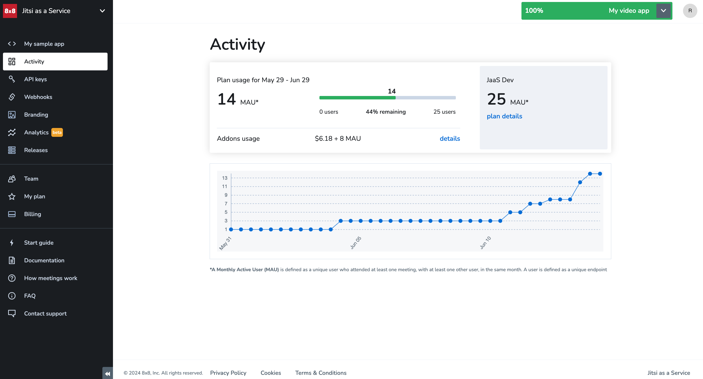
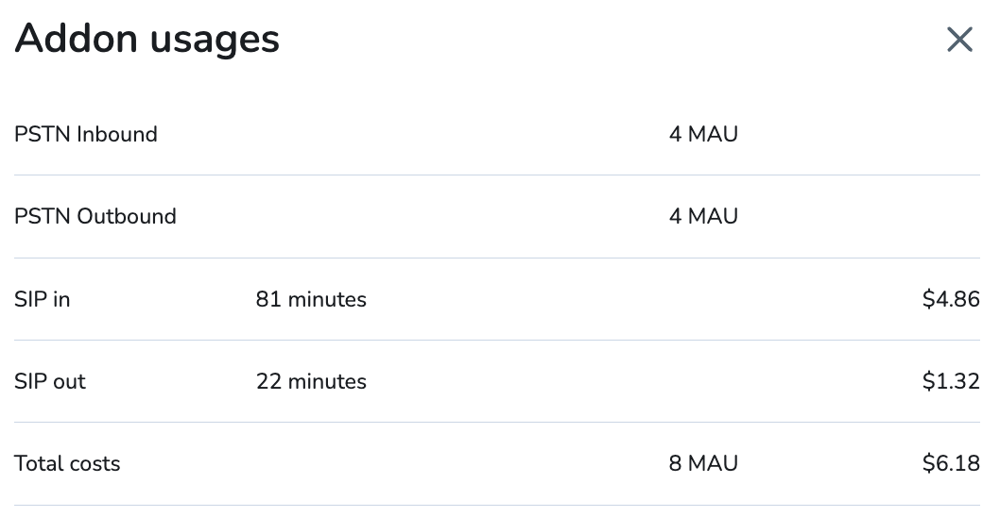

# Activity

The **Activity** page allows you to see your usage within your subscription plan. 

JaaS uses the concept of the Monthly Active User (MAU) to identify participants who have attended at least one meeting during your monthly billing cycle. To identify a MAU, JaaS installs an identifier on the local storage of a user's meeting device (e.g., laptop, tablet, phone). 

This identifier remains on the device as long as the user continues using the meeting device and does not clear their local cache data. The identifier remains installed during software or system upgrades.

The identifier can be removed by deleting the associated JaaS app.

The following screenshot shows the MAU according to the user's subscription plan along with a plot of cumulative usage for the current month:

  

Clicking **details** on the same line as **Addons usage** will show you a breakdown of any additional charges incurred for your addons.

