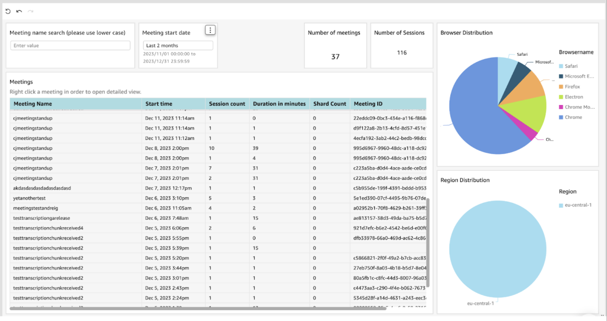
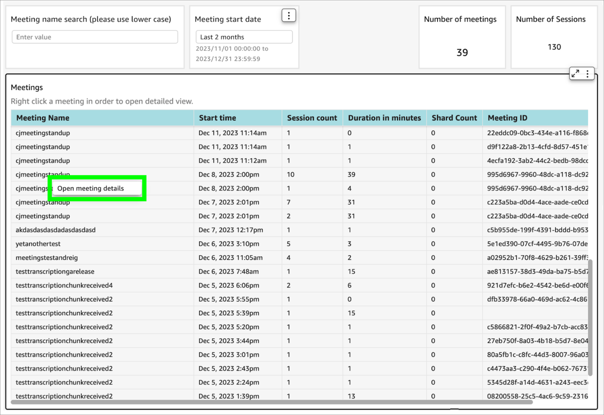
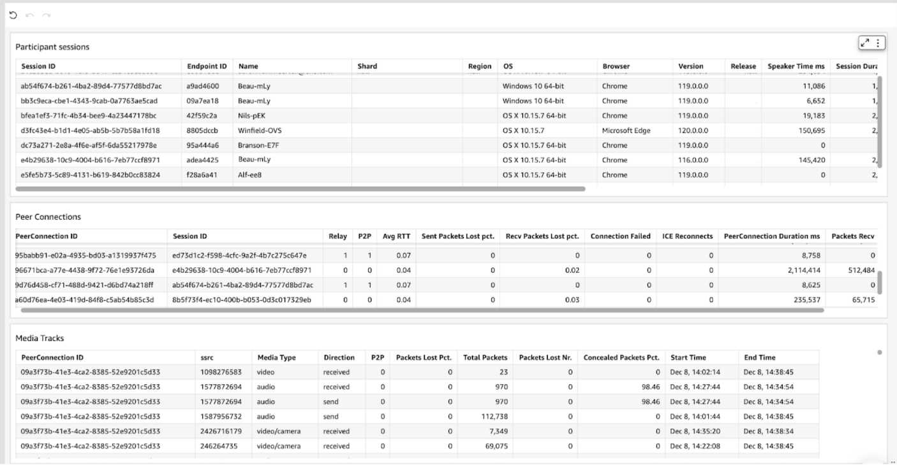
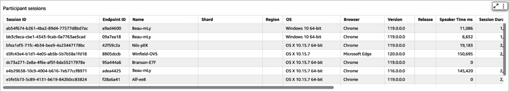
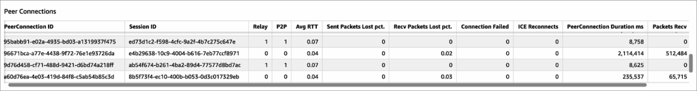
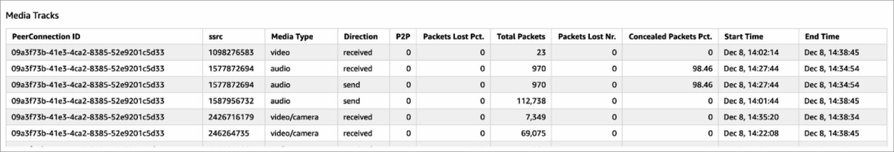

# Analytics (beta)

## Meetings Overview Dashboard

The **meetings overview dashboard** is a fairly straightforward presentation of the overall state of your meetings ecosystem.

Below are a few statistics of interest to get you started (see screenshot below):

* **Browser Distribution chart**: Displays what types of browsers users have been using in order to connect to meetings. This could help you determine which platform needs more focus.
* **Region Distribution chart**: Plots the distribution of datacenter regions to which users connect. While we don’t support more granular location information at this point, this can be used to estimate the region where most users are located.
* **Number of meetings**: Number of meetings that match your filter selection.
* **Number of sessions**: Specifies the number of sessions that match the filters. A session should not be confused with a unique participant; rather, it denotes a distinctive engagement in a meeting. For example: if a participant rejoins a meeting 10 times, 10 unique sessions will be generated.
* **Meetings table**: Lists the meetings that match the filters.
  * `Meeting Name`: Meeting name part of the url, without the tenant. If the url was [https://8x8.vc/randomtenant/randommeetingname](https://8x8.vc/randomtenant/randommeetingname) then only randommeetingname would be displayed here.
  * `Start time`: UTC +0 date/time at which the first participant joined the meeting.
  * `Session count`: The total number of sessions created during the meeting.
  * `Duration in minutes`: Calculated as the time elapsed since the first participant joined until the last participant left.
  * `Shard Count`: The total number of shards that were involved in the meeting. If a participant joins from the US and another from Asia, we connect them to localized instances of our servers in order to achieve better performance.
  * `Meeting ID`: Serves as the unique identifier for a meeting.  
  
  Meetings sharing the same name can be repeatedly joined. This identifier is used to differentiate between various occurrences of a meeting with identical names.  
  
  For example, upon a participant joining a meeting named randommeetinganame, an ID is generated for that specific instance.  
  
  Once all participants leave, the meeting ends.  
  
  If a participant subsequently joins the same meeting the next day, a new ID will be generated for that instance.  

## Meetings Details Dashboard

Right-click on any meeting in the meetings overview table and click Open meeting details to see that meeting's details.

The meetings details dashboard provides you with information about audio and video performance, along with other important insights. It is subdivided into three main sections:

* **Participant sessions**
* **Peer Connections**
* **Media Tracks**

## Participant sessions

* **Session ID**: A distinctive identifier assigned to each participant session for reference.
* **Endpoint ID**: A unique identifier utilized within the ecosystem to distinguish and track participants, especially useful for cross-referencing interactions in logs. For instance, client logs document participant interactions with their corresponding endpoint IDs.
* **Shard**: The backend shard to which the participant connected.
* **Region**: The datacenter region from which the participant connected.
* **OS**: The operating system employed by the participant.
* **Browser**: The specific web browser utilized by the participant..
* **Version**: The version of the web browser in use.
* **Release**: 8x8.vc release on which the meeting occurred.
* **Speaker time ms**: The duration, in milliseconds, during which the participant served as the dominant speaker.
* **Session duration, start time, end time**: Indicators of the temporal aspects of the specific session, including its overall duration, start time, and end time.

## Peer Connections

This table presents aggregates about WebRTC PeerConnections.

* **PeerConnection ID**: Allocates a unique ID to a peer connection.
* **Session ID**: The participant session ID from which the peer connection was created. A single session can have multiple peer connections.
* **Relay**: Whether or not this peer connection used a relay server to establish connection. If a relay is used, it could mean that network conditions are not optimal and in some cases this could affect overall meeting quality.
* **P2P**: Peer connections may take the form of either P2P (peer to peer) or JVB (Jitsi Video Bridge).
  * **P2P connections**: Direct links are established between two participants, without our SFU (Selective Forward Unit) servers. This means that media, audio and video, flows directly between the two participants. Such connections are initiated when there are two participants in the meeting.
  * **JVB connections**: Involve the use of a Jitsi Video Bridge, which functions as our SFU server, positioned in the middle. The switch to JVB occurs automatically when the number of participants in a meeting exceeds two. This ensures optimal connectivity and efficient handling of media streams in scenarios with multiple participants.
* **AVG RTT**: This aggregate metric represents the average time in seconds that it takes for a packet to travel from its source to the destination and back. The average is done across all the media flowing through this peer connection. The lower the average RTT, the faster and more responsive the network. For example if the value is greater than 0.150 (150 milliseconds) participants might experience delay in audio or video.
* **Sent packet loss pct**: Sent Packet Loss Percentage measures the proportion of transmitted data packets that fail to reach their destination. This aggregate provides insights into the reliability and integrity of data transmission and can be used for assessing the quality and stability of network connections. A higher Sent Packet Loss Percentage may indicate potential issues such as network congestion, bandwidth limitations, or other factors impacting the flow of data.  

Values above 5% could mean that participants which were receiving data transmitted over this peer connection experienced poor quality at some point.

* **Recv packet loss pct**: Received Packet Loss Percentage is similar to Send Packet loss pct, but for the received packets.  

To clarify, a high percentage of sent packet loss may not be perceptible to the participant sending the packets; however, those receiving the packets may experience diminished audio/video quality. Conversely, when the received packet loss percentage is high, it directly influences the perceived quality of the media on the peer connection where it was recorded.

* **Connection failed**: Indicates whether the WebRTC peer connection failed or not. It serves as a binary metric, providing information on whether attempts to establish a connection between peers using WebRTC were successful or unsuccessful. This could be due to various reasons, such as network issues, incompatible configurations, or other factors.
* **ICE Reconnects**: This is the number of times an ICE (Interactive Connectivity Establishment) reconnection has occurred. This metric serves as a numerical representation of instances where the connectivity establishment process needed to be rerun. A non-zero value for ICE Reconnects indicates that the system encountered challenges somewhere along its lifetime, which most likely manifested as audio/video disruptions. Typically, the primary factor in such instances is a disruption in the network.
* **Peer Connection Duration (ms)**: The measured lifetime of a peer connection, in milliseconds.
* **Packets recv and Packets sent**: Total number of packets which flowed through the peer connection.

## Media Tracks

Media transmitted via WebRTC Peer Connections is organized into units referred to as tracks, each of which can be categorized as either audio, camera video, or screen share video.

While the Peer Connections table provides an aggregated overview of all active tracks within a connection, the focus of this table is to offer a more detailed and granular perspective on each individual track.

* **PeerConnection ID**: The ID number of the peer connection that this track belongs to. It should map to an entry in the Peer Connection table.
* **SSRC**: Synchronization Source, a unique identifier within the context of a WebRTC environment. SSRC is used to distinguish and synchronize different streams of media, such as audio or video, within a communication session.
* **Media Type**:
  * `audio`: Microphone input
  * `video`: Camera
  * `video/screen`: Screen sharing track
* **Direction**: Whether this track was media being transmitted, or being received.
* **P2P**: This track belonged to a Peer Connection which was P2P: 1 = TRUE, 0 = FALSE
* **Packets Lost Pct**: The proportion of data packets at the track level that fail to reach their destination, for example the packets lost for an individual sent audio stream.
* **Concealed packets pct**: Refers to a metric that quantifies the proportion of concealed or reconstructed packets.  

Concealed packets are those that were lost during transmission but successfully reconstructed to maintain a continuous and smooth media playback experience. Usually this correlates with packet loss metrics and has the same causes.

### Glossary

* **WebRTC**: Web Real-Time Communication. A free, open-source project that enables real-time communication over the internet through web browsers. It includes protocols, application programming interfaces (APIs), and communication protocols for creating interactive audio, video, and data-sharing applications.
* **Peer Connection**: In WebRTC, a Peer Connection refers to the direct connection established between two devices (peers) for real-time communication. It enables the exchange of audio, video, and data directly between users without the need for intermediaries.
* **Track**: In the context of WebRTC, a Track represents a stream of media data, such as audio or video, within a Peer Connection. Tracks allow for the separate handling of different types of media streams, enabling more granular control and manipulation.
* **Packet Loss**: Packet Loss occurs when data packets transmitted over a network fail to reach their destination. In the context of WebRTC, packet loss can impact the quality of audio and video streams, leading to disruptions or degradation in real-time communication.
* **RTT**: Round Trip Time. This is the time it takes for a signal to travel from its source to the destination and back. In WebRTC, RTT is a crucial metric for assessing the responsiveness of a network. Higher RTT values may result in increased latency, affecting the real-time nature of communication.
* **ICE**: Interactive Connectivity Establishment. This is a framework within WebRTC that enables the establishment of network connections between peers. It facilitates the identification of the most efficient communication path by dealing with issues like NAT traversal and firewall configurations, ensuring optimal connectivity for real-time communication.
